```{r setup, include=FALSE}
knitr::opts_chunk$set(
               echo=FALSE,
	           cache=FALSE,
               prompt=FALSE,
               # tidy=TRUE,
               tidy=FALSE,
               comment=NA,
               message=FALSE,
               warning=FALSE)
options(knitr.kable.NA = '')

library(mbsenergyUtils)

box::use(ggplot2[...],
         magrittr[...],
         data.table[...],
         scales[...],
         flextable[...],
         xl = openxlsx[read.xlsx, getSheetNames])

set_flextable_defaults(
    font.color = "#002E5A",
    font.size = 7,
    font.family = 'Source Sans Pro',
    padding = 2,
    border.color = "#D9D9D9",
    background.color = "whitesmoke",
    split = FALSE,
    theme_fun = "theme_box",
    decimal.mark = ",",
    big.mark = " ",
    na_str = "<NA>")


excel_file = file.path('tables_data', 'tables_report.xlsx')
excel_file_sn = xl$getSheetNames(excel_file)


```

# Frame of Reference

REF-E scenarios over the time horizon 2025–2050 (with projections up to
2060) are developed by MBS Consulting experts using proprietary tools
and market expertise. These scenarios are based on econometric and
structural models, combined with expert insights, detailed regulatory
knowledge, and rigorous monitoring of market dynamics.

Gas and electricity forecasts consider various geopolitical and economic
hypotheses stemming from regulatory, financial, and fundamental
adjustments to disruptions caused by both the pandemic and the war in
Ukraine. These factors are viewed as key determinants of the future
equilibrium in energy markets.

The current scenario update incorporates climate variable trends that
align with historical averages.

In this context, we have defined three scenarios:

-   The **Low RES scenario**: Characterized by persistently high fuel
    and power prices amid negative or stagnant economic growth, this
    scenario hampers investments and slows the energy transition
    process.

-   In the **Reference scenario**: Marked by progress in the energy
    transition process, this scenario reflects a diversification of
    energy sources supported by existing policies. Combined with
    efficiency improvements, it maintains the energy market on a
    transformational path. Economic growth is expected to recover
    gradually over the next two years.

-   The **High RES scenario**: This scenario assumes favorable weather
    conditions and a rapid energy transition, facilitated by low
    inflation and a faster economic recovery. These factors would reduce
    demand for power and fossil fuels over the next few years, limiting
    upward pressure on energy prices and potentially driving a downward
    acceleration.

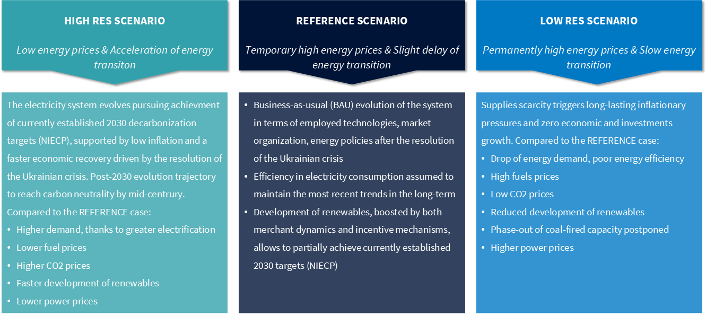

\newpage

## Energy Transition in the Spotlight: Demand Stagnation, MACSE and FERX Results and Price Dynamics

***Gas Prices Ease, but Risk for Market Tightness Persists Ahead of the Winter Season***

Gas prices have declined over the past three months, settling at €40/MWh, reflecting  stable LNG supplies, combined with muted demand competition. Europe’s LNG imports remained robust as Asian demand growth slowed, with China’s LNG intake being capped by higher domestic production, expanded Russian pipeline flows, and growing renewable capacity. This dynamic led to a steeper-than-expected price decline, although in line with our expectations for an overall downward trajectory.

Nevertheless, structural risks persist in the short-term. Geopolitical uncertainty continues to add a risk premium, while European storage levels are 10% lower than the historical average. With limited new LNG supply due to come online in the near term, winter price volatility remains a key concern.
Average gas transport costs are expected to remain high in the short to medium term, approximately at €4/MWh, mainly due to storage-related charges and the continued impact of White Certificate and efficiency components. A gradual decline below €4/MWh is projected after 2028, consistent with the anticipated normalization of gas prices. The latest ARERA update on tariff components (Resolution 429/2025/R/Com) confirms that current funds are sufficient to support storage-related measures, thereby aligned with our forecast assumptions.
Our base-case scenario remains unchanged. We maintain an average PSV price forecast close to €40/MWh for 2025, gradually declining toward €35/MWh in 2026 as new regasification capacity, including the Ravenna FSRU, comes fully online. From 2027 onward, the commissioning of additional liquefaction capacity, primarily from the US and Qatar, is anticipated to consolidate a structurally long supplied market, driving European prices toward the €27/MWh threshold by 2030.

Our updated CO₂ price outlook incorporates recent market trends, with downward revisions of nearly €30/tCO₂ in the High RES scenario and €1/tCO₂ in the Reference case for 2025. 2026 values report a similar update, with a €20/ tCO₂ reduction to High RES projections, while the Reference value remains approximately aligned. Weak industrial activity and subdued auction demand have increased the TNAC, temporarily delaying the expected tightening effect of ETS reforms.

On the macroeconomic side, short-term GDP growth forecasts have been revised slightly downward amid persistent geopolitical tensions and rising trade barriers. The combination of weaker exports and stagnant domestic demand continues to weigh on industrial output.

***FER-X 2025 results and progress in installed capacity foster optimism, yet the achievement of burden-sharing targets remains uncertain***

Renewable energy installations continue to follow a growth trajectory, though at a slower pace compared to 2024. In the first nine months of 2025, photovoltaic capacity additions reached 4100 MW, marking a 3% year-on-year slowdown in growth, while wind installations totaled 370 MW, with a sharper deceleration of 19.4%. The reduced momentum likely reflects transitional delays ahead of the FERX auction, which was awaited by the market and concluded in September 2025. On the generation side, solar output continues to exceed 2024 levels, largely driven by the contribution of newly installed capacity. Wind generation, by contrast, remains more volatile: monthly output has been hovering around last year’s levels, indicating that recent capacity additions have not yet translated into a sustained increase in output. These trends are consistent with the evidence presented in the IIQ MBS report. Under our Reference scenario, RES generation is projected to cover 51% of electricity demand by 2030, reaching the 63% target only by 2038. This gap persists despite a downward revision of demand expectations for 2025-2030 in this release, reflecting weaker consumption in early 2025 and a stagnating industrial sector. The updated outlook underscores the need for faster deployment and stronger policy support.

We have revised our short-term installed capacity projections upward, as installation activity in 2025 has outpaced earlier expectations. Nonetheless, we reaffirm our medium- and long-term outlook, which envisages a broadly positive growth path supported by a pipeline exceeding 20 GW in advanced authorization stages (excluding projects already participating in the FERX 2025 auction). However, projected capacity levels are still expected to fall short of NIECP targets for both 2030 and 2040. In this context, the outcomes of the FER-X 2025 auction represent a key test for the policy and market dynamics that will shape the next phase of renewable deployment.

The FER-X 2025 auction attracted around 12 GW of renewable project bids, largely dominated by solar and concentrated in the South and Sicily, in line with our expectations.  These bids were drawn from a subset of approximately 18 GW of potential participants, identified by applying commercial and technical filters to a broader pool of 30 GW of projects with final authorization or a positive VIA. Of this subset, roughly 5 GW were expected to pursue alternative routes such as Energy Release 2.0 or PPAs.

Strong participation reinforces confidence in the medium-term outlook for RES-E deployment. However, only the publication of auction rankings will reveal whether the measure has effectively supported burden-sharing objectives. In particular, it remains to be seen whether capacity has been steered toward Northern Italy, or whether the higher cost competitiveness and strong presence of Southern projects have resulted in geographically unbalanced allocation. Despite hosting nearly half of Italy’s installed capacity, the North faces a substantial pipeline gap, with around 15 GW still needed to attain 2030 NIECP targets, amid just over 5 GW expected in other macrozones.

These dynamics are especially relevant looking ahead of Definitive FER-X approval, which will require expert calibration of operational rules. We estimate that roughly 20 GW are eligible for upcoming auctions, predominantly solar projects in the South. In this context, effective territorial differentiation mechanisms are essential. Our analysis of pre-Commission drafts indicated that neither zonal coefficients nor merit-order correctives alone would ensure a geographically balanced allocation.

***Rising Solar Output Deepens Intraday Price Distortions, Weighing on RES-E Captured Prices***

The growing penetration of solar generation is increasingly reshaping hourly price dynamics, deepening midday price troughs and amplifying profile skewness compared to the profile elaborated as of IIQ25 release. Captured prices for solar and, more broadly, RES-E technologies are anticipated to come under increasing downward pressure, particularly over the medium to long term. These evolving market conditions reinforce the strategic importance of flexibility assets such as storage, which are essential to stabilizing revenues and supporting system integration.

***MACSE to Drive Southern Deployment While Northern Regions Position for Merchant Storage Growth***

The first MACSE auction, held on 30 September 2025, awarded 10 GWh of electrochemical storage capacity, fully covering the volume made available, at an average price close to €13,000/MWh-year, which is well below the regulatory cap of €37,000/MWh-year. As anticipated with preliminary analyses, competition was intense, with more than 35–40 GWh of offers submitted, over three times the required capacity, confirming a strong and dynamic market. Most awarded projects are located in Southern regions, where 7 GWh were allocated in the South and Calabria, 2 GWh in the Centre-South, and 0.5 GWh each in Sicily and Sardinia.

According to our estimates, the awarded tariffs are consistent with internal rates of return (IRR) below 5%, net of leverage effects. These returns are compatible with CAPEX levels that have fallen by roughly 40% since late 2024. The MACSE mechanism therefore appears particularly suited to investors seeking long-term, stable cash flows, such as vertically integrated utilities, rather than developers focused on single-asset returns. The auction design, which remunerates capacity based on the actual energy deliverable (MWh/year), favored larger and longer-duration systems, typically ranging from six to eight hours, which benefit from economies of scale.

Our BESS projections are broadly consistent with the MACSE outcomes in terms of total capacity awarded, although some discrepancies remain at the zonal level, with capacity allocation in Southern zones being underestimated compared to the auction results. As of IIIQ25, our BESS projections remain aligned with IIQ25 estimates, as the detailed zonal results of the MACSE auction have not yet been incorporated due to timing. We also confirm our medium- and long-term outlook. The Italian storage market continues to expand, supported by a robust pipeline of utility-scale projects. 10 GW of capacity, beyond that participating to the MACSE auction has already received authorization while over 16.6 GW of additional capacity is currently under evaluation, representing the eligible pool for future MACSE rounds beyond 2025 and forming the backbone of future installations. Based on MACSE outcomes and Capacity Market dynamics, we project over 20 GWh of large-scale battery capacity to be deployed by 2028.
In line with the NIECP target of 72 GWh of new storage by 2030, utility-scale systems are expected to concentrate in Southern regions, where renewable intermittency is greatest. Northern zones will emerge as hubs for merchant storage, driven by sustainable market revenues and the gradual saturation of incentive-based capacity in the South. Overall, Italy’s total installed battery capacity is projected to reach around 88 GWh by 2030.


\newpage

# Key Figures

```{r, net_power}

dt_table = openxlsx::read.xlsx(file.path('tables_data', 'tables_report.xlsx'), sheet = excel_file_sn[1]) %>% 
    setDT() 

vec_sce = names(dt_table)[-1]
vec_colnames = as.character(as.vector(dt_table[1]))

dt_table = dt_table[2:.N]


suffixes = c('', rep("Reference_", 4), rep("High RES_", 4), rep('Low RES_', 4))
vec_colnames = paste0(suffixes, vec_colnames)
names(dt_table) = vec_colnames

dt_table[, (vec_colnames[-1]) := lapply(.SD, function(x) {round(as.numeric(x), 1)}), .SDcols = vec_colnames[-1]]

dt_table |> flextable() %>% 
    separate_header() %>%  
    align(align = "center", part = "all") %>% 
    bg(bg = "#32587B", part = "header") %>% 
    color(part = "header", color = 'white') %>% 
    vline(j = c(1, 5, 9, 13), border = officer::fp_border(color = "#D9D9D9", width = 1), part = "all") %>% 
    bold(i = NULL, j = 1) %>% 
    width(width = 2, j = 1)

```

```{r, balance}

dt_table = openxlsx::read.xlsx(file.path('tables_data', 'tables_report.xlsx'), sheet = excel_file_sn[2]) %>% 
    setDT() 

vec_sce = names(dt_table)[-1]
vec_colnames = as.character(as.vector(dt_table[1]))

dt_table = dt_table[2:.N]


suffixes = c('', rep("Reference_", 4), rep("High RES_", 4), rep('Low RES_', 4))
vec_colnames = paste0(suffixes, vec_colnames)
names(dt_table) = vec_colnames

dt_table[, (vec_colnames[-1]) := lapply(.SD, function(x) {round(as.numeric(x), 1)}), .SDcols = vec_colnames[-1]]

dt_table |> flextable() %>% 
    separate_header() %>%  
    align(align = "center", part = "all") %>% 
    bg(bg = "#32587B", part = "header") %>% 
    color(part = "header", color = 'white') %>% 
    vline(j = c(1, 5, 9, 13), border = officer::fp_border(color = "#D9D9D9", width = 1), part = "all") %>% 
    bold(i = NULL, j = 1) %>% 
    width(width = 2, j = 1)

```

```{r, commodities}

dt_table = openxlsx::read.xlsx(file.path('tables_data', 'tables_report.xlsx'), sheet = excel_file_sn[3]) %>% 
    setDT() 

vec_sce = names(dt_table)[-1]
vec_colnames = as.character(as.vector(dt_table[1]))

dt_table = dt_table[2:.N]


suffixes = c('', rep("Reference_", 4), rep("High RES_", 4), rep('Low RES_', 4))
vec_colnames = paste0(suffixes, vec_colnames)
names(dt_table) = vec_colnames

dt_table[, (vec_colnames[-1]) := lapply(.SD, function(x) {round(as.numeric(x), 1)}), .SDcols = vec_colnames[-1]]

dt_table |> flextable() %>% 
    separate_header() %>%  
    align(align = "center", part = "all") %>% 
    bg(bg = "#32587B", part = "header") %>% 
    color(part = "header", color = 'white') %>% 
    vline(j = c(1, 5, 9, 13), border = officer::fp_border(color = "#D9D9D9", width = 1), part = "all") %>% 
    bold(i = NULL, j = 1) %>% 
    width(width = 2, j = 1)

```

```{r, electricity_prices}

dt_table = openxlsx::read.xlsx(file.path('tables_data', 'tables_report.xlsx'), sheet = excel_file_sn[4]) %>% 
    setDT() 

vec_sce = names(dt_table)[-1]
vec_colnames = as.character(as.vector(dt_table[1]))

dt_table = dt_table[2:.N]


suffixes = c('', rep("Reference_", 4), rep("High RES_", 4), rep('Low RES_', 4))
vec_colnames = paste0(suffixes, vec_colnames)
names(dt_table) = vec_colnames

dt_table[, (vec_colnames[-1]) := lapply(.SD, function(x) {round(as.numeric(x), 1)}), .SDcols = vec_colnames[-1]]

dt_table |> flextable() %>% 
    separate_header() %>%  
    align(align = "center", part = "all") %>% 
    bg(bg = "#32587B", part = "header") %>% 
    color(part = "header", color = 'white') %>% 
    vline(j = c(1, 5, 9, 13), border = officer::fp_border(color = "#D9D9D9", width = 1), part = "all") %>% 
    bold(i = NULL, j = 1) %>% 
    width(width = 2, j = 1)

```

```{r, zonal_prices}

dt_table = openxlsx::read.xlsx(file.path('tables_data', 'tables_report.xlsx'), sheet = excel_file_sn[5]) %>% 
    setDT() 

vec_sce = names(dt_table)[-1]
vec_colnames = as.character(as.vector(dt_table[1]))

dt_table = dt_table[2:.N]


suffixes = c('', rep("Reference_", 4), rep("High RES_", 4), rep('Low RES_', 4))
vec_colnames = paste0(suffixes, vec_colnames)
names(dt_table) = vec_colnames

dt_table[, (vec_colnames[-1]) := lapply(.SD, function(x) {round(as.numeric(x), 1)}), .SDcols = vec_colnames[-1]]

dt_table |> flextable() %>% 
    separate_header() %>%  
    align(align = "center", part = "all") %>% 
    bg(bg = "#32587B", part = "header") %>% 
    color(part = "header", color = 'white') %>% 
    vline(j = c(1, 5, 9, 13), border = officer::fp_border(color = "#D9D9D9", width = 1), part = "all") %>% 
    bold(i = NULL, j = 1) %>% 
    width(width = 2, j = 1)

```

```{r, cp_pv_fx}

dt_table = openxlsx::read.xlsx(file.path('tables_data', 'tables_report.xlsx'), sheet = excel_file_sn[6]) %>% 
    setDT() 

vec_sce = names(dt_table)[-1]
vec_colnames = as.character(as.vector(dt_table[1]))

dt_table = dt_table[2:.N]


suffixes = c('', rep("Reference_", 4), rep("High RES_", 4), rep('Low RES_', 4))
vec_colnames = paste0(suffixes, vec_colnames)
names(dt_table) = vec_colnames

dt_table[, (vec_colnames[-1]) := lapply(.SD, function(x) {round(as.numeric(x), 1)}), .SDcols = vec_colnames[-1]]

dt_table |> flextable() %>% 
    separate_header() %>%  
    align(align = "center", part = "all") %>% 
    bg(bg = "#32587B", part = "header") %>% 
    color(part = "header", color = 'white') %>% 
    vline(j = c(1, 5, 9, 13), border = officer::fp_border(color = "#D9D9D9", width = 1), part = "all") %>% 
    bold(i = NULL, j = 1) %>% 
    width(width = 2, j = 1)

```

```{r, cp_pv_tr}

dt_table = openxlsx::read.xlsx(file.path('tables_data', 'tables_report.xlsx'), sheet = excel_file_sn[7]) %>% 
    setDT() 

vec_sce = names(dt_table)[-1]
vec_colnames = as.character(as.vector(dt_table[1]))

dt_table = dt_table[2:.N]


suffixes = c('', rep("Reference_", 4), rep("High RES_", 4), rep('Low RES_', 4))
vec_colnames = paste0(suffixes, vec_colnames)
names(dt_table) = vec_colnames

dt_table[, (vec_colnames[-1]) := lapply(.SD, function(x) {round(as.numeric(x), 1)}), .SDcols = vec_colnames[-1]]

dt_table |> flextable() %>% 
    separate_header() %>%  
    align(align = "center", part = "all") %>% 
    bg(bg = "#32587B", part = "header") %>% 
    color(part = "header", color = 'white') %>% 
    vline(j = c(1, 5, 9, 13), border = officer::fp_border(color = "#D9D9D9", width = 1), part = "all") %>% 
    bold(i = NULL, j = 1) %>% 
    width(width = 2, j = 1)

```

```{r, cp_wind_on}

dt_table = openxlsx::read.xlsx(file.path('tables_data', 'tables_report.xlsx'), sheet = excel_file_sn[8]) %>% 
    setDT() 

vec_sce = names(dt_table)[-1]
vec_colnames = as.character(as.vector(dt_table[1]))

dt_table = dt_table[2:.N]


suffixes = c('', rep("Reference_", 4), rep("High RES_", 4), rep('Low RES_', 4))
vec_colnames = paste0(suffixes, vec_colnames)
names(dt_table) = vec_colnames

dt_table[, (vec_colnames[-1]) := lapply(.SD, function(x) {round(as.numeric(x), 1)}), .SDcols = vec_colnames[-1]]

dt_table |> flextable() %>% 
    separate_header() %>%  
    align(align = "center", part = "all") %>% 
    bg(bg = "#32587B", part = "header") %>% 
    color(part = "header", color = 'white') %>% 
    vline(j = c(1, 5, 9, 13), border = officer::fp_border(color = "#D9D9D9", width = 1), part = "all") %>% 
    bold(i = NULL, j = 1) %>% 
    width(width = 2, j = 1)

```

\newpage

```{r, cp_wind_off}

dt_table = openxlsx::read.xlsx(file.path('tables_data', 'tables_report.xlsx'), sheet = excel_file_sn[9]) %>% 
    setDT() 

vec_sce = names(dt_table)[-1]
vec_colnames = as.character(as.vector(dt_table[1]))

dt_table = dt_table[2:.N]


suffixes = c('', rep("Reference_", 4), rep("High RES_", 4), rep('Low RES_', 4))
vec_colnames = paste0(suffixes, vec_colnames)
names(dt_table) = vec_colnames

dt_table[, (vec_colnames[-1]) := lapply(.SD, function(x) {round(as.numeric(x), 1)}), .SDcols = vec_colnames[-1]]

dt_table |> flextable() %>% 
    separate_header() %>%  
    align(align = "center", part = "all") %>% 
    bg(bg = "#32587B", part = "header") %>% 
    color(part = "header", color = 'white') %>% 
    vline(j = c(1, 5, 9, 13), border = officer::fp_border(color = "#D9D9D9", width = 1), part = "all") %>% 
    bold(i = NULL, j = 1) %>% 
    width(width = 2, j = 1)

```

# Macroeconomic Context

## GDP

::: callout-main
**GEOPOLITICAL TENSIONS AND TRADE CONFLICTS, FURTHER AGGRAVATED BY THE IMPOSITION OF COMMERCIAL TARIFFS THAT HAVE SEVERELY AFFECTED ITALIAN EXPORTS, ARE SHAPING A SHORT-TERM CONTEXT CHARACTERIZED BY LIMITED ECONOMIC GROWTH, SUSTAINED PRIMARILY BY INVESTMENTS LINKED TO THE NRRP. EXCLUDING THESE FUNDS, THE INDUSTRIAL SECTOR IS EXPERIENCING A PROLONGED PHASE OF STAGNATION, WITH NO SIGNS OF RECOVERY EXPECTED IN THE COMING MONTHS. IN THE MEDIUM TO LONG TERM, A GRADUAL IMPROVEMENT OF THE ECONOMIC SITUATION IS ANTICIPATED, SUPPORTED BY THE PROGRESSIVE STABILISATION OF THE GLOBAL MACROECONOMIC ENVIRONMENT**
:::

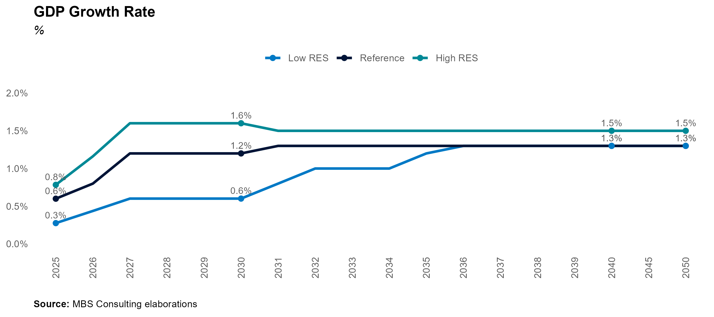

::::: callout-item
::: callout-left
#### 25-26 {.unnumbered}
:::

::: callout-right
In the short term, the most recent data confirmed our previous forecast worsening, due to the limited industrial output, a strong decrease in export and subdued consumption. In the next two years is confirmed our forecasts of a weak GDP growth below the 1%, with an expected increase of 0.6% in 2025 and a slightly more consistent growth in 2026 (0.8%).
:::
:::::

::::: callout-item
::: callout-left
#### 27-30 {.unnumbered}
:::

::: callout-right
In both the Reference and High Res scenarios, economic growth is projected to settle at approximately 1.2% per year, supported by the progressive implementation of the NRRP, an improving international environment, and the advancing impact of structural reforms associated with the green transition.
:::
:::::

::::: callout-item
::: callout-left
#### 31-50 {.unnumbered}
:::

::: callout-right
Over the long term, the Reference and High Res scenarios assume that economic growth will reach a steady pace, supported by sustained progress in investment and reform. In contrast, the Low Res scenario captures the prolonged effects of disruptions in key investment areas, which continue to weigh on overall economic performance.
:::
:::::

::::: callout-wrap
::: callout-left
#### Main updates {.unnumbered}
:::

::: callout-right
GDP growth forecast remains in line with our previous market update.
:::
:::::

\newpage

## Inflation rate

::: callout-main
**DESPITE THE DETERIORATION OF THE GLOBAL MACROECONOMIC ENVIRONMENT AND THE INTENSIFICATION OF FACTORS THAT HEIGHTEN THE RISK OF PRICE PRESSURES, THE MOST RECENT INFLATION DATA INDICATE THAT NO SIGNIFICANT INCREASE IN THE INFLATION RATE HAS YET MATERIALIZED. IN THE SHORT TERM, INFLATION IS EXPECTED TO REMAIN BELOW 2%, BEFORE CONVERGING TOWARD THIS LEVEL FROM THE MEDIUM TERM ONWARD**
:::

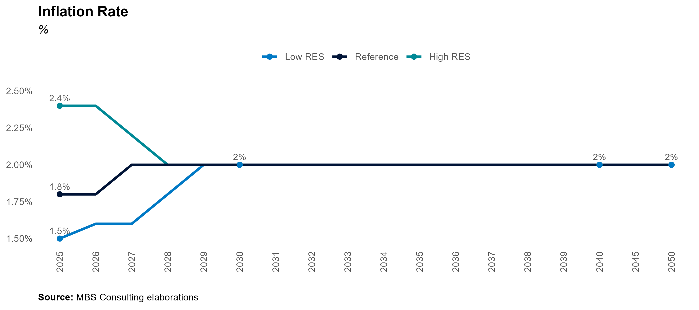

::::: callout-item
::: callout-left
#### 25-26 {.unnumbered}
:::

::: callout-right
Heightened geopolitical tensions are expected to lead to a stronger increase in prices in the short term compared to 2024, when monetary policy measures supported a disinflationary trajectory. In 2025 and 2026, inflation is projected to remain below the 2% threshold (at around 1.8% in both years). The outlook is subject to a high degree of uncertainty, largely linked to the implementation of import tariffs recently announced by the United States. These measures could exert significant upward pressure on prices in the near term, potentially altering short-term inflation dynamics and projections.
:::
:::::

::::: callout-item
::: callout-left
#### 27-30 {.unnumbered}
:::

::: callout-right
In the medium term, a gradual increase is expected to bring annual inflation growth up to 2%, followed by a period of stabilization around that level.
:::
:::::

::::: callout-item
::: callout-left
#### 31-50 {.unnumbered}
:::

::: callout-right
Long-term assumptions envisage the inflation rate to stabilize at around 2%, in line with the ECB’s medium term inflation target.
:::
:::::

::::: callout-wrap
::: callout-left
#### Main updates {.unnumbered}
:::

::: callout-right
Short-term inflation rates remained in line with our previous market update.
:::
:::::

\newpage

# Commodities

## Natural Gas

### LNG

::: callout-main
**GLOBAL LNG DEMAND WILL CONTINUE TO GROW, LED BY EUROPE AND ASIA, WHILE NEW LIQUEFACTION CAPACITY COMING ONLINE FROM 2027 WILL OUTPACE CONSUMPTION GROWTH. THE RESULTING WIDER SUPPLY-DEMAND MARGIN IS EXPECTED TO EASE MARKET TIGHTNESS, WITH GLOBAL LNG PRICES GRADUALLY DECLINING**
:::

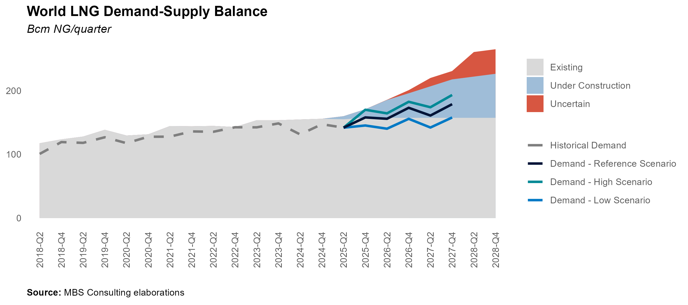

::::: callout-item
::: callout-left
#### 25-26 {.unnumbered}
:::

::: callout-right
Global LNG demand is expected to rise over 5% in 2025 to around 600 Bcm, reaching about 650 Bcm in 2026. Growth is led by Europe, which must replace roughly 30 Bcm of lost Russian pipeline gas and refill storage to meet energy security goals. In Asia, demand growth is slower as China increases Russian pipeline imports, boosts domestic production, and expands renewables, reducing LNG needs. Southeast Asia adds demand through economic growth but remains price sensitive. With limited new supply, market tightness remains likely, potentially lifting winter prices.
:::
:::::

::::: callout-item
::: callout-left
#### 27-30 {.unnumbered}
:::

::: callout-right
Global LNG demand is expected to exceed 650 Bcm by 2027, before slowing to below 5% annual growth as renewable generation expands and energy efficiency gains accelerate. From 2027, a significant new wave of supply (mainly from the US and Qatar) will enter the market. This additional capacity is likely to ease current tightness, supporting a gradual rebalancing and normalization of global LNG prices.
:::
:::::

::::: callout-item
::: callout-left
#### 31-50 {.unnumbered}
:::

::: callout-right
In the long term, pressure on the LNG market is expected to ease as new capacity expands, and green energy commitments take effect. 
:::
:::::

::::: callout-wrap
::: callout-left
#### Main updates {.unnumbered}
:::

::: callout-right
We maintain our global LNG market outlook. Demand remains on track with earlier expectations, as stronger growth in Europe and parts of Asia offsets slower demand in China.
:::
:::::

\newpage

### TTF Price

::: callout-main
**WEAK ECONOMIC ACTIVITY, CONTINUED IMPROVEMENTS IN ENERGY EFFICIENCY, AND THE EXPANSION OF RENEWABLE POWER GENERATION PREVENT GAS DEMAND FROM RECOVERING TO PRE-CRISIS LEVELS. OVER THE LONG TERM, EUROPE’S DECARBONIZATION EFFORTS ARE EXPECTED TO ACCELERATE DEMAND DECLINES, DRIVING TTF PRICES TOWARDS A LOWER TREND OF AROUND 25 €/MWH**
:::

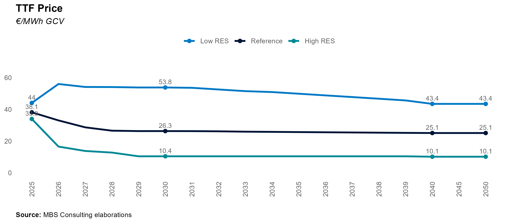

::::: callout-item
::: callout-left
#### 25-26 {.unnumbered}
:::

::: callout-right
In our Reference scenario, the TTF gas price is expected to stay close to 39 €/MWh on average in 2025 and close to 33 €/MWh in 2026. This reflects a fragile and uncertain market balance, with upside risks mainly during the winter months, when seasonal demand rises, supply growth remains limited, and the risk of a possible return of competition for available supplies is not negligible. 
:::
:::::

::::: callout-item
::: callout-left
#### 27-30 {.unnumbered}
:::

::: callout-right
Significant increases in new liquefaction capacity in US and Qatar would lead to a gas price normalization from 2027 onwards. Assuming a ramp up in global LNG supplies and an acceleration of the energy transition, European gas prices are projected to steadily decline below the 30 €/MWh threshold by 2028.
:::
:::::

::::: callout-item
::: callout-left
#### 31-50 {.unnumbered}
:::

::: callout-right
The European decarbonization process will continue to reduce gas demand, gradually pressuring prices back towards a long-term equilibrium of around 25 €/MWh. In the Low Res scenario, where geopolitical tensions persist and structurally supply issues remain unresolved, prices will likely remain just below 45 €/MWh over the long term. In contrast, effective green policies, supported by economic growth, could push prices significantly lower in the High Res scenario, with the TTF averaging near 10 €/MWh in the long term. 
:::
:::::

::::: callout-wrap
::: callout-left
#### Main updates {.unnumbered}
:::

::: callout-right
Both short- and long-term TTF gas price projections remain substantially in line with our previous market assessment. The updated projections incorporate summer prices that were slightly lower than expected, as storage refill proceeded with less difficulty than anticipated.
:::
:::::

\newpage

### Spread TTF-PSV

::: callout-main
**AS PIPED FLOWS FROM NORWAY REMAIN CRUCIAL FOR ADEQUATE DEMAND COVERAGE, THE PSV GAS PRICE IS EXPECTED TO MAINTAIN A PREMIUM OVER THE TTF IN THE SHORT-TO-MEDIUM TERM. IN THE LONG TERM, THE REBALANCING OF FLOWS IS ANTICIPATED TO LEAD TO A GRADUAL NARROWING OF THE SPREAD TOWARDS ZERO**
:::

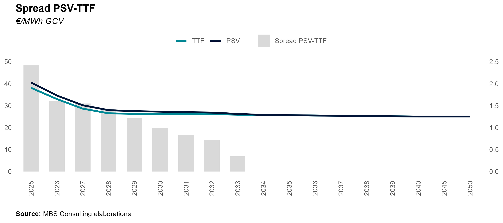

::::: callout-item
::: callout-left
#### 25-26 {.unnumbered}
:::

::: callout-right
The PSV–TTF spread is expected to remain close to 2.5 €/MWh in 2025 and around 2 €/MWh in 2026. The wider spread in 2025 reflects Norwegian maintenance works, Transitgas capacity restrictions, and reduced availability of Northern European flows in summer, which remain necessary and marginal for Italy. Fluctuations throughout the year are expected to follow seasonality and the impact of various maintenance operations.
:::
:::::

::::: callout-item
::: callout-left
#### 27-30 {.unnumbered}
:::

::: callout-right
Flows from the TAP and Algeria, along with LNG arrivals, are expected to partially replace imports from the North in the medium term, leading to a progressive narrowing of the spread to below 1 €/MWh by 2030. 
:::
:::::

::::: callout-item
::: callout-left
#### 31-50 {.unnumbered}
:::

::: callout-right
The PSV-TTF spread is expected to converge towards zero in the long term, as flows rebalance from North to South and LNG, combined with the underlying demand reduction driven by decarbonization, plays a key role. 
:::
:::::

::::: callout-wrap
::: callout-left
#### Main updates {.unnumbered}
:::

::: callout-right
The PSV-TTF spread is still expected to remain positive in the short and medium term due to Italy’s continued reliance on piped gas flows from Norway and high transport tariffs. However, it is projected to gradually reduce towards zero in the long run as flows rebalance and LNG plays an increasing role.
:::
:::::

\newpage

### PSV Price

::: callout-main
**THE ITALIAN GAS PRICE REMAINS CLOSELY LINKED TO EUROPEAN HUB LEVELS IN THE SHORT-TO-MEDIUM TERM, WITH PSV TRACKING TTF MOVEMENTS. OVER THE LONG TERM, PSV IS EXPECTED TO ALIGN WITH EUROPEAN PRICES, REACHING AROUND 30 €/MWH BY 2030**
:::

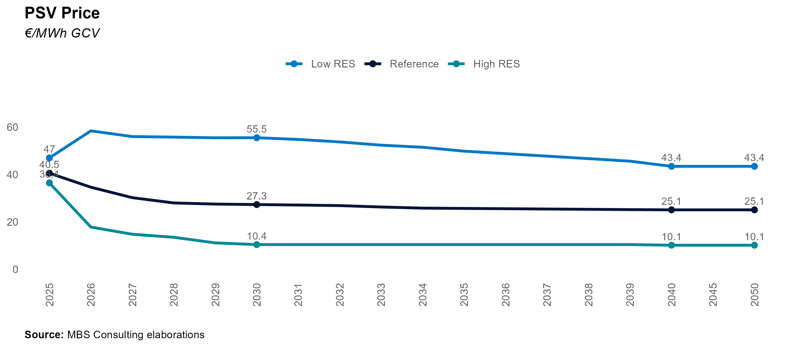

::::: callout-item
::: callout-left
#### 25-26 {.unnumbered}
:::

::: callout-right
We still expect PSV yearly averages to remain close to €40/MWh in 2025 and around €35/MWh in 2026, despite weak natural gas demand growth. Conditions for full stabilization of the Italian gas market are unlikely to materialize in the near term, in line with the overall European gas market. The new Ravenna FSRU, with 5 Bcm/y of regasification capacity, is expected to be fully operational by 2026, helping ease some pressure, which will remain high, particularly during winter 2025–2026.
:::
:::::

::::: callout-item
::: callout-left
#### 27-30 {.unnumbered}
:::

::: callout-right
The PSV is expected to follow the mid-term normalization of European gas prices towards 30 €/MWh by 2030, as a gradual rebalancing of the global gas demand-supply dynamics aligns with the anticipated acceleration of the energy transition.
:::
:::::

::::: callout-item
::: callout-left
#### 31-50 {.unnumbered}
:::

::: callout-right
The PSV reference price is expected to stabilize, aligning with TTF prices at around 25 €/MWh in the long term.
:::
:::::

::::: callout-wrap
::: callout-left
#### Main updates {.unnumbered}
:::

::: callout-right
As for the TTF, short-term PSV projections remain consistent with our previous market update, incorporating recent summer prices that were slightly lower than expected due to smoother storage refill. The European gas market balance remains fragile, and further gas price recovery cannot be ruled out.
:::
:::::

\newpage

### Logistics Costs for Italian Gas-Fired Units

::: callout-main
**SHORT-TERM GAS LOGISTIC COSTS ARE EXPECTED TO REMAIN HIGH, ABOVE 4 €/MWh(t), REFLECTING EXTRA CHARGES TO OFFSET HIGH GAS PRICE IMPACTS ON CONSUMERS AND SECURE SYSTEM OPERATOR REVENUES. VARIABLE GAS COSTS SHOULD START GRADUALLY DECREASING FROM 2028 ONWRADS, FOLLOWING THE EXPECTED GAS PRICES NORMALIZATION**
:::

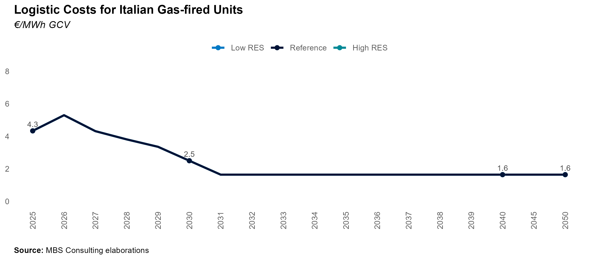

::::: callout-item
::: callout-left
#### 25-28 {.unnumbered}
:::

::: callout-right
The variable logistic cost for CCGTs is expected to remain above 4 €/MWh(t) on average in the short-to-medium term, driven by the need to recover extra costs linked to measures mitigating the impact of high prices on consumers and to ensure adequate revenues for gas system operators. With Resolution 429/2025/R/Com, ARERA confirms that current funds are sufficient to cover the costs of the last-resort storage service (STUI), supporting our CRVOS projections. The CRVOS component, which ensures revenues for storage operators, is expected to gradually normalize to just above 1.5 €/MWh(t) from winter 2026/27, reflecting a steady return to pre-crisis levels. However, ARERA also highlighted that costs covered by the RET component (including White Certificates and energy efficiency measures) remain under pressure. This reinforces our view that RET is expected to remain high at around 2.6 €/MWh(t) throughout at least 2026.
:::
:::::

::::: callout-item
::: callout-left
#### 29-50 {.unnumbered}
:::

::: callout-right
A gradual decline in variable logistic costs below 4 €/MWh is expected after 2028, in line with the anticipated normalization of gas prices and the recovery of storage-related costs, nearing 1.6 €/MWh on average by 2030.
:::
:::::

::::: callout-wrap
::: callout-left
#### Main updates {.unnumbered}
:::

::: callout-right
The variable transport charges forecast incorporates the latest regulator interventions to mitigate the recent commodities surge on bills.
:::
:::::

\newpage

## EU ETS

### CO2 Allowances Price

::: callout-main
**THE ETS REFORM AIMS AT SUPPORTING A RAISE IN CO2 PRICE BY TIGHTENING THE EMISSIONS CERTIFICATES MARKET THROUGH A COMBINATION OF
SUPPLY CURTAILMENT AND DEMAND-INCREASING MEASURES. THE INCLUSION OF NEW
SECTORS, SUCH AS THE MARITIME, WILL CONTRIBUTE TO SUSTAINING THE
ENVISIONED PRICE INCREASES**
:::

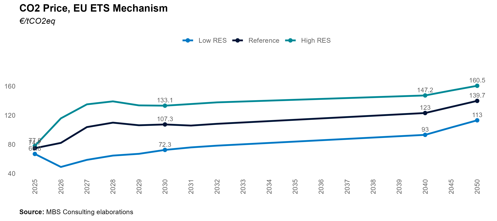

::::: callout-item
::: callout-left
#### 25-26 {.unnumbered}
:::

::: callout-right
After weak price growth in early 2025, ETS certificate prices have risen in recent months, driven by the start of allowance withdrawals under the Market Stability Reserve and expectations of higher future demand. CO₂ prices are now converging toward the 2025 forecast of around €75 per ton. In 2026, prices are expected to rise further with the inclusion of maritime emissions and the phase-out of free aviation allowances, reaching about €82 per ton.
:::
:::::

::::: callout-item
::: callout-left
#### 27-30 {.unnumbered}
:::

::: callout-right
Despite the delay in price growth observed in 2025, the market mechanism is expected to remain effective over the medium term, with CO₂ prices projected to exceed €105/ton before 2030.  
:::
:::::

::::: callout-item
::: callout-left
#### 31-50 {.unnumbered}
:::

::: callout-right
The EU ETS is expected to transition to a fully auction-based system, phasing out free allocations entirely, including Hard-to-Abate sectors. The scheme’s coverage could be broadened to encompass additional industries currently excluded from its scope. Under the assumption of full implementation of the planned regulatory framework, CO₂ prices are projected to stabilize above €120 per ton after 2040. In the High Res scenario, which envisions a more stringent EU emissions reduction trajectory, prices could rise further, approaching €150 per ton.
:::
:::::

::::: callout-wrap
::: callout-left
#### Main updates {.unnumbered}
:::

::: callout-right
Short-term CO₂ price forecast remains in line with our previous market update.
:::
:::::

\newpage

# Energy Mix

## Day-Ahead Market Energy Balance

### Reference Scenario

::: callout-main
**IN THE SHORT TERM, IMPORTS AND RES-E DOMINATE THE MIX AS DEMAND SLOWLY RECOVERS. IN THE MID TERM, GAS REMAINS THE MARGINAL TECHNOLOGY, WHILE IN THE LONG TERM, RES-E BECOME THE MAIN SOURCE WITH GAS PROVIDING SYSTEM SUPPORT**
:::

<div style="text-align: center;">
  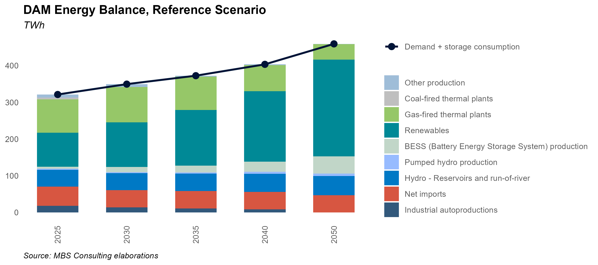
</div>

::::: callout-item
::: callout-left
#### 25-26 {.unnumbered}
:::

::: callout-right
Systemic overgeneration in Europe and PUN premium compared to European prices will jointly sustain imports from the Northern border. New renewable capacity will continue to grow through 2025–2026, though more slowly, while gas-fired plants remain the marginal source in the mix, amid slowly recovering demand.
:::
:::::

::::: callout-item
::: callout-left
#### 27-30 {.unnumbered}
:::

::: callout-right
Coal-fired units are set to phase out by 2025, except for those in Sardinia, which are expected to remain operational until the Tyrrhenian Link is completed — projected for 2030 in the Reference case and 2028 in the High RES case. By 2030, RES are expected to meet about 51% of total electricity demand in the Reference case.
:::
:::::

::::: callout-item
::: callout-left
#### 31-50 {.unnumbered}
:::

::: callout-right
Renewable energy is expected to account for 67% of the energy mix by 2040 and 81% by 2050. Gas-fired thermal plants are projected to represent about 11% of the mix by 2050. Supportive market dynamics are expected to drive the deployment of energy-intensive storage solutions, increasing their share of the energy mix to around 12% by 2050.
:::
:::::

::::: callout-wrap
::: callout-left
#### Main updates {.unnumbered}
:::

::: callout-right
Short- and mid-term power demand forecasts have been revised downward, as weak early-2025 demand and a struggling industrial sector point to a slow recovery. Other balance adjustments reflect updated commodity prices and revised RES-E output expectations.
:::
:::::


### High RES Scenario

::: callout-main
**THE SUSTAINED PACE OF RES AUTHORIZATIONS AND INSTALLATIONS SUPPORTS ROBUST RENEWABLE GENERATION PROJECTIONS THROUGH THE MID-TERM, EXPECTED TO NEAR THE CURRENT 2030 RES-E/DEMAND PNIEC TARGET, EXCEEDING 56% OF THE ELECTRICITY MIX BY 2030 AND SURPASSING 95% BY 2050. THIS EXPANSION WILL BE FURTHER SUPPORTED BY SIGNIFICANT BATTERY STORAGE GROWTH**
:::

<div style="text-align: center;">
  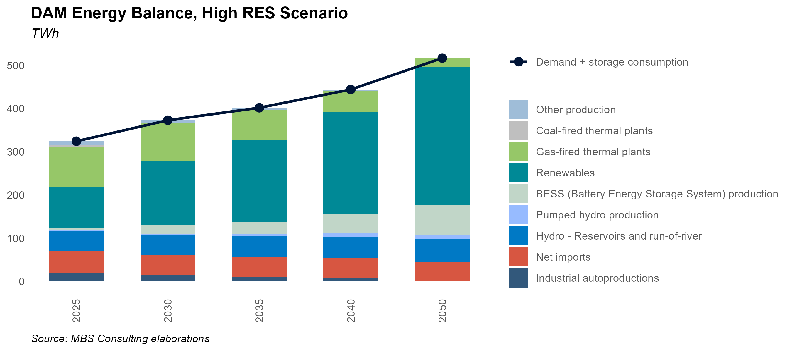
</div>

::::: callout-item
::: callout-left
#### 25-26 {.unnumbered}
:::

::: callout-right
In a context of moderate demand recovery, advancing RES installations, net imports exceeding 50 TWh, and the projected coal phase-out by 2025, the share of gas-fired generation in the mix is expected to stabilize at around 30% through 2026. 
:::
:::::

::::: callout-item
::: callout-left
#### 27-30 {.unnumbered}
:::

::: callout-right
By the end of 2028, coal-fired units are fully phased out. Declining renewable costs and the impact of regulated mechanisms — particularly FERX — support renewable development through 2030, while additional offshore wind projects come online. By 2030, the share of renewable energy in total electricity consumption reaches 56%, while net imports keep covering around 13% of the whole demand.
:::
:::::

::::: callout-item
::: callout-left
#### 31-50 {.unnumbered}
:::

::: callout-right
In the long term, gas-fired thermal plants will remain essential for system security, but their share of the energy mix is expected to fall to 13% by 2040 and 5% by 2050 as storage capacity expands. Despite advances in storage and grid upgrades, full renewable integration will face challenges such as congestion and overproduction, underscoring the need for greater electrolyzer capacity to manage surplus renewable energy effectively.
:::
:::::

::::: callout-wrap
::: callout-left
#### Main updates {.unnumbered}
:::

::: callout-right
Short- and mid-term power demand forecasts have been revised downward, as weak early-2025 demand and a struggling industrial sector point to a slow recovery. Other balance adjustments reflect updated commodity prices and revised RES-E output expectations.
:::
:::::

\newpage

### Low RES Scenario

::: callout-main
**A SLOWER ECONOMIC RECOVERY LEADS TO LOWER ELECTRICITY DEMAND AND WEAKER INVESTMENT IN DECARBONIZATION. COMPLETION OF CRITICAL GRID PROJECTS ENABLES COAL PHASE-OUT BY 2032, WHILE RENEWABLES AND BATTERY STORAGE STEADILY INCREASE THEIR SHARE IN THE ENERGY MIX**
:::

<div style="text-align: center;">
  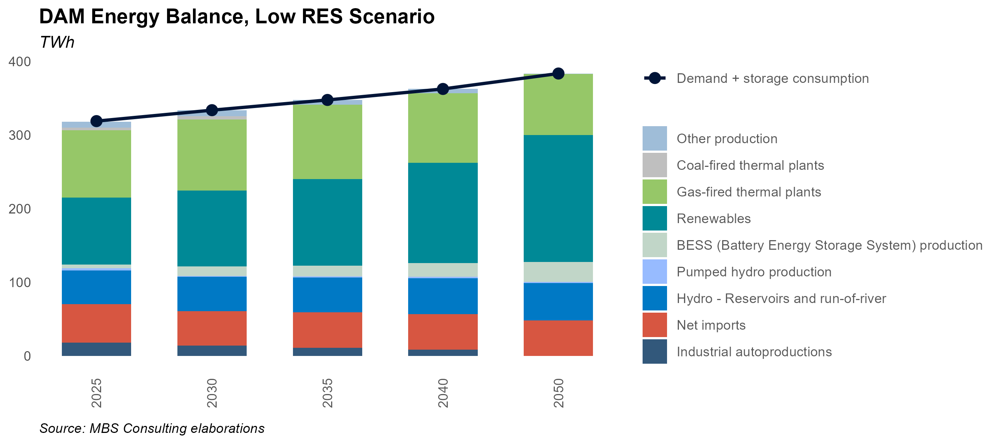
</div>

::::: callout-item
::: callout-left
#### 25-26 {.unnumbered}
:::

::: callout-right
As the role of coal-fired thermal plants in the energy mix declines and electricity demand grows toward 315 TWh, gas-fired plants are expected to continue covering over 30% of demand. Renewable generation is projected to rise annually, albeit at a moderate pace, due to a slowdown in new installations. Net electricity imports are anticipated to stabilize around 52 TWh by 2025.
:::
:::::

::::: callout-item
::: callout-left
#### 27-30 {.unnumbered}
:::

::: callout-right
CM-led investments are expected to come online, though the coal-fired capacity phase-out is postponed to 2032, coinciding with the completion of major network upgrades. By 2030, net imports are projected to fall to 47 TWh, with gas-fired generation covering 32% of electricity demand. Hydropower stabilizes near 46.5 TWh, while renewables steadily grow their share.
:::
:::::

::::: callout-item
::: callout-left
#### 31-50 {.unnumbered}
:::

::: callout-right
The complete phase-out of coal-fired plants is expected by 2032 with the commissioning of the Tyrrhenian Link. In parallel, gas-fired generation is projected to decline, covering just 23% of the energy mix by 2050. Shifting Day-Ahead Market dynamics and growing renewables—exceeding 60% of demand—will favour the integration of 14 GW of energy-intensive storage from 2031 to 2050.
:::
:::::

::::: callout-wrap
::: callout-left
#### Main updates {.unnumbered}
:::

::: callout-right
Short- and mid-term power demand projections have been revised downward from the previous update, as weaker-than-expected demand in the first eight months of 2025 and a deteriorating industrial sector point to a slow recovery in base demand. Although EV market performance in 2025 has exceeded expectations, meeting NIECP targets would require an unlikely surge in registrations, further justifying the downward mid-term demand revision. Other generation mix changes reflect updated short-term commodity price assumptions and revised mid-term RES output expectations.
:::
:::::

\newpage

## Electricity Demand

::: callout-main
**SHORT-TERM POWER DEMAND TRENDS REMAIN WEAK AMID SIGNS OF INDUSTRIAL SECTOR UNDERPERFORMANCE AND UNCERTAINTY IN THE GROWTH OF NEW CONSUMPTION SEGMENTS (EVs, HEAT PUMPS AND DATACENTRES). HOWEVER, DEMAND IS EXPECTED TO RISE IN THE MEDIUM TO LONG TERM, POTENTIALLY SURPASSING THE PRE-CRISIS LEVEL OF 320 TWh BY 2028 IN THE REFERENCE SCENARIO. A DETERIORATING CONTEXT COULD DELAY FULL RECOVERY UNTIL 2031**
:::

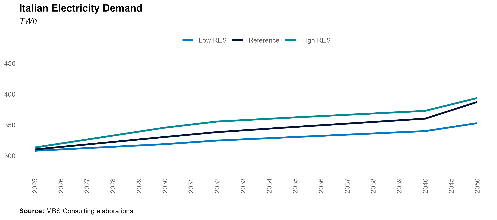

::::: callout-item
::: callout-left
#### 25-26 {.unnumbered}
:::

::: callout-right
A modest rise in base demand (+1 TWh annually), combined with an additional 2 TWh from EVs, heat pumps, and datacentres over the next two years, is expected to lift electricity demand to 315 TWh in the reference case by 2026. In the high RES scenario, stronger economic growth and a more optimistic outlook for EV registrations push demand above 320 TWh as early as 2026, while in the low RES scenario, a stagnant economy could keep demand below 320 TWh until 2031.
:::
:::::

::::: callout-item
::: callout-left
#### 27-30 {.unnumbered}
:::

::: callout-right
In the reference case, ongoing electrification and steady GDP growth bring power demand to over 318 TWh by 2027 and 330 TWh by 2030. In the high RES scenario, stronger economic expansion (+1.2% y/y) and faster electrification push demand to 345 TWh by 2030. Conversely, in the low RES scenario, slower economic recovery (+0.6% y/y) and lagging electrification hold demand near pre-crisis levels (just above 320 TWh) until after 2030.
:::
:::::

::::: callout-item
::: callout-left
#### 31-50 {.unnumbered}
:::

::: callout-right
After 2030, increased electrification in transport, heating, and data centres is expected to lift electricity demand, though efficiency gains may limit growth. In the reference case, demand rises to over 360 TWh by 2040 and stabilises near 385 TWh. Scenarios diverge thereafter: the high RES case exceeds 390 TWh by 2050, while the low RES case levels around 350 TWh.
:::
:::::

::::: callout-wrap
::: callout-left
#### Main updates {.unnumbered}
:::

::: callout-right
Short- and mid-term demand projections across all scenarios have been revised down, as weak demand in early 2025 and a deteriorating industrial sector signal a slow recovery. Despite stronger-than-expected EV sales, meeting NIECP targets would require an unlikely surge in registrations, reinforcing the downward revision.
:::
:::::

\newpage

### E-mobility

::: callout-main
**ADDITIONAL ELECTRICITY DEMAND FROM ELECTRIC VEHICLES (EVS) CAN VARY SIGNIFICANTLY DEPENDING ON THE FUTURE IMPLEMENTATION OF E-MOBILITY SOLUTIONS IN URBAN AREAS, EMISSIONS REDUCTION TARGETS IN TRANSPORTATION, AND OVERALL LONG-TERM TRANSPORTATION HABITS**
:::

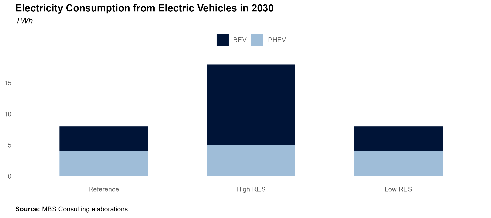

::::: callout-item
::: callout-left
#### 25-40 {.unnumbered}
:::

::: callout-right
Electric vehicle (EV) numbers are projected to reach 1.2 million by 2025, 4.1 million by 2030, and 10.7 million by 2040 in the reference scenario, translating into EV consumption of 2 TWh, 8.4 TWh, and 22.8 TWh, respectively. In the high RES scenario, faster electric vehicle uptake is expected, with 6.6 million by 2030 and 12.6 million by 2040. Conversely, in the low RES scenario, e-mobility deployment faces a 5- to 10-year delay versus the reference, and the PNIEC Slow Policy target of 4.5 million EVs is only reached by 2040.
:::
:::::

::::: callout-item
::: callout-left
#### 30 {.unnumbered}
:::

::: callout-right
The NIECP targets 6.5 million electric vehicles in Italy by 2030 — 4.3 million of them pure EVs (BEVs: Battery Electric Vehicles). Our reference projections for 2030 remain below this policy goal, as current business-as-usual registrations average about +110k EVs per year, far from the +880k annual pace needed to meet the target. The high RES scenario, however, anticipates achieving the 6.5 million objective on schedule.
:::
:::::

::::: callout-item
::: callout-left
#### 31-50 {.unnumbered}
:::

::: callout-right
Despite the recent Green Deal proposals at the EU level regarding
transportation, the uncertainty surrounding the future expansion of a
market still in its early stages of development leads us to assume a
business-as-usual (BAU) trend over the long term, beginning with the
annual level of electric vehicle (EV) additions projected for 2030.
:::
:::::

::::: callout-wrap
::: callout-left
#### Main updates {.unnumbered}
:::

::: callout-right
E-mobility demand have been revised to incorporate the recent evolutions in the market: 2024 signalled a sub-expectations evolution of EV registrations, while 2025 registered a significant % increase compared to the 2024 levels. Recent registration pace results still limited compared to the one needed to achieve policy targets.
:::
:::::

\newpage

### Heating and Cooling

::: callout-main
**THE ADDITIONAL ELECTRICITY DEMAND FOR HEATING AND COOLING WILL DEPEND ON THE GROWTH RATE OF INSTALLATIONS FOR RESIDENTIAL AND INDUSTRIAL USES, WHICH MAY BE FURTHER SUPPORTED BY DECARBONIZATION INCENTIVES**
:::

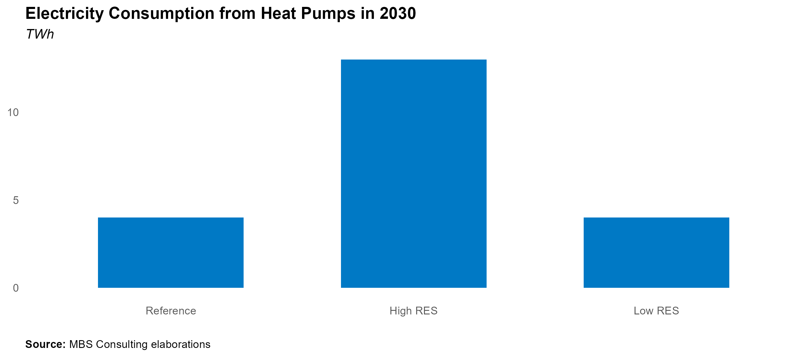

::::: callout-item
::: callout-left
#### 25-40 {.unnumbered}
:::

::: callout-right
Heating and cooling (H&C) is projected to represent additional
electricity requirements ranging from 2 TWh to 5 TWh in 2025, 4 TWh to 13 TWh in 2030, and 8 TWh to 17 TWh in 2040, depending on the scenario analyzed.
:::
:::::

::::: callout-item
::: callout-left
#### 30 {.unnumbered}
:::

::: callout-right
Our assumptions lead to estimate 6.7 TWh of H&C consumption in 2030, as
per the reference scenario, corresponding to around 1.8 million
installations for civil uses.
:::
:::::

::::: callout-item
::: callout-left
#### 31-50 {.unnumbered}
:::

::: callout-right
We assume a BAU trend in the long-term horizon, starting from the annual
level of additional installations and consumption reached in 2030.
:::
:::::

::::: callout-wrap
::: callout-left
#### Main updates {.unnumbered}
:::

::: callout-right
H&C demand hypotheses are in line with the previous update.
:::
:::::

\newpage

### Industrial Self-Production and Self-Consumption

::: callout-main
**INDUSTRIAL SELF-CONSUMPTION WILL GRADUALLY DECREASE AS EXISTING ASSETS REACH END-OF-LIFE AND THE EXEMPTIONS ACCORDED TO CLOSED DISTRIBUTION SYSTEMS WILL BE AT LEAST PARTIALLY REMOVED**
:::

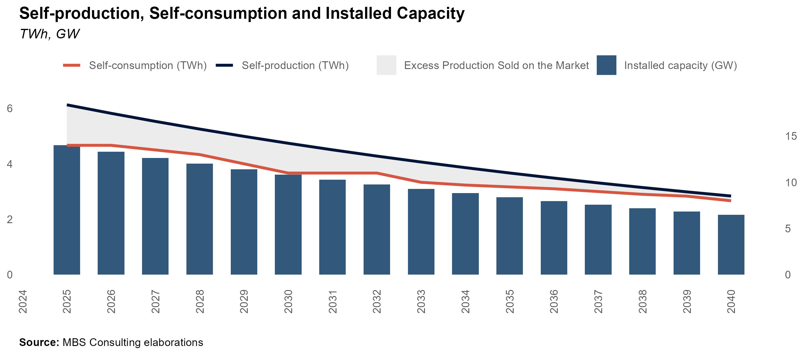

::::: callout-item
::: callout-left
#### 25 {.unnumbered}
:::

::: callout-right
Law 91/2014 affirms that grid and general system tariff components
should be applied to the electricity consumed and not only to the
electricity withdrawn from the public grid. Following this approach, the
exemptions accorded to RIU (Re Interne di Utenza) and SEU (Sistemi
Efficienti di Utenza) and closed distribution systems, and the benefits
currently in force for existing plants related to self-consumption will
be at least partially removed for new subjects/projects that apply for
similar mechanisms.
:::
:::::

::::: callout-item
::: callout-left
#### 26-50 {.unnumbered}
:::

::: callout-right
The excess of self-produced electricity that is not consumed by the
industrial sites (self-consumption) and is thus sold on the market
(differential between self-production and self-consumption) is expected
to gradually decrease, consistently with the expected end-of-life of
existing power plants that serve industrial sites.
:::
:::::

::::: callout-wrap
::: callout-left
#### Main updates {.unnumbered}
:::

::: callout-right
Industrial self-production and self-consumption hypotheses are in line
with the previous update. Self-production/consumption hypotheses are the
same in all the three scenarios.
:::
:::::

\newpage

### Zonal Distribution of Electricity Demand

::: callout-main
**ZONAL DISTRIBUTION OF ELECTRICITY DEMAND IS ESTIMATED IN LINE WITH MOST RECENT REGIONAL TRENDS**
:::

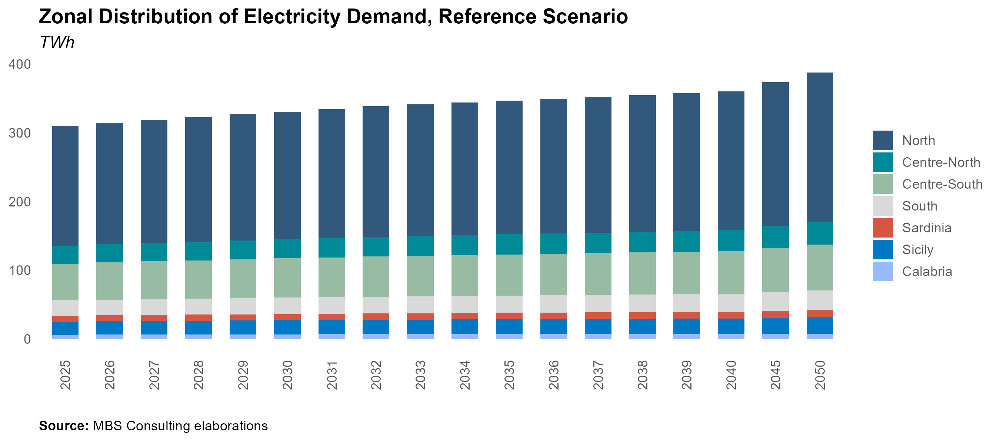

::::: callout-item
::: callout-left
#### 15-20 {.unnumbered}
:::

::: callout-right
In 2015, the approval of the European guidelines on capacity allocation
and congestion management (CACM) introduced new parameters to be
followed in the zonal configuration review process. In 2018, Terna began
a process to review the zonal configurations in compliance with such
rules.
:::
:::::

::::: callout-item
::: callout-left
#### 21-onwards {.unnumbered}
:::

::: callout-right
The current zonal configuration derives from the base case proposed by
Terna in compliance with the CACM. Differences compared to the previous
configuration: (i) elimination of the limited production poles, (ii)
inclusion of a new bidding zone corresponding to the Calabria region,
(iii) displacement of the Umbria region from the Centre-North zone to
the Centre-South market zone.
:::
:::::

::::: callout-item
::: callout-left
#### 25-50 {.unnumbered}
:::

::: callout-right
The zonal distribution of electricity demand is based on historical
regional data published by Terna and subsequent econometric
elaborations. In the Reference case, the zonal distribution of
electricity needs is as follows: North (57%), Central-North (9%),
Central-South (17%), South (7%), Calabria (2%), Sicily (6%), Sardinia
(3%). Slight differences in such figures between the alternative cases
are the result of the econometric elaborations performed.
:::
:::::

::::: callout-wrap
::: callout-left
#### Main updates {.unnumbered}
:::

::: callout-right
The approach adopted and the distribution quotas are in line with the
previous update.
:::
:::::

\newpage

## Net Import

::: callout-main
**THE RECOVERY OF NUCLEAR CAPACITY FROM O&M OPERATIONS INITIATED IN 2022 (ALONG WITH THE CONNECTION OF THE FLAMANVILLE REACTOR AFTER LONG DELAYS), INCREASED HYDROPOWER PRODUCTION IN SWITZERLAND, AND LOWER ELECTRICITY DEMAND ACROSS EUROPE, IS EXPECTED TO SUSTAIN NET IMPORTS INTO THE NORTHERN ZONE. NET IMPORTS ARE PROJECTED TO REACH 50 TWH BY THE END OF 2024. AFTER 2029, THE COMPLETION OF A 600 MW INTERCONNECTOR WITH TUNISIA WILL ENHANCE EXPORT CAPABILITIES**
:::

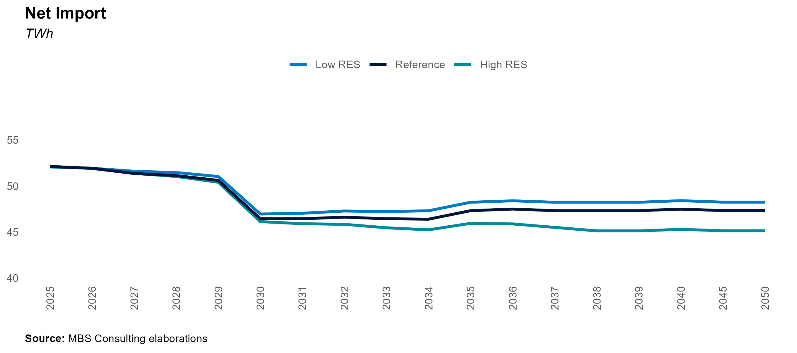

::::: callout-item
::: callout-left
#### 25-26 {.unnumbered}
:::

::: callout-right
Building on trends seen in 2023 and 2024, with net imports exceeding 50 TWh, imports from neighboring countries are expected to remain above historical averages in the short term. This sustained level is mainly driven by the gradual recovery of French nuclear output after two years of disruptions, increased hydroelectric production in Switzerland, and a slower-than-expected rebound in European electricity demand. Net imports are projected at 52.1 TWh in 2025, with a marginal decline of 200 GWh in 2026, representing 17% of short-term electricity demand.
:::
:::::

::::: callout-item
::: callout-left
#### 27-30 {.unnumbered}
:::

::: callout-right
A moderate recovery in electricity demand, coupled with growing renewable capacity across Europe, fuels expectations of overgeneration in the medium term—positioning imports as a cost-effective option for Italy. This trend is supported by projections that the PUN will remain above other European price benchmarks. Net imports are forecast to average around 51 TWh annually through 2029. However, with the Elmed interconnection to Tunisia set to begin operation by late 2028, the net import balance is projected to decline to 47 TWh, as over 3.5 TWh shifts to exports.
:::
:::::

::::: callout-item
::: callout-left
#### 31-50 {.unnumbered}
:::

::: callout-right
Import levels are expected to remain stable also after 2030, ranging
above 47 TWh. The slight increase in net import seen from 2035 is due to an estimated reduction (1 TWh ca.) in the export flows towards Tunisia, following the implementation of the Tunisian system development plan.
:::
:::::

::::: callout-wrap
::: callout-left
#### Main updates {.unnumbered}
:::

::: callout-right
Import projections are in line with the previous update.
:::
:::::

```{r, include=FALSE}
# ## Capacity from 2024 Capacity Market Auction
# 
# ::: callout-main
# **NEW PROJECTS CONCENTRATED IN THE NORTH ZONE AND SARDINIA, THOSE
# MANIFESTING THE GREATEST ADEQUACY NEEDS. ALL THE NEW GAS-FIRED PROJECTS
# PARTICIPATING TO THE AUCTIONS ARE SUPPOSED TO EXPLOIT THE 1-YEAR BUFFER
# PERMITTED BY THE RULES OF THE MECHANISM**
# :::
# 
# 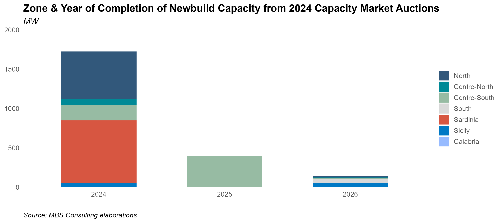
# 
# ::: callout-item
# ::: callout-left
# #### NORTH, CNORTH {.unnumbered}
# :::
# 
# ::: callout-right
# 1.7 GW of new high-efficiency gas-fired capacity and almost 0.6 of new
# electrochemical storage capacity have been procured in the North market
# zone, the one which will suffer the most -- under a system adequacy
# point of view -- from the dismission of coal-fired capacity. In the
# Centre-North market zone, about 50 MW of new storage capacity have been
# procured instead.
# :::
# :::
# 
# ::: callout-item
# ::: callout-left
# #### CSOUTH, SOUTH, CALA {.unnumbered}
# :::
# 
# ::: callout-right
# These zones will be interested by the phase-out planned for 2025 as they
# respectively host about 1.8 GW and 2.6 GW of coal-fired capacity.
# However, only 0.4 GW ca. between gas-fired and storage capacity have
# been awarded among the two -- 0.3 GW in Centre-South and the remaining
# capacity in South -- after the competitive procedure. No new projects
# were awarded in Calabria.
# :::
# :::
# 
# ::: callout-item
# ::: callout-left
# #### SICI, SARD {.unnumbered}
# :::
# 
# ::: callout-right
# In Sardinia, coal-fired units will not be substituted by new gas-fired
# generation as the 0.8 GW awarded only come from new storage capacity.
# This could be a cornerstone for the island as the transition path
# embraced would hence neglect natural gas and favor fully electrified
# solutions. In Sicily, the competitive procedure resulted in the
# procurement of just 12 MW of new storage capacity.
# :::
# :::
# 
# ::: callout-wrap
# ::: callout-left
# #### Main updates {.unnumbered}
# :::
# 
# ::: callout-right
# 2024 Capacity Market auction outcomes are based on the data published by
# Terna and recent information regarding construction time.
# :::
# :::
# 
# \newpage
```

## Thermoelectric Generation

### Installed Capacity, Reference Scenario

::: callout-main
**CAPACITY MARKET AUCTIONS WILL COMPREHENSIVELY BRING 4.5 GW OF NEW GAS-FIRED CAPACITY BY THE BEGINNING OF 2027. SARDINIAN COAL-FIRED UNITS TO BE PHASED-OUT ONLY IN 2029, CONSIDERING THE TYRRHENIAN LINK ENTERING IN 2030**
:::

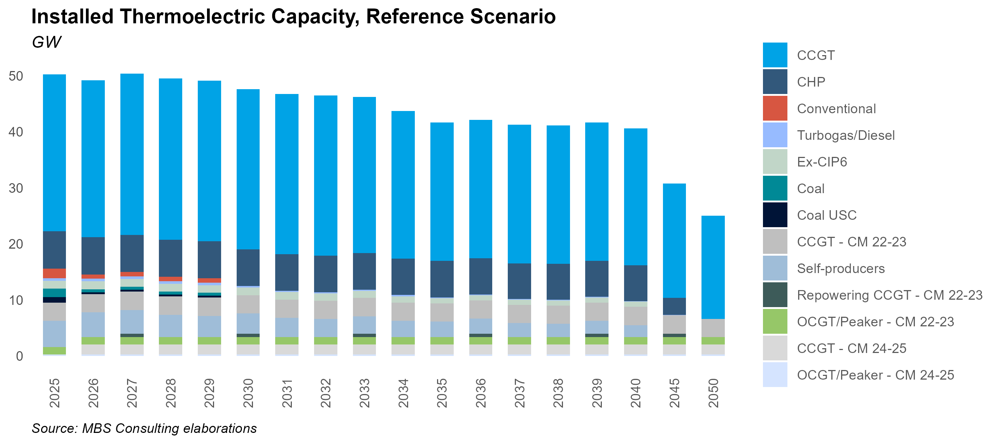

::::: callout-item
::: callout-left
#### 25-26 {.unnumbered}
:::

::: callout-right
Capacity secured in the 2024 Capacity Market auctions has experienced widespread delays, with notable examples such as the CCGT Ostiglia project now rescheduled for commissioning in February 2026. Most of this capacity is expected to gradually enter the market over the course of 2025.
:::
:::::

::::: callout-item
::: callout-left
#### 27-30 {.unnumbered}
:::

::: callout-right
Auction results show also that Sardinia coal-fired capacity will not be substituted by gas-fired units, as only storage capacity was awarded in the island. Anyway, while coal-fired plants on the peninsula will be phased-out after 2025, Sardinia units are expected to operate until the Tyrrhenian Link infrastructure is fully completed (2030).
:::
:::::

::::: callout-item
::: callout-left
#### 31-50 {.unnumbered}
:::

::: callout-right
The amount of capacity auctioned through the CM is expected to ensure full system adequacy until at least 2030. The latest CM auctions (delivery period 2025-2026-2027) have not provided the right signals for investment in new thermoelectric capacity, as new capacity awarded was related only to repowering and BESS, and no other investments are envisaged. Existing CHP plants continue to support industrial activities under the assumption of BAU evolution of industrial needs. Some obsolete CCGT capacity exits the market.
:::
:::::

::::: callout-wrap
::: callout-left
#### Main updates {.unnumbered}
:::

::: callout-right
Thermoelectric capacity assumptions are in line with the previous update.
:::
:::::

\newpage

### Installed Capacity, High RES Scenario

::: callout-main
**CAPACITY MARKET AUCTIONS WILL COMPREHENSIVELY BRING 4.5 GW OF NEW GAS-FIRED CAPACITY BY BEGINNING OF 2027. SARDINIAN COAL-FIRED UNITS TO BE PHASED-OUT ONLY IN 2027, CONSIDERING THE TYRRHENIAN LINK ENTERING IN 2028**
:::

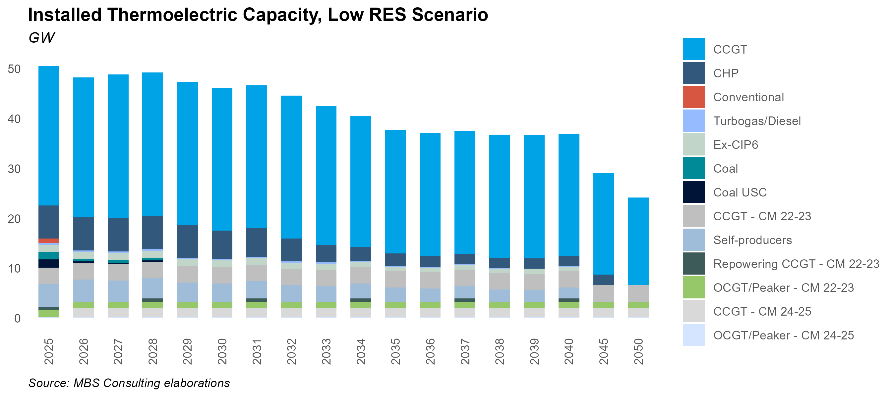

::::: callout-item
::: callout-left
#### 25-26 {.unnumbered}
:::

::: callout-right
Capacity secured in the 2024 Capacity Market auctions has experienced widespread delays, with notable examples such as the CCGT Ostiglia project now rescheduled for commissioning in February 2026. Most of this capacity is expected to gradually enter the market over the course of 2025.
:::
:::::

::::: callout-item
::: callout-left
#### 27-30 {.unnumbered}
:::

::: callout-right
Auction results show also that Sardinia coal-fired capacity will not be substituted by gas-fired units, as only storage capacity was awarded in the island. Anyway, while coal-fired plants on the peninsula will be phased-out after 2025, Sardinia units are expected to operate until the Tyrrhenian Link infrastructure is fully completed (2029).
:::
:::::

::::: callout-item
::: callout-left
#### 31-50 {.unnumbered}
:::

::: callout-right
The latest CM auctions (delivery period 2025-2026-2027) have not provided the right signals for investment in new thermoelectric capacity, as new capacity awarded was related only to repowering and BESS, and no other investments are envisaged. Most of existing CHP power plants gradually exit the market, substituted by greener solutions. Some ageing CCGT capacity exit the market following strong competitive conditions.
:::
:::::

::::: callout-wrap
::: callout-left
#### Main updates {.unnumbered}
:::

::: callout-right
Thermoelectric capacity assumptions are in line with the previous update.
:::
:::::

\newpage

### Installed Capacity, Low RES Scenario

::: callout-main
**CAPACITY MARKET AUCTIONS WILL COMPREHENSIVELY BRING 4.5 GW OF NEW GAS-FIRED CAPACITY BY BEGINNING OF 2027. PHASE-OUT OF COAL-FIRED UNITS IS POSTPONED UNTIL 2034 WHEN THE TYRRHENIAN LINK BECOMES OPERATIVE**
:::

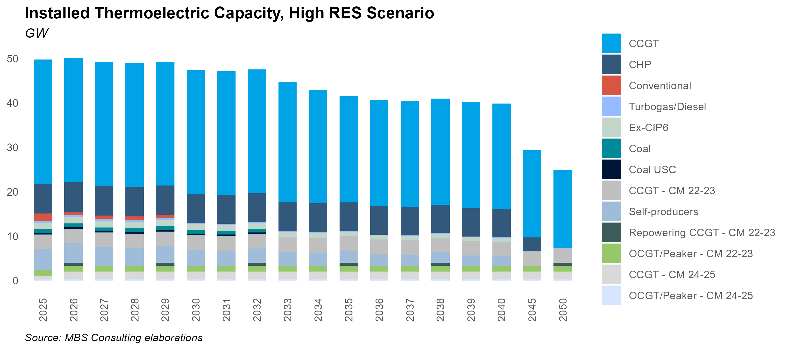

::::: callout-item
::: callout-left
#### 25-26 {.unnumbered}
:::

::: callout-right
Capacity secured in the 2024 Capacity Market auctions has experienced widespread delays, with notable examples such as the CCGT Ostiglia project now rescheduled for commissioning in February 2026. Most of this capacity is expected to gradually enter the market over the course of 2025.
:::
:::::

::::: callout-item
::: callout-left
#### 27-30 {.unnumbered}
:::

::: callout-right
Thermal capacity expected to be stable in the second half of the decade in the Low RES scenario.
:::
:::::

::::: callout-item
::: callout-left
#### 31-50 {.unnumbered}
:::

::: callout-right
The latest CM auctions (delivery period 2025-2026-2027) have not provided the right signals for investment in new thermoelectric capacity, as new capacity awarded was related only to repowering and BESS, and no other investments are envisaged. Existing CHP and CCGT power plants are projected to remain operative. The commissioning of the Tyrrhenian Link is postponed until 2032, determining a delayed phase-out of all coal power plants.
:::
:::::

::::: callout-wrap
::: callout-left
#### Main updates {.unnumbered}
:::

::: callout-right
Thermoelectric capacity assumptions are in line with the previous update.
:::
:::::

\newpage

### Residual Demand for CCGTs

::: callout-main
**EXISTING CCGTS STABILIZE AROUND 1,800 EOH IN 2025, THEN GRADUALLY DECLINE TOWARD 800 AVERAGE EOH BY 2040. THIS TREND IS DRIVEN BY A SIGNIFICANT RISE IN OUTPUT FROM NEW RENEWABLE ENERGY INSTALLATIONS, ALONGSIDE INCREASED COMPETITION FROM ADDITIONAL CAPACITY INTRODUCED FOLLOWING THE 2024–2025 CAPACITY MARKET AUCTIONS**
:::

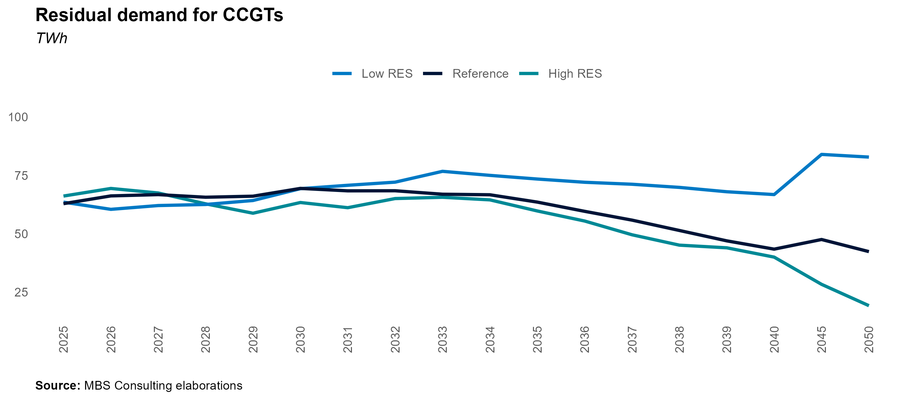

::::: callout-item
::: callout-left
#### 25-26 {.unnumbered}
:::

::: callout-right
The existing fleet of combined cycle gas turbines (CCGTs) is projected
to average approximately 1800 EOH during the 2025-2026 period,
exhibiting significant zonal variations. In the Northern zone, the load
factor for CCGTs is around 1100 EOH, while the Southern zones show lower
figures, averaging about 800 EOH. Notably, Calabria stands out with an
average of 2200 EOH.
:::
:::::

::::: callout-item
::: callout-left
#### 27-30 {.unnumbered}
:::

::: callout-right
After the phase-out of coal-fired units, residual demand is expected to
rebound. However, existing combined cycle gas turbines (CCGTs) will face
significant competition from sustained import levels and new
high-efficiency entrants supported by the capacity market. In the low
scenario, residual demand is further reduced due to the effects of
energy efficiency improvements and increased renewable penetration.
Conversely, in the high scenario, residual demand gradually increases as
switching conditions improve.
:::
:::::

::::: callout-item
::: callout-left
#### 31-50 {.unnumbered}
:::

::: callout-right
Existing CCGTs (53%-efficiency) stabilize around 1200 EOH. In the High RES
scenario, the great renewable penetration influences competitive
dynamics and existing units remain close to 1000 EOH. In the Low RES
scenario, the improvement of switching conditions is hampered by the
high level of imports from abroad, with EOH of existing units over 2000
favored by phase-out after 2035. High-efficiency units stabilize below
the 4800 EOH only in the Low scenario.
:::
:::::

::::: callout-wrap
::: callout-left
#### Main updates {.unnumbered}
:::

::: callout-right
CCGT residual demand projections have been revised downward due to lower power demand expectations and higher projected RES-E output.
:::
:::::

\newpage

### Coal-fired Production

::: callout-main
**THE PHASE-OUT OF COAL-FIRED THERMAL PLANTS IS EXPECTED TO OCCUR IN 2025, EXCEPT FOR THE SARDINIAN PLANTS, WHICH ARE SET TO CLOSE THROUGH 2029. THIS TIMELINE COINCIDES WITH THE FULL COMPLETION OF THE TYRRHENIAN LINK IN 2030**
:::

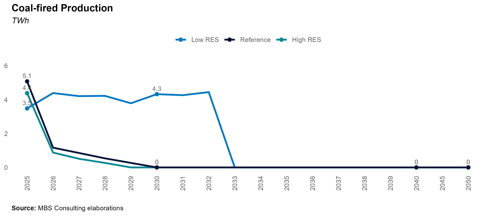

::::: callout-item
::: callout-left
#### 25-26 {.unnumbered}
:::

::: callout-right
Limited growth in electricity demand, combined with favorable switching conditions, sustained imports, and increasing RES-E generation, is expected to drive a significant reduction in coal production. In the Reference Scenario, coal output is projected to get to 5.1 TWh by 2025, while in the High RES Scenario, it falls further to just below 1 TWh by 2026. Conversely, in the Low RES Scenario, coal remains above 4 TWh by 2026.
:::
:::::

::::: callout-item
::: callout-left
#### 27-30 {.unnumbered}
:::

::: callout-right
The coal phase-out timeline varies across scenarios, primarily influenced by the availability of key grid infrastructure—most notably, the Tyrrhenian Link. In the Reference Scenario, only Sardinian units are expected to remain online beyond 2025, with decommissioning aligned to the Tyrrhenian Link’s completion in 2030. In the High RES Scenario, full coal plant closure is projected by 2028, while in the Low RES Scenario, coal-fired units are expected to stay operational until 2032.
:::
:::::

::::: callout-item
::: callout-left
#### 31-50 {.unnumbered}
:::

::: callout-right
Coal units remain operational beyond 2030 only in the Low RES Scenario, with a complete phase-out projected by 2032, following the commissioning of the Tyrrhenian Link.
:::
:::::

::::: callout-wrap
::: callout-left
#### Main updates {.unnumbered}
:::

::: callout-right
Short-term changes in coal production reflect updated commodity prices, while the phase-out timeline is in line with the previous update.
:::
:::::

\newpage

## Reneweable Generation

### Renewable Installed Capacity

::: callout-main
**RES CAPACITY GROWTH IS SET TO CONTINUE IN THE SHORT TERM, THOUGH SLOWER THAN 2024. LONG TERM, MARKET PARITY WILL BE DRIVEN BY HIGHER COMMODITY PRICES AND DECARBONIZATION POLICIES, BUT NIECP TARGETS ARE EXPECTED TO BE REACHED WITH A DELAY OF 4–5 YEARS**
:::

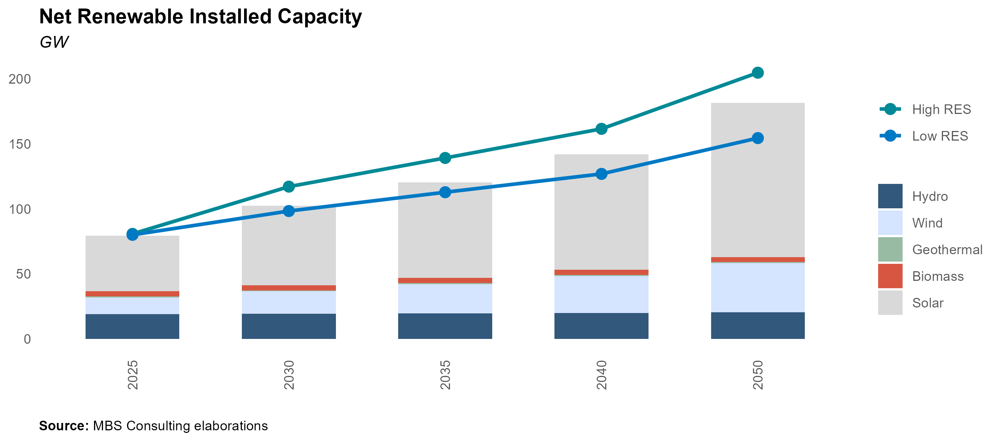

::::: callout-item
::: callout-left
#### 25-26 {.unnumbered}
:::

::: callout-right
By the end of 2025, 43 GW of solar and 14 GW of wind capacity are expected to be operational. In 2026, an additional 4.2 GW of solar and 660 MW of wind are projected in the Reference case, while in the High RES case, yearly additions could reach up to 7.5 GW. Installations align with the trend observed in the first eight months of 2025, showing steady PV growth but a slowdown from 2024, as developers delayed project deployment to participate in FERX and FERX Transitorio auctions amid regulatory adjustments and delays.
:::
:::::

::::: callout-item
::: callout-left
#### 27-30 {.unnumbered}
:::

::: callout-right
Market parity, incentive schemes, and the solid progress in permitting achieved in 2024 and 2025 are expected to support deployment beyond 2025–2026. The Reference scenario projects 61 GW of solar and 18 GW of wind by 2030. In the High RES scenario, faster cost reductions and stronger economics raise solar to 72 GW and wind to 21 GW, with offshore wind accounting for over 50% of additions between 2027 and 2030.
:::
:::::

::::: callout-item
::: callout-left
#### 31-50 {.unnumbered}
:::

::: callout-right
The reference scenario projects continued renewable growth through 2040, though at a slower pace than in 2025–2030, with just over 3 GW added annually and moderate acceleration approaching 2040 as targets near completion. Solar is expected to reach 89 GW and wind 29 GW by 2040, with most macro zones meeting targets by 2050. Achieving faster decarbonization may require greater investment in grid enhancements and advanced storage solutions.
:::
:::::

::::: callout-wrap
::: callout-left
#### Main updates {.unnumbered}
:::

::: callout-right
Solar capacity projections have been revised to better capture the momentum seen in Q1 and Q2 2025 — particularly with an upward adjustment of short-term PV installations, but also more broadly across the full horizon, as the 2025 installation slowdown versus 2024 proves less pronounced than expected.
:::
:::::

\newpage

### Renewable Production

::: callout-main
**THE EARLY MONTHS OF 2025 SHOWED STRONG SOLAR GROWTH, DRIVEN BY NEW CAPACITY AND CONSISTENTLY OUTPERFORMING 2024 LEVELS. YET, ACHIEVING ITALY'S NECP TARGETS WILL REQUIRE SIGNIFICANT EFFORT. MEETING THE 2030 RES/GDC GOAL OF 63% DEPENDS ON FASTER PERMITTING AND MORE STABLE WIND OUTPUT, WHICH REMAINS HIGHLY VARIABLE, WITH 2025 LEVELS BELOW 2024 DESPITE ADDITIONAL CAPACITY**
:::

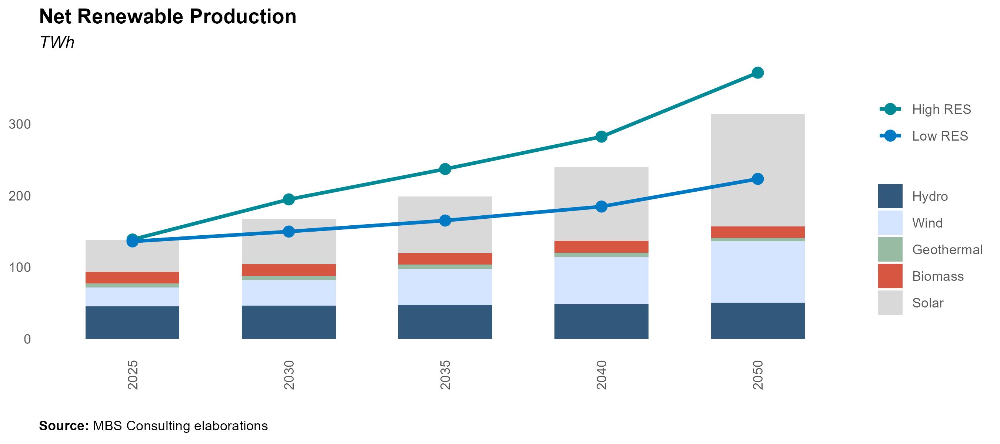

::::: callout-item
::: callout-left
#### 25-26 {.unnumbered}
:::

::: callout-right
Wind generation is expected to exceed 26.5 TWh, while solar is projected to reach nearly 44.5 TWh in 2025; combined output is expected to grow by an additional 6 TWh in 2026. In the High RES scenario, stronger demand and faster deployment push wind to 31 TWh and solar close to 49 TWh by 2026.
:::
:::::

::::: callout-item
::: callout-left
#### 27-30 {.unnumbered}
:::

::: callout-right
Assuming business-as-usual producibility and steady installation growth beyond 2026, RES are expected to cover over 50% of demand by 2030 — about 80% of the 2030 target. Achieving a 63% RES share of gross domestic consumption by 2030 would require a much steeper green transition, with wind and solar capacity reaching NIECP target levels on time.
:::
:::::

::::: callout-item
::: callout-left
#### 31-50 {.unnumbered}
:::

::: callout-right
In the reference scenario, reaching 2040 capacity targets by 2050 — supported by technological advances — would more than double wind and solar generation from 2025 levels. Offshore deployment, potentially adding up to 30 TWh by 2050, plays a pivotal role. Alternative scenarios show varying paths of renewable expansion and output.
:::
:::::

::::: callout-wrap
::: callout-left
#### Main updates {.unnumbered}
:::

::: callout-right
Short-term RES production forecasts have been slightly revised due to changes in solar installation trends.
:::
:::::

\newpage

### Day-Ahead Market Overgeneration

::: callout-main
**OVERGENERATION IS EXPECTED TO BECOME A SIGNIFICANT LONG-TERM CHALLENGE DUE TO HIGH RENEWABLE PENETRATION, PARTICULARLY IN SOUTHERN ZONES. SCALING UP ENERGY-INTENSIVE STORAGE AND ELECTROLYSIS CAPACITY WILL BE CRUCIAL TO MITIGATE MARKET IMBALANCES**
:::

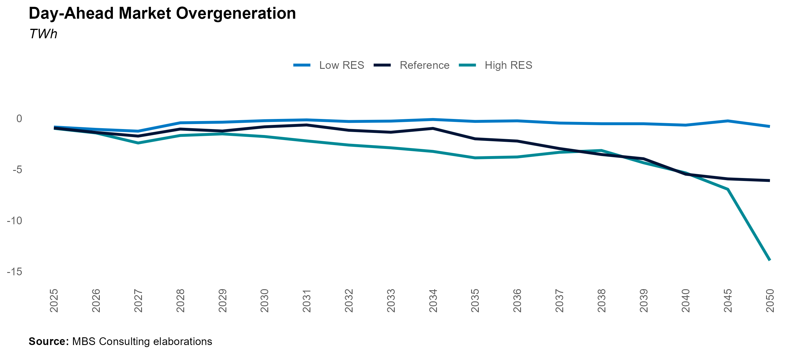

::::: callout-item
::: callout-left
#### 25-26 {.unnumbered}
:::

::: callout-right
Under BAU market conditions and sustained renewable growth, the risk of overgeneration remains limited in both the reference and low RES scenarios, averaging about 1.2 TWh. However, a sharper rise in capacity additions in the Southern macro-zone could cause more frequent overgeneration in the high RES scenario, though earlier grid infrastructure deployment keeps average overgeneration from exceeding 1.2 TWh.
:::
:::::

::::: callout-item
::: callout-left
#### 27-30 {.unnumbered}
:::

::: callout-right
Advancing RES penetration is expected to raise the risk of overgeneration, while grid upgrades and demand recovery lag, causing overgeneration to peak in 2027. Rapid renewable expansion in southern regions and anticipated delays in grid reinforcement will keep average overgeneration around 1.2 TWh in the reference case and 1.8 TWh in the high RES case.
:::
:::::

::::: callout-item
::: callout-left
#### 31-50 {.unnumbered}
:::

::: callout-right
Managing the challenges of rising renewable penetration and resulting overgeneration will require substantial investment in grid reinforcement and large-scale energy storage throughout the 2030s. These measures will be critical to maintaining grid stability, particularly in regions more exposed to overgeneration. At the same time, surplus electricity presents a strategic opportunity to expand electrolysis capacity, enabling productive use of excess energy and strengthening long-term renewable investment.
:::
:::::

::::: callout-wrap
::: callout-left
#### Main updates {.unnumbered}
:::

::: callout-right
Short-term day-ahead market overgeneration has changed following updates to RES production and power demand projections.
:::
:::::

\newpage

### Electrolyzer Installed Capacity

::: callout-main
**LONG-TERM RENEWABLE EXPANSION IN THE SOUTHERN REGIONS, PARTICULARLY ON
THE ISLANDS, IS EXPECTED TO RESULT IN SIGNIFICANT EXCESS ENERGY
GENERATION. GRID UPGRADES AND THE DEPLOYMENT OF BATTERY ENERGY STORAGE
SYSTEMS (BESS) MAY PROVE INSUFFICIENT TO FULLY MITIGATE THIS ISSUE,
NECESSITATING THE IMPLEMENTATION OF ELECTROLYSERS. BY 2040, INSTALLED
CAPACITY COULD REACH 0.5 GW UNDER THE REFERENCE SCENARIO AND UP TO 4 GW
IN THE HIGH RES SCENARIO, WITH CAPACITY PRIMARILY CONCENTRATED IN
SARDINIA AND SICILY**
:::

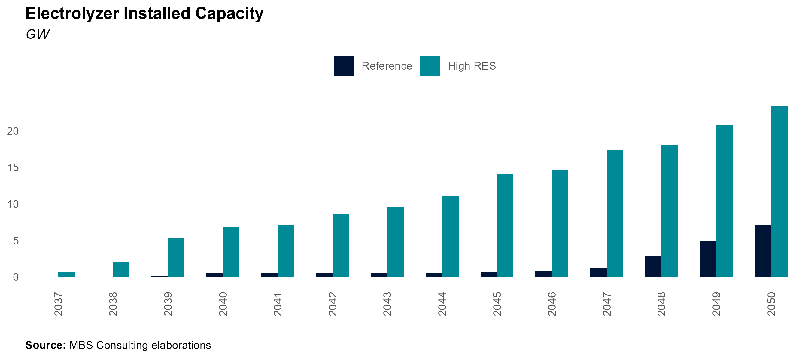

::::: callout-item
::: callout-left
#### 35-40 {.unnumbered}
:::

::: callout-right
In the long term, the expansion of renewable capacity---particularly in
the Southern regions---is expected to significantly increase the
incidence of systematic overgeneration, especially on the islands. Grid
investments and battery energy storage systems (BESS) will likely prove
inadequate to address this issue, thereby creating favorable conditions
for the adoption of green hydrogen technologies. In the Reference
scenario, installed electrolysis capacity could reach nearly 0.5 GW,
predominantly concentrated in Sardinia. Over time, electrolysis capacity
can effectively mitigate overgeneration by offering a mechanism to store
surplus renewable energy. Moreover, by enhancing demand during periods
of high RES production, it can help stabilize prices and alleviate the
cannibalization effect, particularly during the later stages of the
transition.
:::
:::::

::::: callout-wrap
::: callout-left
#### Main updates {.unnumbered}
:::

::: callout-right
Electrolyzer capacity hypotheses are in line with the previous update.
:::
:::::

\newpage

### Solar Market Parity

::: callout-main
**DESPITE THE EXPECTED LONG-TERM PRICE DECLINE—DRIVEN BY GAS MARKET STABILIZATION AND THE GRADUAL INTEGRATION OF RENEWABLES IN THE MIX SOLAR TECHNOLOGY REMAINS COMPETITIVE, WITH CAPTURED PRICES SURPASSING THE LEVELIZED COST OF ELECTRICITY**
:::

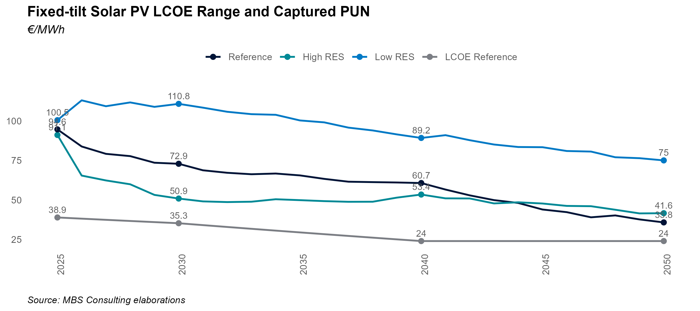

::::: callout-item
::: callout-left
#### 25-26 {.unnumbered}
:::

::: callout-right
Despite land constraints and rising costs, solar project economics have strengthened over the past year, supported by falling panel prices and greater supplier competition. These dynamics underpin market parity, with captured prices projected to range from 83 to 102 €/MWh across macro-zones in 2025–2026 under the reference case. Consequently, solar plants are expected to sustain capture rates above LCOEs, which average about 60 €/MWh but differ across market zones.
:::
:::::

::::: callout-item
::: callout-left
#### 27-30 {.unnumbered}
:::

::: callout-right
Despite potential cannibalization effects on unlevered projects in Southern regions, falling investment costs and expected captured prices — projected between 69 and 78 €/MWh by 2030 in the Reference case — continue to sustain returns on PV plant investments.
:::
:::::

::::: callout-item
::: callout-left
#### 31-50 {.unnumbered}
:::

::: callout-right
The long-term outlook for the renewable energy sector from 2030 onwards appears promising, driven by the continuous decline in technology costs and the adoption of enhanced Power Purchase Agreement (PPA) best practices, which are expected to bolster non-incentivized investments. However, the cannibalization effect may emerge as a significant concern in specific regions, such as Sardinia and Sicily, where the grid infrastructure may lack the capacity to efficiently manage and redirect energy flows.
:::
:::::

::::: callout-wrap
::: callout-left
#### Main updates {.unnumbered}
:::

::: callout-right
2025-2026 Solar captured prices reflect updated short-term commodity trends, while mid-term projections are influenced by revised demand outlooks and an updated hourly price shape — now more skewed than in the previous release due to additional historical data, with a deeper midday dip — driven by the growing share of solar generation in the energy mix.
:::
:::::

\newpage

### Wind Market Parity

:::: callout-main
::: callout-main
**DESPITE THE PROJECTED LONG-TERM PRICE DECLINE—DRIVEN BY GAS PRICE NORMALIZATION AND THE PROGRESSIVE INTEGRATION OF RENEWABLES INTO THE ENERGY MIX—WIND MARKET PARITY REMAINS SECURED THROUGH CAPTURED PRICES SURPASSING THE LEVELIZED COST OF ELECTRICITY**
:::
::::

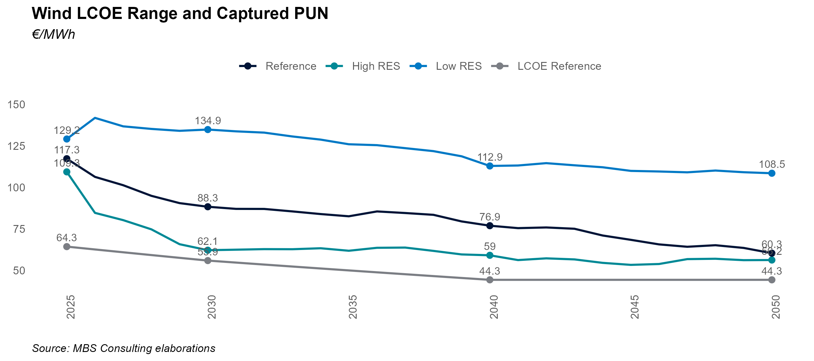

::::: callout-item
::: callout-left
#### 25-26 {.unnumbered}
:::

::: callout-right
Market parity for wind plants remains robust despite their higher capital intensity, supported by a broader generation profile that enables them to capture higher market prices than solar assets. In 2025, annual captured prices are projected to exceed 105 €/MWh consistently across market zones and to average around 100 €/MWh in 2026, while levelized costs of electricity (LCOE) for wind are expected to remain slightly below 80 €/MWh.
:::
:::::

::::: callout-item
::: callout-left
#### 27-30 {.unnumbered}
:::

::: callout-right
The gradual reduction in investment costs for wind projects, combined with captured prices consistently above 80 €/MWh across all market zones, underpins wind market parity in the mid term. Price cannibalization effects are expected to remain limited until 2030, as significant capacity growth—partly driven by offshore expansion—is projected to accelerate in the 2030s. Nevertheless, site-specific conditions may continue to affect the economic performance of individual projects.
:::
:::::

::::: callout-item
::: callout-left
#### 31-50 {.unnumbered}
:::

::: callout-right
The long-term outlook beyond 2030 appears promising, fueled by ongoing technology cost declines and the adoption of improved PPA practices that enable non-incentivized investments, further supported by the growing penetration of storage capacity. Captured prices are projected to stay consistently above 60 €/MWh through 2050, with the sole exception of the insular regions.
:::
:::::

::::: callout-wrap
::: callout-left
#### Main updates {.unnumbered}
:::

::: callout-right
2025-2026 Solar captured prices reflect updated short-term commodity trends, while mid-term projections are influenced by revised demand outlooks and an updated hourly price shape — now more skewed than in the previous release due to additional historical data, with a deeper midday dip — driven by the growing share of solar generation in the energy mix.
:::
:::::

\newpage

## Storage

### Pumped Hydro Production

::: callout-main
**DAY-AHEAD MARKET OPPORTUNITIES FOR PUMPED HYDRO POWER PLANTS MAY EMERGE IN THE SHORT TERM DUE TO VOLATILE PRICE FLUCTUATIONS; THESE OPPORTUNITIES ARE EXPECTED TO PERSIST IN THE LONG TERM AS NON-PROGRAMMABLE RENEWABLE GENERATION CONTINUES TO GROW**
:::

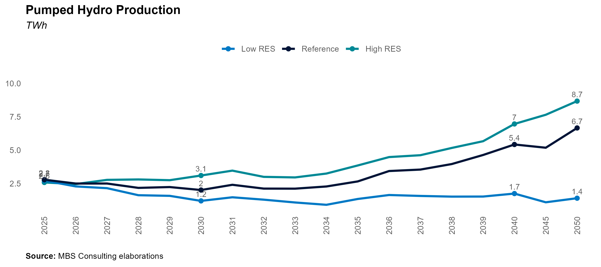

::::: callout-item
::: callout-left
#### 25-26 {.unnumbered}
:::

::: callout-right
Intra-day price spreads in the Day-Ahead Market (DAM) may create opportunities for pumped hydro units; however, the Ancillary Services Market — especially the real-time balancing phase — is expected to remain their main revenue source. Pumped hydro production is projected to average around 2.6 TWh in the reference case.
:::
:::::

::::: callout-item
::: callout-left
#### 27-30 {.unnumbered}
:::

::: callout-right
With faster RES deployment and stronger demand growth than the BAU trajectory, pumped hydro production could reach 3.1 TWh by 2030 in the high RES scenario, supported by expanding DAM opportunities as RES penetration rises. Conversely, the low RES scenario would limit production to 1.2 TWh.
:::
:::::

::::: callout-item
::: callout-left
#### 31-50 {.unnumbered}
:::

::: callout-right
As non-programmable renewables exceed 50% of total electricity demand, market opportunities are expected to expand further. Pumped hydro units will be key to mitigating the solar cannibalization effect and alleviating network congestion, with production projected to near 7 TWh by 2050.
:::
:::::

::::: callout-wrap
::: callout-left
#### Main updates {.unnumbered}
:::

::: callout-right
Short-term fluctuations in pumped hydro production reflect updated commodity prices, as well as revised RES generation and demand projections. Pure pumped hydro capacity currently stands at around 4 GW, with no further expansions expected going forward.
:::
:::::

\newpage

### Battery Energy Storage System

::: callout-main
**IN THE SHORT TERM, SMALL-SCALE SYSTEMS WILL AID SOLAR INTEGRATION, ESPECIALLY IN THE NORTH. UTILITY-SCALE ENTRY WILL BE SUPPORTED BY CAPACITY MARKET AUCTIONS AND FAST RESERVE PROJECTS. THE MAIN MARKET ACCELERATOR WILL BE MACSE (2028–2030), DRIVING LARGE-SCALE DEPLOYMENT IN THE SOUTH AND ISLANDS FOR RES INTEGRATION**
:::

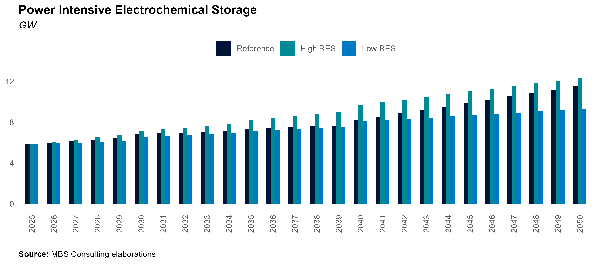

::::: callout-item
::: callout-left
#### 25-26 {.unnumbered}
:::

::: callout-right
In the coming years, projects from the December 2020 Fast Reserve auctions — part of Terna’s pilot for ultra-fast frequency regulation — are expected to enter operation. Additionally, the 2024 Capacity Market auction has spurred the development of energy-intensive storage in Italy and could bring four-hour systems to nearly 7 GWh by 2026. With continued distributed storage deployment, total electrochemical capacity could reach 18.9 GWh by 2026.
:::
:::::

::::: callout-item
::: callout-left
#### 27-30 {.unnumbered}
:::

::: callout-right
Expanding storage capacity is vital for integrating non-programmable renewables and strengthening the stability of Italy’s electricity system. The NIECP targets 72 GWh of new storage by 2030, spanning both utility-scale and distributed projects, with the former largely concentrated in the South. A strong project pipeline is underway: by 2030, total BESS capacity is projected to reach 49–83 GWh across all scales, depending on the scenario. MACSE alone is expected to deliver over 30 GWh of utility-scale systems, with the 2025 auction already allocating its full 10 GWh quota to support this growth.
:::
:::::

::::: callout-item
::: callout-left
#### 31-50 {.unnumbered}
:::

::: callout-right
Energy-intensive applications are expected to expand, driven by market signals from growing renewable capacity. In the Reference scenario, the 2030 NIECP targets are projected to be reached by the mid-2030s, with storage capacity climbing to 106 GWh by 2040 and rising further to 167 GWh in the high RES case.
:::
:::::

::::: callout-wrap
::: callout-left
#### Main updates {.unnumbered}
:::

::: callout-right
BESS capacity projections remain largely unchanged, still excluding the latest permitted pipeline, and the 2025 MACSE auction outcome. 
:::
:::::

```{r, include=FALSE}
# ## Capacity from 202
### Energy Intensive Electrochemical Storage

#::: callout-main
#**2024 CAPACITY MARKET AUCTION STARTED THE DEVELOPMENT OF ENERGY
#INTENSIVE STORAGES IN THE ITALIAN MARKET. LONG-TERM DEVELOPMENT OF SUCH
#KIND OF ASSET WILL BE KEY IN FOSTERING THE INTEGRATION OF RENEWABLES IN
#THE SYSTEM, WHEN THE GREAT SOLAR PENETRATION CREATES OPPORTUNITIES FOR
#TIME-SHIFTING APPLICATIONS ON THE DAY-AHEAD MARKET**
#:::

#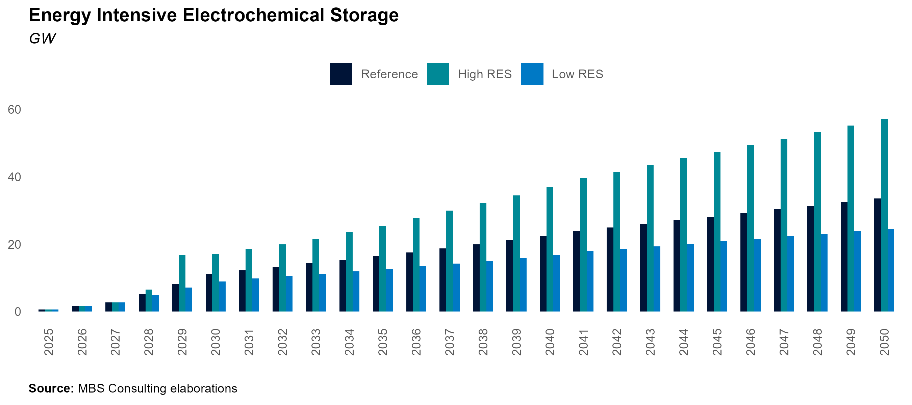

#::: callout-item
#::: callout-left
#### 24 {.unnumbered}
#:::

#::: callout-right
#2024 Capacity Market auction started the development of energy intensive
#storage in the Italian market, with more than 1.5 GW of new storage
#capacity -- quite completely energy intensive (4 hours) -- expected to
#hit the market by 2024 (possibly with some delays due to issue on the
#supply chain), with Sardinia and North to host about 0.8 GW and about
#0.6 GW respectively.
#:::
#:::

#::: callout-item
#::: callout-left
#### 25-30 {.unnumbered}
#:::

#::: callout-right
#The Day-Ahead Market presents promising market opportunities for
#merchant energy-intensive storage applications with a storage capacity
#of 4 hours. This is due to the increasing price spread volatility and
#the presence of overgeneration resulting from the development of
#renewable energy sources. Additionally, the gradual decrease in
#technology costs further enhances the attractiveness of energy-intensive
#investments.
#:::
#:::

#::: callout-item
#::: callout-left
#### 31-50 {.unnumbered}
#:::

#::: callout-right
#Energy-intensive applications reach an overall installed capacity of 22
#GW in 2040. The larger installed capacity achieved in the Low scenario
#(near 31 GW in 2040) is consequence of greater opportunities both on the
#DAM and on the ASM.
#:::
#:::

#::: callout-wrap
#::: callout-left
#### Main updates {.unnumbered}
#:::

#::: callout-right
#Energy-intensive BESS capacity hypotheses are in line with the previous
#update. They factor in ASM volumes dynamics and economic convenience.
#:::
#:::
```

\newpage

# Transmission Grid

## Grid Reinforcements

::: callout-main
**SIGNIFICANT GRID REINFORCEMENTS ARE EXPECTED BY THE MID-2020s, WITH MAJOR PROJECTS—SUCH AS THE TYRRHENIAN LINK AND ADRIATIC LINK—SCHEDULED FOR COMPLETION IN THE 2030s. THE LARGE-SCALE EXPANSION OF RENEWABLES WILL DRIVE FURTHER UPGRADES, AS INTER-ZONAL CONSTRAINTS WILL PERSIST**
:::

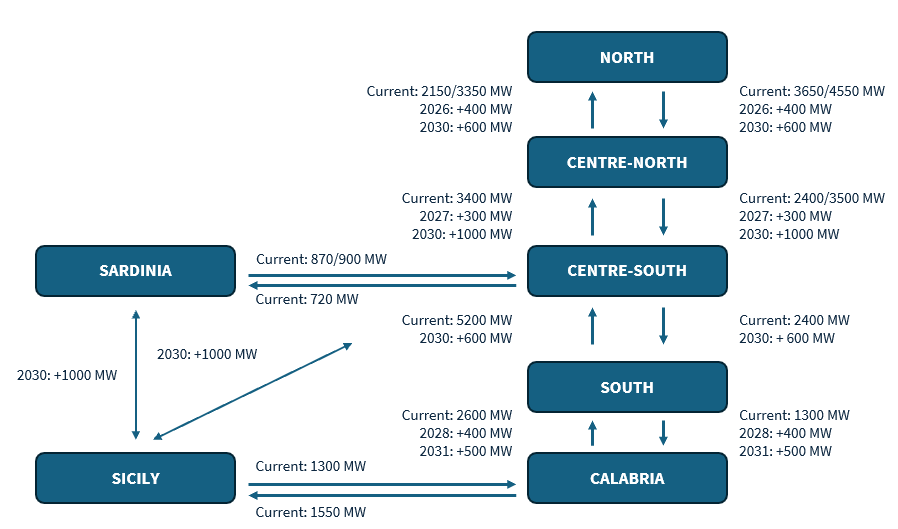

::::: callout-item
::: callout-left
#### 25-26 {.unnumbered}
:::

::: callout-right
In all the scenarios proposed, network constraints are aligned with the
most recent indications provided by Terna.
:::
:::::

::::: callout-item
::: callout-left
#### 27-30 {.unnumbered}
:::

::: callout-right
Grid reinforcements are expected to improve flow management and reduce
inter-zonal congestion on the mainland. By 2030, two key HVDC
infrastructures are set to become operational: the Tyrrhenian Link, key
to decommission Sardinia's coal-fired units, and the Adriatic Link,
designed to alleviate bottlenecks between South and North.
:::
:::::

::::: callout-item
::: callout-left
#### 31-50 {.unnumbered}
:::

::: callout-right
Under BAU assumptions, interzonal constraints on the mainland are expected to gradually ease starting in 2035. In the high RES scenario, Terna’s proposed 30 GW Hypergrid infrastructure is implemented largely in line with Terna’s schedule, while the low RES scenario anticipates more substantial delays in long-term network development.
:::
:::::

::::: callout-wrap
::: callout-left
#### Main updates {.unnumbered}
:::

::: callout-right
We revised our projections for the timeline of Terna’s project implementation based on the 2025 *Piano di Sviluppo della Rete*, incorporating the most recent updates.
:::
:::::

\newpage

# Power Market Prices

## Baseload PUN

::: callout-main
**THE PUN IS PROJECTED TO RECOVER TO AROUND 119 €/MWH IN 2025, SUPPORTED BY GAS MARKET TENSIONS AND CO2 PRICES STABILIZING AT 74.7 €/TON FOLLOWING FULL ETS REFORM IMPLEMENTATION. HOWEVER, ACCELERATED RES INTEGRATION, GAS PRICE NORMALIZATION AFTER 2026, AND STABLE ELECTRICITY IMPORTS ARE EXPECTED TO DRIVE PRICES BELOW 100 €/MWH BY 2029 IN THE REFERENCE SCENARIO AND AS EARLY AS 2026 IN THE HIGH-RES CASE**
:::

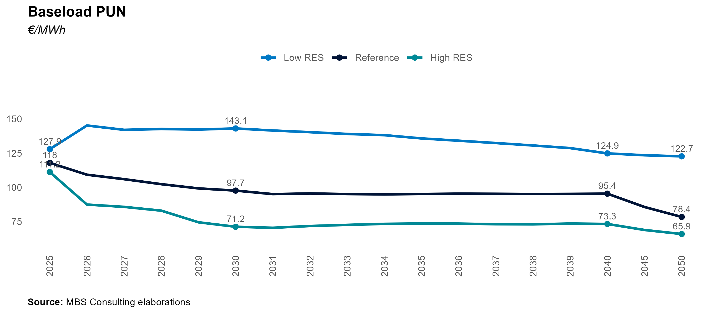

::::: callout-item
::: callout-left
#### 25-26 {.unnumbered}
:::

::: callout-right
In the Reference scenario, market dynamics are expected to stabilize by 2026 as the gas market approaches equilibrium. In 2025, gas market tensions and a demand-driven recovery supporting the ETS mechanism are projected to push average prices to approximately €120/MWh, before easing to €109/MWh in 2026. In the High RES scenario, stronger economic conditions and accelerated RES integration may temper price increases, with the PUN forecast to average around €112/MWh in 2025.
:::
:::::

::::: callout-item
::: callout-left
#### 27-30 {.unnumbered}
:::

::: callout-right
In the medium term, continued electricity imports, gas price normalization—supported by new LNG capacity from the U.S. and Qatar—and rising RES penetration are expected to push prices down. Average electricity prices are projected to fall to €98/MWh by 2030, and to €71/MWh in the High RES scenario.
:::
:::::

::::: callout-item
::: callout-left
#### 31-50 {.unnumbered}
:::

::: callout-right
In the long term, power prices will remain primarily driven by the cost structure of CCGTs, expected to set the marginal price about 75% of the time in 2040, declining to below 55% by 2050. Consequently, long-term ETS dynamics are likely to counteract part of the downward pressure on power prices from increasing RES penetration. The PUN in 2040 is projected to range between €73/MWh and €125/MWh, depending on the scenario.
:::
:::::

::::: callout-wrap
::: callout-left
#### Main updates {.unnumbered}
:::

::: callout-right
The 2025 PUN revision reflects lower CO₂ price assumptions, driven by weak certificate demand and easing market tensions. Medium-term forecasts were also adjusted, with reduced baseload CSS due to lower thermoelectric residual demand and higher expected RES output.
:::
:::::

### Peak-Load/ Off-Peak PUN

::: callout-main
**RENEWABLES PENETRATION, DRIVEN BY SOLAR ENERGY, IS ANTICIPATED TO HAVE
A SIGNIFICANT IMPACT ON PEAK AND OFF-PEAK DYNAMICS AFTER 2030, WHEN AN
INVERSION IN PRICE SPREADS BETWEEN TIME SLOTS IS EXPECTED TO TAKE
PLACE**
:::

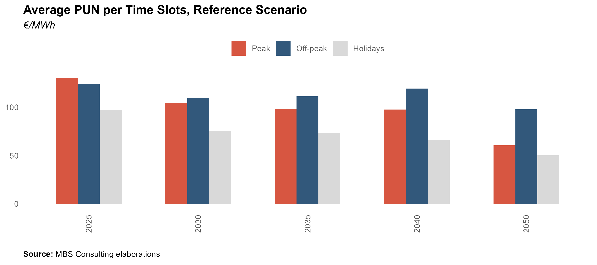

::::: callout-item
::: callout-left
#### 25-26 {.unnumbered}
:::

::: callout-right
The favorable price spread between evening and midday hours is
anticipated to persist in the short term, as the penetration of
renewables remains below 50% of gross domestic consumption.
:::
:::::

::::: callout-item
::: callout-left
#### 27-30 {.unnumbered}
:::

::: callout-right
The continued expansion of solar capacity is expected to further
suppress midday prices, particularly during periods of abundant sunlight
and low demand, such as in spring. This trend will progressively narrow
the disparity between peak and off-peak prices.
:::
:::::

::::: callout-item
::: callout-left
#### 31-50 {.unnumbered}
:::

::: callout-right
The long-term persistence of reversed hourly price differentials is
expected to drive higher prices during off-peak hours. The growing
integration of energy-intensive electrochemical storage systems, coupled
with improved storage unit operability, is likely to alleviate the
cannibalization effect caused by non-programmable solar power plants.
:::
:::::

::::: callout-wrap
::: callout-left
#### Main updates {.unnumbered}
:::

::: callout-right
The price trends for the various categories of hours align with the
findings from the previous market update.
:::
:::::

\newpage

### Baseload PUN Components, Reference Scenario

::: callout-main
**THE DECLINE IN RESIDUAL DEMAND FOR CCGTS, AMID SLOWLY RECOVERING ELECTRICITY CONSUMPTION, PERSISTENT NET IMPORTS, AND STRONG RENEWABLE OUTPUT, WILL LEAD TO LOWER CSS LEVELS FOR EXISTING UNITS IN THE SHORT TERM. AFTER THE COAL PHASE-OUT, CSS IS EXPECTED TO REMAIN AROUND -3 €/MWh AND TURN INCREASINGLY NEGATIVE OVER THE LONG TERM, AS GROWING RENEWABLE PENETRATION AND CM-BACKED NEW CAPACITY INTENSIFY COMPETITIVE PRESSURE**
:::

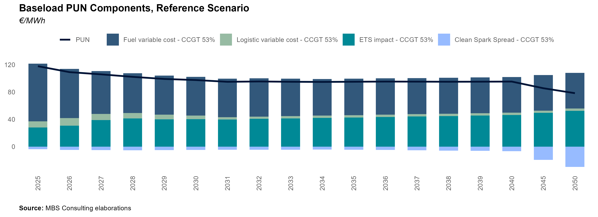

::::: callout-item
::: callout-left
#### 25-26 {.unnumbered}
:::

::: callout-right
Sustained net imports from foreign countries and the sluggish recovery in demand heighten market competition for CCGTs, while the moderation of commodity prices exerts downward pressure on the market price. The decreasing room for thermal plants operativity maintain the CSS in negative territory, setting at approximately -3.1 €/MWh in the Reference scenario for 2025.
:::
:::::

::::: callout-item
::: callout-left
#### 27-30 {.unnumbered}
:::

::: callout-right
In the latter half of the 2020s, intensified competition from newly
constructed Capacity Market units, and the growing share of RES are expected to keep the CSS in negative territory, averaging -5 €/MWh, while the CO2 price exceeds 100 €/MWh.
:::
:::::

::::: callout-item
::: callout-left
#### 31-50 {.unnumbered}
:::

::: callout-right
In the long term, renewables are expected to dominate the generation mix, driving down both power prices and the CSS, which is projected to fall to around -30 €/MWh by 2050. With rising demand and despite a substantial increase in RES penetration, existing CCGTs are expected to remain the marginal technology, setting prices for roughly 80% of system hours in 2040.
:::
:::::

::::: callout-wrap
::: callout-left
#### Main updates {.unnumbered}
:::

::: callout-right
Short-term baseload PUN projections have been updated to reflect the latest commodity and CO₂ price assumptions, while medium-term estimates have been adjusted following the revision of CSS projections driven by changes in power demand and RES generation.
:::
:::::

\newpage

### PUN Hourly Shape

::: callout-main
**INCREASING SOLAR PENETRATION EXERTS SIGNIFICANT PRESSURE ON PRICES DURING PEAK DAYTIME HOURS, WIDENING INTRADAY PRICE DIFFERENTIALS OVER THE LONG TERM. THIS EFFECT IS PARTIALLY MITIGATED BY THE GROWTH OF STORAGE CAPACITY**
:::

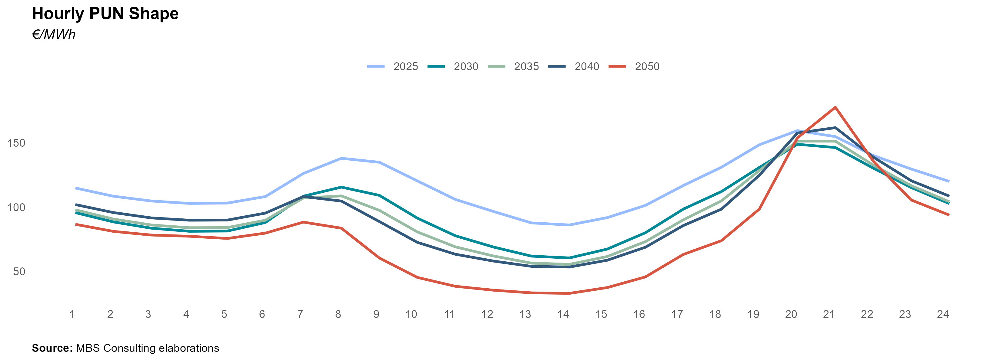

::::: callout-item
::: callout-left
#### 25-26 {.unnumbered}
:::

::: callout-right
The surge in solar production observed consistently in the recent past affects both midday price depression and profile skewness, which are increasingly pronounced relative to 2022–2024 averages. This tendency is expected to become even more prominent as solar capacity advances and production grows.
:::
:::::

::::: callout-item
::: callout-left
#### 27-30 {.unnumbered}
:::

::: callout-right
As solar penetration rises and the cannibalization effect intensifies, the gap between central hours and morning/evening peak prices continues to widen. Although the combined deployment of single-axis trackers, grid upgrades, and energy-intensive storage solutions helps mitigate this imbalance, their overall impact remains limited.
:::
:::::

::::: callout-item
::: callout-left
#### 31-50 {.unnumbered}
:::

::: callout-right
As renewable penetration grows, intra-day price differentials widen and the frequency of hours with 0 €/MWh prices increases, incentivizing investments in electrolysis capacity. This environment enhances the appeal of time-shifting applications in the Day-Ahead Market and drives new investments in energy-intensive storage systems.
:::
:::::

::::: callout-wrap
::: callout-left
#### Main updates {.unnumbered}
:::

::: callout-right
The PUN hourly shape shows increasing skewness and deeper midday depression, driven by growing solar output. In the short term, it also shifts downward by reflecting the revised short-term PUN projections. Post-2040, the shape features sharper troughs, largely due to a rise in zero-price hours, as recent trends in hourly price evolution are incorporated. These effects are only partially mitigated by BESS capacity expansion. Additionally, the model projects a slightly less pronounced evening peak compared to the 2024 average, reflecting recent price formation patterns and a modest decline in commodity prices, which has been correlated with reduced price profile skewness.
:::
:::::

\newpage

## Baseload Zonal Prices

::: callout-main
**IN THE SHORT AND MEDIUM TERM, ZONAL PRICES WILL DIVERGE DUE TO VARIATIONS IN SUPPLY-DEMAND BALANCE ACROSS ZONES. IN THE LONG TERM, THE EXPANSION OF RENEWABLES IN THE SOUTHERN MACRO-ZONE, SUPPORTED BY GRID UPGRADES, WILL LOWER BASELOAD PRICES AND NARROW PRICE GAPS**
:::

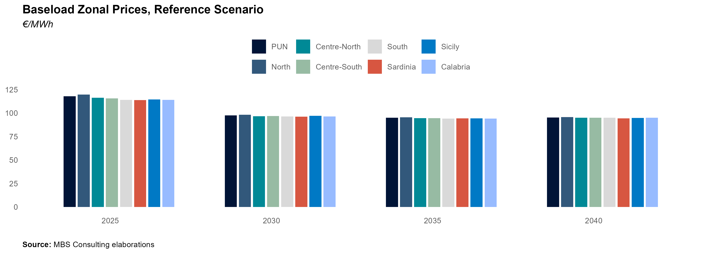

::::: callout-item
::: callout-left
#### 25-26 {.unnumbered}
:::

::: callout-right
Network congestion remains limited on the mainland. Southern regions (including Calabria) and the islands record lower prices, while higher CCGT utilization in the North keeps prices above the PUN, in line with recent historical trends. However, with electricity demand still below past levels and renewable penetration progressing gradually, zonal price spreads remain modest—just above €4/MWh in 2025 and below €4.1/MWh in 2026.
:::
:::::

::::: callout-item
::: callout-left
#### 27-30 {.unnumbered}
:::

::: callout-right
While the rapid expansion of renewables is expected to push zonal prices below €100/MWh in the Reference scenario by 2029, it will temporarily intensify inter-zonal congestion during the second half of the 2020s. Major grid upgrades planned after 2029—most notably the Adriatic Link and Tyrrhenian Link—will reinforce North–South energy flows and progressively ease congestion, keeping price differentials around €3/MWh or lower as 2030 approaches.
:::
:::::

::::: callout-item
::: callout-left
#### 31-50 {.unnumbered}
:::

::: callout-right
Despite completed grid improvements, bottlenecks between Northern and Southern zones are expected to persist, with price differentials remaining above 1.5 €/MWh through most of the 2030s. Additional grid reinforcements, planned closer to 2035, are projected to further ease inter-zonal congestion on the mainland. However, similar challenges are likely to remain more pronounced in the island regions, particularly in Sardinia.
:::
:::::

::::: callout-wrap
::: callout-left
#### Main updates {.unnumbered}
:::

::: callout-right
Zonal price dynamics have shifted due to revisions in both demand and renewable output projections, as well as updates to the implementation timeline of grid improvements outlined in Terna’s *Piano di Sviluppo* 2025. The updated zonal prices show wider medium-term spreads, driven by higher renewable output in specific zones and delays in the completion of major grid enhancements.

:::
:::::

\newpage

## Evolution of Baseload PUN-South Price Differential

::: callout-main
**THE TREND IN THE SPREAD BETWEEN THE PUN PRICE---PRIMARILY INFLUENCED
BY THE PERFORMANCE OF THE NORTHERN MARKET ZONE---AND THE PRICES IN THE
SOUTHERN MARKET ZONES IS HEAVILY DEPENDENT ON ASSUMPTIONS REGARDING
RENEWABLE PENETRATION, STORAGE DEVELOPMENT, AND THE TIMING OF GRID
INFRASTRUCTURE IMPLEMENTATION**
:::

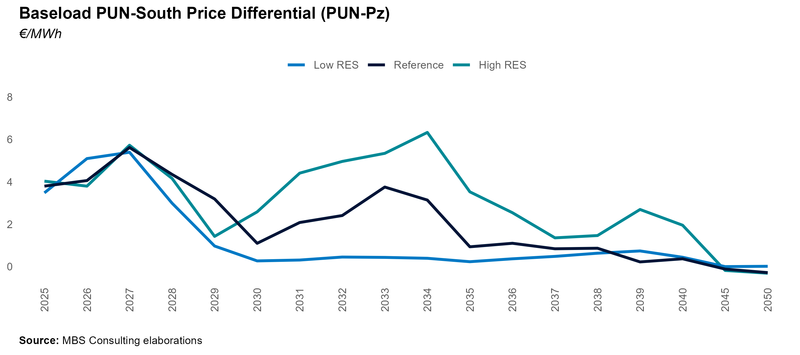

::::: callout-item
::: callout-left
#### 25-26 {.unnumbered}
:::

::: callout-right
The spread between the PUN and the Southern market zones is expected to remain at recent historical levels in the short term, with the Southern zone experiencing a discount. This dynamic is driven by a general decrease in electricity demand and an increasing share of RES in the generation mix, leading to lower prices compared to the Northern zones. Despite the rise in import flows, CCGTs in the North are still needed to meet demand, resulting in average prices that are higher.
:::
:::::

::::: callout-item
::: callout-left
#### 27-30 {.unnumbered}
:::

::: callout-right
In both the Reference and High RES scenarios, the integration of renewable technologies leads to a wider spread, with the South Price averaging -1.5 €/MWh below the PUN in the Reference case, and -1.7 €/MWh in the High RES case. Conversely, in the Low RES scenario, the spread remains narrower due to more moderate renewable growth, allowing for a gradual improvement in gas-fired unit operations until 2030, when coal generation becomes less competitive than gas.
:::
:::::

::::: callout-item
::: callout-left
#### 31-50 {.unnumbered}
:::

::: callout-right
In both the Reference and High RES cases, the substantial growth of renewables in Southern regions is partially offset by network developments—particularly the Tyrrhenian Link, expected to enter operation by 2030. However, in the High RES case, long-term PUN projections decline due to persistently low prices in the Islands, keeping regional price differentials above the PUN by more than €1/MWh through 2050. In contrast, this spread nearly closes after 2040 in the Reference case.
:::
:::::

::::: callout-wrap
::: callout-left
#### Main updates {.unnumbered}
:::

::: callout-right
The average medium-term spread between the PUN and Southern zonal prices reflects the updated BESS capacity projections across zones.
:::
:::::

\newpage

## Clean Spark Spread

### Baseload CSS for Existing CCGT Units

::: callout-main
**BASELOAD CSS IS PROJECTED TO DECLINE IN THE SHORT TERM AS STAGNANT
POWER DEMAND GROWTH, SUSTAINED IMPORTS, AND INCREASING RES PENETRATION
REDUCE CCGT PRODUCTION. BY 2040, VALUES ARE EXPECTED TO STABILIZE
BETWEEN -7 AND -4 €/MWh, DEPENDING ON THE SCENARIO. MISSING MONEY ISSUES
ARE LIKELY TO EMERGE IN THE LATTER HALF OF THE 2020s AND BECOME MORE
PRONOUNCED IN ALTERNATIVE SCENARIOS**
:::

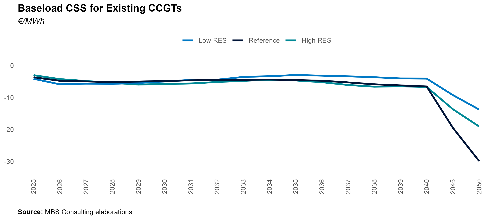

::::: callout-item
::: callout-left
#### 25-26 {.unnumbered}
:::

::: callout-right
The anticipated energy outlook—marked by stagnant electricity demand, a rising share of RES, and sustained import levels—is expected to intensify competition for the existing generation fleet. These dynamics will exert downward pressure on the Clean Spark Spread (CSS) for CCGTs, with average values projected at -4.0 €/MWh in the Reference case over the 2025–2026 period.
:::
:::::

::::: callout-item
::: callout-left
#### 27-30 {.unnumbered}
:::

::: callout-right
Market competition is set to intensify as a result of stabilized imports from Northern borders, expanding renewable capacity, and the addition of new high-efficiency CCGTs through CM auctions. These factors are expected to maintain negative baseload CSS, averaging around -5.5 €/MWh under the High RES scenario, where accelerated RES deployment and increased thermoelectric competition further heighten pressure in the latter half of the 2020s.
:::
:::::

::::: callout-item
::: callout-left
#### 31-50 {.unnumbered}
:::

::: callout-right
Post-2030, the decommissioning of aging capacity will enable existing CCGTs (53%-efficiency) to remain the marginal technology for approximately 80% of the operating hours through 2040. During this horizon, baseload CSS is expected to range below -4 €/MWh, and until -7 €/MWh. After 2040 baseload CSS is expected to fall below -10 €/MWh across all scenarios, reaching -30 €/MWh by 2050, when CCGTs will only fulfill a support function.
:::
:::::

::::: callout-wrap
::: callout-left
#### Main updates {.unnumbered}
:::

::: callout-right
CSS estimates reflect the upward revision of RES capacity projections as well as the downward contraction of demand projections; short-term projections vary, while medium and long-term values remain broadly consistent with the previous update.
:::
:::::

### Day-Ahead Market Profitability for CCGT Units

::: callout-main
**IN THE NEAR TERM, CURRENT UNITS ARE LIKELY TO FACE LESS FAVORABLE
SWITCHING CONDITIONS, BUT THE RISING SOLAR PENETRATION IS PROJECTED TO
INCREASE EVENING PRICE PEAKS OVER THE MEDIUM TO LONG TERM.
HIGH-EFFICIENCY UNITS WILL OPTIMIZE DAM VOLUMES WHILE MAINTAINING A
DOUBLE-DIGIT MARGINAL CAPTURE**
:::

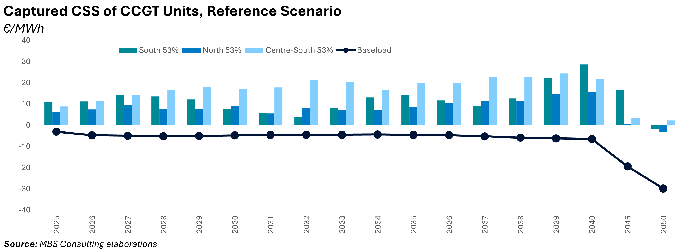

::::: callout-item
::: callout-left
#### 25-26 {.unnumbered}
:::

::: callout-right
Differences in energy mix across market zones will significantly affect thermal unit margins. In the South, weak demand and growing RES constrain operability, though peak-hour price spikes sustain captured CSS around 11 €/MWh. In the North, stronger demand supports CCGT utilization, but imports from the Northern border and high RES output compress margins to about 7 €/MWh. The Centre-South, with slower RES expansion and minimal imports, is expected to maintain captured CSS averaging at 10 €/MWh.
:::
:::::

::::: callout-item
::: callout-left
#### 27-30 {.unnumbered}
:::

::: callout-right
As renewable capacity expands, existing thermal units increasingly concentrate operations in evening hours to maximize captured margins. High-efficiency gas-fired plants face mounting competition from new projects supported by the latest Capacity Market auction. Nonetheless, their superior efficiency enables them to maintain an average captured CSS above 8 €/MWh in the North, while sharper price spikes in the South sustain levels around 10 €/MWh through 2030.
:::
:::::

::::: callout-item
::: callout-left
#### 31-50 {.unnumbered}
:::

::: callout-right
Rising renewable penetration increases overgeneration and sharpens evening price spikes, boosting captured margins for existing units through the late 2030s to around 2042. However, growing RES share and competition from high-efficiency units drive a steady decline in load factors. In the late 2040s, projections show strong zonal variability, with a risk of negative captured prices—especially in Southern zones, where RES may be marginal in about 50% of the hours.
:::
:::::

::::: callout-wrap
::: callout-left
#### Main updates {.unnumbered}
:::

::: callout-right
The expected load factor and marginality of CCGT units show a long-term decline, reflecting updated expectations of CCGT operability following the upward revision of RES-E installed capacity and generation, as well as the decline of short- and medium-term power demand.
:::
:::::

\newpage

## Captured Prices of Renewable Sources

### Solar Captured Prices

::: callout-main
**A GROWING CANNIBALIZATION EFFECT ON SOLAR PRICES BECOMES APPARENT IN
THE LATE 2020s, PARTICULARLY IN SOUTHERN MARKET ZONES, WHERE HIGH
RENEWABLE PENETRATION AND LIMITED INTERCONNECTION CAPACITY WITH NORTHERN
ZONES EXACERBATE THE IMPACT**
:::

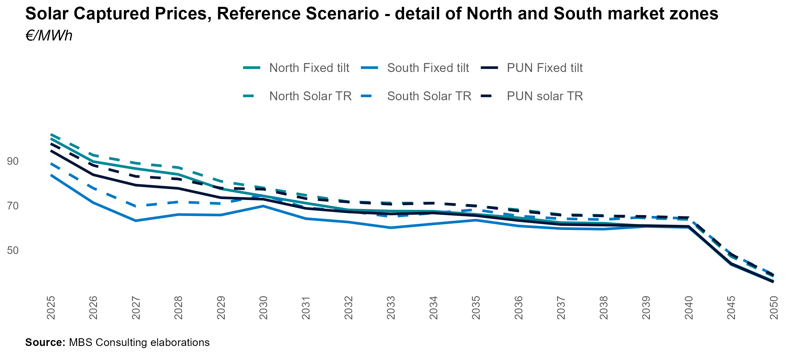

::::: callout-item
::: callout-left
#### 25-26 {.unnumbered}
:::

::: callout-right
Solar power plants are expected to register captured prices averaging 93 €/MWh in the 2025-2026 horizon.  In the Northern zone, captured prices are projected to range between €101/MWh for tracker and €109/MWh for fixed-tilt systems, in 2025. In the Southern zones, prices are slightly lower, with projections between €104/MWh and €99/MWh. Captured prices are expected to decrease between 2025 and 2026 consistently across zones.
:::
:::::

::::: callout-item
::: callout-left
#### 27-30 {.unnumbered}
:::

::: callout-right
The rapid growth of renewable energy installations is intensifying cannibalization and overgeneration, with storage and grid upgrades only partially mitigating these effects. As a result, zonal captured prices are diverging from baseload and are expected to fall below €80/MWh by 2030—even in the typically more resilient Northern zones.
:::
:::::

::::: callout-item
::: callout-left
#### 31-50 {.unnumbered}
:::

::: callout-right
Rising overgeneration highlights the need for energy-intensive storage to help ease the cannibalization effect. After 2030, this issue intensifies—especially for solar captured prices in Southern zones with higher RES penetration. Consequently, long-term Reference captured prices are expected to drop below €40/MWh in both Northern and Southern regions.
:::
:::::

::::: callout-wrap
::: callout-left
#### Main updates {.unnumbered}
:::

::: callout-right
Short-term solar captured price projections are influenced by fluctuations in commodity prices, while medium- and long-term levels decline due to rising projections of RES production.
:::
:::::

\newpage

### Wind Captured Prices

::: callout-main
**WIND GENERATION IS LESS CONCENTRATED THAN SOLAR OUTPUT, WITH PRODUCTION MORE EVENLY DISTRIBUTED BOTH ACROSS SEASONS AND THROUGHOUT THE DAY. THIS BROADER TEMPORAL PROFILE ALLOWS CAPTURED PRICES TO ALIGN WITH — OR EVEN EXCEED — BASELOAD PRICES**
:::

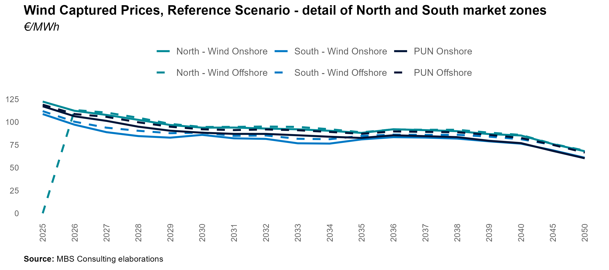

::::: callout-item
::: callout-left
#### 25-26 {.unnumbered}
:::

::: callout-right
Captured prices in 2025 closely follow zonal baseload prices, exceeding €100/MWh in all zones. In 2026, they edge lower, reflecting the gradual normalization of the PUN and, even more, the emergence of a more pronounced price profile marked by sharper peaks and troughs.
:::
:::::

::::: callout-item
::: callout-left
#### 27-50 {.unnumbered}
:::

::: callout-right
Captured prices remain closely aligned with zonal baseload prices over the long term. While increased solar and wind output leads to overgeneration in the early 2030s, outcomes for both technologies are increasingly shaped by zonal market dynamics rather than broader price trends. By 2030, captured prices approach €94/MWh in the Northern zones and €86/MWh in the South, supported by a more balanced production profile across both time of day and season.
:::
:::::

::::: callout-wrap
::: callout-left
#### Main updates {.unnumbered}
:::

::: callout-right
Short-term solar capture price projections are shaped by commodity price volatility, while medium- and long-term levels decline due to rising RES output, particularly from offshore capacity expansion. The rising share of RES generation—particularly solar—is reshaping hourly price patterns, deepening midday dips and increasing profile skewness; this dynamic, reflected in the current update, intensifies downward pressure on wind capture prices, especially over the medium and long term.
:::
:::::

\newpage

### Investment costs and IRR of Solar and Wind

::: callout-main
**INTENSE COMPETITION IN THE PV MODULES MARKET DRIVES DOWN INVESTMENT
COSTS FOR SOLAR IN THE MID AND LONG TERM, EVEN THOUGH GRID CONNECTION
AND LAND COSTS MAY RISE. HIGHER TECHNOLOGY COSTS FOR WIND**
:::

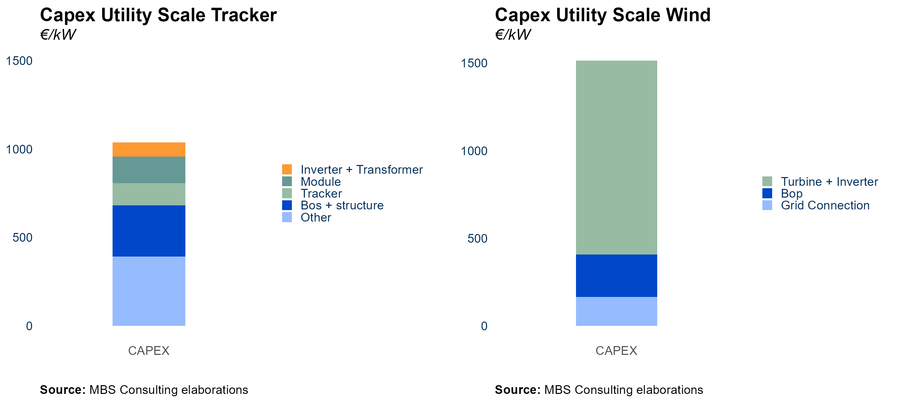

::::: callout-item
::: callout-left
#### Solar {.unnumbered}
:::

::: callout-right
Intense competition in the PV module market—led primarily by Chinese manufacturers—has reduced module costs to around €100.000/MW. Polysilicon, while inexpensive, accounts for about 30% of this cost and remains highly price-volatile. Scarce materials like silver could further increase costs in the future. Due to competitive pricing, PV modules represent just 15% of total solar CAPEX. Two major cost drivers are grid connection—expected to rise as projects shift to remote areas—and land acquisition or rental, which now makes up about 8% of CAPEX and is increasing due to growing land demand. These factors typically yield a base-case IRR of 7% for solar projects in the South (pre-tax, 30-year horizon), with regional variations based on captured prices. Agri-voltaic projects require a 20–40% investment premium, lowering expected IRRs to around 6%.
:::
:::::

::::: callout-item
::: callout-left
#### Wind {.unnumbered}
:::

::: callout-right
Turbines and inverters represent about 60% of a wind plant’s total cost, with grid connection accounting for around 10%—approximately €1.1 million for an onshore project. In the short to mid-term, limited new installations constrain economies of scale, keeping technology costs stable. Over time, cost reductions may emerge, especially in Northern countries with higher deployment rates. Nonetheless, onshore wind CAPEX is expected to remain above €1 million until 2040. This cost structure typically yields an IRR of around 7% (base case, South zone, pre-tax captured prices, 20-year horizon).
:::
:::::

::::: callout-wrap
::: callout-left
#### Main updates {.unnumbered}
:::

::: callout-right
The cost structure for both solar and wind technologies is in line with the previous update.
:::
:::::

\newpage

### Hydro Run-of-River Captured Prices

::: callout-main
**HYDROPOWER GENERATION IS MORE SENSITIVE TO SEASONAL WATER INFLOWS
TRENDS THAN TO HOURLY VARIABILITY, SO THAT CAPTURED PRICES REMAIN
BASICALLY IN LINE WITH BASELOAD PRICES**
:::

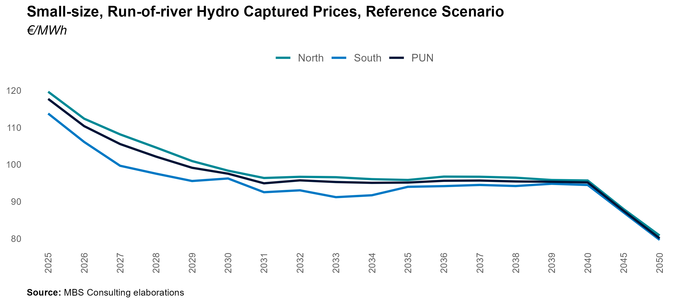

::::: callout-item
::: callout-left
#### 25-26 {.unnumbered}
:::

::: callout-right
Captured prices closely align with zonal baseload prices and reflect increased power prices, averaging 114 €/MWh.
:::
:::::

::::: callout-item
::: callout-left
#### 27-50 {.unnumbered}
:::

::: callout-right
Captured prices are expected to remain closely aligned with zonal baseload prices over the long term. While overgeneration driven by increased solar output significantly affects the early 2030s, the performance of both solar and wind remains more influenced by zonal market dynamics than by shifts in price structure. Moreover, both technologies benefit from a production profile that is more evenly distributed across hours of the day and throughout the year.
:::
:::::

::::: callout-wrap
::: callout-left
#### Main updates {.unnumbered}
:::

::: callout-right
Short-term outcomes are supported by commodity price trends and their influence on electricity prices, while mid- and long-term results remain consistent with the previous update.
:::
:::::

\newpage

# Ancilliary Services & Fuels Mix

## Ancilliary Services Volumes, Reference Scenario

::: callout-main
**THE DEMAND FOR ANCILLARY SERVICES IS EXPECTED TO REMAIN BELOW RECENT
LEVELS DUE TO CHANGES IN SYSTEM MANAGEMENT STRATEGIES IMPLEMENTED BY THE
TSO AND INVESTMENTS IN GRID INFRASTRUCTURE AT CRITICAL NODES. HOWEVER,
IN THE LONG TERM, THE EXPANSION OF RENEWABLE ENERGY CAPACITY IS LIKELY
TO DRIVE AN INCREASED NEED FOR SYSTEM SERVICES**
:::

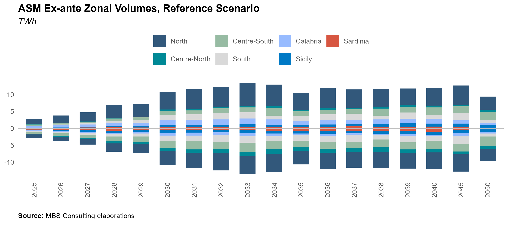

::::: callout-item
::: callout-left
#### 25-26 {.unnumbered}
:::

::: callout-right
Procured ex-ante ancillary services volumes are expected to partially
recover from 2022 but will remain below historical levels due to: (i)
availability of thermoelectric reserves, (ii) changes in network
management practices by Terna since the 2022 cost-containment scheme,
and (iii) feasibility intervals imposed on power plants under the new
Intra-Day Market structure.
:::
:::::

::::: callout-item
::: callout-left
#### 27-30 {.unnumbered}
:::

::: callout-right
The phase-out of coal-fired units on the mainland and the growing share of renewables in the energy mix are offset by the entry of (i) new thermoelectric and energy-intensive storage capacity supported by the Capacity Market, and (ii) the rollout of power-intensive BESS, which will reduce the need for ex-ante scheduling by increasing system flexibility.
:::
:::::

::::: callout-item
::: callout-left
#### 31-50 {.unnumbered}
:::

::: callout-right
The increasing share of renewables in the energy mix will be balanced by
(i) the addition of new thermoelectric capacity and storage systems
supported by the Capacity Market mechanism and MACSE. This is expected
to reduce the need for ex-ante scheduling, thanks to the greater
availability of flexible resources within the system.
:::
:::::

::::: callout-wrap
::: callout-left
#### Main updates {.unnumbered}
:::

::: callout-right
ASM volumes reflect recent structural market trends across the simulated period. Upward and downward volumes are symmetric in our model, due to the deterministic simulation approach. Estimates exclude the contingent portion of the balancing market associated with real-time imbalances.
:::
:::::

\newpage

## Ancilliary Services Volumes, Alternative Scenario

::: callout-main
**ANCILLARY SERVICES EX-ANTE VOLUMES EVOLVE ACCORDING TO THE COMPOSITION
OF THE GENERATION MIX AND DAM DYNAMICS IN THE DIFFERENT SCENARIOS. IN
THE POST-2030 SCENARIO, STORAGE SYSTEMS AND GRID REINFORCEMENTS ARE
EXPECTED TO LIMIT THE EXPANSION TREND IN THE THREE SCENARIOS**
:::

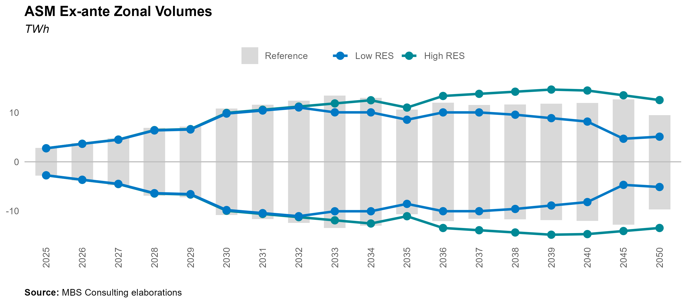

::::: callout-item
::: callout-left
#### 25-26 {.unnumbered}
:::

::: callout-right
Procured ex-ante ancillary services volumes are projected to remain low
compared to recent levels in the alternative scenarios as well, with
variations arising from the differing degrees of competition in the
thermoelectric sector within the Day-Ahead Market. This competition
results in varying levels of running reserves.
:::
:::::

::::: callout-item
::: callout-left
#### 27-30 {.unnumbered}
:::

::: callout-right
In the High RES scenario, the rapid growth of non-programmable renewables is offset by grid enhancements and accelerated deployment of energy-intensive storage. In contrast, the Low RES scenario features a rise in less flexible resources, driving higher demand for secondary reserve volumes.
:::
:::::

::::: callout-item
::: callout-left
#### 31-50 {.unnumbered}
:::

::: callout-right
In the High RES scenario, ongoing grid development and strong growth in energy-intensive storage help contain ASM volumes. In contrast, in the Low RES scenario, ASM volumes remain stable due to a higher share of CCGTs in the Day-Ahead Market and continued coal plant operation until 2035. Energy-intensive storage also enhances system regulation.
:::
:::::

::::: callout-wrap
::: callout-left
#### Main updates {.unnumbered}
:::

::: callout-right
ASM short-term volumes incorporate the variations in commodities level.
:::
:::::

\newpage

## Ancilliary Services Market prices

::: callout-main
**GRID BOTTLENECK RESOLUTION AND THE PENETRATION OF BESS ARE KEY DRIVERS
OF FUTURE COMPETITIVE DYNAMICS IN THE ANCILLARY SERVICES MARKET. THE
CAPACITY MARKET STRIKE PRICE (FOR DELIVERY YEARS) MAY EMERGE AS THE
REFERENCE UPPER PRICE, SIGNIFICANTLY AFFECTING THE CENTRE-SOUTH MARKET
ZONE.**
:::


::::: callout-item
::: callout-left
#### 25-26 {.unnumbered}
:::

::: callout-right
In the delivery years of the Capacity Market's, the strike price is
anticipated to exert a cap on prices for start-up and upward regulation,
particularly in the Centre-South market zone. However, the decline in
ASM volumes may promote increased price competition across Italy
compared to previous years.
:::
:::::

::::: callout-item
::: callout-left
#### 27-50 {.unnumbered}
:::

::: callout-right
Price competition in the ancillary services market is expected to
increase gradually as innovative technological solutions, such as
electrochemical storage, become available at more competitive prices.
Assuming the extension of the capacity remuneration mechanism, the
strike price, along with the Levelized Cost of Storage (LCOS) of
batteries, could emerge as key factors shaping ancillary services prices
in the future.
:::
:::::

::::: callout-wrap
::: callout-left
#### Main updates {.unnumbered}
:::

::: callout-right
Price projections are derived from a statistical approach that analyzes
the historical bidding strategies of market participants in the
ancillary services market. It is assumed that the historical
distributions of price spreads between Day-Ahead Market (DAM) and
ancillary services prices for each type of service will remain constant
in the future. In comparison to the previous release, the updated
short-term price projections for ancillary services now reflect the
impacts of revised assumptions regarding DAM dynamics and prices.
:::
:::::

# Our Suite of Market Models

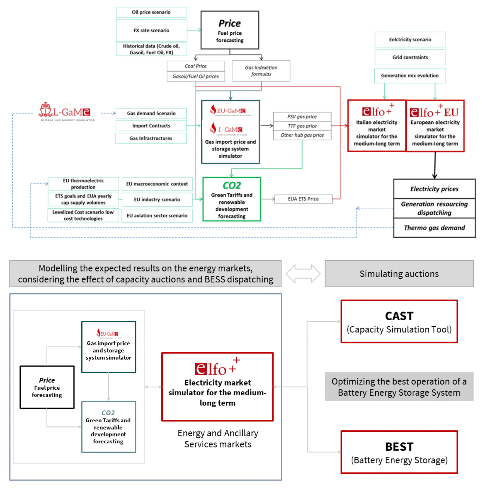

ELFO ++ suite has been included among the benchmark models for energy
systems' planning in the World Bank database and it is included in the
top list of electricity market simulation models prepared in 2017 by the
Joint Research Center of European Commission. ELFO ++suite and its
database are used for research acvities in numerous universities with
which REF-E has a consolidated collaboration (Florence School of
Regulation, University of Milan-Bicocca, Bocconi University, Milan
Catholic, Milan Polytechnic, Turin Polytechnic, University of Pavia,
University of Padua, University of Verona, others).

# Acronyms

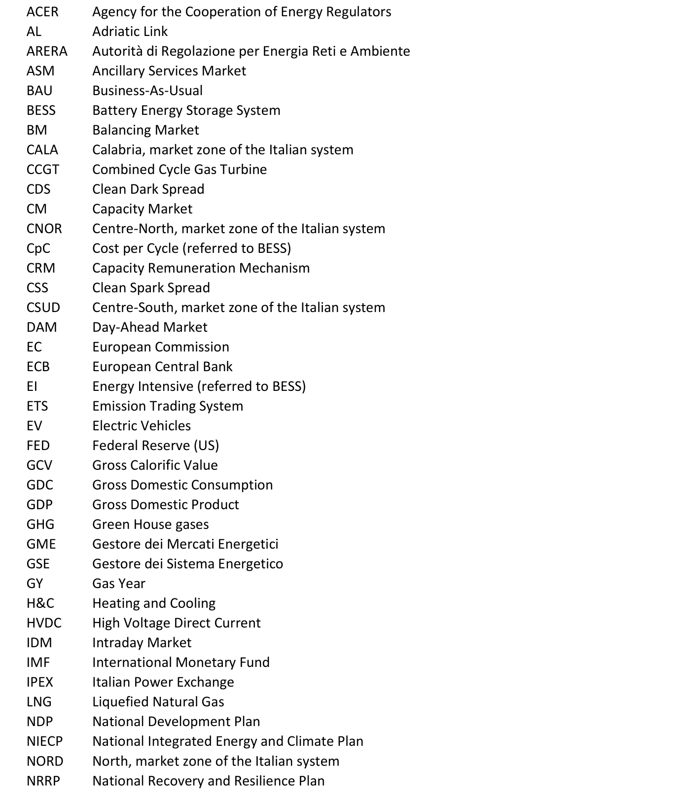

\newpage

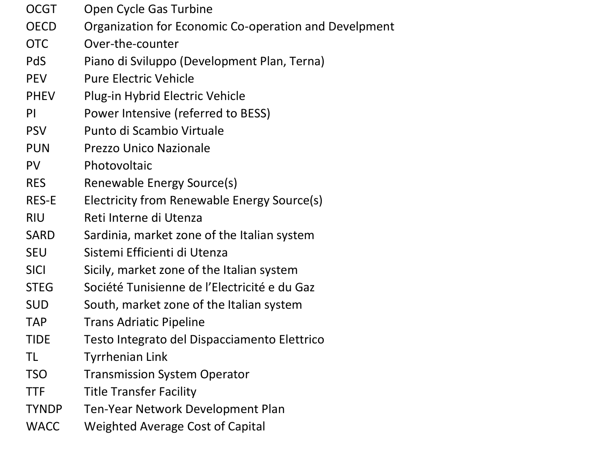
