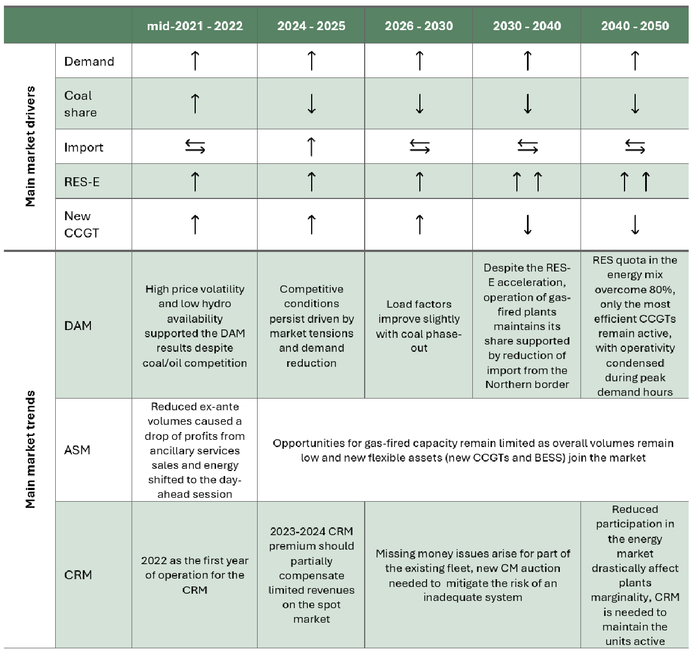
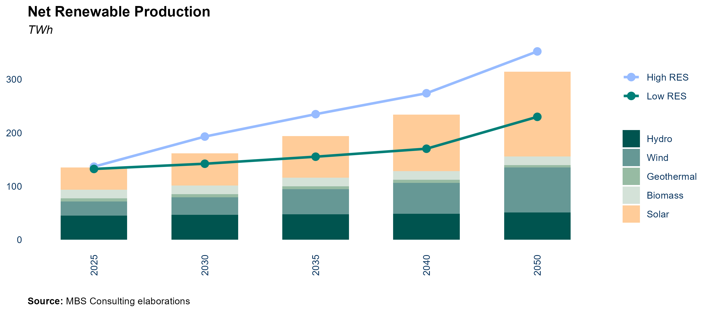
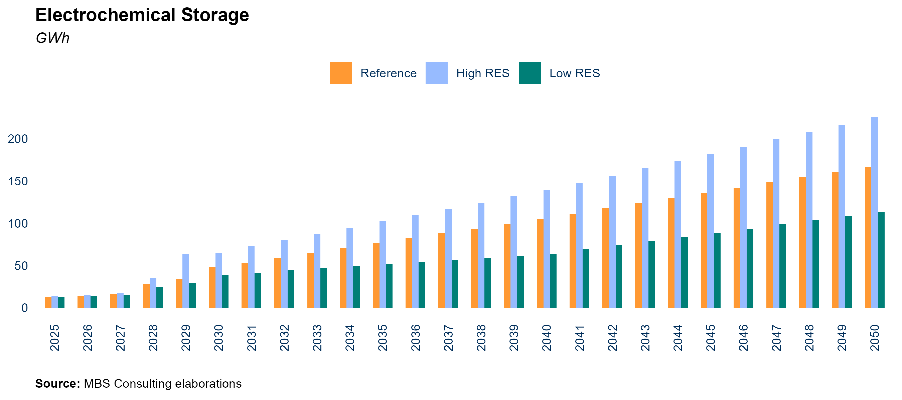
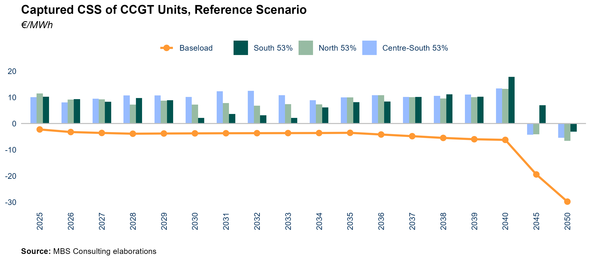
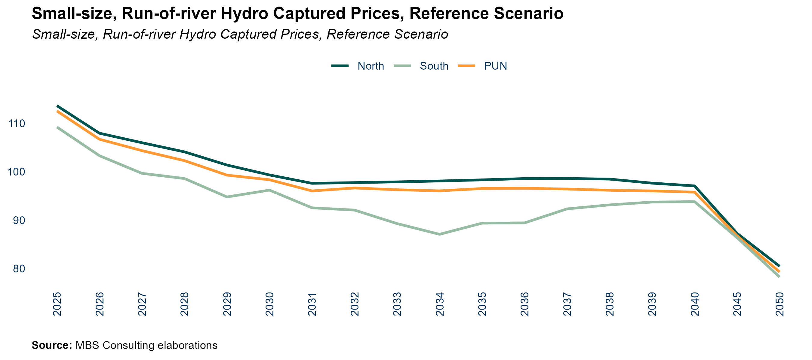

```{r setup, include=FALSE}
knitr::opts_chunk$set(
               echo=FALSE,
	           cache=FALSE,
               prompt=FALSE,
               # tidy=TRUE,
               tidy=FALSE,
               comment=NA,
               message=FALSE,
               warning=FALSE)
options(knitr.kable.NA = '')

library(mbsenergyUtils)

box::use(ggplot2[...],
         magrittr[...],
         data.table[...],
         scales[...],
         flextable[...],
         xl = openxlsx[read.xlsx, getSheetNames])

set_flextable_defaults(
    font.color = "#54565B",
    font.size = 7,
    font.family = 'calibri',
    padding = 2,
    border.color = "#dfe2e5",
    background.color = "whitesmoke",
    split = FALSE,
    theme_fun = "theme_box",
    decimal.mark = ",",
    big.mark = " ",
    na_str = "<NA>")


excel_file = file.path('tables_data', 'tables_report.xlsx')
excel_file_sn = xl$getSheetNames(excel_file)


```

# Frame of Reference

REF-E scenarios over the time horizon 2024-2050 (with projections up to
2060) are elaborated by MBS Consulting experts on the base of
proprietary suites and market knowledge. Econometric and structural
models, as well as our expert sensitiveness, detailed knowledge of
regulation, and accurate monitoring of market outcomes underlie our
elaborations.

Gas and electricity forecasts consider the diverse geopolitical and
economic hypothesis deriving from the regulatory, financial and
fundamentals adjustments to the disruption generated both from the
pandemic and the Ukrainian war, which are seen as key determinants of
the future equilibrium of the energy markets.

Current scenario update incorporates an evolution of climate variables
in line with the historical average trend.

In this perspective, we defined three scenarios:

-   The **High Case scenario** is characterized by permanently high
    fuels and power prices amid negative or zero economic growth
    depressing investments and weighing on the energy transition
    process.\

-   In the **Reference scenario**, is characterized by the energy
    transition process progress leading to a diversification of energy
    sources supported by the existing policies. This, combined with
    efficiency maintains the energy market on a transformation path. The
    economic growth slowly recovers over the next two years.

-   The **Low Case scenario** would materialize in the event of
    favorable weather conditions and a fast energy transition, supported
    by low inflation and a faster economic recovery, reducing power and
    fossil fuels demand over the next few years. This would limit energy
    prices upside potential and then fuel a downward acceleration.


\newpage

## Perspectives for the Italian energy market between uncertain demand growth and RES accelleration

### Key Insights {.unnumbered}

#### Key market trends in Italy {.unnumbered}



# Key Figures

```{r, net_power}

dt_table = openxlsx::read.xlsx(file.path('tables_data', 'tables_report.xlsx'), sheet = excel_file_sn[1]) %>% 
    setDT() 

vec_sce = names(dt_table)[-1]
vec_colnames = as.character(as.vector(dt_table[1]))

dt_table = dt_table[2:.N]


suffixes = c('', rep("Reference_", 4), rep("Low_", 4), rep('High_', 4))
vec_colnames = paste0(suffixes, vec_colnames)
names(dt_table) = vec_colnames

dt_table[, (vec_colnames[-1]) := lapply(.SD, function(x) {round(as.numeric(x), 1)}), .SDcols = vec_colnames[-1]]

dt_table |> flextable() %>% 
    separate_header() %>%  
    align(align = "center", part = "all") %>% 
    bg(bg = "#8497B0", part = "header") %>% 
    color(part = "header", color = 'white') %>% 
    vline(j = c(1, 5, 9, 13), border = officer::fp_border(color = "#dfe2e5", width = 1), part = "all") %>% 
    bold(i = NULL, j = 1) %>% 
    width(width = 2, j = 1)

```

```{r, balance}

dt_table = openxlsx::read.xlsx(file.path('tables_data', 'tables_report.xlsx'), sheet = excel_file_sn[2]) %>% 
    setDT() 

vec_sce = names(dt_table)[-1]
vec_colnames = as.character(as.vector(dt_table[1]))

dt_table = dt_table[2:.N]


suffixes = c('', rep("Reference_", 4), rep("Low_", 4), rep('High_', 4))
vec_colnames = paste0(suffixes, vec_colnames)
names(dt_table) = vec_colnames

dt_table[, (vec_colnames[-1]) := lapply(.SD, function(x) {round(as.numeric(x), 1)}), .SDcols = vec_colnames[-1]]

dt_table |> flextable() %>% 
    separate_header() %>%  
    align(align = "center", part = "all") %>% 
    bg(bg = "#8497B0", part = "header") %>% 
    color(part = "header", color = 'white') %>% 
    vline(j = c(1, 5, 9, 13), border = officer::fp_border(color = "#dfe2e5", width = 1), part = "all") %>% 
    bold(i = NULL, j = 1) %>% 
    width(width = 2, j = 1)

```

```{r, commodities}

dt_table = openxlsx::read.xlsx(file.path('tables_data', 'tables_report.xlsx'), sheet = excel_file_sn[3]) %>% 
    setDT() 

vec_sce = names(dt_table)[-1]
vec_colnames = as.character(as.vector(dt_table[1]))

dt_table = dt_table[2:.N]


suffixes = c('', rep("Reference_", 4), rep("Low_", 4), rep('High_', 4))
vec_colnames = paste0(suffixes, vec_colnames)
names(dt_table) = vec_colnames

dt_table[, (vec_colnames[-1]) := lapply(.SD, function(x) {round(as.numeric(x), 1)}), .SDcols = vec_colnames[-1]]

dt_table |> flextable() %>% 
    separate_header() %>%  
    align(align = "center", part = "all") %>% 
    bg(bg = "#8497B0", part = "header") %>% 
    color(part = "header", color = 'white') %>% 
    vline(j = c(1, 5, 9, 13), border = officer::fp_border(color = "#dfe2e5", width = 1), part = "all") %>% 
    bold(i = NULL, j = 1) %>% 
    width(width = 2, j = 1)

```

```{r, electricity_prices}

dt_table = openxlsx::read.xlsx(file.path('tables_data', 'tables_report.xlsx'), sheet = excel_file_sn[4]) %>% 
    setDT() 

vec_sce = names(dt_table)[-1]
vec_colnames = as.character(as.vector(dt_table[1]))

dt_table = dt_table[2:.N]


suffixes = c('', rep("Reference_", 4), rep("Low_", 4), rep('High_', 4))
vec_colnames = paste0(suffixes, vec_colnames)
names(dt_table) = vec_colnames

dt_table[, (vec_colnames[-1]) := lapply(.SD, function(x) {round(as.numeric(x), 1)}), .SDcols = vec_colnames[-1]]

dt_table |> flextable() %>% 
    separate_header() %>%  
    align(align = "center", part = "all") %>% 
    bg(bg = "#8497B0", part = "header") %>% 
    color(part = "header", color = 'white') %>% 
    vline(j = c(1, 5, 9, 13), border = officer::fp_border(color = "#dfe2e5", width = 1), part = "all") %>% 
    bold(i = NULL, j = 1) %>% 
    width(width = 2, j = 1)

```

```{r, zonal_prices}

dt_table = openxlsx::read.xlsx(file.path('tables_data', 'tables_report.xlsx'), sheet = excel_file_sn[5]) %>% 
    setDT() 

vec_sce = names(dt_table)[-1]
vec_colnames = as.character(as.vector(dt_table[1]))

dt_table = dt_table[2:.N]


suffixes = c('', rep("Reference_", 4), rep("Low_", 4), rep('High_', 4))
vec_colnames = paste0(suffixes, vec_colnames)
names(dt_table) = vec_colnames

dt_table[, (vec_colnames[-1]) := lapply(.SD, function(x) {round(as.numeric(x), 1)}), .SDcols = vec_colnames[-1]]

dt_table |> flextable() %>% 
    separate_header() %>%  
    align(align = "center", part = "all") %>% 
    bg(bg = "#8497B0", part = "header") %>% 
    color(part = "header", color = 'white') %>% 
    vline(j = c(1, 5, 9, 13), border = officer::fp_border(color = "#dfe2e5", width = 1), part = "all") %>% 
    bold(i = NULL, j = 1) %>% 
    width(width = 2, j = 1)

```

```{r, cp_pv_fx}

dt_table = openxlsx::read.xlsx(file.path('tables_data', 'tables_report.xlsx'), sheet = excel_file_sn[6]) %>% 
    setDT() 

vec_sce = names(dt_table)[-1]
vec_colnames = as.character(as.vector(dt_table[1]))

dt_table = dt_table[2:.N]


suffixes = c('', rep("Reference_", 4), rep("Low_", 4), rep('High_', 4))
vec_colnames = paste0(suffixes, vec_colnames)
names(dt_table) = vec_colnames

dt_table[, (vec_colnames[-1]) := lapply(.SD, function(x) {round(as.numeric(x), 1)}), .SDcols = vec_colnames[-1]]

dt_table |> flextable() %>% 
    separate_header() %>%  
    align(align = "center", part = "all") %>% 
    bg(bg = "#8497B0", part = "header") %>% 
    color(part = "header", color = 'white') %>% 
    vline(j = c(1, 5, 9, 13), border = officer::fp_border(color = "#dfe2e5", width = 1), part = "all") %>% 
    bold(i = NULL, j = 1) %>% 
    width(width = 2, j = 1)

```

```{r, cp_pv_tr}

dt_table = openxlsx::read.xlsx(file.path('tables_data', 'tables_report.xlsx'), sheet = excel_file_sn[7]) %>% 
    setDT() 

vec_sce = names(dt_table)[-1]
vec_colnames = as.character(as.vector(dt_table[1]))

dt_table = dt_table[2:.N]


suffixes = c('', rep("Reference_", 4), rep("Low_", 4), rep('High_', 4))
vec_colnames = paste0(suffixes, vec_colnames)
names(dt_table) = vec_colnames

dt_table[, (vec_colnames[-1]) := lapply(.SD, function(x) {round(as.numeric(x), 1)}), .SDcols = vec_colnames[-1]]

dt_table |> flextable() %>% 
    separate_header() %>%  
    align(align = "center", part = "all") %>% 
    bg(bg = "#8497B0", part = "header") %>% 
    color(part = "header", color = 'white') %>% 
    vline(j = c(1, 5, 9, 13), border = officer::fp_border(color = "#dfe2e5", width = 1), part = "all") %>% 
    bold(i = NULL, j = 1) %>% 
    width(width = 2, j = 1)

```

```{r, cp_wind_on}

dt_table = openxlsx::read.xlsx(file.path('tables_data', 'tables_report.xlsx'), sheet = excel_file_sn[8]) %>% 
    setDT() 

vec_sce = names(dt_table)[-1]
vec_colnames = as.character(as.vector(dt_table[1]))

dt_table = dt_table[2:.N]


suffixes = c('', rep("Reference_", 4), rep("Low_", 4), rep('High_', 4))
vec_colnames = paste0(suffixes, vec_colnames)
names(dt_table) = vec_colnames

dt_table[, (vec_colnames[-1]) := lapply(.SD, function(x) {round(as.numeric(x), 1)}), .SDcols = vec_colnames[-1]]

dt_table |> flextable() %>% 
    separate_header() %>%  
    align(align = "center", part = "all") %>% 
    bg(bg = "#8497B0", part = "header") %>% 
    color(part = "header", color = 'white') %>% 
    vline(j = c(1, 5, 9, 13), border = officer::fp_border(color = "#dfe2e5", width = 1), part = "all") %>% 
    bold(i = NULL, j = 1) %>% 
    width(width = 2, j = 1)

```

```{r, cp_wind_off}

dt_table = openxlsx::read.xlsx(file.path('tables_data', 'tables_report.xlsx'), sheet = excel_file_sn[9]) %>% 
    setDT() 

vec_sce = names(dt_table)[-1]
vec_colnames = as.character(as.vector(dt_table[1]))

dt_table = dt_table[2:.N]


suffixes = c('', rep("Reference_", 4), rep("Low_", 4), rep('High_', 4))
vec_colnames = paste0(suffixes, vec_colnames)
names(dt_table) = vec_colnames

dt_table[, (vec_colnames[-1]) := lapply(.SD, function(x) {round(as.numeric(x), 1)}), .SDcols = vec_colnames[-1]]

dt_table |> flextable() %>% 
    separate_header() %>%  
    align(align = "center", part = "all") %>% 
    bg(bg = "#8497B0", part = "header") %>% 
    color(part = "header", color = 'white') %>% 
    vline(j = c(1, 5, 9, 13), border = officer::fp_border(color = "#dfe2e5", width = 1), part = "all") %>% 
    bold(i = NULL, j = 1) %>% 
    width(width = 2, j = 1)

```

# Macroeconomic Context

## GDP

::: callout-main
**GDP GROWTH IN THE SHORT TERM REMAINS SUBDUED, WITH A MODERATE RECOVERY
IN INDUSTRIAL PRODUCTION ANTICIPATED, SUPPORTED BY WAGE DYNAMICS AND THE
EASING OF MONETARY POLICIES. IN THE MEDIUM AND LONG TERM, GROWTH
PROSPECTS ARE PRIMARILY DRIVEN BY THE PATH OF DISINFLATION, EASING
FINANCING CONDITIONS, AND THE IMPLEMENTATION OF THE NRRP**
:::


::: callout-item
::: callout-left
#### 24-25 {.unnumbered}
:::

::: callout-right
The reference scenario predicts a 0.4% year-on-year GDP growth in 2024,
with a stronger increase of 1% in 2025, driven by an anticipated easing
of financial conditions. A gradual easing of monetary policies in the
second half of the year, along with positive wage dynamics, should
contribute to growth in 2025. In the worst-case scenario, if
inflationary pressures persist, GDP is projected to decline by 0.1%
year-on-year in 2024 and see a modest increase of 0.3% in 2025.
Conversely, the best-case scenario, characterized by accelerated
disinflation and a recovery in investments, would result in GDP growth
of up to 1.2% in 2024 and 1.6% in 2025.
:::
:::

::: callout-item
::: callout-left
#### 26-30 {.unnumbered}
:::

::: callout-right
In our Reference and Best scenarios, economic growth would gradually
realign to the previously projected path, sustained by the effective
implementation of the NRRP measures, the recovery of the global economy,
and an acceleration of the green transition reforms.
:::
:::

::: callout-item
::: callout-left
#### 31-50 {.unnumbered}
:::

::: callout-right
In the long-term, our Reference and Best-case scenarios remain anchored
to the assumption of a stabilization of the yearly GDP growth rate in
the 1-2% interval, while in the Worst scenario, GDP growth continues to
discount the effects of the failure of key investments.
:::
:::

::: callout-wrap
::: callout-left
#### Main updates {.unnumbered}
:::

::: callout-right
Short-term GDP projections were revised upward, as a faster than
expected disinflation and the probable easing of monetary policies
combined with positive wage dynamics contribute to GDP growth.
:::
:::

## Inflation rate

::: callout-main
**THE PERSISTENCE OF THE ENERGY PRICES NORMALIZATION IS DRIVING THE
GENERAL PRICE INDEX DECLINE, WITH ITS REDUCTION BEGINNING TO TRANSMIT
ALSO TO THE CORE INDEX. MONETARY POLICY TIGHTENING PROVED TO BE
EFFECTIVE IN LIMITING INFLATIONARY PRESSURES AND KEEPING MEDIUM AND LONG
TERM EXPECTATIONS UNDER CONTROL**
:::


::: callout-item
::: callout-left
#### 24-25 {.unnumbered}
:::

::: callout-right
Inflation is expected to remain close to 2% both in 2024 and 2025, in
line with the ongoing disinflation path. In the second half of 2024
monetary policy may revert to easing supporting investments growth. The
European Central Bank (ECB) has in fact decided to start a slow path of
rate reduction, with an initial cut of 0.25 percentage points from the
previous 4.75%. However, geopolitical uncertainty and the risk of
pressures, particularly on energy prices, could cause delays in the
anticipated lowering of interest rates.
:::
:::

::: callout-item
::: callout-left
#### 26-30 {.unnumbered}
:::

::: callout-right
Still relatively high interest rates are seen as proving effective in
guiding inflation back to 2% in the short term. Our scenario foresees a
stabilization at 2% in the second part of the decade, even with a
gradual easing of monetary policy, although the risk of further pressure
on prices due to the expected easing of monetary policy.
:::
:::

::: callout-item
::: callout-left
#### 31-50 {.unnumbered}
:::

::: callout-right
Long-term assumptions envisage the inflation rate to stabilize at around
2%, in line with the ECB’s medium term inflation target.
:::
:::

::: callout-wrap
::: callout-left
#### Main updates {.unnumbered}
:::

::: callout-right
Short-term inflation rates remained in line with our previous market
update.
:::
:::

\newpage

# Commodities

## Natural Gas

### LNG

::: callout-main
**GLOBAL LNG DEMAND IS SEEN AS GROWING STEADILY IN THE SHORT TERM, WITH
A NOTABLE DISPARITY IN GROWTH RATE SHOWCASED BETWEEN THE ASIAN AND
EUROPEAN BLOCS. DELAYS IN THE CONSTRUCTION OF LIQUEFACTION AND
REGASIFICATION CAPACITY, INDUCED BY LOW PRICES, COULD TRANSLATE IN
RENEWED DEMAND-SUPPLY TENSIONS IN 2025-2026. THERE IS A HIGH PROPABILITY
OF AN OVERSUPPLIED MARKET POST-2026 LAYING THE GROUNDWORK FOR LNG PRICES
NORMALIZING IN THE MEDIUM TO LONG-TERM**
:::


::: callout-item
::: callout-left
#### 24-25 {.unnumbered}
:::

::: callout-right
European and Chinese gas demand will primarily drive this uprise, as LNG
intake is expected to accelerate in the short-term, in response to
expansion of regasification capacity, and to support the transition from
coal. Despite 2024 LNG supply growth being limited globally, reduced
competition between Europe and Asia, and the expected new capacity
entering the market in 2025, are likely to guarantee adequate demand
coverage.
:::
:::

::: callout-item
::: callout-left
#### 26-30 {.unnumbered}
:::

::: callout-right
Starting from 2026, LNG demand growth is expected to gradually slowdown,
stabilizing just below 5% y/y, consistently with rising renewable energy
production and improved energy efficiency measures. Conditional on the
lack of further delays, a new wave of liquefaction capacity will enter
the market by 2026, driven by US and Qatar, contributing to almost
eliminating the risk of market tightness.
:::
:::

::: callout-item
::: callout-left
#### 31-50 {.unnumbered}
:::

::: callout-right
In the long-term, pressure on the LNG market is expected to ease, with
new capacity growing and green energy commitments becoming effective.
:::
:::

::: callout-wrap
::: callout-left
#### Main updates {.unnumbered}
:::

::: callout-right
Global LNG demand growth remains consistent with our prior market
assessment.
:::
:::

\newpage

### TTF Price

::: callout-main
**THE LIKELIHOOD OF DEMAND RETURNING TO PRE-CRISIS LEVELS WITHIN THE
NEXT THREE YEARS IS CONSIDERED LOW, WITH THE SAVINGS PUT IN PLACE IN
RESPONSE TO THE RUSSIAN GAS HALT LEADING TO STRUCTURAL CHANGES. IN THE
LONG TERM, WE ANTICIPATE FURTHER DEMAND REDUCTION DUE TO EUROPE'S
DECARBONIZATION EFFORTS, LEADING TO A LOWER TTF PRICE TRAJECTORY NEARING
25€/MWH. PRICE TENSION AND VOLATILITY SPIKES, PARTICULARLY DURING
WINTERS, MAY OCCUR OVER THE NEXT FEW YEARS THOUGH**
:::


::: callout-item
::: callout-left
#### 24-25 {.unnumbered}
:::

::: callout-right
In our Reference scenario, the projected average TTF price for 2024 is
expected to remain below €40/MWh, primarily due to sustained low demand
impacting prices. Additionally, Europe’s LNG import capacity is set to
increase by 30 Bcm in 2024, facilitating additional LNG shipments. This
expansion is crucial for maintaining market stability in the short term
and for adapting to the ongoing reduction of Russian piped gas supplies.
:::
:::

::: callout-item
::: callout-left
#### 26-30 {.unnumbered}
:::

::: callout-right
From 2026 onwards, a further normalization is anticipated as a result of
the significant deployment of new liquefaction capacity. Assuming a
progressive growth of global LNG supplies alongside an acceleration of
the energy transition, European gas prices are projected to steadily
decrease towards 30 €/MWh by 2028.
:::
:::

::: callout-item
::: callout-left
#### 31-40 {.unnumbered}
:::

::: callout-right
The European decarbonization process would keep reducing gas demand,
successively pressuring the price action back towards the 25 €/MWh
long-term equilibrium. Only in the High scenario, persisting
geopolitical and commercial tensions would leave commodities shortages
unresolved, leaving prices just below 45 €/MWh in the long-term.
Effective green policies supported by economic growth may lead prices
significantly lower in the Low scenario, with the TTF averaging near 10
€/MWh in the long-term.
:::
:::

::: callout-wrap
::: callout-left
#### Main updates {.unnumbered}
:::

::: callout-right
TTF gas price projections remain in line with our previous market
update. However, lingering geopolitical instability is seen as exerting
pressure on global gas prices.
:::
:::

\newpage

### Spread TTF-PSV

::: callout-main
**IN THE SHORT-TO-MEDIUM TERM THE PSV GAS PRICE IS ANTICIPATED TO
MAINTAIN A PREMIUM COMPARED TO THE TTF, FOLLOWING THE NEED FOR NORTHERN
EUROPE GAS FLOWS TO COMPENSATE FOR THE INTERRUPTION OF RUSSIAN PIPED GAS
SUPPLIES. THE TEMPORARY CLOSURE OF THE OLT LNG REGASIFICATION FACILITY
IN ITALY ADDS PRESSURE IN THE VERY NEAR-TERM. IN THE LONG-TERM, THE
REBALANCING OF FLOWS IS SEEN AS LEADING TO A PROGRESSIVE NARROWING OF
THE SPREAD TOWARDS ZERO**
:::


::: callout-item
::: callout-left
#### 24-25 {.unnumbered}
:::

::: callout-right
The PSV-TTF spread is expected to stay just below 3 €/MWh in 2024
following the closure of the OLT LNG regasification facility which
increases the Italy’s reliance on piped gas flows from Norway via Passo
Gries. Fluctuations throughout the year are anticipated to be in line
with seasonality.
:::
:::

::: callout-item
::: callout-left
#### 26-30 {.unnumbered}
:::

::: callout-right
Flows from the TAP and Algeria, and LNG arrivals are seen as partially
taking over imports from the North in the medium-term, leading to a
progressive spread closure to below 1 €/MWh by 2030.
:::
:::

::: callout-item
::: callout-left
#### 31-50 {.unnumbered}
:::

::: callout-right
The PSV-TTF spread is foreseen to reabsorb towards zero in the
long-term, with the completion of flows rebalancing from North to South
and LNG expected to combine with the underlying decarbonization-induced
demand reduction.
:::
:::

::: callout-wrap
::: callout-left
#### Main updates {.unnumbered}
:::

::: callout-right
PSV-TTF spread is still expected to remain positive in short and medium
term and to reduce progressively towards null in the long-run. A slight
increase in the short-term average PSV-TTF spread follows OLT facility
temporary halt, coherently with our expectations.
:::
:::

\newpage

### PSV Price

::: callout-main
**THE ITALIAN GAS PRICE CONTINUES TO BE CLOSELY TIED TO THE EUROPEAN HUB
ONE, WITH THE TTF SIGNIFICANTLY AFFECTING PSV TRENDS. HOWEVER, THE
TEMPORARY CLOSURE OF OLT LNG FACILITY LEADS TO SHORT-TERM PROJECTIONS
SUGGESTING WIDER DEVIATIONS FROM THE TTF. IN THE LONG RUN, WE FORESEE
THE PSV TO ALIGN WITH THE EUROPEAN PRICES, TARGETING 30 €/MWH BY 2030**
:::


::: callout-item
::: callout-left
#### 24-25 {.unnumbered}
:::

::: callout-right
We anticipate a 2024 PSV yearly average below 40 €/MWh, amid constrained
gas demand recovery. The shift towards savings and efficiency weights on
distribution network consumption, while subdued growth in the
energy-intensive sector limits the industrial demand adding to a
lower-than-average thermoelectric gas demand. Delays in the
commissioning of the Ravenna FSRU have also hampered gas demand recovery
expectations. In the event of renewed tensions on LNG and TTF prices
arising in winter 25-26, the PSV would follow.
:::
:::

::: callout-item
::: callout-left
#### 26-30 {.unnumbered}
:::

::: callout-right
The PSV is foreseen to follow the European gas prices mid-term
normalization towards 30 €/MWh by year 2030, as a gradual rebalancing of
the global gas demand-supply dynamics should follow the expected
acceleration of energy transition.
:::
:::

::: callout-item
::: callout-left
#### 31-40 {.unnumbered}
:::

::: callout-right
The PSV Reference price is expected to stabilize, aligning to TTF prices
at around 25 €/MWh in the long-term.
:::
:::

::: callout-wrap
::: callout-left
#### Main updates {.unnumbered}
:::

::: callout-right
Our short-term expectations on the European gas hubs prices remain
consistent with our prior market update on the back of the persisting
relaxation of short-term market fundamentals and the significant
slowdown in economic growth in Europe. The risk for renewed tensions in
winter 2025-26 and possibly 2026-27 is now seen as not negligible
though.
:::
:::

\newpage

### Logistics Costs for Italian Gas-Fired Units

::: callout-main
\*\* GAS LOGISTIC COSTS ARE EXPECTED TO REMAIN HIGH IN THE SHORT-TERM
DUE TO THE INCREASE RELATED TO THE COVERAGE OF STORAGE INJECTIONS
ACTIVITY IN PARTICULAR. VARIABLE LOGISTIC GAS COSTS SHOULD START
GRADUALLY DECREASING FROM 2028 ONWARDS, FOLLOWING THE EXPECTED GAS
PRICES NORMALIZATION \*\*
:::


::: callout-item
::: callout-left
#### 24-27 {.unnumbered}
:::

::: callout-right
The 2023 logistic cost for Italian gas-fired units averaged 4 €/MWh amid
the increase of the CRVOS (which pays storage injections incentives),
CRVBL (which covers the charges associated with the gas system balancing
activity) and the CVU (which covers variable charges and it’s linked to
the gas price trend) components. The variable logistic cost remains
around 4 €/MWh short-term due to the essential CRVOS component for
storage injection incentives, though thermoelectric producers could
request over 60% exemption. The ARERA Resolution 263/2024 temporary
fixes the CRVBL component (which covers the charges associated with the
gas system balancing activity) equal to zero from January 2025, as a
result of the improved natural gas price scenario. As a precautionary
measure, we assume a gradual return to historical average levels in the
second half of 2025 to account for the volatility of the current
transport cost environment, which reverberates on prices consequently.
:::
:::

::: callout-item
::: callout-left
#### 28-50 {.unnumbered}
:::

::: callout-right
A gradual normalization of the average variable logistic costs below 4
€/MWh is only expected beyond 2028, coherently with the foreseen
normalization of gas prices and the recovery of the storage-related
losses, nearing 1.6 €/MWh on average by 2030.
:::
:::

::: callout-wrap
::: callout-left
#### Main updates {.unnumbered}
:::

::: callout-right
The variable transport charges forecast incorporates the regulator
interventions to mitigate the recent commodities surge on bills,
compensated by an increase in storages and balancing cost.
:::
:::

\newpage

## EU ETS

### CO2 Allowances Price

::: callout-main
**THE ETS REFORM, TO BE INCORPORATED INTO NATIONAL LEGISTLATION OF EU
MEMBER STATES BY THE END OF 2024, AIMS AT SUPPORTING A RAISE OF THE CO2
PRICE BY TIGHTENING THE EMISSIONS CERTIFICATES MARKET THROUGH A
COMBINATION OF SUPPLY CURTAILMENT AND DEMAND-INCREASING MEASURES. THE
INCLUSION OF NEW SECTORS, SUCH AS THE MARITIME, WILL CONTRIBUTE TO
SUSTAINING THE ENVISIONED PRICE INCREASES**
:::


::: callout-item
::: callout-left
#### 24-25 {.unnumbered}
:::

::: callout-right
In our Reference scenario, the 2024 CO2 price average is projected to
stay near 70 €/ton, driven by the gradual implementation of the ETS
system reform. The phasing out of free allowances for the aviation
sector, reaching 50% of the total in 2025, are expected to begin
exerting upward pressure on allowances prices by curtailing supply. From
2025 onwards, the progressive inclusion of the maritime transport sector
will further boost overall demand.
:::
:::

::: callout-item
::: callout-left
#### 26-30 {.unnumbered}
:::

::: callout-right
The widening of the supply-demand gap should become evident starting
from 2026, as the maritime sector integrates into the ETS system and the
phasing out of free allowances for aviation reaches full implementation.
By 2030, the reinforcement of the Market Stability Reserve and the
increase of the Linear Reduction Factor up to 4.4% will contribute to
further tightening the market. As a result, the CO2 price is expected to
accelerate towards 110 €/ton on average by 2030.
:::
:::

::: callout-item
::: callout-left
#### 31-50 {.unnumbered}
:::

::: callout-right
By 2034 the removal of free allowances for sectors covered by the CBAM
will reach full implementation, inducing a further increase in
allowances demand. The long-term targets would hinge upon the effective
efficiency of the ETS System, with the CO2 price expected to exceed 120
€/ton in the Reference scenario by 2040, and potentially accelerate to
just below 150 €/ton in the Low scenario.
:::
:::

::: callout-wrap
::: callout-left
#### Main updates {.unnumbered}
:::

::: callout-right
Our CO2 price targets remain consistent with our prior market update. A
rebound in allowances demand and, consequently, in average prices in the
post-2024 period, is envisaged.
:::
:::

# Energy Mix

## Day-Ahead Market Energy Balance

### Reference Scenario

::: callout-main
**IN THE SHORT TERM, SUBDUED DEMAND IS INCREASINGLY COVERED BY GROWTH IN
RENEWABLE ENERGY SOURCES (RES) AND NET IMPORT FLOWS. IN THE MID TERM,
GAS-FIRED GENERATION CONTINUES TO SERVE AS THE BACKBONE OF THE ENERGY
MIX, EVEN AS RENEWABLES INCREASE THEIR SHARE. IN THE LONG TERM,
RENEWABLES WILL EMERGE AS THE PRIMARY SOURCE OF ELECTRICITY PRODUCTION,
WITH GAS-FIRED GENERATION PROVIDING ESSENTIAL SUPPORT**
:::


::: callout-item
::: callout-left
#### 24-25 {.unnumbered}
:::

::: callout-right
::: callout-item
The reduction in electricity demand across Europe, combined with
supply-side overgeneration driven by the recovery of nuclear plant
capacity after two years of maintenance and an increase in hydroelectric
production, has led to a rise in electricity imports from the northern
borders. This phenomenon is expected to continue in the short term.
Additionally, the positive trend in the installation of new renewable
energy sources (RES) observed in 2023 and the first half of 2024 is
anticipated to persist, with gas-fired thermal plants maintaining their
role as the marginal source in the energy mix.
:::
:::
:::

::: callout-item
::: callout-left
#### 26-30 {.unnumbered}
:::

::: callout-right
Coal-fired units are set to phase out by 2025, with the exception of
those in Sardinia, which will remain operational until the completion of
the Tyrrhenian Link—projected for 2030 in the Reference scenario and
2029 in the Low case. By 2030, electricity production from renewable
sources is expected to meet approximately 47% of overall demand.
:::
:::

::: callout-item
::: callout-left
#### 31-50 {.unnumbered}
:::

::: callout-right
Renewable energy is projected to become the dominant source in the
energy mix, reaching nearly 70% by 2040 and 85% by 2050. The share of
gas-fired thermal plants in the energy mix is expected to reach 10% by
2050. Favorable market conditions are expected to promote the
development of energy-intensive storage solutions, thereby enhancing
their contribution to the energy mix.
:::
:::

::: callout-wrap
::: callout-left
#### Main updates {.unnumbered}
:::

::: callout-right
Net import increase in the short-term, aligned with market
dyanmics,supported by French nuclear capacity recovery and a general
reduction in the electricity demand at European level.
:::
:::

### Low Case Scenario

::: callout-main
**GREATER COMMITMENT TO DECARBONIZATION IN THE EUROPEAN ECONOMY DRIVES
STRONG RENEWABLE ENERGY GROWTH, WHICH IS EXPECTED TO APPROACH THE
CURRENT 2030 PNIEC TARGET, REACHING 55% OF THE ELECTRICITY MIX BY 2030
AND EXCEEDING 85% BY 2050. THIS EXPANSION IN RENEWABLES WILL BE FURTHER
SUPPORTED BY SIGNIFICANT INCREASES IN BATTERY STORAGE CAPACITY**
:::


::: callout-item
::: callout-left
#### 24-25 {.unnumbered}
:::

::: callout-right
A rapid surge in decarbonization efforts is driven by rising commodity
prices, increased EU ETS costs, and streamlined approval processes for
new renewable projects, all of which collectively boost investment in
energy efficiency. The phase-out of coal-fired units across the
peninsula is projected by 2025. Gas-fired thermal plants are expected to
supply up to 34% of national electricity demand by then, with net
electricity imports exceeding 49 TWh.
:::
:::

::: callout-item
::: callout-left
#### 26-30 {.unnumbered}
:::

::: callout-right
By the end of 2028 coal-fired units are entirely phased-out. Falling
renewables' costs and a greater effort to reach decarbonization goals
support renewables development. In 2030 the ratio between renewable
energy and total electricity consumption reach 59%. Improvements in the
electricity grid will facilitate the reduction of electricity imported
from neighborhood countries.
:::
:::

::: callout-item
::: callout-left
#### 31-50 {.unnumbered}
:::

::: callout-right
In the long term, gas-fired thermal plants will remain crucial for
ensuring system security and reliability, but their share in the energy
mix is expected to drop to 15% by 2040 and 6% by 2050, as storage
capacity expands. However, despite progress in storage and grid
enhancements, achieving full renewable integration will encounter
challenges like grid congestion and overproduction. These issues are
likely to highlight the need for increased electrolyzer capacity to
manage surplus renewable energy output effectively.
:::
:::

::: callout-wrap
::: callout-left
#### Main updates {.unnumbered}
:::

::: callout-right
Short-term shifts in the production mix reflect updated commodity
prices. In the long term, the addition of new renewable capacity will be
bolstered by thermoelectric power and storage solutions to ensure system
reliability and adequacy.
:::
:::

\newpage

### High Case Scenario

::: callout-main
**A SLOWER ECONOMIC RECOVERY TRANSLATES INTO REDUCED ELECTRICITY DEMAND
AND LOWER INVESTMENTS IN DECARBONIZATION. THE COMPLETION OF KEY GRID
INFRASTRUCTURE PROJECTS FACILITATES THE PHASE-OUT OF COAL UNITS BY 2034,
WHILE RENEWABLES AND BATTERY STORAGE SYSTEMS GRADUALLY EXPAND THEIR
SHARE IN THE ENERGY MIX**
:::


::: callout-item
::: callout-left
#### 24-25 {.unnumbered}
:::

::: callout-right
Coal-fired thermal plants remain a significant power source, but lower
gas prices will increase the share of gas-fired plants to 32% of demand.
Net imports are expected to stabilize at 49 TWh in 2025, reducing coal
generation from 7 TWh in 2024 to to 5 TWh.
:::
:::

::: callout-item
::: callout-left
#### 26-30 {.unnumbered}
:::

::: callout-right
CM-led investments are set to come online, but the phase-out of
coal-fired capacity is delayed until 2035, coinciding with the
completion of significant network investments. By 2030, net imports are
expected to decline to just over 44 TWh, while gas-fired generation will
account for 35% of total electricity demand. Hydroelectric output is
projected to stabilize around 46.5 TWh per year, with renewable energy
sources steadily increasing their share in the energy mix.
:::
:::

::: callout-item
::: callout-left
#### 31-50 {.unnumbered}
:::

::: callout-right
The anticipated rise in CO2 prices is projected to further diminish the
competitiveness of coal generation until 2035, when the completion of
the Tyrrhenian Link will facilitate the phase-out of all coal units.
Concurrently, gas-fired generation is expected to increase its share in
the national energy mix to approximately 38%. The dynamic nature of the
Day-Ahead Market (DAM) and the ongoing development of renewable energy
sources will support the integration of 10 GW of energy-intensive
storage in the long term.
:::
:::

::: callout-wrap
::: callout-left
#### Main updates {.unnumbered}
:::

::: callout-right
Changes in the production mix reflect updated commodities in the
short-term.
:::
:::

\newpage

## Electricity Demand

::: callout-main
**THE REDUCTION OF ELECTRICITY DEMAND AT EUROPEAN LEVEL IS REFLECTED IN
THE ITALIAN SCENARIO, STILL TO EVALUATE WHETHER THE TREND IS GOING TO BE
STRUCTURAL. IN THE LONG-TERM, ELECTRIFICATION AND EFFICIENCY IN FINAL
CONSUMPTIONS ARE GOING TO BE THE MAIN DRIVERS FOR DEMAN RECOVERY**
:::


::: callout-item
::: callout-left
#### 24-25 {.unnumbered}
:::

::: callout-right
A slight recovery of the economy is expected in the next two years,
leading to an increase in the electricity demand, which would reach
almost 316 TWh in 2025 (+1.1% y/y). The positive growth is foreseen also
in the alternative views: in the high case scenario, the demand would
reach 312 TWh, according to a lower economic recovery, and 321 TWh in
the low case scenario, where the economic growth is expected to be more
sustained.
:::
:::

::: callout-item
::: callout-left
#### 26-30 {.unnumbered}
:::

::: callout-right
In the Reference case, moderate economic growth is driven by supportive
measures and electrification allowing demand to reach 339 TWh in 2030.
In the Low scenario, stronger economic outlook and system
electrification push demand slightly below 360TWh, while in the High
scenario the lower economic recovery and electrification bring
consumption at 327 TWh.
:::
:::

::: callout-item
::: callout-left
#### 31-50 {.unnumbered}
:::

::: callout-right
After 2030, the progressive electrification of consumption in the
transport sector and the diffusion of heating and cooling appliances
could be compensated by efficiency measures in the industrial and civil
sectors. This could lead electricity demand below 370 TWh in 2040. In
the alternave scenarios 2040 demand totals 377 TWh in Low case and 347
TWh in High case.
:::
:::

::: callout-wrap
::: callout-left
#### Main updates {.unnumbered}
:::

::: callout-right
Electricity demand hypothesis are in line with the previous update, with
a 1 TWh increase in 2024.
:::
:::

\newpage

### E-mobility

::: callout-main
**ADDITIONAL ELECTRICITY DEMAND FROM EVs CAN SIGNIFICANTLY VARY BASED ON
THE FUTURE DEPLOYMENT OF E- MOBILITY APPLICATIONS IN CITIES, EMISSION
REDUCTION OBJECTIVES IN TRANSPORTS AND GENERALLY ON LONG- TERM TRANSPORT
HABITS**
:::


::: callout-item
::: callout-left
#### 24-40 {.unnumbered}
:::

::: callout-right
Electric vehicles are assumed to increase up to 1.2 million in 2025, 4.5
million in 2030 and 11 million in 2040, bringing 2 TWh, 7.6 TWh and 18.7
TWh of additional consumption, respectively. In the Low scenario, a
greater diffusion of electric vehicles leads 10.5 million in 2030 and 14
million in 2040. In the High scenario, e-mobility development suffers a
5-year delay compared to the Reference case.
:::
:::

::: callout-item
::: callout-left
#### 30 {.unnumbered}
:::

::: callout-right
The NIECP envisages 6 million electric vehicles in Italy in 2030 - 4
million are pure EVs (BEV: Battery Electric Vehicles) -- accounting for
about 8 TWh of additional electricity demand. In our Reference view we
estimate additional 7.5 TWh to come from BEV and PHEV (Plug-in Hybrid
Electric Vehicle). This means that our hypotheses consider a greater
consumption per EV compared to NIECP figures. Main differences are most
likely connected to the underlying assumptions about e-mobility
applications in cities or long-term transport.
:::
:::

::: callout-item
::: callout-left
#### 31-50 {.unnumbered}
:::

::: callout-right
Notwithstanding the newest Green Deal proposals at EU level concerning
transports, considering the uncertainty connected to the future
expansion of a market which is still in a first stage of development, we
assume a BAU trend in the long-term horizon, starting from the annual
level of EVs addition reached in 2030.
:::
:::

::: callout-wrap
::: callout-left
#### Main updates {.unnumbered}
:::

::: callout-right
Development of EVs in line with previous market update, considering a
potentially accentuated sensitivity towards sustainability goals in the
post-pandemic recovery and especially from 2030 on with the likely
strengthening of EU standards.
:::
:::

\newpage

### Heating and Cooling

::: callout-main
**THE ADDITIONAL ELECTRICITY DEMAND FOR HEATING AND COOLING WILL DEPEND
ON THE PACE OF GROWTH OF INSTALLATIONS FOR CIVIL AND INDUSTRIAL USES,
POTENTIALLY SUSTAINED BY SUPPORT MEASURES FOR DECARBONIZATION**
:::


::: callout-item
::: callout-left
#### 24-40 {.unnumbered}
:::

::: callout-right
H&C is expected to account for additional electricity requirements in a
range between 2.5 TWh and 8 TWh in 2025, 4 TWh and 16 TWh in 2030, 7 TWh
and 18 TWh in 2040, depending on the scenario considered.
:::
:::

::: callout-item
::: callout-left
#### 30 {.unnumbered}
:::

::: callout-right
Our assumptions lead to estimate 6.7 TWh of H&C consumption in 2030,
corresponding to around 1.8 million installations for civil uses.
:::
:::

::: callout-item
::: callout-left
#### 31-50 {.unnumbered}
:::

::: callout-right
We assume a BAU trend in the long-term horizon, starting from the annual
level of additional installations and consumption reached in 2030.
:::
:::

::: callout-wrap
::: callout-left
#### Main updates {.unnumbered}
:::

::: callout-right
H&C hypotheses are in line with the previous market update, that
considers the outcomes of a survey conducted in recent years by REF-E
among H&C installers.
:::
:::

\newpage

### Industrial Self-Production and Self-Consumption

::: callout-main
**INDUSTRIAL SELF-CONSUMPTION WILL GRADUALLY DECREASE AS EXISTING ASSETS
REACH END-OF-LIFE AND THE EXEMPTIONS ACCORDED TO CLOSED DISTRIBUTION
SYSTEMS WL BE AT LEAST PARTIALLY REMOVED**
:::


::: callout-item
::: callout-left
#### 24 {.unnumbered}
:::

::: callout-right
Law 91/2014 affirms that grid and general system tariff components
should be applied to the electricity consumed and not only to the
electricity withdrawn from the public grid. Following this approach, the
exemptions accorded to RIU (Re Interne di Utenza) and SEU (Sistemi
Efficienti di Utenza) and closed distribution systems, and the benefits
currently in force for existing plants related to self-consumption will
be at least partially removed for new subjects/projects that apply for
similar mechanisms.
:::
:::

::: callout-item
::: callout-left
#### 25-50 {.unnumbered}
:::

::: callout-right
The excess of self-produced electricity that is not consumed by the
industrial sites (self-consumption) and is thus sold on the market
(differential between self-production and self-consumption) is expected
to gradually decrease, consistently with the expected end-of-life of
existing power plants that serve industrial sites.
:::
:::

::: callout-wrap
::: callout-left
#### Main updates {.unnumbered}
:::

::: callout-right
Industrial self-production and self-consumption hypotheses have been
updated considering the most recent historical data but are in line with
the previous update. Self-production/consumption hypotheses are the same
in all the three scenarios.
:::
:::

\newpage

### Zonal Distribution of Electricity Demand

::: callout-main
**ZONAL DISTRIBUTION OF ELECTRICITY DEMAND IS ESTIMATED IN LINE WITH
MOST RECENT REGIONAL TRENDS**
:::


::: callout-item
::: callout-left
#### 15-20 {.unnumbered}
:::

::: callout-right
In 2015, the approval of the European guidelines on capacity allocation
and congestion management (CACM) introduced new parameters to be
followed in the zonal configuration review process. In 2018, Terna began
a process to review the zonal configurations in compliance with such
rules.
:::
:::

::: callout-item
::: callout-left
#### 21-onwards {.unnumbered}
:::

::: callout-right
The current zonal configuration derives from the base case proposed by
Terna in compliance with the CACM. Differences compared to the previous
configuration: (i) elimination of the limited production poles, (ii)
inclusion of a new bidding zone corresponding to the Calabria region,
(iii) displacement of the Umbria region from the Centre-North zone to
the Centre-South market zone.
:::
:::

::: callout-item
::: callout-left
#### 24-50 {.unnumbered}
:::

::: callout-right
The zonal distribution of electricity demand is based on historical
regional data published by Terna and subsequent econometric
elaborations. In the Reference case, the zonal distribution of
electricity needs is as follows: North (57%), Central-North (9%),
Central-South (17%), South (7%), Calabria (2%), Sicily (6%), Sardinia
(3%). Slight differences in such figures between the alternative cases
are the result of the econometric elaborations performed.
:::
:::

::: callout-wrap
::: callout-left
#### Main updates {.unnumbered}
:::

::: callout-right
The approach adopted and the distribution quotas are in line with the
previous update.
:::
:::

\newpage

## Net Import

::: callout-main
**THE RECOVERY OF NUCLEAR CAPACITY FROM THE O&M OPERATION HELD SINCE
2022, AN INCREASE IN HYDRO PRODUCTION IN SWITZERALND, AND ELECTRICITY
DEMAND REDUCTION AT EUROPEAN LEVEL LEAD TO AN INCREASE IN NET IMPORT
FROM THE NEIGHTBORS COUNTRIES TO THE NORTH ZONE. AS RESULT, NET IMPORT
IS GOING TO REACH UP TO 50 TWh BY THE END OF 2024. AFTER 2029, THE
COMPLETION OF 600 MW POWER INTERCONNECTOR WITH TUNISIA (MONTEL) WILL
INCREASE ELECTRICITY EXPORT**
:::


::: callout-item
::: callout-left
#### 24-25 {.unnumbered}
:::

::: callout-right
Continuing the trend registered in 2023 and in the first half of 2024,
net import from neighboring countries is going to be higher than
historical average. This is manly due to French nuclear power production
recovery, after two years operation and maintenance stops, recovery in
hydro production in Switzerland, and a general delay in European demand
increase. Net import is expected to reach 49.7 TWh in 2024, and
stabilize also in 2025.
:::
:::

::: callout-item
::: callout-left
#### 26-30 {.unnumbered}
:::

::: callout-right
Net imports flows are assumed to slowly decrease in the second half of
the decade to around 45 TWh in 2030. This is due to: (i) recovering
switching conditions and the partial dismission of the nuclear and coal-
fired capacity in France and Germany, (ii) demand recovery at European
level lead by electrification, and (iii) the achievement of 2030
renewable targets in other European countries, which increases
electricity production from RES. Moreover, the go-live of the
Tunisia-Sicily cable by the end of 2028, will reduce the net import
balance by adding more than 3.5 TWh of export flows.
:::
:::

::: callout-item
::: callout-left
#### 31-50 {.unnumbered}
:::

::: callout-right
The phase-out of nuclear and coal-fired units in continental Europe
could lead to a further net import decrease in the 2030s, until 13 TWh
ca. in 2040. The slight increase in net import seen from 2035 is due to
an estimated reduction (1 TWh ca.) in the export flows towards Tunisia,
following the Tunisian system development plan. In the High scenario,
net imports remain sustained as switching conditions only partially
improve and no significant nuclear/coal-fired dismission is supposed in
continental Europe.
:::
:::

::: callout-wrap
::: callout-left
#### Main updates {.unnumbered}
:::

::: callout-right
Update in short-term trend, in line with 2023 results. In the
alternative scenarios, net import values are assumed equivalent to the
Reference case under the assumption that national grid security
conditions must be ensured.
:::
:::

\newpage

```{r, include=FALSE}
# ## Capacity from 2024 Capacity Market Auction
# 
# ::: callout-main
# **NEW PROJECTS CONCENTRATED IN THE NORTH ZONE AND SARDINIA, THOSE
# MANIFESTING THE GREATEST ADEQUACY NEEDS. ALL THE NEW GAS-FIRED PROJECTS
# PARTICIPATING TO THE AUCTIONS ARE SUPPOSED TO EXPLOIT THE 1-YEAR BUFFER
# PERMITTED BY THE RULES OF THE MECHANISM**
# :::
# 
# 
# 
# ::: callout-item
# ::: callout-left
# #### NORTH, CNORTH {.unnumbered}
# :::
# 
# ::: callout-right
# 1.7 GW of new high-efficiency gas-fired capacity and almost 0.6 of new
# electrochemical storage capacity have been procured in the North market
# zone, the one which will suffer the most -- under a system adequacy
# point of view -- from the dismission of coal-fired capacity. In the
# Centre-North market zone, about 50 MW of new storage capacity have been
# procured instead.
# :::
# :::
# 
# ::: callout-item
# ::: callout-left
# #### CSOUTH, SOUTH, CALA {.unnumbered}
# :::
# 
# ::: callout-right
# These zones will be interested by the phase-out planned for 2025 as they
# respectively host about 1.8 GW and 2.6 GW of coal-fired capacity.
# However, only 0.4 GW ca. between gas-fired and storage capacity have
# been awarded among the two -- 0.3 GW in Centre-South and the remaining
# capacity in South -- after the competitive procedure. No new projects
# were awarded in Calabria.
# :::
# :::
# 
# ::: callout-item
# ::: callout-left
# #### SICI, SARD {.unnumbered}
# :::
# 
# ::: callout-right
# In Sardinia, coal-fired units will not be substituted by new gas-fired
# generation as the 0.8 GW awarded only come from new storage capacity.
# This could be a cornerstone for the island as the transition path
# embraced would hence neglect natural gas and favor fully electrified
# solutions. In Sicily, the competitive procedure resulted in the
# procurement of just 12 MW of new storage capacity.
# :::
# :::
# 
# ::: callout-wrap
# ::: callout-left
# #### Main updates {.unnumbered}
# :::
# 
# ::: callout-right
# 2024 Capacity Market auction outcomes are based on the data published by
# Terna and recent information regarding construction time.
# :::
# :::
# 
# \newpage
```

\## Thermoelectric Generation

### Installed Capacity, Reference Scenario

::: callout-main
**CAPACITY MARKET AUCTIONS WILL COMPREHENSIVELY BRING 7.3 GW OF NEW
GAS-FIRED CAPACITY BY MID 2025. SARDINIAN COAL-FIRED UNITS TO BE
PHASED-OUT ONLY IN 2029, CONSIDERING THE TYRRHENIAN LINK ENTERING IN
2030**
:::


::: callout-item
::: callout-left
#### 24-25 {.unnumbered}
:::

::: callout-right
2024 CM capacity should enter the market between late 2024 and mid-2025.
:::
:::

::: callout-item
::: callout-left
#### 26-30 {.unnumbered}
:::

::: callout-right
Auction results show also that Sardinia coal-fired capacity will not be
substituted by gas-fired units, as only storage capacity was awarded in
the island. Anyway, while coal-fired plants on the peninsula will be
phased-out after 2025, Sardinia units are expected to operate until the
Tyrrhenian Link infrastructure is fully completed (2030).
:::
:::

::: callout-item
::: callout-left
#### 31-50 {.unnumbered}
:::

::: callout-right
The amount of capacity auctioned through the CM is expected to grant
full system adequacy at least through to 2030. No other thermoelectric
capacity investments are envisaged after the wave of investment brought
by the last CM auctions. Existing CHP power plants continue to support
industrial acvities under the assumption of a BAU evolution of the
industrial needs they serve. Some ageing CCGT capacity exit the market.
:::
:::

::: callout-wrap
::: callout-left
#### Main updates {.unnumbered}
:::

::: callout-right
Evolution of new thermoelectric capacity reviewed consistently with
latest information diffused by Terna with respect to the results of
Capacity Market auctions. Hypotheses related to existing gas-fired
capacity are in line with the previous market update.
:::
:::

\newpage

### Installed Capacity, Low Case Scenario

::: callout-main
**CAPACITY MARKET AUCTIONS WILL COMPREHENSIVELY BRING 7.3 GW OF NEW
GAS-FIRED CAPACITY ONLINE BETWEEN MID 2025. SARDINIAN COAL-FIRED UNITS
TO BE PHASED-OUT ONLY IN 2029, CONSIDERING THE TYRRHENIAN LINK ENTERING
IN 2030**
:::


::: callout-item
::: callout-left
#### 24-25 {.unnumbered}
:::

::: callout-right
2024 CM capacity should enter the market between late 2024 and mid-2025.
:::
:::

::: callout-item
::: callout-left
#### 26-30 {.unnumbered}
:::

::: callout-right
Auction results show also that Sardinia coal-fired capacity will not be
substituted by gas-fired units, as only storage capacity was awarded in
the island. Anyway, while coal-fired plants on the peninsula will be
phased-out after 2025, Sardinia units are expected to operate until the
Tyrrhenian Link infrastructure is fully completed (2029).
:::
:::

::: callout-item
::: callout-left
#### 31-50 {.unnumbered}
:::

::: callout-right
No other thermoelectric capacity investments are envisaged afer the wave
of investment brought by the last CM auctions. Most of existing CHP
power plants gradually exit the market, substituted by greener
solutions. Some ageing CCGT capacity exit the market following strong
competitive conditions.
:::
:::

::: callout-wrap
::: callout-left
#### Main updates {.unnumbered}
:::

::: callout-right
Evolution of new thermoelectric capacity reviewed consistently with
latest information diffused by Terna with respect to the results of
Capacity Market auctions. All coal-fired units phased-out in 2029 under
the hypothesis of a realization of the Tyrrhenian Link infrastructure in
line with Terna assumptions. Hypotheses related to existing gas-fired
capacity are in line with the previous market update.
:::
:::

\newpage

### Installed Capacity, High Case Scenario

::: callout-main
**CAPACITY MARKET AUCTIONS WILL COMPREHENSIVELY BRING 7.3 GW OF NEW
GAS-FIRED CAPACITY ONLINE BETWEEN 2022 AND EARLY 2025. PHASE-OUT OF
COAL-FIRED POSTPONED UNTILL 2034 WHEN TYRRHENIAN LINK BECOME OPERATIVE**
:::


::: callout-item
::: callout-left
#### 24-25 {.unnumbered}
:::

::: callout-right
2024 CM capacity should enter the market between late 2024 and mid-2025.
:::
:::

::: callout-item
::: callout-left
#### 26-30 {.unnumbered}
:::

::: callout-right
Thermal capacity expected to be stable in the second half of the '20s in
High scenario
:::
:::

::: callout-item
::: callout-left
#### 31-50 {.unnumbered}
:::

::: callout-right
No other thermoelectric capacity investments are envisaged after the
wave of investment brought by the last CM auctions. Existing CHP and
CCGT power plants are remain operative. Realization of the Tyrrhenian
Link in 2035 determine the phase-out of all coal power plants.
:::
:::

::: callout-wrap
::: callout-left
#### Main updates {.unnumbered}
:::

::: callout-right
Evolution of new thermoelectric capacity reviewed consistently with
latest information diffused by Terna with respect to the results of
Capacity Market auctions. Phase-out of coal-fired units positioned until
2035. Hypotheses related to existing gas-fired capacity are in line with
the previous market update.
:::
:::

\newpage

### Residual Demand for CCGTs

::: callout-main
**EXISTING CCGTs COULD OVERCOME 2000 EOH IN THE SHORT-THERM AND RANGE
BETWEEN 2000 AND 1300 EOH IN THE MID- AND LONG-TERM DUE TO THE GREATER
INCREASE OF PRODUCTION FROM NEW RES INSTALLATIONS AND HIGHER DEGREE OF
COMPETITION BROUGHT BY THE NEWBUILD CAPACITY AFTER 2024-2025 CAPACITY
MARKET AUCTIONS**
:::


::: callout-item
::: callout-left
#### 24-25 {.unnumbered}
:::

::: callout-right
Existing CCGT fleet is supposed to average around 2300 EOH in the
2024-2025 period, with considerable zonal differences. In the Norther
zone, the load factor for CCGTs is around 1800 EOH, while Southern zones
have lower values, around 1000 EOH.
:::
:::

::: callout-item
::: callout-left
#### 26-30 {.unnumbered}
:::

::: callout-right
After the phase-out of coal-fired units, the residual demand rebounds
but existing CCGTs suffer the competition brought by sustained import
levels and new high-efficiency competitors entering with the Capacity
Market support. In the Low scenario, residual demand is furtherly
reduced by the energy efficiency effect on consumption and the greater
renewable penetration. In the High scenario, the progressive increase of
residual demand is due to improving switching conditions.
:::
:::

::: callout-item
::: callout-left
#### 31-50 {.unnumbered}
:::

::: callout-right
Existing CCGTs (53%-efficiency) stabilize around 2000 EOH. In the Low
scenario, the great renewable penetration influences competitive
dynamics and existing units remain close to 1600 EOH. In the High
scenario, the improvement of switching conditions is hampered by the
high level of imports from abroad, with EOH of existing units over 2000
favored by phase-out after 2035. High-efficiency units stabilize below
the 4800 EOH only in the Low scenario.
:::
:::

::: callout-wrap
::: callout-left
#### Main updates {.unnumbered}
:::

::: callout-right
CCGTs production varies in the scenarios according to the different
hypotheses made for commodities, demand growth and the evolution of the
thermoelectric installed capacity.
:::
:::

\newpage

### Coal-fired Production

::: callout-main
**THE PHASE-OUT OF COAL-FIRED THERMAL PLANTS IS EXPECTED IN 2025, A PART
FROM THE SARDINIAN PLANTS THAT ARE GOING TO CLOSE IN 2029 IN THE
REFERENCE SCENARIO, AS IN 2030 THE TYRRHENIAN LINK WILL BE FULLY
COMPLETED**
:::


::: callout-item
::: callout-left
#### 24-25 {.unnumbered}
:::

::: callout-right
The decrease in the electricity demand and favorable switching
conditions are leading to a reduction in the coal production, reaching
1.8 TWh in 2025 in the Reference Scenario. In the High Case Scenario,
the share coal production will amount to 4.9 TWh in 2025.
:::
:::

::: callout-item
::: callout-left
#### 26-30 {.unnumbered}
:::

::: callout-right
Coal phase-out in the different scenarios depend on the functionality of
the main grid infrastructure (Tyrrhenian link). In the Reference case
only the units in Sardinia will continue to operate after 2025 until the
Tyrrhenian Link is completed in 2030, while in 2028 in the Low scenario.
HIn the high scenario coal-powered units may continue to operate until
2035.
:::
:::

::: callout-item
::: callout-left
#### 31-50 {.unnumbered}
:::

::: callout-right
Coal units remain operative only in the High scenario untill phase-out
in 2035, with the entrance of the Tyrrhenian Link.
:::
:::

::: callout-wrap
::: callout-left
#### Main updates {.unnumbered}
:::

::: callout-right
Coal production varies in the scenarios according to the different
hypotheses made for commodities, demand growth and the evolution of the
thermoelectric installed capacity.
:::
:::

\newpage

## Reneweable Generation

### Renewable Installed Capacity

::: callout-main
**THE ACCELERATION GROWTH OF RES CAPACITY OBSERVED IN THE LAST YEAR WILL
CONTINUE IN THE SHORT-TERM. IN THE LONG-TERM,** **RES MARKET PARITY WILL
CONSOLIDATE DRIVEN BY THE SURGE IN COMMODITIES PRICES AND
DECARBONIZATION TARGETS**
:::


::: callout-item
::: callout-left
#### 24-27 {.unnumbered}
:::

::: callout-right
By the end of the year, 36 GW of solar and 13 GW of wind capacity are
expected to be operational. The potential for renewable energy
development is assessed based on recent trends, considering both
bureaucratic and technical obstacles. This analysis projects an increase
of 6.5 GW in solar capacity and 1.5 GW in wind capacity between the end
of 2024 and 2027. These estimates are aligned with the installation
growth trends observed in recent years, driven by the completion of the
authorization process, Fer 1 incentives, signed PPAs, and merchant
projects.
:::
:::

::: callout-item
::: callout-left
#### 27-30 {.unnumbered}
:::

::: callout-right
Market parity conditions and FerX incentive scheme will accelerate
long-term targets achievement. In the Reference case, there is an
ambitious plan for the development of renewables with an estimated 50 GW
of solar and 16 GW of wind capacity by 2030, allowing to reach almost
50% of the energy demand. This scenario assumes a market-driven
evolution of the sector. Low scenario reach 63 GW of solar and 20 GW of
wind capacity by 2030, achieved through a faster decrease in technology
costs and more favorable economic conditions boosting investment in new
RES capacity.
:::
:::

::: callout-item
::: callout-left
#### 31-50 {.unnumbered}
:::

::: callout-right
The Reference scenario predicts a continued increase in renewables
penetration, with solar and wind capacity expected to reach 80 GW and 27
GW respectively, by 2040. A faster transition towards long-term
decarbonization goals may be possible with greater-than-anticipated
investments in grid infrastructure and high-capacity energy storage
solutions.
:::
:::

::: callout-wrap
::: callout-left
#### Main updates {.unnumbered}
:::

::: callout-right
The assumptions regarding renewable capacity have been updated in line
with the latest available data and consistently with the TSO connection
requests.
:::
:::

\newpage

### Renewable Production

::: callout-main
**THE ACHIEVEMENT OF THE NIECP TARGETS RELATED TO THE ELECTRICITY SECTOR
REQUIRES A GREAT EFFORT: IN 2030 RES/GDC RATIO OF 50% COULD BE ACHIEVED
ONLY WITH A STRONG ACCELERATION OF PROJECTS RECEIVING THE GREEN LIGHT IN
THE NEXT YEARS AND INCENTIVIZED BY FER-X**
:::



::: callout-item
::: callout-left
#### 24-25 {.unnumbered}
:::

::: callout-right
In the next two years, solar and wind production are assumed to reach
past 37 TWh and 42 TWh by 2025. In the Low scenario, instead, the
greater amount of investments in decarbonization projects leads to
achieve 49 TWh and 52 TWh in the same period.
:::
:::

::: callout-item
::: callout-left
#### 26-30 {.unnumbered}
:::

::: callout-right
Assuming a BAU evolution of the market and the elimination of perming
process constraints in the next future, a 90% quota of the 2030 RES/GDC
ratio target is expected to be achieved. Only a greener evolution of the
Italian system is expected to be able to lead to the full achievement of
the target (+55%). The achievement of Green Deal targets -- possibly
RES/GDC around 70%, yet to be defined -- would surely require a greater
effort instead.
:::
:::

::: callout-item
::: callout-left
#### 31-50 {.unnumbered}
:::

::: callout-right
The reduction of technology costs and consolidated market parity
conditions could allow solar production to almost quadruple and wind
generation to more than triple with respect to 2022 values in 2040 in
the Reference scenario. Boundary conditions of alternative scenarios
lead to different degrees of renewable development and production level.
:::
:::

::: callout-wrap
::: callout-left
#### Main updates {.unnumbered}
:::

::: callout-right
RES production are in line with capacity installation and technology
performance.
:::
:::

\newpage

### Day-Ahead Market Overgeneration

::: callout-main
**OVERGENERATION COULD BECOME SIGNIFICANT IN THE LONG-TERM, FOLLOWING
THE HIGH RENEWABLE PENETRATION IN THE ENERGY MIX, PARTICULARLY IN THE
SOUTHERN ZONES. ENERGY INTENSIVE STORAGES DEVELOPMENT AND ELECTROLYSIS
CAPACITY INCREASE COULD MITIGATE THE MARKET COUNTEREFFECTS**
:::


::: callout-item
::: callout-left
#### 24-25 {.unnumbered}
:::

::: callout-right
BAU market conditions and moderate renewable penetration lead to a
minimum risk of overgeneration in Reference and High scenario, while a
more sustained increase in capacity installation in the south macro-
zone could lead to higher overgeneration in some hours in the Low case
scenario.
:::
:::

::: callout-item
::: callout-left
#### 26-30 {.unnumbered}
:::

::: callout-right
Greater penetration of renewable energy sources expected after 2027.
Consequently, the possibility of overgeneration starting to increase
could result in almost 2 TWh of excess electricity in the Low scenario
by 2030. The curtailment effect may be emphasized in certain local grid
conditions. Moreover, during this decade, overgeneration is likely to be
exacerbated by the rapid development of renewable energy sources in the
southern regions of the country and the lack of adequate grid
reinforcement.
:::
:::

::: callout-item
::: callout-left
#### 31-50 {.unnumbered}
:::

::: callout-right
In order to effectively manage the growing penetration of renewable
energy sources and the associated overgeneration phenomena, the 2030s
will require significant investments in grid reinforcements and high-
capacity energy storage solutions. These measures will be crucial for
balancing the grid and ensuring stable energy supply, especially in
regions that are particularly prone to overgeneration. This excess
energy production could provide opportunities for the installation of
electrolysis capacity, which would not only help to take advantage of
excess energy production but also support ongoing investments in RES.
:::
:::

::: callout-wrap
::: callout-left
#### Main updates {.unnumbered}
:::

::: callout-right
Day-ahead market overgeneration updated according to new scenario
hypothesis concerning RES installation and grid reinforcement.
:::
:::

\newpage

### Electrolyzer Installed Capacity

::: callout-main
**LONG-TERM RENEWABLE GROWTH IN SOUTHERN REGIONS WILL CAUSE EXCESS
ENERGY, ESPECIALLY ON ISLANDS. GRID AND BESS DEVELOPMENT MAY NOT BE
SUFFICIENT TO CONTAIN THE PHENOMENA, ELECTROLYSER MAY BE NEEDED.
INSTALLED CAPACITY COULD REACH 0.5 GW IN REFERENCE AND 4 GW IN LOW
SCENARIO, MAINLY IN SARDINIA AND SICILY**
:::


::: callout-item
::: callout-left
#### 35-40 {.unnumbered}
:::

::: callout-right
In the long-term the development of renewable capacity, in particular in
the southern zones, increase the presence of systematic overgeneration
in the system, mainly in the islands. Grid investments and BESS are
going to be insufficient to mitigate the problem, creating favorable
conditions for green hydrogen, installed electrolysis capacity could
reach almost 0.5 GW in the Reference scenario, concetrated in Sardinia.
In the long-term, electrolysis capacity can effectively address
overgeneration by providing a means to store excess renewable energy.
Additionally, by increasing demand during periods of high RES
production, it can help sustain prices and mitigate the cannibalization
effect, particularly during the advanced transition phase.
:::
:::

::: callout-wrap
::: callout-left
#### Main updates {.unnumbered}
:::

::: callout-right
Electrolysis capacity introduce in Reference and Low case scenario,
considering Day-ahead market overgeneration update according to new
scenario hypothesis concerning RES installation and grid reinforcement.
Expected load factor at least between 1700 and 2000 equivalent hours.
Commodities prices make green hydrogen competitive compared to grey.
:::
:::

\newpage

### Solar Market Parity

::: callout-main
**DESPITE THE REDUCTION IN COMMODITIES PRICES IS LOWERING ELECTRICITY
PRICES, SOLAR PV CONTINUES TO BE COMPETITIVE, WITH CAPTURE RATES HIGHER
THAN THE LIVELIZED COST OF ELECTRICITY**
:::


::: callout-item
::: callout-left
#### 24-25 {.unnumbered}
:::

::: callout-right
Even if some increase in technology costs has been observable in the
last year, the solar energy sector continues to achieve market parity;
as baseload prices are expected to settle above 100€/MWh during the
2024-2025 period, solar power plants are projected to capture rates that
are significantly higher than the estimated levelized cost of
electricity (LCOE) across all scenarios. This indicates a positive
outlook for the solar energy industry, which is likely to remain
competitive and profitable in the near future.
:::
:::

::: callout-item
::: callout-left
#### 26-30 {.unnumbered}
:::

::: callout-right
Despite the potential cannibalization effect on unlevered projects
located in southern regions, market opportunities for merchant
investments are expected to strengthen in the coming years.
:::
:::

::: callout-item
::: callout-left
#### 31-50 {.unnumbered}
:::

::: callout-right
The long-term outlook from 2030 on wards appears promising for the
renewable energy sector, as the ongoing reduction in technology costs
and the adoption of improved PPA best practices are expected to support
non-incentivized investments. However, the cannibalization effect could
become a significant factor in certain regions, such as Sardinia and
Sicily, where the grid infrastructure may not be capable of efficiently
redirecting energy flows.
:::
:::

::: callout-wrap
::: callout-left
#### Main updates {.unnumbered}
:::

::: callout-right
Captured prices driven by the commodities prices dynamics. No
development of tracker technology assumed in the High scenario until
2040. LCOE metrics: 30-year me horizon, full equity financing, discount
factor 7%.
:::
:::

\newpage

### Wind Market Parity

::: callout-main
**DESPITE THE REDUCTION IN COMMODITIES PRICES IS LOWERING ELECTRICITY
PRICES, WIND MARKET PARITY IS GUARANTEED BY CAPTURED PRICES HIGHER THAN
THE LIVELIZED COST OF ELECTRICITY**
:::


::: callout-item
::: callout-left
#### 24-25 {.unnumbered}
:::

::: callout-right
Wind market parity consolidates despite some increase in technology
costs benefitting from the bullish trend of commodities that influence
market prices. With yearly captured prices aligned to baseload prices,
wind power plants are expected to achieve promising results, above the
estimated levelized cost of electricity (LCOE) in all the scenarios.
:::
:::

::: callout-item
::: callout-left
#### 26-30 {.unnumbered}
:::

::: callout-right
Market opportunities for merchant investments are expected to
consolidate, as wind assets do not suffer from cannibalization effects.
Site-specific matters may however influence project economics.
:::
:::

::: callout-item
::: callout-left
#### 31-50 {.unnumbered}
:::

::: callout-right
Long-term perspectives from 2030 on wards are promising, following the
continuous reduction of the cost of technologies and improved PPA best
practices to support non-incentivized investments.
:::
:::

::: callout-wrap
::: callout-left
#### Main updates {.unnumbered}
:::

::: callout-right
Captured prices driven by the great surge in commodities prices. LCOE
metrics: 35-year time horizon, full equity financing, discount factor
7%.
:::
:::

\newpage

## Storage

### Pumped Hydro Production

::: callout-main
**DAY-AHEAD MARKET OPPORTUNITIES FOR PUMPED HYDRO POWER PLANTS CAN ARISE
IN THE SHORT-TERM BECAUSE OF THE EFFECT OF VOLATILE PRICES, WILL
MANIFEST IN THE LONG-TERM BECAUSE OF THE CONTINUOUS INCREASE OF
NON-PROGRAMMABLE RENEWABLE PRODUCTION**
:::


::: callout-item
::: callout-left
#### 24-25 {.unnumbered}
:::

::: callout-right
Within-day price spreads on the DAM could disclose opportunities for
pumped hydro units, although the Ancillary Services Market (especially
the real-me balancing phase) is expected to continue to be their main
source of revenues.
:::
:::

::: callout-item
::: callout-left
#### 26-30 {.unnumbered}
:::

::: callout-right
Renewables development gradually increases the opportunities on the DAM.
An accelerated development compared to the expected BAU trajectory could
lead pumped hydro production volumes to reach 3.5 TWh in the Low
scenario.
:::
:::

::: callout-item
::: callout-left
#### 31-50 {.unnumbered}
:::

::: callout-right
With a penetration of non-programmable renewable sources above 50% of
total electricity needs, market opportunities furtherly increase: pumped
hydro units help mitigate the solar cannibalization effect and help
contain network congestions.
:::
:::

::: callout-wrap
::: callout-left
#### Main updates {.unnumbered}
:::

::: callout-right
Pure pumped hydro capacity currently amounts to about 4 GW and is not
assumed to increase further in the future.
:::
:::

\newpage

### Power Intensive Electrochemical Storage

::: callout-main
**POWER INTENSIVE ELECTROCHEMICAL STORAGES CAN BE IN THE MONEY IN THE
MID TERM: REVENUES DERIVE MAINLY FROM ANCILLARY SERVICES MARKET
PARTICIPATION AND SPECIFIC SERVICES SUPPLY, AND COULD BE FURTHERLY
SUSTAINED BY THE CHANGES BROUGHT BY THE FUTURE MARKET DESIGN REFORM. IN
THE LONG RUN INCREASE IN RES QUOTA AND MORE VOLATILE PRICES FAVOR
CONVERSION TO ENERGY INTENSIVE STORAGE**
:::



::: callout-item
::: callout-left
#### 24-25 {.unnumbered}
:::

::: callout-right
The first BESS (Battery Energy Storage System) projects are expected to
come online in 2023 following the results of the Fast Reserve auctions
held in December 2020. The pilot project proposed by Terna is based on
the supply of a specific ultra-fast frequency regulation service paid
with a fixed yearly capacity remuneration and is the first experience of
development electrochemical storages in the italian market.
:::
:::

::: callout-item
::: callout-left
#### 26-30 {.unnumbered}
:::

::: callout-right
PI storages (1 hour of storage capacity) penetration is sustained by
growing needs on the BM as non- programmable renewable capacity
progressively increases, in the first years. After reaching the peak in
the mid 20s, power intensive gradually contract, due to opportunities
for converting their units in energy intensive storage to capture the
increase volatile dynamics on DAM. Increased overgeneration and
contractiion in ASM volumes reduce determine a gradual end in PI
investments
:::
:::

::: callout-item
::: callout-left
#### 31-50 {.unnumbered}
:::

::: callout-right
Power intensive BESS capacity gradually disappear in the Reference and
High scenario, progressively replaced by energy intensive BESS as they
reach the end of the operational life, and remain available only in the
Low scenario where higher RES capacity generate operativity signals on
the ancillary service market.
:::
:::

::: callout-wrap
::: callout-left
#### Main updates {.unnumbered}
:::

::: callout-right
Power intensive storage updated taking in account ASM volumes dynamics
and economic convenience.
:::
:::

\newpage

### Energy Intensive Electrochemical Storage

::: callout-main
**2024 CAPACITY MARKET AUCTION STARTED THE DEVELOPMENT OF ENERGY
INTENSIVE STORAGES IN THE ITALIAN MARKET. LONG-TERM DEVELOPMENT OF SUCH
KIND OF ASSET WILL BE KEY IN FOSTERING THE INTEGRATION OF RENEWABLES IN
THE SYSTEM, WHEN THE GREAT SOLAR PENETRATION CREATES OPPORTUNITIES FOR
TIME-SHIFTING APPLICATIONS ON THE DAY-AHEAD MARKET**
:::


::: callout-item
::: callout-left
#### 24 {.unnumbered}
:::

::: callout-right
2024 Capacity Market auction started the development of energy intensive
storage in the Italian market, with more than 1.5 GW of new storage
capacity -- quite completely energy intensive (4 hours) -- expected to
hit the market by 2024 (possibly with some delays due to issue on the
supply chain), with Sardinia and North to host about 0.8 GW and about
0.6 GW respectively.
:::
:::

::: callout-item
::: callout-left
#### 25-30 {.unnumbered}
:::

::: callout-right
The Day-Ahead Market presents promising market opportunities for
merchant energy-intensive storage applications with a storage capacity
of 4 hours. This is due to the increasing price spread volatility and
the presence of overgeneration resulting from the development of
renewable energy sources. Additionally, the gradual decrease in
technology costs further enhances the attractiveness of energy-intensive
investments.
:::
:::

::: callout-item
::: callout-left
#### 31-50 {.unnumbered}
:::

::: callout-right
Energy intensive applications reach an overall installed capacity of 22
GW in 2040. The larger installed capacity achieved in the Low scenario
(near 31 GW in 2040) is consequence of greater opportunies both on the
DAM and on the ASM.
:::
:::

::: callout-wrap
::: callout-left
#### Main updates {.unnumbered}
:::

::: callout-right
Energy intensive storage updated taking in account overgenertiaon
dynamics and price volatility on the DAM.
:::
:::

\newpage

# Transmission Grid

## Grid Reiforcements

::: callout-main
**IMPORTANT GRID REINFORCEMENTS TO BE REALIZED ALREADY IN THE MID 2020s
BUT MAJOR IMPROVEMENTS ARE EXPECTED TO BE COMPLETED IN THE 2030s --
TYRRHENIAN LINK AND ADRIATIC LINK. GREAT RES DEVELOPMENT GENERATE SIGNAL
FOR FURTHER GRID REINFORCEMNTS AS INTER-ZONAL CONSTRAINT ARE NOT FULLY
OVERCOM**
:::


::: callout-item
::: callout-left
#### 24-25 {.unnumbered}
:::

::: callout-right
In all the scenarios proposed, network constraints are aligned with the
most recent indications provided by Terna.
:::
:::

::: callout-item
::: callout-left
#### 26-30 {.unnumbered}
:::

::: callout-right
Grid reinforcements are anticipated to enhance grid flow management and
alleviate inter-zonal congestions on the mainland. By 2030, two
significant HVDC infrastructures are expected to become operational: the
Tyrrhenian Link, crucial for phasing out Sardinian coal-fired units, and
the Adriac Link, aimed at reducing bottlenecks between southern and
northern regions. These infrastructures are projected to be introduced
with some delay compared to the Terna-Arera timeline.
:::
:::

::: callout-item
::: callout-left
#### 31-50 {.unnumbered}
:::

::: callout-right
Under BAU assumption, a progressive reduction of inter-zonal constraints
in the mainland is assumed to take place since 2035. In the Low
scenario, the implementation of the 30 GW Hypergrid infrastructure
proposed by Terna is considered. In the High scenario, instead, the
long-term network development is more limited.
:::
:::

::: callout-wrap
::: callout-left
#### Main updates {.unnumbered}
:::

::: callout-right
BAU grid development hypotheses based on the latest Development Plan
published by Terna (2023). Assumptions in the alternative scenarios are
consistent with other boundary conditions.
:::
:::

\newpage

# Power Market Prices

## Baseload PUN

::: callout-main
**MORE FAVORABLE ECONOMIC CONDITIONS LEAD TO A REDUCTION IN COMMODITIES
LEVELS TRANSFERING TO ELECTRICITY PRICES IN THE SHORT-TERM.** **A
GRADUAL STABILIZATION OF PRICES IS EXPECTED IN THE MID AND LONG-TERM,
CONCURRENTLY WITH COMMODITIES, DEMAND, AND NET IMPORT STABILIZATION.**
:::


::: callout-item
::: callout-left
#### 24-25 {.unnumbered}
:::

::: callout-right
In the Reference scenario, markets dynamics are expected to relax in the
next two years, with gas market continuing to stabilize. In 2025,
possible tensions in the gas market and recover in demand supporting the
ETS mechanism should increase prices, averaging around 104 €/MWh. In a
Low case scenario, more favorable economic conditions bring prices below
100 €/MWh.
:::
:::

::: callout-item
::: callout-left
#### 26-30 {.unnumbered}
:::

::: callout-right
In the later half of the 2020s, a gradual decline in commodities prices
is expected due to the recovery of gas supply and economic growth. This
decline, along with the increased development of RES, adoption of BESS
technologies, and completion of crucial network infrastructure, is
projected to bring prices below 110 €/MWh in the Reference case. A
stronger focus on system decarbonization could even drive prices down to
75 €/MWh in the Low scenario.
:::
:::

::: callout-item
::: callout-left
#### 31-50 {.unnumbered}
:::

::: callout-right
In the long run, power prices are expected to be supported by ETS
dynamics, with CCGTs being the marginal technology in the system for at
least 85% of the me, causing the baseload PUN to largely reflect their
average variable production costs. Depending on the level of
decarbonization achieved in each scenario, the projected PUN range for
2040 is between 130-75 €/MWh.
:::
:::

::: callout-wrap
::: callout-left
#### Main updates {.unnumbered}
:::

::: callout-right
Downward revision of commodities levels determines reduction in power
prices during the mid 2020s. Long-term price trends are in line with
previous update.
:::
:::

\newpage

### Peak-Load/ Off-Peak PUN

::: callout-main
**RENEWABLES PENETRATION, LED BY SOLAR ENERGY, IS EXPECTED TO STRONGLY
AFFECT PEAK / OFF-PEAK DYNAMICS AFTER 2030, WHEN THE INVERSION OF PRICE
SPREADS BETWEEN TIME SLOTS IS EXPECTED TO OCCUR**
:::


::: callout-item
::: callout-left
#### 24-25 {.unnumbered}
:::

::: callout-right
The positive price spread between evening and central hours of the day
is expected to persist in the short- term, as renewables penetration
remains under 40% of gross domestic consumptions.
:::
:::

::: callout-item
::: callout-left
#### 26-30 {.unnumbered}
:::

::: callout-right
Sustained solar development will sharpen the price decrease in the
central hours of the day, especially in correspondence of large sunlight
availability and low demand levels (e.g., during spring), gradually
closing the gap between peak and off-peak prices.
:::
:::

::: callout-item
::: callout-left
#### 31-50 {.unnumbered}
:::

::: callout-right
The reverse trajectory of hourly price differentials is expected to
continue in the long-term, favoring the increase of prices in off-peak
hours. The growing penetration of energy intensive electrochemical BESS
and the generally greater operativity of storage units could dampen the
cannibalization effect produced by non- programmable solar power plants.
:::
:::

::: callout-wrap
::: callout-left
#### Main updates {.unnumbered}
:::

::: callout-right
The evolution of the price for the different categories of hours is in
line with the previous market update.
:::
:::

\newpage

### Baseload PUN Components, Reference Scenario

::: callout-main
**CONTRACTION IN ELECTRICITY DEMAND AND INCREASE IN NET IMPORT REDUCE
CSS FOR EXISTING CCGTs IN THE SHORT-TERM. AFTER THE PHASE-OUT OF
COAL-FIRED UNITS, THE CCS IS EXPECTED TO REMAIN CLOSE TO NULL, AS THE
GROWING PENETRATION OF RENEWABLES AND THE CM-SUPPORTED NEWBUILDS AFFECT
COMPETITIVE DYNAMICS**
:::


::: callout-item
::: callout-left
#### 24-25 {.unnumbered}
:::

::: callout-right
The stabilization of commodities prices, high net import from foreign
countries, and low recovery demand increase market competitiveness for
CCGTs. As a result, negative CSS for thermal plants, around -3 €/MWh is
foreseed.
:::

::: callout-left
#### 26-30 {.unnumbered}
:::

::: callout-right
In the second half of the 2020s, existing CCGTs will benefit from
coal-fired units phase-out. This, coupled with electricity demand
recovery, will increase baseload CSS. However, this benefit will be
challenged by the slow decrease trend of imported flows, competition
from CM new built and the growing trend of renewables.
:::
:::

::: callout-item
::: callout-left
#### 31-50 {.unnumbered}
:::

::: callout-right
In the long-term, renewables are expected to dominate the generation
mix. However, due to the decreasing trend of imported flows and increase
in demand, existing CCGTs are favored and are expected to remain the
marginal technology in the system for at least 85% of the hours.
:::
:::

::: callout-wrap
::: callout-left
#### Main updates {.unnumbered}
:::

::: callout-right
The increase in net import from northern countries is the main driver of
downward price variations in the short- and mid- term, compared to the
previous scenario. Long-term price trends are in line with previous
update.
:::
:::

\newpage

### PUN Hourly Storage

::: callout-main
**INCREASING SOLAR PENETRATION SIGNIFICANTLY IMPACTS PRICES DURING
CENTRAL HOURS OF THE DAY AND EXACERBATES DAILY PRICE DIFFERENTIALS IN
THE LONG-TERM. THE EFFECT IS PARTIALLY MITIGATED BY THE DEVELOPMENT OF
STORAGE UNITS**
:::


::: callout-item
::: callout-left
#### 24-25 {.unnumbered}
:::

::: callout-right
The effect of solar production during central hours of the day is still
moderate as penetration remains limited. Price differentials during
attain the day current average levels.
:::
:::

::: callout-item
::: callout-left
#### 26-30 {.unnumbered}
:::

::: callout-right
As solar penetration increases and the cannibalization effect
intensifies, the spread between central and morning/evening peak hours
increase. The development of single-axis tracker installations, grid
reinforcements, and power intensive storages only partially contain such
effect.
:::
:::

::: callout-item
::: callout-left
#### 31-50 {.unnumbered}
:::

::: callout-right
As within-day price differential and the number of hours in which prices
reach 0 €/MWh increase, supporting investments in electrolysis capacity,
time-shifting applications on the DAM become interesting and trigger new
investments in energy intensive storage units.
:::
:::

::: callout-wrap
::: callout-left
#### Main updates {.unnumbered}
:::

::: callout-right
The PUN hourly shape is in line with the results of the previous update.
Lower short- and mid-term absolute values incorporate the effects of
updated commodities assumptions.
:::
:::

\newpage

## Baseload Zonal Prices

::: callout-main
**IN THE SHORT-TERM, ZONAL PRICES ARE EXPECTED TO DIVERGE DUE TO
DIFFERENCES IN THE DEMAND-OFFER BALANCE BETWEEN ZONES. IN THE LONG-TERM,
THE STRONG DEVELOPMENT OF RENEWABLE ENERGY SOURCES IN THE SOUTHERN
MACRO-ZONE AND IMPROVEMENTS IN THE TRANSMISSION GRID WILL AVOID ZONAL
PRICES SPREAD EXPLOITATION**
:::


::: callout-item
::: callout-left
#### 24-25 {.unnumbered}
:::

::: callout-right
Network congestions are generally not a major issue on the mainland.
Electricity demand still below the historical level and gradual growth
of renewable generation result in lower prices in the southern regions,
while higher CCGT operations in the northern zones lead to higher than
PUN prices, consistent with recent historical trends.
:::
:::

::: callout-item
::: callout-left
#### 26-30 {.unnumbered}
:::

::: callout-right
Renewable penetration will increase the number of inter-zonal
congestions until 2030, when the completion of the Adriatic Link is
expected to partially contain the effect in the mainland and improve
south-to-north energy exchanges. Nevertheless, a greater development of
renewables energy sources in the southern zones is expected to gradually
increase congestions occourence, favoring price separation.
:::
:::

::: callout-item
::: callout-left
#### 31-50 {.unnumbered}
:::

::: callout-right
Despite the realized grid improvements, bottlenecks are expected to
occur anyway between northern and southern zones, leading to different
prices levels between them in 2030s. Further grid reinforcements are
assumed from 2035, with consequent minimization of inter-zonal
congestion issues on the mainland, while criticalities remain evident in
the islands.
:::
:::

::: callout-wrap
::: callout-left
#### Main updates {.unnumbered}
:::

::: callout-right
The dynamics of zonal prices are in line with the previous update.
:::
:::

\newpage

## Evolution of Baseload PUN-South Price Differential

::: callout-main
**THE EVOLUTION TREND OF THE SPREAD BETWEEN THE PUN PRICE -- BASICALLY
DRIVEN BY THE RESULTS OF THE NORTH MARKET ZONE -- AND THE PRICE OF
SOUTHERN MARKET ZONES STRONGLY DEPENDS ON THE ASSUMPTIONS RELATED TO
RENEWABLES PENETRATION, STORAGE DEVELOPMENT, AND THE TIMING OF
REALIZATION OF GRID INFRASTRUCTURES**
:::


::: callout-item
::: callout-left
#### 24-25 {.unnumbered}
:::

::: callout-right
The spread between PUN and southern market zones (here represented by
the South zone) is expected to mantain recent historical levels in the
short-term, with Soutern zone at discount. Dynamic driven by a general
reduction in electricity demand and a growing share of RES in the
generation mix, resulting in lower prices compared to Northern zones,
where despite the increase in import flows CCGTs remain necessary to
close demand fixing on average higher prices.
:::
:::

::: callout-item
::: callout-left
#### 26-30 {.unnumbered}
:::

::: callout-right
In the Reference and Low case integration of renewables technologies
contributes to further widen the spread, notwithstanding network
interventions. In the High scenario, the spread is reabsorbed as
renewable development is more contained switching conditions for
gas-fired units gradually improve until in 2030, when coal generation
become less competitive compared to gas.
:::
:::

::: callout-item
::: callout-left
#### 31-50 {.unnumbered}
:::

::: callout-right
In the Reference case, the great penetration of renewables in southern
regions widens back the spread in the first half of the 2030s, providing
the market signal for new electrochemical BESS to enter the market and
for new grid investment to be realized. In the Low scenario, the
anticipated and greater development of storage and network investments
helps reduce the spread instead. Continuos RES development widen again
the spread in the second half of the 2030s.
:::
:::

::: callout-wrap
::: callout-left
#### Main updates {.unnumbered}
:::

::: callout-right
The evolution of the spread between the PUN and southern zonal prices
depends on the assumptions related to renewables, storage, and grid
developments.
:::
:::

\newpage

## Clean Spark Spread

### Baseload CSS for Existing CCGT Units

::: callout-main
**BASELOAD CSS EXPECTED TO DECREASE IN THE SHORT-TERM AS HIGH IMPORT AND
RES PENETRATION AFFECT CCGTS PRODUCTION. IN MID- AND LONG-TERM VALUES
EXPECTED TO STABILIZE BETWEEN -1 AND 2 €/MWh RANGE. MISSING MONEY ISSUES
LIKELY TO ARISE IN THE SECOND HALF OF THE 2020s AND TO BE AMPLIFIED IN
ALTERNATIVE SCENARIOS**
:::


::: callout-item
::: callout-left
#### 24-25 {.unnumbered}
:::

::: callout-right
Increase competition for the existing fleet brought by the expected
energy outlook characterized by subdued electricity demand, greater
share of RES and import in the energy mix affecting CSS for existing
CCGTs, averaging -1.8 €/MWh between 2024-2025.
:::
:::

::: callout-item
::: callout-left
#### 26-30 {.unnumbered}
:::

::: callout-right
Market competition is expected to increase with the import flows
stabilization from the northern borders, the rise in renewable capacity,
and the entry of new high-efficiency CCGTs, which were acquired through
Capacity Market auctions. These factors will keep the baseload CSS in
negative territory. In the Low scenario, where renewable development is
greater and the competition within the thermoelectric sector is
stronger, this effect will be even more pronounced, with CSS averaging
around -3 €/MWh.
:::
:::

::: callout-item
::: callout-left
#### 31-50 {.unnumbered}
:::

::: callout-right
After 2030, a significant decrease in net import flows and the exit of
some ageing capacity allow existing CCGTs (53%-efficiency) to remain the
marginal technology in the system for at least 85% of the hours, with
the baseload CSS below -2 €/MWh for all the horizon. Greater renewable
penetration in the Low scenario, maintain the baseload CSS below 4 €/MWh
also in the long-term. In the High case scenario, reduced renewable
development favor CCGT production increases baseload CSS, which remains
below 1 €/MWh.
:::
:::

::: callout-wrap
::: callout-left
#### Main updates {.unnumbered}
:::

::: callout-right
CSS estimations are aligned with market dynamics.
:::
:::

\newpage

### Day-Ahead Market Profitability for CCGT Units

::: callout-main
**IN THE SHORT-TERM, EXISTING UNITS ARE EXPECTED TO SUFFER FROM WEAKER
SWITCHING CONDITIONS, BUT THE GROWING PENETRATION OF SOLAR IS EXPECTED
TO BOOST EVENING PRICE SPIKES IN THE MID- AND LONG-TERM. HIGH-EFFICIENCY
UNITS TO MAXIMIZE DAM VOLUMES WHILE PRESERVING A DOUBLE DIGIT CAPTURED
MARGINALITY**
:::



::: callout-item
::: callout-left
#### 24-25 {.unnumbered}
:::

::: callout-right
Captured CSS evolve depending on the zone mix, with southern bidding
zones suffering the high operativity of coal-fired units and significant
risk of operation at loss, while CCGT producing in the northern zone
manage to guarantee positive margins at around 11 €/MWh , favored by the
current market dynamics.
:::
:::

::: callout-item
::: callout-left
#### 26-30 {.unnumbered}
:::

::: callout-right
As renewable capacity increases, existing units tend to concentrate
their operations during evening hours to maximize captured margins. The
high-efficiency gas-fired capacity captured CSS is subject to
competitive market conditions as new projects enter the market with
support from the latest CM auction. Despite this, the high efficiency of
these projects enables them to maintain an average captured margin of 10
€/MWh.
:::
:::

::: callout-item
::: callout-left
#### 31-50 {.unnumbered}
:::

::: callout-right
Growing renewable penetration intensifies overgeneration phenomena and
accentuates evening price spikes, determining an increasing trend for
captured marginality for existing units in the first half of the 2030s,
but load factors reduce progressively on increasing renewables share and
increase competition from high efficiency units.
:::
:::

::: callout-wrap
::: callout-left
#### Main updates {.unnumbered}
:::

::: callout-right
Expected load factor and marginality of CCGT units depend on updated
hypothesis concerning commodity prices, market dynamics and new
thermoelectric installed capacity.
:::
:::

\newpage

## Captured Prices of Renewable Sources

### Solar Captured Prices

::: callout-main
**PROGRESSIVELY INCREASING CANNIBALIZATION EFFECT IS EVIDENT ON SOLAR
PRICES FROM THE LATE 2020s, ESPECIALLY IN SOUTHERN MARKET ZONES, WHERE
RENEWABLE PENETRATION IS GREATER AND INTERCONNECTION CAPACITY WITH
NORTHERN ZONES IS LIMITED**
:::


::: callout-item
::: callout-left
#### 24-25 {.unnumbered}
:::

::: callout-right
Solar power plants benefit of power prices, with captured prices around
98€/MWh in the North zone, and 87 €/MWh in the Southern zones.
:::
:::

::: callout-item
::: callout-left
#### 26-30 {.unnumbered}
:::

::: callout-right
Increasing pace of installations and the consequent cannibalization and
overgeneration effects -- only partially limited by power intensive
storages and grid developments -- have an impact on zonal captured
prices, which trend diverges compared to baseload prices, decreasing
below 95 €/MWh also in the Northern zones.
:::
:::

::: callout-item
::: callout-left
#### 31-50 {.unnumbered}
:::

::: callout-right
The increasing occurrence of overgeneration serves as a market signal
for the entry of energy-intensive storages, which partially mitigate the
cannibalization phenomenon. After 2030, the cannibalization effect
becomes more noticeable in the captured prices of solar energy,
parcularly in southern market zones with higher renewable penetration,
resulting in captured prices below 50 €/MWh in the long run.
:::
:::

::: callout-wrap
::: callout-left
#### Main updates {.unnumbered}
:::

::: callout-right
Short- results supported by the trend of commodities prices and their
effect on power prices. Mid and long- term results are affected by the
high degree of cannibalization effect.
:::
:::

\newpage

### Wind Captured Prices

::: callout-main
**WIND GENERATION IS LESS CONCENTRATED THAN SOLAR PRODUCTION AND ITS
GREATER DISTRIBUTION OVER THE SEASONS AND THE HOURS OF THE DAY LEADS
CAPTURED PRICES TO ALIGN WITH -- OR EVEN OUTPERFORM -- BASELOAD PRICES**
:::


::: callout-item
::: callout-left
#### 24-25 {.unnumbered}
:::

::: callout-right
Captured prices are aligned to zonal baseload prices and benefit from
power prices, with captured price above 100€/MWh in all the zones.
:::
:::

::: callout-item
::: callout-left
#### 26-50 {.unnumbered}
:::

::: callout-right
Captured prices remain basically in line zonal baseload prices also in
the long-term. The overgeneration induced by the growing solar
production has a major impact in the early 2030s, but the results of
both sources remain more connected to zonal market dynamics than to the
evolution of the price shape. Also, both sources benefit from a
production profile which is more distributed over the hours of the day
and over the year.
:::
:::

::: callout-wrap
::: callout-left
#### Main updates {.unnumbered}
:::

::: callout-right
Short- results supported by the trend of commodities prices and their
effect on power prices. Mid and long- term results are affected by the
high degree of cannibalization effect.
:::
:::

\newpage

### Investment costs and IRR of Solar and Wind

::: callout-main
**INTENSE COMPETITION IN THE PV MODULES MARKET DRIVES DOWN INVESTMENT
COSTS FOR SOLAR IN THE MID AND LONG TERM, EVEN THOUGH GRID CONNECTION
AND LAND COSTS MAY RISE. HIGHER TECHNOLOGY COSTS FOR WIND**
:::


::: callout-item
::: callout-left
#### Solar {.unnumbered}
:::

::: callout-right
The high competition in the PV modules market, predominantly led by
Chinese manufacturers, has driven the costs of PV modules down to around
€150,000 per MW. Nearly 30% of the total cost for a module is attributed
to polysilicon, a relatively inexpensive but highly volatile material.
Other critical materials with high demand and low availability, such as
silver, could potentially increase the price of the technology in the
future. Generally, due to market competitiveness, PV modules account for
only 15% of the total solar CAPEX. Two significant costs impact the
total CAPEX for solar technologies. The cost of connecting to the grid,
which varies greatly by project, is expected to rise in the coming
years. This is due to the increasing number of projects in remote
locations, complicating high-voltage grid connections. Additionally, the
cost of land acquisition or rental, which constitutes nearly 8% of the
total cost, has increased in recent years. The anticipated acceleration
of new installations in the coming years may further drive up land
demand for solar projects, as available sites diminish, thereby
increasing rental costs. This cost structure typically results in an IRR
of around 7% (base case considering South zone, pre-tax captured prices,
30 years time horizon) for solar projects, with regional variations
according to different zonal captured prices. For agri-voltaic projects,
a markup of 20%-40% on the total investment cost must be applied,
leading to a lower expected IRR of around 6%.
:::
:::

::: callout-item
::: callout-left
#### Wind {.unnumbered}
:::

::: callout-right
The primary cost for a wind plant is the turbine and inverter, which
account for 60% of the total cost. Grid connection represents 10% of the
wind CAPEX, which is approximately €1.5 million for an onshore wind
project. In the short and mid-term, technology costs are unlikely to
decrease due to the low rate of new installations, which limits the
potential for economies of scale. However, as the technology matures,
particularly in Northern countries where installation rates are higher,
there may be a reduction in technology costs. Despite this, the CAPEX
for a wind project is expected to remain above €1 million until 2040.
This cost structure typically results in an IRR of around 7% (base case
considering South zone, pre-tax captured prices, 20 years time horizon)
for onshore wind projects.
:::
:::

::: callout-wrap
::: callout-left
#### Main updates {.unnumbered}
:::

::: callout-right
Cost structure for solar and wind has been adjusted on the basis of
current technologies' trends.
:::
:::

\newpage

### Hydro Run-of-River Captured Prices

::: callout-main
**HYDROPOWER GENERATION IS MORE SENSITIVE TO SEASONAL WATER INFLOWS
TRENDS THAN TO HOURLY VARIABILITY, SO THAT CAPTURED PRICES REMAIN
BASICALLY IN LINE WITH BASELOAD PRICES**
:::



::: callout-item
::: callout-left
#### 24-25 {.unnumbered}
:::

::: callout-right
Captured prices are basically aligned to zonal baseload prices and
benefit from high power prices.
:::
:::

::: callout-item
::: callout-left
#### 26-50 {.unnumbered}
:::

::: callout-right
Captured prices remain basically in line zonal baseload prices also in
the long-term. The overgeneration induced by the growing solar
production has a major impact in the early 2030s, but the results of
both sources remain more connected to zonal market dynamics than to the
evolution of the price shape. Also, both sources benefit from a
production profile which is more distributed over the hours of the day
and over the year.
:::
:::

::: callout-wrap
::: callout-left
#### Main updates {.unnumbered}
:::

::: callout-right
Short- results supported by the trend of commodities prices and their
effect on power prices. Mid and long- term results are affected by the
high degree of cannibalization effect.
:::
:::

\newpage

# Ancilliary Services & Fuels Mix

## Ancilliary Services Volumes, Reference Scenario

::: callout-main
**ANCILLARY SERVICES NEEDS ARE EXPECTED TO SHRINK IN THE FUTURE
FOLLOWING THE MOST RECENT PAST, AS A CONSEQUENCE OF PECULIAR MARKET
CONDITIONS AND CHANGES IN THE SYSTEM MANAGEMENT APPROACH ADOPTED BY THE
TSO. IN THE LONG-TERM BESS AND GRID DEVELOPMENT CAN IMRPOVE THE
ANCILLARY SERVICES MARKET**
:::


::: callout-item
::: callout-left
#### 24-25 {.unnumbered}
:::

::: callout-right
Procured ex-ante ancillary services volumes are expected to partially
recover from 2022, but remaining lower compared to the past as a
consequence of (i) greater availability of thermoelectric running
reserve due to reversed switching conditions, (ii) changes in the
network management approach adopted by Terna since the beginning of the
cost-containment incentive scheme (2022), (iii) feasibility intervals
imposed to power plants in the new Intra-Day Market structure.
:::
:::

::: callout-item
::: callout-left
#### 26-31 {.unnumbered}
:::

::: callout-right
The exit of coal-fired units on the mainland and the progressive
increase in the energy mix of renewable production are compensated by
the entry of (i) new thermoelectric and energy intensive storage
capacity sustained by the Capacity Market mechanism, and (ii) the
diffusion of power intensive BESS that are going to reduce the need of
ex ante scheduling, given the availability of flexible resources in the
system.
:::
:::

::: callout-item
::: callout-left
#### 31-50 {.unnumbered}
:::

::: callout-right
ASM ex-ante volumes are expected to contract and then remain stable
during the 2030s as consequence of a more efficient purchase, thanks to
flexible resources and grid reinforcement. On the other side an increase
of MB can be expected in line with the increasing volatility driven by
the strong development of RES in the scenario, sustaining units
operativity.
:::
:::

::: callout-wrap
::: callout-left
#### Main updates {.unnumbered}
:::

::: callout-right
ASM volumes incorporate the most recent trends -- which are reckoned to
be structural in the market -- over the entire me horizon simulated.
Upward and downward volumes resulting from our model are very symmetric
due to the deterministic approach adopted in the simulations. The
contingent portion of balancing market linked to real time imbalances
are not included in the estimations.
:::
:::

\newpage

## Ancilliary Services Volumes, Alternative Scenario

::: callout-main
**ANCILLARY SERVICES EX-ANTE VOLUMES EVOLVE ACCORDING TO THE COMPOSITION
OF THE GENERATION MIX AND DAM DYNAMICS IN THE DIFFERENT SCENARIOS. IN
THE POST-2030 SCENARIO, STORAGE SYSTEMS AND GRID REINFORCEMENTS ARE
EXPECTED TO LIMIT THE EXPANSION TREND IN THE THREE SCENARIOS**
:::


::: callout-item
::: callout-left
#### 24-25 {.unnumbered}
:::

::: callout-right
Procured ex-ante ancillary services volumes are expected to remain low
compared to the recent past also in the alternative scenarios, with some
differences determined by the different degree of competition in the
thermoelectric sector on the DAM -- that translates into different
levels of running reserve.
:::
:::

::: callout-item
::: callout-left
#### 26-31 {.unnumbered}
:::

::: callout-right
Rapid growth of non-programmable renewable generation in the Low
scenario is counterbalanced by grid developments and a faster
development of energy intensive storages. In the High scenario the
development of less flexible resources increases the need to purchase
more volumes on MSD.
:::
:::

::: callout-item
::: callout-left
#### 31-50 {.unnumbered}
:::

::: callout-right
In the Low scenario, further grid development and a major development of
energy intensive storage assets help containing ASM volumes. In the High
scenario instead ASM volumes remains stable, because of an increased
presence of CCGT on the DAM and the of still active coal plants untill
2025, furthermore development of energy intensive storage allows to beer
regulate the system.
:::
:::

::: callout-wrap
::: callout-left
#### Main updates {.unnumbered}
:::

::: callout-right
ASM volumes incorporate the most recent trends -- which are reckoned to
be structural in the market -- over the entire me horizon simulated.
Upward and downward volumes resulting from our model are very symmetric
due to the deterministic approach adopted in the simulations. The
contingent portion of balancing market linked to real me imbalances are
not included in the estimate.
:::
:::

\newpage

## Ancilliary Services Market prices

::: callout-main
**GRID BOTTLENECKS RESOLUTION AND BESS PENETRATION ARE AMONG THE MAIN
DRIVERS OF THE FUTURE ASM COMPETITIVE DYNAMICS. THE CAPACITY MARKET
STRIKE PRICE (IN DELIVERY YEARS) COULD BECOME THE REFERENCE UPWARD
PRICE, WITH MAJOR IMPACTS IN THE CENTRE-SOUTH MARKET ZONE**
:::


::: callout-item
::: callout-left
#### 24-25 {.unnumbered}
:::

::: callout-right
During the first years of delivery of the Capacity Market, the strike
price is expected to have a cap effect on prices for start-up and upward
regulation, especially in the Centre-South market zone. However, the
recent downward trend of ASM volumes could foster price competition all
over Italy compared to past years.
:::
:::

::: callout-item
::: callout-left
#### 26-50 {.unnumbered}
:::

::: callout-right
Price competition on the ASM is expected to grow progressively as
innovative technological solutions will be gradually available in the
system at an increasingly competitive price (e.g., electrochemical
storages). Under the hypothesis of an extension of the capacity
remuneration mechanism, the strike price, together with the LCOS of
batteries, could become the main factors influencing ancillary services
prices in the future.
:::
:::

::: callout-wrap
::: callout-left
#### Main updates {.unnumbered}
:::

::: callout-right
Price projections are based on a statiscal approach describing the
historical bidding strategies of market players on the ASM. Historical
distribuotins of price spreads between DAM and ASM prices for each type
of service are assumed constant in the future. Compared to the previous
release, the new ASM price projections incorporate the effects of
updated hypothesis determining DAM dynamics and prices.
:::
:::

# Our Suite of Market Models


ELFO ++ suite has been included among the benchmark models for energy
systems' planning in the World Bank database and it is included in the
top list of electricity market simulation models prepared in 2017 by the
Joint Research Center of European Commission. ELFO ++suite and its
database are used for research acvities in numerous universities with
which REF-E has a consolidated collaboration (Florence School of
Regulation, University of Milan-Bicocca, Bocconi University, Milan
Catholic, Milan Polytechnic, Turin Polytechnic, University of Pavia,
University of Padua, University of Verona, others).

# Acronyms


\newpage


