```{r setup, include=FALSE}
knitr::opts_chunk$set(
               echo=FALSE,
	           cache=FALSE,
               prompt=FALSE,
               # tidy=TRUE,
               tidy=FALSE,
               comment=NA,
               message=FALSE,
               warning=FALSE)
options(knitr.kable.NA = '')

library(mbsenergyUtils)

box::use(ggplot2[...],
         magrittr[...],
         data.table[...],
         scales[...],
         flextable[...],
         xl = openxlsx[read.xlsx, getSheetNames])

set_flextable_defaults(
    font.color = "#002E5A",
    font.size = 7,
    font.family = 'calibri',
    padding = 2,
    border.color = "#dfe2e5",
    background.color = "whitesmoke",
    split = FALSE,
    theme_fun = "theme_box",
    decimal.mark = ",",
    big.mark = " ",
    na_str = "<NA>")


excel_file = file.path('tables_data', 'tables_report.xlsx')
excel_file_sn = xl$getSheetNames(excel_file)


```

# Frame of Reference

REF-E scenarios over the time horizon 2025–2050 (with projections up to 2060) are developed by MBS Consulting experts using proprietary tools and market expertise. These scenarios are based on econometric and structural models, combined with expert insights, detailed regulatory knowledge, and rigorous monitoring of market dynamics.

Gas and electricity forecasts consider various geopolitical and economic hypotheses stemming from regulatory, financial, and fundamental adjustments to disruptions caused by both the pandemic and the war in Ukraine. These factors are viewed as key determinants of the future equilibrium in energy markets.

The current scenario update incorporates climate variable trends that align with historical averages.

In this context, we have defined three scenarios:

-   The **Low RES scenario**: Characterized by persistently high fuel and power prices amid negative or stagnant economic growth, this scenario hampers investments and slows the energy transition process.

-   In the **Reference scenario**: Marked by progress in the energy transition process, this scenario reflects a diversification of energy sources supported by existing policies. Combined with efficiency improvements, it maintains the energy market on a transformational path. Economic growth is expected to recover gradually over the next two years.

-   The **High RES scenario**: This scenario assumes favorable weather conditions and a rapid energy transition, facilitated by low inflation and a faster economic recovery. These factors would reduce demand for power and fossil fuels over the next few years, limiting upward pressure on energy prices and potentially driving a downward acceleration.


\newpage

## The demand puzzle: slow recovery in a renewable-driven market

***While the focus on renewable energy expansion remains central, the market must also address the challenge of subdued demand. Our projections for demand growth have in fact been adjusted downward to account for the modest recovery observed post-crisis and a partial decoupling from GDP trends; pre-crisis levels are now expected to be reached only after 2027. In the long-term, modest demand growth is primarily driven by electrification. The foreseen declines in gas prices post-2026, as supply tensions ease, are expected to exert downward pressure on power prices. Concurrently, CCGT operability is increasingly constrained by low demand and rising RES production, exacerbating negative Clean Spark Spreads (CSS) and thus further weighing on the electricity price trajectory beyond 2030. Although progress in RES installations remains promising, weak demand poses a significant challenge to renewable investments, potentially jeopardizing national installation targets.***

**Italian power demand rose by 2.3% in 2024**, reaching 312.2 TWh, which closely aligns with our IIIQ24 projections (a variance of just 90 GWh). This marks the **first annual increase since 2018**, excluding the 2021 post-pandemic rebound. **Limited demand growth** reflects **macroeconomic challenges, delayed electrification, and weak industrial performance**, with GDP having expanded by only 0.8%, and industrial output having continued to contract, particularly in energy-intensive sectors.

Persistent industrial stagnation and modest GDP growth, projected at +0.9% for 2025, combined with the observed persistence of a **partial decoupling between economic growth and electricity consumption**, led to a **downward revision of our power demand forecast**: -0.4 TWh in 2025, -1.7 TWh in 2026, and an average reduction of -4.0 TWh annually beyond 2027 in the Reference scenario. Annual **power demand growth is now projected at 1.1% for 2025–2030 (3 TWh per year)**, a modest but still notable acceleration, not seen consistently since before 2008. Consumption is expected to exceed pre-crisis levels (320 TWh) by 2027 in the Reference scenario.
**Over the medium to long term (2030–2050), demand growth is anticipated to remain steady**, exceeding 2.5 TWh per year, **driven by the electrification of final consumption and the development of new electricity use segments**, which will play an increasingly critical role in shaping future demand dynamics.
The surge in PV installations spurs RES production but targets attainment is at risk without regulatory progress
2024 marked a **record year for renewable energy production** in Italy, with **129 TWh generated** (+13% from 113 TWh in 2023), bringing the RES share of total production to 42.5%, thanks to a **rebound in hydroelectric generation**, which returned to its historical average at 52 TWh (+30% y/y), and an **increase in solar production**, which reached 36 TWh (+19% y/y). The 2024 surge in RES production was driven by a **19% increase in PV output**, having offset a 6% decline in wind generation. PV production growth resulted from a 7 GW capacity expansion—exceeding 2023’s 5 GW—and improved irradiation levels, while wind capacity grew by 600 MW, consistent with the prior year.
Our **wind installed capacity projections were slightly adjusted on a regional basis** to better align the onshore and offshore development mix with recent trends. These revisions reflect limited offshore wind development in the Centre-North zone and sustained onshore capacity growth in the Southern and insular areas. Notably, most offshore wind projects submitted to MASE in 2023 and 2024 are concentrated in the Southern and insular regions, with only one project proposed for the Centre-North.
We still expect a deceleration in RES penetration growth during 2025 and 2026**, particularly in PV deployment, with installed capacity increasing by less than 2 GW in 2025 and just under 3 GW in 2026. This slowdown is attributed to several factors. Firstly, the awaited scheduling of the FERX and "FERX Transitorio" auctions may encourage some developers to delay construction activities to ensure eligibility for auction participation. Despite the introduction of the FERX Transitorio, designed to ease the implementation of the new auctioning framework, developers are still monitoring the finalization of BANDI operational guidelines. Secondly, **regulatory uncertainty persists**, driven by delays in **regional deliberations on the "Aree Idonee" Decree** and the complexities introduced by the **Testo Unico sulle Rinnovabili (TUFER)**. The TUFER, published in its final version in the Gazzetta Ufficiale, may pose additional challenges for developers. For an in-depth analysis of its implications, refer to our newsletter publication [link](https://mbsconsulting.ref-e.com/newsletter/16768/il-tufer-semplificazione-ben-riuscita/page/).

Under the Reference scenario, solar installed capacity is projected to reach only 51 GW and wind capacity 17 GW by 2030, significantly **below the PNIEC targets of 80 GW and 28 GW**, respectively. This shortfall is primarily attributed to **the current permitting pace, which remains insufficient to achieve the 9–10 GW of annual installations** required to meet national objectives. Our demand and RES production projections indicate that **RES generation will cover 49% of Italian electricity demand by 2030**, falling significantly short of the PNIEC target of 63  %.

Italy's storage market is progressing, with 16 GW in projects under evaluation, though regulatory changes could slow deployment
The expected growth of storage in the coming years will be essential in supporting the integration of non-programmable renewable generation, ensuring greater stability and flexibility of the national electricity system. Indeed, storage systems will not only optimize energy management but also help mitigate the cannibalization effect of renewable power plants, improving the overall efficiency of the system.
The **PNIEC targets 72 GWh of additional storage capacity by 2030**, encompassing utility-scale, distributed projects, and their geographical distribution**utility-scale development should contribute significantly in Southern regions**, where non-programmable renewable generation is most prevalent, while **distributed capacity is aimed to grow primarily in Northern regions**, often integrated with residential and commercial PV systems.
The storage market in Italy currently factors in a **pipeline of approximately 16 GW of projects**, either authorized or under evaluation, whose realization will depend significantly on the support of regulated mechanisms. These include the MACSE auctions, scheduled for mid-2025, which primarily aim to develop capacity in the South and Islands, and the Capacity Market, which is expected to drive investments in the North, where the MACSE allocation will be limited.

Starting in 2025, while larger projects remain under MASE’s jurisdiction, **Regions will manage authorizations for storage plants up to 200 MW**, which could lead to bottlenecks in the processing of requests and delay projects eligible for the first MACSE auction,. 
Our IVQ24 projections employ a refined methodology, now accounting for the **potential for BESS development within incentivized mechanisms** in the short and medium term, as well as RES deployment trajectories and localization over the long term. We consequently revised expectations higher for utility-scale storage in Southern and insular regions, now comprising 78% of the total as of 2030. Small-scale storage will lead in the Northern regions instead, accounting for 60% of the total. Total BESS capacity, encompassing both small- and utility-scale systems, is projected to reach **48 GWh by 2030**, a net increase of +41 GWh from 2023 levels. 

PUN expected to decline towards 100 €/MWh only post-2026 with new liquefaction capacity improving the global LNG market supply-demand balance.
We confirm our expectations for a **slight increase in the PUN in 2025 to 112 €/MWh**, driven by a still **tight gas market** and CO2 prices remaining around 85 €/ton, reflecting the **full implementation of the ETS reform**. However, with the continued integration of RES capacity, further price normalization post-2026, and sustained levels of electricity imports, we project **prices to fall below 100 €/MWh by 2029** in the Reference scenario and by 2026 in the High RES case.

The **annual 2024 PUN average settled at 107.6 €/MWh**, aligning closely with our IIIQ24 projections (107.8 €/MWh) While this marks a reduction of approximately 15% compared to the 2023 average of 127 €/MWh, **prices remain elevated relative to pre-crisis levels**.
Despite the high level of RES production achieved over the past year, thermoelectric generation remains the marginal source in the Italian market and is expected to maintain this role in the near term. Consequently, the short-term dynamics of power prices are still primarily driven by developments in the gas market. **In 2024, gas demand stagnated** due to milder winter temperatures having reduced heating needs and a struggling industrial sector. The replenishment of gas storage was consequently facilitated, creating an additional buffer against demand fluctuations. This combined with stable gas supples, allowing prices to edge closer to pre-crisis levels.

In the short term, **the global LNG market balance remains fragile** though, since supply growth is limited and the absence of Russian pipeline gas continues to support the European demand. Norway and Algeria emerged as key suppliers, but **Italy's high network and transportation tariffs—among the highest in Europe—limit its ability to position itself as an exporting country** to Eastern and Central European nations, such as Austria, that were most impacted by the suspension of Russian flows. Prices, currently exceeding €30/MWh, are therefore unlikely to decline significantly before 2026, when the market awaits new liquefaction capacity from Qatar and the United States to ease the global LNG market tightness.
However, **adjustments in gas logistic component** for the 2025–2030 period, including the stabilization of the CRVOS reimbursement mechanism and the elimination of the CRVBL component, led to a downward revision of the gas price projections. Consequently, **our PUN projections have also been revised downward**, with reductions of approximately 2 €/MWh for 2025, 6 €/MWh for 2026, and over 5 €/MWh for the post-2026 period. The anticipated decline in power demand throughout the forecast horizon limits the operability of CCGTs, thereby leading to a **reduction in Clean Spark Spread (CSS) expectations for thermoelectric plants**.

\newpage

# Key Figures

```{r, net_power}

dt_table = openxlsx::read.xlsx(file.path('tables_data', 'tables_report.xlsx'), sheet = excel_file_sn[1]) %>% 
    setDT() 

vec_sce = names(dt_table)[-1]
vec_colnames = as.character(as.vector(dt_table[1]))

dt_table = dt_table[2:.N]


suffixes = c('', rep("Reference_", 4), rep("High RES_", 4), rep('Low RES_', 4))
vec_colnames = paste0(suffixes, vec_colnames)
names(dt_table) = vec_colnames

dt_table[, (vec_colnames[-1]) := lapply(.SD, function(x) {round(as.numeric(x), 1)}), .SDcols = vec_colnames[-1]]

dt_table |> flextable() %>% 
    separate_header() %>%  
    align(align = "center", part = "all") %>% 
    bg(bg = "#8497B0", part = "header") %>% 
    color(part = "header", color = 'white') %>% 
    vline(j = c(1, 5, 9, 13), border = officer::fp_border(color = "#dfe2e5", width = 1), part = "all") %>% 
    bold(i = NULL, j = 1) %>% 
    width(width = 2, j = 1)

```

```{r, balance}

dt_table = openxlsx::read.xlsx(file.path('tables_data', 'tables_report.xlsx'), sheet = excel_file_sn[2]) %>% 
    setDT() 

vec_sce = names(dt_table)[-1]
vec_colnames = as.character(as.vector(dt_table[1]))

dt_table = dt_table[2:.N]


suffixes = c('', rep("Reference_", 4), rep("High RES_", 4), rep('Low RES_', 4))
vec_colnames = paste0(suffixes, vec_colnames)
names(dt_table) = vec_colnames

dt_table[, (vec_colnames[-1]) := lapply(.SD, function(x) {round(as.numeric(x), 1)}), .SDcols = vec_colnames[-1]]

dt_table |> flextable() %>% 
    separate_header() %>%  
    align(align = "center", part = "all") %>% 
    bg(bg = "#8497B0", part = "header") %>% 
    color(part = "header", color = 'white') %>% 
    vline(j = c(1, 5, 9, 13), border = officer::fp_border(color = "#dfe2e5", width = 1), part = "all") %>% 
    bold(i = NULL, j = 1) %>% 
    width(width = 2, j = 1)

```

```{r, commodities}

dt_table = openxlsx::read.xlsx(file.path('tables_data', 'tables_report.xlsx'), sheet = excel_file_sn[3]) %>% 
    setDT() 

vec_sce = names(dt_table)[-1]
vec_colnames = as.character(as.vector(dt_table[1]))

dt_table = dt_table[2:.N]


suffixes = c('', rep("Reference_", 4), rep("High RES_", 4), rep('Low RES_', 4))
vec_colnames = paste0(suffixes, vec_colnames)
names(dt_table) = vec_colnames

dt_table[, (vec_colnames[-1]) := lapply(.SD, function(x) {round(as.numeric(x), 1)}), .SDcols = vec_colnames[-1]]

dt_table |> flextable() %>% 
    separate_header() %>%  
    align(align = "center", part = "all") %>% 
    bg(bg = "#8497B0", part = "header") %>% 
    color(part = "header", color = 'white') %>% 
    vline(j = c(1, 5, 9, 13), border = officer::fp_border(color = "#dfe2e5", width = 1), part = "all") %>% 
    bold(i = NULL, j = 1) %>% 
    width(width = 2, j = 1)

```

```{r, electricity_prices}

dt_table = openxlsx::read.xlsx(file.path('tables_data', 'tables_report.xlsx'), sheet = excel_file_sn[4]) %>% 
    setDT() 

vec_sce = names(dt_table)[-1]
vec_colnames = as.character(as.vector(dt_table[1]))

dt_table = dt_table[2:.N]


suffixes = c('', rep("Reference_", 4), rep("High RES_", 4), rep('Low RES_', 4))
vec_colnames = paste0(suffixes, vec_colnames)
names(dt_table) = vec_colnames

dt_table[, (vec_colnames[-1]) := lapply(.SD, function(x) {round(as.numeric(x), 1)}), .SDcols = vec_colnames[-1]]

dt_table |> flextable() %>% 
    separate_header() %>%  
    align(align = "center", part = "all") %>% 
    bg(bg = "#8497B0", part = "header") %>% 
    color(part = "header", color = 'white') %>% 
    vline(j = c(1, 5, 9, 13), border = officer::fp_border(color = "#dfe2e5", width = 1), part = "all") %>% 
    bold(i = NULL, j = 1) %>% 
    width(width = 2, j = 1)

```

```{r, zonal_prices}

dt_table = openxlsx::read.xlsx(file.path('tables_data', 'tables_report.xlsx'), sheet = excel_file_sn[5]) %>% 
    setDT() 

vec_sce = names(dt_table)[-1]
vec_colnames = as.character(as.vector(dt_table[1]))

dt_table = dt_table[2:.N]


suffixes = c('', rep("Reference_", 4), rep("High RES_", 4), rep('Low RES_', 4))
vec_colnames = paste0(suffixes, vec_colnames)
names(dt_table) = vec_colnames

dt_table[, (vec_colnames[-1]) := lapply(.SD, function(x) {round(as.numeric(x), 1)}), .SDcols = vec_colnames[-1]]

dt_table |> flextable() %>% 
    separate_header() %>%  
    align(align = "center", part = "all") %>% 
    bg(bg = "#8497B0", part = "header") %>% 
    color(part = "header", color = 'white') %>% 
    vline(j = c(1, 5, 9, 13), border = officer::fp_border(color = "#dfe2e5", width = 1), part = "all") %>% 
    bold(i = NULL, j = 1) %>% 
    width(width = 2, j = 1)

```

```{r, cp_pv_fx}

dt_table = openxlsx::read.xlsx(file.path('tables_data', 'tables_report.xlsx'), sheet = excel_file_sn[6]) %>% 
    setDT() 

vec_sce = names(dt_table)[-1]
vec_colnames = as.character(as.vector(dt_table[1]))

dt_table = dt_table[2:.N]


suffixes = c('', rep("Reference_", 4), rep("High RES_", 4), rep('Low RES_', 4))
vec_colnames = paste0(suffixes, vec_colnames)
names(dt_table) = vec_colnames

dt_table[, (vec_colnames[-1]) := lapply(.SD, function(x) {round(as.numeric(x), 1)}), .SDcols = vec_colnames[-1]]

dt_table |> flextable() %>% 
    separate_header() %>%  
    align(align = "center", part = "all") %>% 
    bg(bg = "#8497B0", part = "header") %>% 
    color(part = "header", color = 'white') %>% 
    vline(j = c(1, 5, 9, 13), border = officer::fp_border(color = "#dfe2e5", width = 1), part = "all") %>% 
    bold(i = NULL, j = 1) %>% 
    width(width = 2, j = 1)

```

```{r, cp_pv_tr}

dt_table = openxlsx::read.xlsx(file.path('tables_data', 'tables_report.xlsx'), sheet = excel_file_sn[7]) %>% 
    setDT() 

vec_sce = names(dt_table)[-1]
vec_colnames = as.character(as.vector(dt_table[1]))

dt_table = dt_table[2:.N]


suffixes = c('', rep("Reference_", 4), rep("High RES_", 4), rep('Low RES_', 4))
vec_colnames = paste0(suffixes, vec_colnames)
names(dt_table) = vec_colnames

dt_table[, (vec_colnames[-1]) := lapply(.SD, function(x) {round(as.numeric(x), 1)}), .SDcols = vec_colnames[-1]]

dt_table |> flextable() %>% 
    separate_header() %>%  
    align(align = "center", part = "all") %>% 
    bg(bg = "#8497B0", part = "header") %>% 
    color(part = "header", color = 'white') %>% 
    vline(j = c(1, 5, 9, 13), border = officer::fp_border(color = "#dfe2e5", width = 1), part = "all") %>% 
    bold(i = NULL, j = 1) %>% 
    width(width = 2, j = 1)

```

```{r, cp_wind_on}

dt_table = openxlsx::read.xlsx(file.path('tables_data', 'tables_report.xlsx'), sheet = excel_file_sn[8]) %>% 
    setDT() 

vec_sce = names(dt_table)[-1]
vec_colnames = as.character(as.vector(dt_table[1]))

dt_table = dt_table[2:.N]


suffixes = c('', rep("Reference_", 4), rep("High RES_", 4), rep('Low RES_', 4))
vec_colnames = paste0(suffixes, vec_colnames)
names(dt_table) = vec_colnames

dt_table[, (vec_colnames[-1]) := lapply(.SD, function(x) {round(as.numeric(x), 1)}), .SDcols = vec_colnames[-1]]

dt_table |> flextable() %>% 
    separate_header() %>%  
    align(align = "center", part = "all") %>% 
    bg(bg = "#8497B0", part = "header") %>% 
    color(part = "header", color = 'white') %>% 
    vline(j = c(1, 5, 9, 13), border = officer::fp_border(color = "#dfe2e5", width = 1), part = "all") %>% 
    bold(i = NULL, j = 1) %>% 
    width(width = 2, j = 1)

```

\newpage

```{r, cp_wind_off}

dt_table = openxlsx::read.xlsx(file.path('tables_data', 'tables_report.xlsx'), sheet = excel_file_sn[9]) %>% 
    setDT() 

vec_sce = names(dt_table)[-1]
vec_colnames = as.character(as.vector(dt_table[1]))

dt_table = dt_table[2:.N]


suffixes = c('', rep("Reference_", 4), rep("High RES_", 4), rep('Low RES_', 4))
vec_colnames = paste0(suffixes, vec_colnames)
names(dt_table) = vec_colnames

dt_table[, (vec_colnames[-1]) := lapply(.SD, function(x) {round(as.numeric(x), 1)}), .SDcols = vec_colnames[-1]]

dt_table |> flextable() %>% 
    separate_header() %>%  
    align(align = "center", part = "all") %>% 
    bg(bg = "#8497B0", part = "header") %>% 
    color(part = "header", color = 'white') %>% 
    vline(j = c(1, 5, 9, 13), border = officer::fp_border(color = "#dfe2e5", width = 1), part = "all") %>% 
    bold(i = NULL, j = 1) %>% 
    width(width = 2, j = 1)

```

# Macroeconomic Context

## GDP

::: callout-main
**IN THE SHORT TERM, POSITIVE WAGE DYNAMICS AND THE COMPLETION OF THE
DISINFLATION PROCESS ARE EXPECTED TO GRADUALLY SUPPORT CONSUMPTION AND
INVESTMENTS, DESPITE THE END OF INCENTIVES IN THE CONSTRUCTION SECTOR.
IN THE MEDIUM TO LONG TERM STABILIZED FINANCING RATES, A GENERAL
IMPROVEMENT OF THE MACROECONOMIC CONTEXT AND FUNDS ALLOCATED THROUGH THE
NRRP ARE ANTICIPATED TO DRIVE MORE STABLE AND ROBUST GDP GROWTH**
:::


::::: callout-item
::: callout-left
#### 25-26 {.unnumbered}
:::

::: callout-right
The reduction in financing rates initiated in 2024, alongside positive
trends in wages and labor market conditions, is expected to support
slightly stronger GDP growth of 0.9% in 2025. These dynamics are
anticipated to drive a recovery in investment and consumption,
contributing to higher growth of 1.1% in 2026. In a worst-case scenario,
growth would remain subdued at 0.4% in 2025 and 0.6% in 2026, with
persistent inflationary pressures keeping investment and consumption
constrained. Conversely, if inflation remains under control and
investment outpaces expectations, GDP growth could reach 1.2% in 2025
and 1.6% in 2026.
:::
:::::

:::: callout-item
::: callout-left
#### 27-30 {.unnumbered}
:::

::: callout-right 
In both the Reference and Best scenarios, economic
expansion is expected to steadily converge with earlier forecasts,
driven by the successful rollout of NRRP initiatives, a rebound in the
global economy, and a faster pace of reforms tied to the green
transition.
::::

:::::

::::: callout-item
::: callout-left
#### 31-50 {.unnumbered}
:::

::: callout-right
Over the long term, the Reference and Best-case scenarios are based on
the expectation that annual GDP growth will stabilize within the 1-2%
range. In contrast, the Worst-case scenario reflects the continued
impact of setbacks in critical investments on economic performance.
:::
:::::

::::: callout-wrap
::: callout-left
#### Main updates {.unnumbered}
:::

::: callout-right
Short-term GDP projections were slightly revised downward, due to the
delay in consumption recovery despite the growth of households
purchasing power. Moreover, the industrial sector is still stagnant,
contributing to the deterioration of GDP growth expectations.
:::
:::::

\newpage

## Inflation rate

::: callout-main
**2024 AVERAGE INFLATION INDEX CONFIRMED THE EFFECTIVENESS OF THE
MONETARY POLICY UNDERTAKEN BY EU. A SLOW BUT STEADY EASING OF THE FUNDS
RATE IS NECESSARY, AND IT SHOULD NOT ADD EXCESSIVE PRESSURE ON PRICES.
THIS SITUATION SUGGESTS THAT, IN THE MEDIUM TO LONG TERM, INFLATION
COULD REMAIN STABLE AROUND THE 2% TARGET**
:::

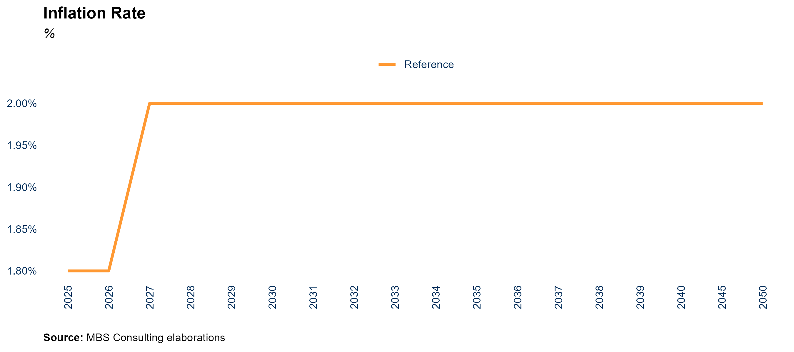

::::: callout-item
::: callout-left
#### 25-26 {.unnumbered}
:::

::: callout-right
THE DISINFLATION PROCESS HAS BEEN COMPLETED, WITH THE OVERALL INDEX
FALLING BELOW THE EU TARGETS. GIVEN THESE ENCOURAGING RESULTS, THE
COMMISSION IS CONTINUING ITS PATH OF INTEREST RATE REDUCTIONS, MARKING
THE FOURTH CONSECUTIVE CUT. NONETHELESS, THE EASING OF MONETARY POLICY
REMAINS PRUDENT AND DEPENDENT ON PERFORMANCE OUTCOMES. IN LIGHT OF THIS,
IN THE SHORT TERM, THIS EASING COULD LEAD TO A SLIGHT UPTICK IN
INFLATION, EXPECTED TO REACH 2.3% IN 2025. FROM 2026, INFLATION IS
ANTICIPATED TO REALIGN WITH THE EU TARGET OF 2%. AN ELEMENT OF
UNCERTAINTY STEMS FROM A POTENTIAL INCREASE IN GEOPOLITICAL AND TRADE
TENSIONS, PARTLY INFLUENCED BY THE OUTCOME OF THE U.S. ELECTIONS.
:::
:::::

::::: callout-item
::: callout-left
#### 27-30 {.unnumbered}
:::

::: callout-right
The 2024 average inflation rate fell below the 2%, proving the EU
monetary policy effective. Our scenario foresees an alignment with this
value in the medium term, with a progressive stabilization.
:::
:::::

::::: callout-item
::: callout-left
#### 31-50 {.unnumbered}
:::

::: callout-right
Long-term assumptions envisage the inflation rate to stabilize at around
2%, in line with the ECB’s medium term inflation target.
:::
:::::

::::: callout-wrap
::: callout-left
#### Main updates {.unnumbered}
:::

::: callout-right
Short-term inflation rates remained in line with our previous market
update.
:::
:::::

\newpage

# Commodities

## Natural Gas

### LNG

::: callout-main
**THE HALT OF RUSSIAN PIPELINE GAS FLOWS BOOSTS EUROPEAN LNG DEMAND,
WHILE SUPPLY GROWTH REMAINS LIMITED WORLDWIDE. OVER THE NEXT TWO YEARS,
THE GLOBAL LNG MARKET BALANCE REMAINS FRAGILE AS A RESULT. THE TIMELY
DEVELOPMENT OF NEW LIQUEFACTION FACILITIES IS KEY TO ACHIEVING LOWER
PRICES IN THE MEDIUM TO LONG TERM**
:::


::::: callout-item
::: callout-left
#### 25-26 {.unnumbered}
:::

::: callout-right
Global LNG demand is expected to grow nearly 5% in 2025 and 2026, led by Europe as 30 Bcm of regasification capacity (mostly in Germany) replaces Russian piped gas. Meanwhile, China's LNG demand growth is set to slow due to increased piped gas from Russia via the Power of Siberia pipeline (40 Bcm/y). In South and Southeast Asia, LNG will remain vital for supporting rapid economic growth. However, short-term global supply growth is constrained by construction delays, particularly in the US, tightening the market and potentially driving up winter prices.
:::
:::::

::::: callout-item
::: callout-left
#### 27-30 {.unnumbered}
:::

::: callout-right
Global LNG demand is projected to reach 660 Bcm by 2027, then stabilize below 5% annual growth due to increased renewables in power generation and improved energy efficiency. With new liquefaction capacity from the US and Qatar coming online as scheduled, market tightness should ease, leading to a gradual normalization of LNG prices.
:::
:::::

::::: callout-item
::: callout-left
#### 31-50 {.unnumbered}
:::

::: callout-right
In the long term, pressure on the LNG market is expected to ease as new capacity expands and green energy commitments take effect.
:::
:::::

::::: callout-wrap
::: callout-left
#### Main updates {.unnumbered}
:::

::: callout-right
Global LNG demand growth aligns with our previous market assessment, though we have revised European demand upwards and slightly lowered China's growth forecast, while global demand remains on track with earlier projections.
:::
:::::

\newpage

### TTF Price

::: callout-main
**A FULL RECOVERY TO PRE-CRISIS GAS DEMAND LEVELS IN EUROPE IS UNLIKELY
IN THE FORESEEABLE FUTURE, AS ENERGY EFFICIENCY IMPROVES AND RENEWABLE
POWER GENERATION CONTINUES TO ADVANCE. OVER THE LONG TERM, WE EXPECT
DEMAND DECLINES TO ACCELERATE DUE TO EUROPE’S DECARBONIZATION EFFORTS,
RESULTING IN A LOWER TTF PRICE TREND, TOWARD 25 €/MWH**
:::


::::: callout-item
::: callout-left
#### 25-26 {.unnumbered}
:::

::: callout-right
In our Reference scenario, the TTF yearly average for 2025 and 2026 is
projected to remain elevated, above 30 €/MWh, due to a fragile market
balance and potential pressure from geopolitical tensions. Storage
dynamics will play a crucial role, as a faster withdrawal compared to
the previous two years could lead to higher prices during the 2025
summer season, coinciding with the refilling season.
:::
:::::

::::: callout-item
::: callout-left
#### 27-30 {.unnumbered}
:::

::: callout-right
From 2027 onwards, further normalization is expected due to the
significant deployment of new liquefaction capacity. Assuming
progressive growth in global LNG supplies and an acceleration of the
energy transition, European gas prices are projected to steadily decline
towards 30 €/MWh by 2028.
:::
:::::

::::: callout-item
::: callout-left
#### 31-50 {.unnumbered}
:::

::: callout-right
The European decarbonization process will continue to reduce gas demand,
gradually pressuring prices back towards the long-term equilibrium of 25
€/MWh. In the Low Res scenario, geopolitical tensions could leave
commodity shortages unresolved, keeping prices just below 45 €/MWh in
the long term. In contrast, effective green policies, supported by
economic growth, could push prices significantly lower in the High Res
scenario, with the TTF averaging near 10 €/MWh in the long term.
:::
:::::

::::: callout-wrap
::: callout-left
#### Main updates {.unnumbered}
:::

::: callout-right
Gas price projections for the TTF remain in line with our previous
market update, though slightly revised downwards in the medium to long
term. This adjustment reflects the growing LNG supply wave, which is
expected to accelerate the reduction in prices. However, geopolitical
tensions are still anticipated to exert pressure on global gas prices in
the short-term.
:::
:::::

\newpage

### Spread TTF-PSV

::: callout-main
**AS PIPED FLOWS FROM NORWAY REMAIN CRUCIAL FOR ADEQUATE DEMAND COVERAGE, THE PSV GAS PRICE IS EXPECTED TO MAINTAIN A PREMIUM OVER THE TTF IN THE SHORT-TO-MEDIUM TERM. IN THE LONG TERM, THE REBALANCING OF FLOWS IS ANTICIPATED TO LEAD TO A GRADUAL NARROWING OF THE SPREAD TOWARDS ZERO**
:::


::::: callout-item
::: callout-left
#### 25-26 {.unnumbered}
:::

::: callout-right
The PSV-TTF spread is expected to stay near 2 €/MWh on average, both in
2025 and in 2026, as Italy’s reliance on piped gas flows from Norway via
Passo Gries remains high. Fluctuations throughout the year are
anticipated to be in line with seasonality.
:::
:::::

::::: callout-item
::: callout-left
#### 27-30 {.unnumbered}
:::

::: callout-right
Flows from the TAP and Algeria, along with LNG arrivals, are expected to
partially replace imports from the North in the medium term, leading to
a progressive narrowing of the spread to below 1 €/MWh by 2030.
:::
:::::

::::: callout-item
::: callout-left
#### 31-50 {.unnumbered}
:::

::: callout-right
The PSV-TTF spread is expected to converge towards zero in the long
term, as flows rebalance from North to South and LNG, combined with the
underlying demand reduction driven by decarbonization, plays a key role.
:::
:::::

::::: callout-wrap
::: callout-left
#### Main updates {.unnumbered}
:::

::: callout-right
The PSV-TTF spread is still expected to remain positive in the short and
medium term, having been revised upwards due to Italy’s continued
reliance on piped gas flows from Norway and high transport tariffs.
However, it is projected to gradually reduce towards zero in the long
run as flows rebalance and LNG plays an increasing role.
:::
:::::

\newpage

### PSV Price

::: callout-main
**THE ITALIAN GAS PRICE CONTINUES TO BE CLOSELY TIED TO THE EUROPEAN HUB PRICE, WITH THE TTF SIGNIFICANTLY AFFECTING PSV TRENDS. IN THE LONG RUN, WE FORESEE THE PSV ALIGNING WITH EUROPEAN PRICES, TARGETING 30 €/MWH BY 2030**
:::


::::: callout-item
::: callout-left
#### 25-26 {.unnumbered}
:::

::: callout-right
We expect both the 2025 and 2026 PSV yearly averages to remain just
below the 35 €/MWh threshold, despite subdued demand growth. The
conditions for the Italian gas market stabilization are unlikely to be
met in the next couple of years. However, the entry of the Ravenna
regasification terminal (5 Bcm/y of capacity) in 2025 may help alleviate
some of the pressure, which, however, remains high.
:::
:::::

::::: callout-item
::: callout-left
#### 27-30 {.unnumbered}
:::

::: callout-right
The PSV is expected to follow the mid-term normalization of European gas
prices towards 30 €/MWh by 2030, as a gradual rebalancing of the global
gas demand-supply dynamics aligns with the anticipated acceleration of
the energy transition.
:::
:::::

::::: callout-item
::: callout-left
#### 31-50 {.unnumbered}
:::

::: callout-right
The PSV reference price is expected to stabilize, aligning with TTF
prices at around 25 €/MWh in the long term.
:::
:::::

::::: callout-wrap
::: callout-left
#### Main updates {.unnumbered}
:::

::: callout-right
As for the TTF, medium-term PSV projections have been revised slightly
lower. This adjustment reflects the growing LNG supply wave, which is
expected to accelerate the reduction in prices. However, geopolitical
tensions are still anticipated to exert pressure on global gas prices.
The short-term PSV forecast has been slightly revised upwards, as
Italy’s reliance on Norway remains crucial and average transport tariffs
remain high.
:::
:::::

\newpage

### Logistics Costs for Italian Gas-Fired Units

::: callout-main
**GAS LOGISTIC COSTS ARE EXPECTED TO REMAIN HIGH IN THE SHORT-TERM DUE
TO THE INCREASE FOLLOWING THE LAST-RESORT STORAGE INJECTION ACTIVITY IN
PARTICULAR. HOWEVER, A PARTIAL REFUND WILL BE AVAILABLE FOR GAS-FIRED
POWER PLANTS PRODUCERS. VARIABLE GAS COSTS SHOULD START GRADUALLY
DECREASING FROM 2028 ONWRADS, FOLLOWING THE EXPECTED GAS PRICES
NORMALIZATION**
:::


::::: callout-item
::: callout-left
#### 25-28 {.unnumbered}
:::

::: callout-right
The ARERA Resolution 599/2024 confirms all downstream PSV variable
components for Q1-25, as anticipated. The only exception is the RET
component, which covers costs related to White Certificates and
efficiency measures, along with a refund mechanism for thermoelectric
producers, covering nearly 40% of costs. The RET component will increase from 1.1 €/MWh to 2.6 €/MWh starting in July 2025, due to uncertainties and delays in the 2025 regulatory framework for White Certificates definition. The same Resolution confirms that thermoelectric producers can request an exemption of over 60% of the CRVOS component (which covers storage injection incentives) for Q1-25. The remaining losses, stemming from extra costs incurred from 2022 emergency gas purchases (nearly 5 billion euros), will be recovered through final customers' bills over five years. The CRVBL component (covering charges related to gas system balancing activities) will be zero starting January 2025, thanks to the improved natural gas price scenario. As a precautionary measure, we assume a gradual return to historical average levels in the second half of 2025 to account for the volatility of the current transport cost environment, which impacts prices.
:::
:::::

::::: callout-item
::: callout-left
#### 29-50 {.unnumbered}
:::

::: callout-right
A gradual normalization of the average variable logistic costs below 4
€/MWh is only expected beyond 2028, coherently with the foreseen
normalization of gas prices and the recovery of the storage-related
losses, nearing 1.6 €/MWh on average by 2030.
:::
:::::

::::: callout-wrap
::: callout-left
#### Main updates {.unnumbered}
:::

::: callout-right
The variable transport charges forecast incorporates the latest
regulator interventions to mitigate the recent commodities surge on
bills, compensated by an increase in storages and balancing cost.
:::
:::::

\newpage

## EU ETS

### CO2 Allowances Price

::: callout-main
**THE ETS REFORM AIMS AT SUPPORTING A RAISE OF THE CO2 PRICE BY
TIGHTENING THE EMISSIONS CERTIFICATES MARKET THROUGH A COMBINATION OF
SUPPLY CURTAILMENT AND DEMAND-INCREASING MEASURES. THE INCLUSION OF NEW
SECTORS, SUCH AS THE MARITIME, WILL CONTRIBUTE TO SUSTAINING THE
ENVISIONED PRICE INCREASES**
:::


::::: callout-item
::: callout-left
#### 25-26 {.unnumbered}
:::

::: callout-right
In our Reference scenario, the average CO2 price for 2025 is projected
to spike above 85 €/ton, driven by the ETS reform kick-off. The phasing
out of free allowances for aviation (50% by 2025) and the removal of 90
million permits in 2024 are expected to put upward pressure on allowance
prices by reducing supply. The inclusion of the maritime transport
sector will further increase demand. However, concerns linger about the
pace of demand recovery, which is expected to be slow due to ongoing
economic challenges.
:::
:::::

::::: callout-item
::: callout-left
#### 27-30 {.unnumbered}
:::

::: callout-right
The supply-demand gap is expected to widen starting in 2026 as the
maritime sector joins the ETS and the phasing out of free aviation
allowances is fully implemented. By 2030, the Market Stability Reserve's
reinforcement and an increase in the Linear Reduction Factor to 4.4%
will further tighten the market, pushing the average CO2 price towards
110 €/ton.
:::
:::::

::::: callout-item
::: callout-left
#### 31-50 {.unnumbered}
:::

::: callout-right
By 2034 the removal of free allowances for sectors covered by the CBAM
will reach full implementation, inducing a further increase in
allowances demand. Long-term targets depend on the ETS system's
efficiency, with the CO2 price projected to exceed 120 €/ton by 2040 in
the Reference scenario and potentially approach 150 €/ton in the Low
scenario, assuming stricter decarbonization efforts in Europe.
:::
:::::

::::: callout-wrap
::: callout-left
#### Main updates {.unnumbered}
:::

::: callout-right
Our CO2 price targets remain consistent with our prior market update.
:::
:::::

\newpage


# Energy Mix

## Day-Ahead Market Energy Balance

### Reference Scenario

::: callout-main
**IN THE SHORT TERM, SUBDUED DEMAND IS INCREASINGLY COVERED BY GROWTH IN
RES AND NET IMPORT FLOWS. IN THE MID TERM, GAS-FIRED GENERATION
CONTINUES TO SERVE AS THE BACKBONE OF THE ENERGY MIX. IN THE LONG TERM,
RENEWABLES WILL EMERGE AS THE PRIMARY SOURCE OF ELECTRICITY PRODUCTION,
WITH GAS-FIRED GENERATION PROVIDING ESSENTIAL SUPPORT**
:::


:::::: callout-item
::: callout-left
#### 25-26 {.unnumbered}
:::

:::: callout-right
::: callout-item
Reduced electricity demand in Europe, coupled with overgeneration from
recovering nuclear capacity and increased hydroelectric production, has
driven up electricity imports from the Northern border. The positive
momentum in new RES installations is likely to persist in 2025-2026,
while gas-fired thermal plants remain the marginal source in the energy
mix.
:::
::::
::::::

::::: callout-item
::: callout-left
#### 27-30 {.unnumbered}
:::

::: callout-right
Coal-fired units are set to phase out by 2025, except for those in
Sardinia, which will remain operational until the Tyrrhenian Link is
completed---projected for 2030 in the Reference case and 2029 in the Low
case. By 2030, RES are expected to supply around 47% of total
electricity demand.
:::
:::::

::::: callout-item
::: callout-left
#### 31-50 {.unnumbered}
:::

::: callout-right
Renewable energy is projected to reach 70% of the energy mix by 2040 and
85% by 2050. The share of gas-fired thermal plants will reach 10% by
2050. Favorable market conditions will promote the development of
energy-intensive storage solutions, thereby enhancing their contribution
to the energy mix.
:::
:::::

:::::: callout-wrap
::: callout-left
#### Main updates {.unnumbered}
:::

:::: callout-right
::: callout-wrap
Short-term shifts in the production mix reflect updated commodity
prices.
:::
::::
::::::

### High RES Scenario

::: callout-main
**GREATER COMMITMENT TO DECARBONIZATION IN THE EUROPEAN ECONOMY DRIVES
STRONG RENEWABLE ENERGY GROWTH, WHICH IS EXPECTED TO APPROACH THE
CURRENT 2030 PNIEC TARGET, REACHING 55% OF THE ELECTRICITY MIX BY 2030
AND EXCEEDING 85% BY 2050. THIS EXPANSION IN RENEWABLES WILL BE FURTHER
SUPPORTED BY SIGNIFICANT INCREASES IN BATTERY STORAGE CAPACITY**
:::

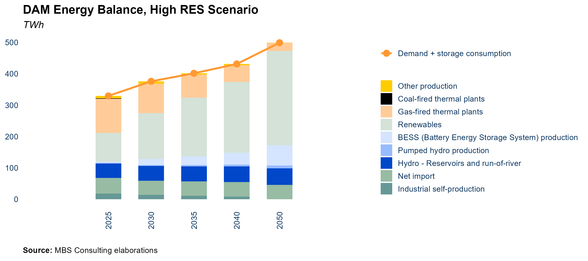

::::: callout-item
::: callout-left
#### 25-26 {.unnumbered}
:::

::: callout-right
A rapid surge in decarbonization efforts is driven by rising commodity
prices, increased EU ETS costs, and streamlined approval processes for
new renewable projects, all of which collectively boost investment in
energy efficiency. The phase-out of coal-fired units across the
peninsula is projected by 2025. Gas-fired thermal plants are expected to
supply up to 34% of national electricity demand by then, with net
electricity imports exceeding 49 TWh.
:::
:::::

::::: callout-item
::: callout-left
#### 27-30 {.unnumbered}
:::

::: callout-right
By the end of 2028 coal-fired units are entirely phased-out. Falling
renewables' costs and a greater effort to reach decarbonization goals
support renewables development. In 2030 the ratio between renewable
energy and total electricity consumption reach 59%. Improvements in the
electricity grid will facilitate the reduction of electricity imported
from neighborhood countries.
:::
:::::

::::: callout-item
::: callout-left
#### 31-50 {.unnumbered}
:::

::: callout-right
In the long term, gas-fired thermal plants will remain essential for
system security, but their share of the energy mix is expected to
decrease to 15% by 2040 and 6% by 2050 as storage capacity expands.
Despite advancements in storage and grid improvements, achieving full
renewable integration will face challenges such as grid congestion and
overproduction, underscoring the need for greater electrolyzer capacity
to effectively manage surplus renewable energy.
:::
:::::

::::: callout-wrap
::: callout-left
#### Main updates {.unnumbered}
:::

::: callout-right
Short-term shifts in the production mix reflect updated commodity
prices.
:::
:::::

\newpage

### Low RES Scenario

::: callout-main
**A SLOWER ECONOMIC RECOVERY TRANSLATES INTO REDUCED ELECTRICITY DEMAND
AND LOWER INVESTMENTS IN DECARBONIZATION. THE COMPLETION OF KEY GRID
INFRASTRUCTURE PROJECTS FACILITATES THE PHASE-OUT OF COAL UNITS BY 2034,
WHILE RENEWABLES AND BATTERY STORAGE SYSTEMS GRADUALLY EXPAND THEIR
SHARE IN THE ENERGY MIX**
:::


::::: callout-item
::: callout-left
#### 25-26 {.unnumbered}
:::

::: callout-right
Coal-fired thermal plants remain a significant power source, but lower
gas prices will increase the share of gas-fired plants to 32% of demand.
Net imports are expected to stabilize at 49 TWh in 2025, reducing coal
generation from 7 TWh in 2024 to to 5 TWh.
:::
:::::

::::: callout-item
::: callout-left
#### 27-30 {.unnumbered}
:::

::: callout-right
CM-led investments are set to come online, but the phase-out of
coal-fired capacity is delayed until 2035, coinciding with the
completion of significant network investments. By 2030, net imports are
expected to decline to just over 44 TWh, while gas-fired generation will
account for 35% of total electricity demand. Hydroelectric output is
projected to stabilize around 46.5 TWh per year, with renewable energy
sources steadily increasing their share in the energy mix.
:::
:::::

::::: callout-item
::: callout-left
#### 31-50 {.unnumbered}
:::

::: callout-right
The projected rise in CO2 prices is expected to further erode the
competitiveness of coal generation, leading to its full phase-out by
2035 with the completion of the Tyrrhenian Link. Meanwhile, gas-fired
generation is anticipated to account for 22% of the energy mix by 2050.
The evolving dynamics of the Day-Ahead Market (DAM) and the continued
expansion of renewable energy sources will support the long-term
integration of 10 GW of energy-intensive storage.
:::
:::::

::::: callout-wrap
::: callout-left
#### Main updates {.unnumbered}
:::

::: callout-right
Short-term shifts in the production mix reflect updated commodity prices
:::
:::::

\newpage

## Electricity Demand

::: callout-main
**2024 MARKED THE FIRST POWER DEMAND INCREASE SINCE 2018, DRIVEN BY INDUSTRIAL RECOVERY AND STABILIZING GAS PRICES AFTER THE 2022–2023 PEAKS. DEMAND IS PROJECTED TO REACH PRE-CRISIS LEVELS BY 2027, WITH LONG-TERM GROWTH SUPPORTED BY ELECTRIFICATION AND EFFICIENCY GAINS**
:::


::::: callout-item
::: callout-left
#### 25-26 {.unnumbered}
:::

::: callout-right
A subdued economic recovery over the next two years is expected to bring electricity demand to 315 TWh by 2025 and 319 TWh by 2026 (+1.1% annually). In the High RES scenario, stronger economic growth pushes demand above 320 TWh by 2025, returning to pre-crisis levels, while in the Low RES scenario, it remains below 320 TWh until 2030.
:::
:::::

::::: callout-item
::: callout-left
#### 27-30 {.unnumbered}
:::

::: callout-right
In the Reference case, gradual electrification and modest GDP growth drive power demand to over 320 TWh by 2027 and 330 TWh by 2030. In the High RES scenario, stronger economic growth and faster electrification push demand to nearly 350 TWh by 2030. Conversely, in the Low RES scenario, slower economic recovery (+0.6% annually) and delayed electrification keep demand near pre-crisis levels (just above 320 TWh) until after 2030.
:::
:::::

::::: callout-item
::: callout-left
#### 31-50 {.unnumbered}
:::

::: callout-right
After 2030, advanced transportation electrification and widespread adoption of heating and cooling technologies are expected to boost electricity consumption, though efficiency improvements in industrial and residential sectors may temper growth. In the Reference Scenario, annual demand growth moderates to +2.7–2.9 TWh, surpassing 360 TWh by 2040 and stabilizing around 385 TWh long-term. Alternative scenarios vary: the High RES case projects demand exceeding 390 TWh by 2050, while the Low RES case anticipates stabilization near 350 TWh due to slower electrification and weaker economic growth.
:::
:::::

::::: callout-wrap
::: callout-left
#### Main updates {.unnumbered}
:::

::: callout-right
Our projections have been revised downward, compared to our previous
update, due to persistent industrial stagnation and modest GDP growth
projections. Additionally, the partial decoupling observed between
economic growth and electricity consumption has further tempered
expectations for electricity demand.
:::
:::::

\newpage

### E-mobility

::: callout-main
**ADDITIONAL ELECTRICITY DEMAND FROM ELECTRIC VEHICLES (EVS) CAN VARY
SIGNIFICANTLY DEPENDING ON THE FUTURE IMPLEMENTATION OF E-MOBILITY
SOLUTIONS IN URBAN AREAS, EMISSIONS REDUCTION TARGETS IN TRANSPORTATION,
AND OVERALL LONG-TERM TRANSPORTATION HABITS**
:::


::::: callout-item
::: callout-left
#### 25-40 {.unnumbered}
:::

::: callout-right
Electric vehicle (EV) numbers are projected to reach 1.2 million by
2025, 4.5 million by 2030, and 11.1 million by 2040 in the Reference
scenario, resulting in total consumption of 2 TWh, 7.6 TWh, and 18.7 TWh
from EVs, respectively. In the High RES scenario, a more rapid adoption
of electric vehicles is expected to reach 6 million by 2030 and 15
million by 2040. Conversely, in the Low RES scenario, the development of
e-mobility experiences a 5- to 10-year delay compared to the Reference
scenario, with the target of 4.5 million EVs only being achieved by
2040.
:::
:::::

::::: callout-item
::: callout-left
#### 30 {.unnumbered}
:::

::: callout-right
The NIECP envisages 6.5 million electric vehicles in Italy in 2030 - 4.3
million are pure EVs (BEV: Battery Electric Vehicles) -- accounting for
about 8 TWh of additional electricity demand. In our Reference view we
estimate additional 7.5 TWh to come from BEV and PHEV (Plug-in Hybrid
Electric Vehicle). This means that our hypotheses consider a greater
consumption per EV compared to NIECP figures. Main differences are most
likely connected to the underlying assumptions about e-mobility
applications in cities or long-term transport.
:::
:::::

::::: callout-item
::: callout-left
#### 31-50 {.unnumbered}
:::

::: callout-right
Despite the recent Green Deal proposals at the EU level regarding
transportation, the uncertainty surrounding the future expansion of a
market still in its early stages of development leads us to assume a
business-as-usual (BAU) trend over the long term, beginning with the
annual level of electric vehicle (EV) additions projected for 2030.
:::
:::::

::::: callout-wrap
::: callout-left
#### Main updates {.unnumbered}
:::

::: callout-right
E-mobility demand hypotheses are in line with the previous update.
:::
:::::

\newpage

### Heating and Cooling

::: callout-main
**THE ADDITIONAL ELECTRICITY DEMAND FOR HEATING AND COOLING WILL DEPEND
ON THE GROWTH RATE OF INSTALLATIONS FOR RESIDENTIAL AND INDUSTRIAL USES,
WHICH MAY BE FURTHER SUPPORTED BY DECARBONIZATION INCENTIVES**
:::


::::: callout-item
::: callout-left
#### 25-40 {.unnumbered}
:::

::: callout-right
Heating and cooling (H&C) is projected to represent additional
electricity requirements ranging from 2 TWh to 5 TWh in 2025, 4 TWh to
13 TWh in 2030, and 8 TWh to 17 TWh in 2040, depending on the scenario
analyzed.
:::
:::::

::::: callout-item
::: callout-left
#### 30 {.unnumbered}
:::

::: callout-right
Our assumptions lead to estimate 6.7 TWh of H&C consumption in 2030, as
per the reference scenario, corresponding to around 1.8 million
installations for civil uses.
:::
:::::

::::: callout-item
::: callout-left
#### 31-50 {.unnumbered}
:::

::: callout-right
We assume a BAU trend in the long-term horizon, starting from the annual
level of additional installations and consumption reached in 2030.
:::
:::::

::::: callout-wrap
::: callout-left
#### Main updates {.unnumbered}
:::

::: callout-right
H&C demand hypotheses are in line with the previous update.
:::
:::::

\newpage

### Industrial Self-Production and Self-Consumption

::: callout-main
**INDUSTRIAL SELF-CONSUMPTION WILL GRADUALLY DECREASE AS EXISTING ASSETS
REACH END-OF-LIFE AND THE EXEMPTIONS ACCORDED TO CLOSED DISTRIBUTION
SYSTEMS WILL BE AT LEAST PARTIALLY REMOVED**
:::

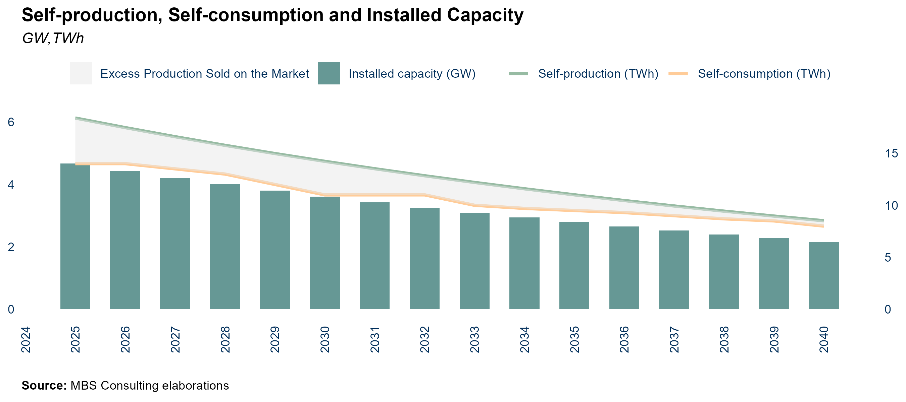

::::: callout-item
::: callout-left
#### 25 {.unnumbered}
:::

::: callout-right
Law 91/2014 affirms that grid and general system tariff components
should be applied to the electricity consumed and not only to the
electricity withdrawn from the public grid. Following this approach, the
exemptions accorded to RIU (Re Interne di Utenza) and SEU (Sistemi
Efficienti di Utenza) and closed distribution systems, and the benefits
currently in force for existing plants related to self-consumption will
be at least partially removed for new subjects/projects that apply for
similar mechanisms.
:::
:::::

::::: callout-item
::: callout-left
#### 26-50 {.unnumbered}
:::

::: callout-right
The excess of self-produced electricity that is not consumed by the
industrial sites (self-consumption) and is thus sold on the market
(differential between self-production and self-consumption) is expected
to gradually decrease, consistently with the expected end-of-life of
existing power plants that serve industrial sites.
:::
:::::

::::: callout-wrap
::: callout-left
#### Main updates {.unnumbered}
:::

::: callout-right
Industrial self-production and self-consumption hypotheses are in line
with the previous update. Self-production/consumption hypotheses are the
same in all the three scenarios.
:::
:::::

\newpage

### Zonal Distribution of Electricity Demand

::: callout-main
**ZONAL DISTRIBUTION OF ELECTRICITY DEMAND IS ESTIMATED IN LINE WITH
MOST RECENT REGIONAL TRENDS**
:::


::::: callout-item
::: callout-left
#### 15-20 {.unnumbered}
:::

::: callout-right
In 2015, the approval of the European guidelines on capacity allocation
and congestion management (CACM) introduced new parameters to be
followed in the zonal configuration review process. In 2018, Terna began
a process to review the zonal configurations in compliance with such
rules.
:::
:::::

::::: callout-item
::: callout-left
#### 21-onwards {.unnumbered}
:::

::: callout-right
The current zonal configuration derives from the base case proposed by
Terna in compliance with the CACM. Differences compared to the previous
configuration: (i) elimination of the limited production poles, (ii)
inclusion of a new bidding zone corresponding to the Calabria region,
(iii) displacement of the Umbria region from the Centre-North zone to
the Centre-South market zone.
:::
:::::

::::: callout-item
::: callout-left
#### 25-50 {.unnumbered}
:::

::: callout-right
The zonal distribution of electricity demand is based on historical
regional data published by Terna and subsequent econometric
elaborations. In the Reference case, the zonal distribution of
electricity needs is as follows: North (57%), Central-North (9%),
Central-South (17%), South (7%), Calabria (2%), Sicily (6%), Sardinia
(3%). Slight differences in such figures between the alternative cases
are the result of the econometric elaborations performed.
:::
:::::

::::: callout-wrap
::: callout-left
#### Main updates {.unnumbered}
:::

::: callout-right
The approach adopted and the distribution quotas is in line with the
previous update.
:::
:::::

\newpage

## Net Import

::: callout-main
**THE RECOVERY OF NUCLEAR CAPACITY FROM O&M OPERATIONS INITIATED IN 2022
(ALONG WITH THE CONNECTION OF THE FLAMANVILLE REACTOR AFTER LONG
DELAYS), INCREASED HYDROPOWER PRODUCTION IN SWITZERLAND, AND LOWER
ELECTRICITY DEMAND ACROSS EUROPE, IS EXPECTED TO SUSTAIN NET IMPORTS
INTO THE NORTHERN ZONE. NET IMPORTS ARE PROJECTED TO REACH 50 TWH BY THE
END OF 2024. AFTER 2029, THE COMPLETION OF A 600 MW INTERCONNECTOR WITH
TUNISIA (MONTEL) WILL ENHANCE EXPORT CAPABILITIES.**
:::


::::: callout-item
::: callout-left
#### 25-26 {.unnumbered}
:::

::: callout-right
Building on the trends observed in 2023 and 2024, net imports from
neighboring countries are expected to remain above the historical
average in the short term. This sustained level is primarily attributed
to the ongoing recovery of French nuclear power production following two
years of operation and maintenance disruptions, enhanced hydroelectric
output in Switzerland, and a slower-than-anticipated rebound in European
electricity demand. Net imports are projected to reach 49.4 TWh in 2025,
with a slight reduction to 48.9 TWh in 2026, accounting for nearly 16%
of short-term electricity demand.
:::
:::::

::::: callout-item
::: callout-left
#### 27-30 {.unnumbered}
:::

::: callout-right
The persistent combination of subdued electricity demand and ongoing
expansion of renewable energy capacity across Europe is anticipated to
result in systemic overgeneration in the medium term, reinforcing
imports as a cost-efficient option for Italy. This is further supported
by the projection that the PUN will remain at a premium compared to
other European prices over the same horizon. Net imports are expected to
stabilize at an average of approximately 49 TWh annually through 2029.
However, with the commissioning of the Elmed interconnection linking
Sicily and Tunisia by late 2028, the net import balance is projected to
decrease to around 45 TWh, as over 3.5 TWh of electricity is redirected
for export.
:::
:::::

::::: callout-item
::: callout-left
#### 31-50 {.unnumbered}
:::

::: callout-right
Import levels are expected to remain stable also after 2030, ranging
above 45 TWh. The slight increase in net import seen from 2035 is due to
an estimated reduction (1 TWh ca.) in the export flows towards Tunisia,
following the implementation of the Tunisian system development plan.
:::
:::::

::::: callout-wrap
::: callout-left
#### Main updates {.unnumbered}
:::

::: callout-wrap
Import hypotheses are in line with the previous update.
:::
:::::


```{r, include=FALSE}
# ## Capacity from 2024 Capacity Market Auction
# 
# ::: callout-main
# **NEW PROJECTS CONCENTRATED IN THE NORTH ZONE AND SARDINIA, THOSE
# MANIFESTING THE GREATEST ADEQUACY NEEDS. ALL THE NEW GAS-FIRED PROJECTS
# PARTICIPATING TO THE AUCTIONS ARE SUPPOSED TO EXPLOIT THE 1-YEAR BUFFER
# PERMITTED BY THE RULES OF THE MECHANISM**
# :::
# 
# 
# 
# ::: callout-item
# ::: callout-left
# #### NORTH, CNORTH {.unnumbered}
# :::
# 
# ::: callout-right
# 1.7 GW of new high-efficiency gas-fired capacity and almost 0.6 of new
# electrochemical storage capacity have been procured in the North market
# zone, the one which will suffer the most -- under a system adequacy
# point of view -- from the dismission of coal-fired capacity. In the
# Centre-North market zone, about 50 MW of new storage capacity have been
# procured instead.
# :::
# :::
# 
# ::: callout-item
# ::: callout-left
# #### CSOUTH, SOUTH, CALA {.unnumbered}
# :::
# 
# ::: callout-right
# These zones will be interested by the phase-out planned for 2025 as they
# respectively host about 1.8 GW and 2.6 GW of coal-fired capacity.
# However, only 0.4 GW ca. between gas-fired and storage capacity have
# been awarded among the two -- 0.3 GW in Centre-South and the remaining
# capacity in South -- after the competitive procedure. No new projects
# were awarded in Calabria.
# :::
# :::
# 
# ::: callout-item
# ::: callout-left
# #### SICI, SARD {.unnumbered}
# :::
# 
# ::: callout-right
# In Sardinia, coal-fired units will not be substituted by new gas-fired
# generation as the 0.8 GW awarded only come from new storage capacity.
# This could be a cornerstone for the island as the transition path
# embraced would hence neglect natural gas and favor fully electrified
# solutions. In Sicily, the competitive procedure resulted in the
# procurement of just 12 MW of new storage capacity.
# :::
# :::
# 
# ::: callout-wrap
# ::: callout-left
# #### Main updates {.unnumbered}
# :::
# 
# ::: callout-right
# 2024 Capacity Market auction outcomes are based on the data published by
# Terna and recent information regarding construction time.
# :::
# :::
# 
# \newpage
```

## Thermoelectric Generation

### Installed Capacity, Reference Scenario

::: callout-main
**CAPACITY MARKET AUCTIONS WILL COMPREHENSIVELY BRING 7.3 GW OF NEW
GAS-FIRED CAPACITY BY MID 2025. SARDINIAN COAL-FIRED UNITS TO BE
PHASED-OUT ONLY IN 2029, CONSIDERING THE TYRRHENIAN LINK ENTERING IN
2030**
:::


::::: callout-item
::: callout-left
#### 25-26 {.unnumbered}
:::

::: callout-right
2024 CM capacity should enter the market between late 2024 and mid-2025.
:::
:::::

::::: callout-item
::: callout-left
#### 27-30 {.unnumbered}
:::

::: callout-right
Auction results show also that Sardinia coal-fired capacity will not be
substituted by gas-fired units, as only storage capacity was awarded in
the island. Anyway, while coal-fired plants on the peninsula will be
phased-out after 2025, Sardinia units are expected to operate until the
Tyrrhenian Link infrastructure is fully completed (2030).
:::
:::::

::::: callout-item
::: callout-left
#### 31-50 {.unnumbered}
:::

::: callout-right
The amount of capacity auctioned through the CM is expected to grant
full system adequacy at least through to 2030. No other thermoelectric
capacity investments are envisaged after the wave of investment brought
by the last CM auctions. Existing CHP power plants continue to support
industrial activities under the assumption of a BAU evolution of the
industrial needs they serve. Some ageing CCGT capacity exit the market.
:::
:::::

::::: callout-wrap
::: callout-left
#### Main updates {.unnumbered}
:::

::: callout-right
Thermoelectric capacity hypotheses are in line with the previous update.
:::
:::::

\newpage

### Installed Capacity, High RES Scenario

::: callout-main
**CAPACITY MARKET AUCTIONS WILL COMPREHENSIVELY BRING 7.3 GW OF NEW
GAS-FIRED CAPACITY ONLINE BETWEEN MID 2025. SARDINIAN COAL-FIRED UNITS
TO BE PHASED-OUT ONLY IN 2029, CONSIDERING THE TYRRHENIAN LINK ENTERING
IN 2030**
:::

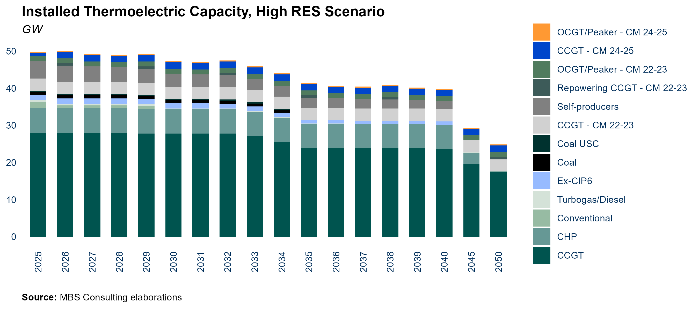

::::: callout-item
::: callout-left
#### 25-26 {.unnumbered}
:::

::: callout-right
Capacity secured in the 2024 Capacity Market auctions has experienced
widespread delays, with notable examples such as the CCGT Ostiglia
project now rescheduled for commissioning in February 2026. Most of this
capacity is expected to gradually enter the market over the course of
2025.
:::
:::::

::::: callout-item
::: callout-left
#### 27-30 {.unnumbered}
:::

::: callout-right
Auction results show also that Sardinia coal-fired capacity will not be
substituted by gas-fired units, as only storage capacity was awarded in
the island. Anyway, while coal-fired plants on the peninsula will be
phased-out after 2025, Sardinia units are expected to operate until the
Tyrrhenian Link infrastructure is fully completed (2029).
:::
:::::

::::: callout-item
::: callout-left
#### 31-50 {.unnumbered}
:::

::: callout-right
No other thermoelectric capacity investments are envisaged after the
wave of investment brought by the last CM auctions. Most of existing CHP
power plants gradually exit the market, substituted by greener
solutions. Some ageing CCGT capacity exit the market following strong
competitive conditions.
:::
:::::

::::: callout-wrap
::: callout-left
#### Main updates {.unnumbered}
:::

::: callout-right
Thermoelectric capacity hypotheses are in line with the previous update.
:::
:::::

\newpage

### Installed Capacity, Low RES Scenario

::: callout-main
**CAPACITY MARKET AUCTIONS WILL COMPREHENSIVELY BRING 7.3 GW OF NEW
GAS-FIRED CAPACITY ONLINE BETWEEN 2022 AND EARLY 2025. PHASE-OUT OF
COAL-FIRED UNITS IS POSTPONED UNTIL 2034 WHEN THE TYRRHENIAN LINK
BECOMES OPERATIVE**
:::


::::: callout-item
::: callout-left
#### 25-26 {.unnumbered}
:::

::: callout-right
Capacity secured in the 2024 Capacity Market auctions has experienced
widespread delays, with notable examples such as the CCGT Ostiglia
project now rescheduled for commissioning in February 2026. Most of this
capacity is expected to gradually enter the market over the course of
2025.
:::
:::::

::::: callout-item
::: callout-left
#### 27-30 {.unnumbered}
:::

::: callout-right
Thermal capacity expected to be stable in the second half of the decade
in the Low RES scenario.
:::
:::::

::::: callout-item
::: callout-left
#### 31-50 {.unnumbered}
:::

::: callout-right
No other thermoelectric capacity investments are envisaged after the
wave of investment brought by the last CM auctions. Existing CHP and
CCGT power plants are projected to remain operative. The commissioning
of the Tyrrhenian Link is postponed until 2035, determining a delayed
phase-out of all coal power plants.
:::
:::::

::::: callout-wrap
::: callout-left
#### Main updates {.unnumbered}
:::

::: callout-right
Thermoelectric capacity hypotheses are in line with the previous update.
:::
:::::

\newpage

### Residual Demand for CCGTs

::: callout-main
**EXISTING CCGTS COULD EXCEED 2000 EOH IN THE SHORT TERM, WITH
EXPECTATIONS TO RANGE BETWEEN 2000 AND 1300 EOH IN THE MID- AND
LONG-TERM. THIS VARIATION IS ATTRIBUTED TO THE SIGNIFICANT INCREASE IN
PRODUCTION FROM NEW RENEWABLE ENERGY INSTALLATIONS, ALONG WITH A HIGHER
DEGREE OF COMPETITION INTRODUCED BY NEWLY BUILT CAPACITY FOLLOWING THE
2024-2025 CAPACITY MARKET AUCTIONS.**
:::

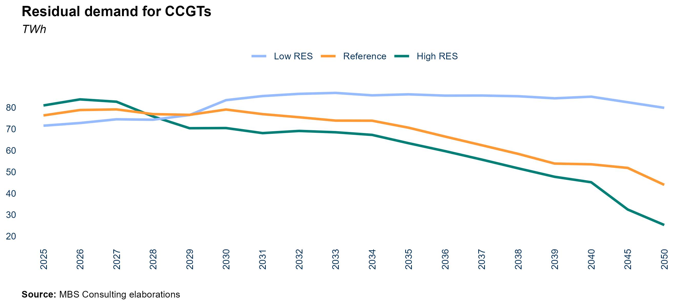

::::: callout-item
::: callout-left
#### 25-26 {.unnumbered}
:::

::: callout-right
The existing fleet of combined cycle gas turbines (CCGTs) is projected
to average approximately 2200 EOH during the 2024-2025 period,
exhibiting significant zonal variations. In the Northern zone, the load
factor for CCGTs is around 1800 EOH, while the Southern zones show lower
figures, averaging about 1000 EOH. Notably, Calabria stands out with an
average of 3000 EOH.
:::
:::::

::::: callout-item
::: callout-left
#### 27-30 {.unnumbered}
:::

::: callout-right
After the phase-out of coal-fired units, residual demand is expected to
rebound. However, existing combined cycle gas turbines (CCGTs) will face
significant competition from sustained import levels and new
high-efficiency entrants supported by the capacity market. In the low
scenario, residual demand is further reduced due to the effects of
energy efficiency improvements and increased renewable penetration.
Conversely, in the high scenario, residual demand gradually increases as
switching conditions improve.
:::
:::::

::::: callout-item
::: callout-left
#### 31-50 {.unnumbered}
:::

::: callout-right
Existing CCGTs (53%-efficiency) stabilize around 2000 EOH. In the Low
scenario, the great renewable penetration influences competitive
dynamics and existing units remain close to 1600 EOH. In the High
scenario, the improvement of switching conditions is hampered by the
high level of imports from abroad, with EOH of existing units over 2000
favored by phase-out after 2035. High-efficiency units stabilize below
the 4800 EOH only in the Low scenario.
:::
:::::

::::: callout-wrap
::: callout-left
#### Main updates {.unnumbered}
:::

::: callout-right
CCGT residual demand hypotheses are in line with the previous update.
:::
:::::

\newpage

### Coal-fired Production

::: callout-main
**THE PHASE-OUT OF COAL-FIRED THERMAL PLANTS IS EXPECTED TO OCCUR IN
2025, EXCEPT FOR THE SARDINIAN PLANTS, WHICH ARE SET TO CLOSE IN 2029.
THIS TIMELINE COINCIDES WITH THE FULL COMPLETION OF THE TYRRHENIAN LINK
IN 2030.**
:::

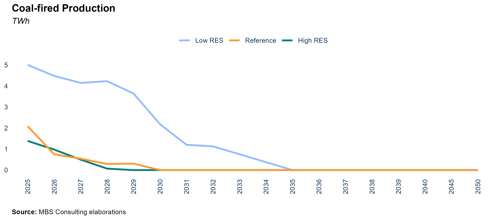

::::: callout-item
::: callout-left
#### 25-26 {.unnumbered}
:::

::: callout-right
The decline in electricity demand, coupled with favorable switching
conditions, is expected to significantly reduce coal production. In the
Reference Scenario, coal output is projected to fall to 2.1 TWh by 2025,
while in the High RES Scenario, it will drop further to just above 1
TWh. Conversely, in the Low RES Scenario, coal production is anticipated
to reach 5.0 TWh in 2025.
:::
:::::

::::: callout-item
::: callout-left
#### 27-30 {.unnumbered}
:::

::: callout-right
The timeline for coal phase-out differs across scenarios, driven largely
by the readiness of key grid infrastructure, particularly the Tyrrhenian
Link. In the Reference Scenario, only the units in Sardinia are expected
to remain operational beyond 2025, with their retirement aligned to the
completion of the Tyrrhenian Link in 2030. In the High RES Scenario,
full coal plant decommissioning is anticipated by 2028. Conversely, in
the Low RES Scenario, coal-powered units are projected to remain active
until 2035.
:::
:::::

::::: callout-item
::: callout-left
#### 31-50 {.unnumbered}
:::

::: callout-right
Coal units remain operative beyond 2030 only in the Low RES scenario,
until the complete phase-out projected in 2035, with the entrance of the
Tyrrhenian Link.
:::
:::::

::::: callout-wrap
::: callout-left
#### Main updates {.unnumbered}
:::

::: callout-right
Short-term shifts in coal production reflect updated commodity prices
and power demand projections.
:::
:::::

\newpage

## Reneweable Generation

### Renewable Installed Capacity

::: callout-main
**THE SIGNIFICANT INCREASE IN RENEWABLE ENERGY SOURCE (RES) CAPACITY
OBSERVED IN THE PAST YEAR IS EXPECTED TO CONTINUE IN THE SHORT TERM. IN
THE LONG TERM, RES MARKET PARITY WILL BE STRENGTHENED BY RISING
COMMODITY PRICES AND THE ACTIONS TAKEN TO MEET DECARBONIZATION TARGETS**
:::


::::: callout-item
::: callout-left
#### 25-26 {.unnumbered}
:::

::: callout-right
By the end of 2025, 38 GW of solar and 14 GW of wind capacity are expected to be operational. An analysis of renewable growth trends, considering bureaucratic and technical challenges, forecasts an additional 1.5 GW of wind and 2.7 GW of solar capacity by 2026. However, growth is expected to slow compared to 2023–2024, particularly for PV, due to developers delaying construction to qualify for the FERX and "FERX Transitorio" auctions.
:::
:::::

::::: callout-item
::: callout-left
#### 27-30 {.unnumbered}
:::

::: callout-right
Market parity conditions, combined with the FerX incentive scheme, are expected to accelerate progress toward long-term targets. The Reference scenario projects 51 GW of solar and 17 GW of wind capacity by 2030, raising the RES share to nearly 50% of total energy demand through a market-driven approach. In the High RES scenario, faster technology cost declines and favorable economic conditions drive even greater growth, with solar reaching 63 GW and wind 19 GW by 2030.
:::
:::::

::::: callout-item
::: callout-left
#### 31-50 {.unnumbered}
:::

::: callout-right
The Reference scenario projects steady growth in renewable penetration, with solar capacity reaching 80 GW and wind 27 GW by 2040. Achieving long-term decarbonization goals faster may require greater investments in grid infrastructure and advanced energy storage.
:::
:::::

::::: callout-wrap
::: callout-left
#### Main updates {.unnumbered}
:::

::: callout-right
Projections for RES installed capacity remain consistent with the
previous update, except for wind capacity, which has been revised
downward. This adjustment reflects the limited growth observed in recent
years, averaging approximately +500 MW annually.
:::
:::::

\newpage

### Renewable Production

::: callout-main
**RES PRODUCTION IN 2024 INCREASED BY APPROXIMATELY +15% COMPARED TO
2023, DRIVEN PRIMARILY BY HIGHER HYDRO AND SOLAR OUTPUT DESPITE A
DECLINE IN WIND PRODUCTION. WHILE SOLAR AND WIND PRODUCTION PERFORMANCES
WERE BELOW AVERAGE, THE IMPACT WAS MITIGATED FOR SOLAR BY A SIGNIFICANT
EXPANSION IN INSTALLED CAPACITY. ACHIEVING ITALY'S NECP TARGETS FOR THE
ELECTRICITY SECTOR WILL REQUIRE SUBSTANTIAL EFFORT: THE 2030 RES/GDC
TARGET OF 63% CAN ONLY BE REACHED WITH A MAJOR ACCELERATION IN THE
PERMITTING PROCESS OVER THE COMING YEARS AND STRONG SUPPORT FROM THE
FER-X INCENTIVE SCHEME**
:::


::::: callout-item
::: callout-left
#### 25-26 {.unnumbered}
:::

::: callout-right
Wind generation is projected to surpass 26 TWh while solar generation
will approach 42 TWh by 2025. In the High RES scenario, more favorable
economic conditions result in even higher projections, with wind
reaching 27 TWh and solar approaching 43 TWh within the same period.
:::
:::::

::::: callout-item
::: callout-left
#### 27-30 {.unnumbered}
:::

::: callout-right
Assuming a business-as-usual market trajectory and the resolution of
permitting process bottlenecks in the near future, it is expected that
90% of the 2030 RES/GDC target will be met. Full achievement of the 63%
target is anticipated only with a greener, more ambitious evolution of
the Italian energy system. Meeting the more stringent Green Deal
objectives---potentially setting the RES/GDC target around 70%, though
still under discussion---would require a significantly greater effort.
:::
:::::

::::: callout-item
::: callout-left
#### 31-50 {.unnumbered}
:::

::: callout-right
The reduction of technology costs and consolidated market parity
conditions could allow both solar and wind generation to almost triple
by 2040, with respect to 2024 values, in the Reference scenario.
Boundary conditions of alternative scenarios lead to different degrees
of renewable development and production level.
:::
:::::

::::: callout-wrap
::: callout-left
#### Main updates {.unnumbered}
:::

::: callout-right
Short-term projections for RES production have been slightly revised as
a result of recent changes in RES installation trajectories.
:::
:::::

\newpage

### Day-Ahead Market Overgeneration

::: callout-main
**OVERGENERATION IS LIKELY TO EMERGE AS A MAJOR CHALLENGE IN THE LONG
TERM DUE TO HIGH RENEWABLE PENETRATION, ESPECIALLY IN THE SOUTHERN
ZONES. EXPANDING ENERGY-INTENSIVE STORAGE SYSTEMS AND ELECTROLYSIS
CAPACITY WILL BE ESSENTIAL TO REDUCE MARKET IMBALANCES**
:::

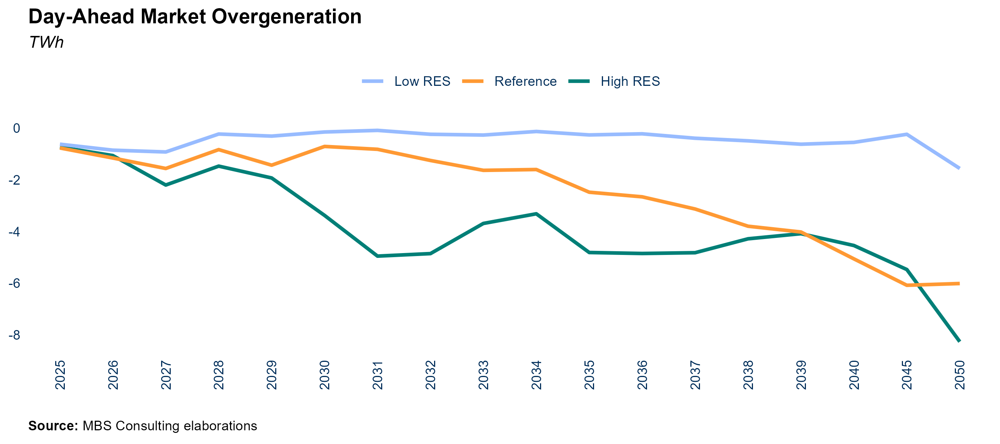

::::: callout-item
::: callout-left
#### 25-26 {.unnumbered}
:::

::: callout-right
Under BAU market conditions and moderate renewable penetration, the risk
of overgeneration remains low in both the Reference and Low RES
scenarios. However, a more significant increase in capacity installation
in the South macro-zone could lead to more frequent overgeneration
during specific hours in the High RES scenario.
:::
:::::

::::: callout-item
::: callout-left
#### 27-30 {.unnumbered}
:::

::: callout-right
The anticipated increase in renewable energy penetration after 2027 is
expected to heighten the risk of overgeneration, potentially resulting
in approximately 3 TWh of excess electricity by 2030 in the High RES
scenario. This curtailment effect could be further amplified by specific
local grid constraints. In comparison, the Reference scenario projects a
more moderate level of overgeneration, reaching around 0.7 TWh by 2030.
Overall, overgeneration is set to escalate throughout the decade, driven
by the rapid expansion of renewables in the Southern regions, and could
be exacerbated by delays or inadequacies in grid reinforcement.
:::
:::::

::::: callout-item
::: callout-left
#### 31-50 {.unnumbered}
:::

::: callout-right
To effectively manage the increasing penetration of renewable energy and
the resulting overgeneration, substantial investments in grid
reinforcement and high-capacity energy storage solutions will be
essential throughout the 2030s. These measures will be critical for
balancing the grid and maintaining a stable energy supply, particularly
in regions more susceptible to overgeneration. Additionally, this excess
energy production presents an opportunity to expand electrolysis
capacity, which would not only harness surplus energy but also support
continued investments in renewable energy sources.
:::
:::::

::::: callout-wrap
::: callout-left
#### Main updates {.unnumbered}
:::

::: callout-right
Short-term day-ahead market overgeneration updated to factor in the
adjustments to demand projections.
:::
:::::

\newpage

### Electrolyzer Installed Capacity

::: callout-main
**LONG-TERM RENEWABLE EXPANSION IN THE SOUTHERN REGIONS, PARTICULARLY ON
THE ISLANDS, IS EXPECTED TO RESULT IN SIGNIFICANT EXCESS ENERGY
GENERATION. GRID UPGRADES AND THE DEPLOYMENT OF BATTERY ENERGY STORAGE
SYSTEMS (BESS) MAY PROVE INSUFFICIENT TO FULLY MITIGATE THIS ISSUE,
NECESSITATING THE IMPLEMENTATION OF ELECTROLYSERS. BY 2040, INSTALLED
CAPACITY COULD REACH 0.5 GW UNDER THE REFERENCE SCENARIO AND UP TO 4 GW
IN THE HIGH RES SCENARIO, WITH CAPACITY PRIMARILY CONCENTRATED IN
SARDINIA AND SICILY**
:::


::::: callout-item
::: callout-left
#### 35-40 {.unnumbered}
:::

::: callout-right
In the long term, the expansion of renewable capacity---particularly in
the Southern regions---is expected to significantly increase the
incidence of systematic overgeneration, especially on the islands. Grid
investments and battery energy storage systems (BESS) will likely prove
inadequate to address this issue, thereby creating favorable conditions
for the adoption of green hydrogen technologies. In the Reference
scenario, installed electrolysis capacity could reach nearly 0.5 GW,
predominantly concentrated in Sardinia. Over time, electrolysis capacity
can effectively mitigate overgeneration by offering a mechanism to store
surplus renewable energy. Moreover, by enhancing demand during periods
of high RES production, it can help stabilize prices and alleviate the
cannibalization effect, particularly during the later stages of the
transition.
:::
:::::

::::: callout-wrap
::: callout-left
#### Main updates {.unnumbered}
:::

::: callout-right
Electrolyzer capacity hypotheses are in line with the previous update.
:::
:::::

\newpage

### Solar Market Parity

::: callout-main
**DESPITE THE ANTICIPATED LONG-TERM REDUCTION IN PRICES---DRIVEN BY
THE NORMALIZATION OF GAS PRICES AND THE GRADUAL INTEGRATION OF RENEWABLE ENERGY SOURCES INTO THE ENERGY MIX---SOLAR TECHNOLOGY REMAINS COMPETITIVE, EXHIBITING CAPTURED RATES THAT EXCEED THE LEVELIZED COST OF ELECTRICITY**
:::

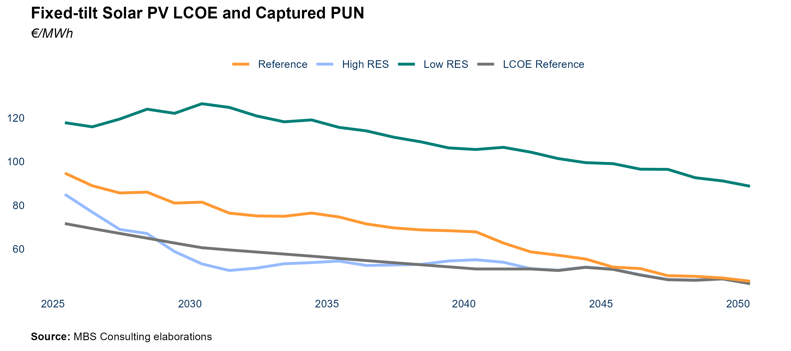

::::: callout-item
::: callout-left
#### 25-26 {.unnumbered}
:::

::: callout-right
Despite potential challenges in securing land and rising land costs,
technology costs for solar projects have decreased over the past year.
This reduction has been primarily driven by declining panel costs,
supported by increased competition among sellers. These trends are
supporting the market parity for solar technologies, with baseload
prices projected to stabilize between 80 and 100€/MWh during the
2025-2026 period. As a result, solar power plants are expected to
capture rates that exceed the estimated levelized cost of electricity
(LCOE), ranging between 66 and 82 €/MWh, depending on the market zone.
:::
:::::

::::: callout-item
::: callout-left
#### 27-30 {.unnumbered}
:::

::: callout-right
Despite the potential cannibalization effect on unlevered projects
situated in the Southern regions, decling investement costs for solar
projects and expected captured prices above 80 €/MWh support return on
investements for pv plants.
:::
:::::

::::: callout-item
::: callout-left
#### 31-50 {.unnumbered}
:::

::: callout-right
The long-term outlook for the renewable energy sector from 2030 onwards appears promising, driven by the continuous decline in technology costs and the adoption of enhanced Power Purchase Agreement (PPA) best practices, which are expected to bolster non-incentivized investments. However, the cannibalization effect may emerge as a significant concern in specific regions, such as Sardinia and Sicily, where the grid infrastructure may lack the capacity to efficiently manage and redirect energy flows.
:::
:::::

::::: callout-wrap
::: callout-left
#### Main updates {.unnumbered}
:::

::: callout-right
Adjustments to solar captured prices are determined by revised commodity
prices and electricity demand evolution trend.
:::
:::::

\newpage

### Wind Market Parity

:::: callout-main
::: callout-main
**DESPITE THE ANTICIPATED LONG-TERM REDUCTION IN PRICES---DRIVEN BY THE
NORMALIZATION OF GAS PRICES AND THE GRADUAL INTEGRATION OF RENEWABLE
ENERGY SOURCES INTO THE ENERGY MIX---WIND MARKET PARITY IS ENSURED BY
CAPTURED PRICES THAT EXCEED THE LEVELIZED COST OF ELECTRICITY**
:::
::::

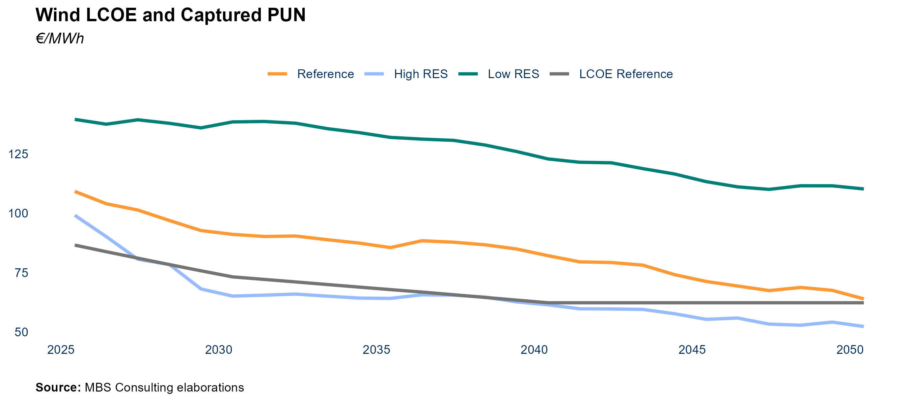

::::: callout-item
::: callout-left
#### 25-26 {.unnumbered}
:::

::: callout-right
Market parity continues to be guaranteed for wind plants despite the
investement intensity of those projects, benefitting of their wider
generation profile capable of capturing higher prices than solar plants.
This is largely due to their broader generation profile, which allows
wind projects to capture higher prices compared to solar plants. With
annual captured prices aligning closely with baseload prices, wind power
plants are expected to cover LCOE levels ranging between 85 and 90
€/MWh, in all the zones.
:::
:::::

::::: callout-item
::: callout-left
#### 27-30 {.unnumbered}
:::

::: callout-right
Gradual reduction in investement costs for wind projects and captured
prices close to 90€/MWh support wind market parity in the mid-term.
Potential price cannibalizzation dynamics remain limited untill 2030, as
a strong capacity development is expected to accelerate during the
2030s. However, site-specific factors may still influence the economics
of individual projects.
:::
:::::

::::: callout-item
::: callout-left
#### 31-50 {.unnumbered}
:::

::: callout-right
The long-term outlook from 2030 onwards appears promising, driven by the
ongoing decline in technology costs and the adoption of enhanced Power
Purchase Agreement (PPA) best practices that support non-incentivized
investments.
:::
:::::

::::: callout-wrap
::: callout-left
#### Main updates {.unnumbered}
:::

::: callout-right
Adjustments to wind captured prices are determined by revised commodity
prices and electricity demand evolution trend.
:::
:::::

\newpage

## Storage

### Pumped Hydro Production

::: callout-main
**DAY-AHEAD MARKET OPPORTUNITIES FOR PUMPED HYDRO POWER PLANTS MAY
EMERGE IN THE SHORT TERM DUE TO VOLATILE PRICE FLUCTUATIONS; THESE
OPPORTUNITIES ARE EXPECTED TO PERSIST IN THE LONG TERM AS
NON-PROGRAMMABLE RENEWABLE GENERATION CONTINUES TO GROW**
:::


::::: callout-item
::: callout-left
#### 25-26 {.unnumbered}
:::

::: callout-right
Intra-day price spreads on the Day-Ahead Market (DAM) may reveal
opportunities for pumped hydro units; however, the Ancillary Services
Market, particularly during the real-time balancing phase, is
anticipated to remain their primary source of revenue. Pumped hydro
production is projected to hover around 2.5 TWh.
:::
:::::

::::: callout-item
::: callout-left
#### 27-30 {.unnumbered}
:::

::: callout-right
Under an accelerated RES development path compared to the BAU
trajectory, pumped hydro production could reach 3.9 TWh by 2030 in the
High RES scenario, driven by new opportunities emerging in the DAM as
RES penetration increases. In contrast, the Low RES scenario limits
pumped hydro production to around 2 TWh.
:::
:::::

::::: callout-item
::: callout-left
#### 31-50 {.unnumbered}
:::

::: callout-right
As non-programmable renewable sources exceed 50% of total electricity
demand, market opportunities are set to grow further. Pumped hydro units
will play a pivotal role in reducing the solar cannibalization effect
and alleviating network congestion, with production projected to reach
nearly 7 TWh by 2050.
:::
:::::

::::: callout-wrap
::: callout-left
#### Main updates {.unnumbered}
:::

::: callout-right
Short-term variations in pumped hydro production align with updated
commodity prices and power demand forecasts. Currently, pure pumped
hydro capacity stands at approximately 4 GW, with no further increases
anticipated in the future.
:::
:::::

\newpage

### Battery Energy Storage System

::: callout-main
**ELECTROCHEMICAL STORAGE SYSTEMS WILL BE KEY DRIVERS OF DECARBONIZATION. IN THE SHORT TERM, SMALL-SCALE DISTRIBUTED CAPACITY WILL SUPPORT SOLAR INTEGRATION, MAINLY IN THE NORTH. CAPACITY MARKET AUCTIONS AND FAST RESERVE PROJECTS WILL ENABLE UTILITY-SCALE CAPACITY ENTRY. THE REAL MARKET BOOST WILL COME FROM MACSE (2028–2030), DRIVING SIGNIFICANT STORAGE CAPACITY, CRUCIAL FOR RES INTEGRATION, MAINLY IN THE SOUTH AND ISLANDS**
:::


::::: callout-item
::: callout-left
#### 25-26 {.unnumbered}
:::

::: callout-right
In the coming years, projects from the December 2020 Fast Reserve auctions, part of Terna's pilot for ultra-fast frequency regulation, are expected to become operational. Additionally, the 2024 Capacity Market auction has initiated the development of energy-intensive storage in Italy, adding over 1.5 GW of 4-hour systems. With the continued installation of distributed storage, total electrochemical storage capacity could exceed 15 GWh.
:::
:::::

::::: callout-item
::: callout-left
#### 27-30 {.unnumbered}
:::

::: callout-right
The anticipated growth of storage capacity will be crucial for integrating non-programmable renewables and improving the stability and flexibility of Italy's electricity system. The PNIEC targets 72 GWh of additional storage by 2030, spanning utility-scale and distributed projects, with a focus on Southern regions where renewable generation is concentrated. Italy's storage market has a robust pipeline of projects, but their realization depends heavily on regulated support mechanisms, including the MACSE auction planned for mid-2025, aimed at expanding capacity in the South and islands. By 2030, total BESS capacity is projected to reach 48–65 GWh, combining small-scale and utility-scale systems.
:::
:::::

::::: callout-item
::: callout-left
#### 31-50 {.unnumbered}
:::

::: callout-right
Energy-intensive applications are expected to grow, driven by market signals from expanding renewable installations. In the Reference scenario, PNIEC targets are projected to be met by the mid-2030s, with storage capacity reaching 105 GWh by 2040, rising to 140 GWh in the High RES case.
:::
:::::

::::: callout-wrap
::: callout-left
#### Main updates {.unnumbered}
:::

::: callout-right
BESS capacity hypotheses have been updated in line with potential
project pipeline and expectation on MACSE auction.
:::
:::::

```{r, include=FALSE}
# ## Capacity from 202
### Energy Intensive Electrochemical Storage

#::: callout-main
#**2024 CAPACITY MARKET AUCTION STARTED THE DEVELOPMENT OF ENERGY
#INTENSIVE STORAGES IN THE ITALIAN MARKET. LONG-TERM DEVELOPMENT OF SUCH
#KIND OF ASSET WILL BE KEY IN FOSTERING THE INTEGRATION OF RENEWABLES IN
#THE SYSTEM, WHEN THE GREAT SOLAR PENETRATION CREATES OPPORTUNITIES FOR
#TIME-SHIFTING APPLICATIONS ON THE DAY-AHEAD MARKET**
#:::

#

#::: callout-item
#::: callout-left
#### 24 {.unnumbered}
#:::

#::: callout-right
#2024 Capacity Market auction started the development of energy intensive
#storage in the Italian market, with more than 1.5 GW of new storage
#capacity -- quite completely energy intensive (4 hours) -- expected to
#hit the market by 2024 (possibly with some delays due to issue on the
#supply chain), with Sardinia and North to host about 0.8 GW and about
#0.6 GW respectively.
#:::
#:::

#::: callout-item
#::: callout-left
#### 25-30 {.unnumbered}
#:::

#::: callout-right
#The Day-Ahead Market presents promising market opportunities for
#merchant energy-intensive storage applications with a storage capacity
#of 4 hours. This is due to the increasing price spread volatility and
#the presence of overgeneration resulting from the development of
#renewable energy sources. Additionally, the gradual decrease in
#technology costs further enhances the attractiveness of energy-intensive
#investments.
#:::
#:::

#::: callout-item
#::: callout-left
#### 31-50 {.unnumbered}
#:::

#::: callout-right
#Energy-intensive applications reach an overall installed capacity of 22
#GW in 2040. The larger installed capacity achieved in the Low scenario
#(near 31 GW in 2040) is consequence of greater opportunities both on the
#DAM and on the ASM.
#:::
#:::

#::: callout-wrap
#::: callout-left
#### Main updates {.unnumbered}
#:::

#::: callout-right
#Energy-intensive BESS capacity hypotheses are in line with the previous
#update. They factor in ASM volumes dynamics and economic convenience.
#:::
#:::
```

\newpage

# Transmission Grid

## Grid Reinforcements

::: callout-main
**SIGNIFICANT GRID REINFORCEMENTS ARE EXPECTED TO BE IMPLEMENTED BY THE
MID-2020s, WITH MAJOR UPGRADES, SUCH AS THE TYRRHENIAN LINK AND ADRIATIC
LINK, SLATED FOR COMPLETION IN THE 2030s. THE EXPANSIVE DEVELOPMENT OF
RENEWABLE ENERGY SOURCES WILL TRIGGER THE NEED FOR ADDITIONAL GRID
UPGRADES, AS INTER-ZONAL CONSTRAINTS WILL NOT BE FULLY RESOLVED**
:::


::::: callout-item
::: callout-left
#### 25-26 {.unnumbered}
:::

::: callout-right
In all the scenarios proposed, network constraints are aligned with the
most recent indications provided by Terna.
:::
:::::

::::: callout-item
::: callout-left
#### 27-30 {.unnumbered}
:::

::: callout-right
Grid reinforcements are expected to improve flow management and reduce
inter-zonal congestion on the mainland. By 2030, two key HVDC
infrastructures are set to become operational: the Tyrrhenian Link, key
to decommission Sardinia's coal-fired units, and the Adriatic Link,
designed to alleviate bottlenecks between South and North. However, both
projects are anticipated to face delays compared to the Terna-Arera
schedule.
:::
:::::

::::: callout-item
::: callout-left
#### 31-50 {.unnumbered}
:::

::: callout-right
Under BAU assumptions, inter-zonal constraints on the mainland are
expected to gradually reduce starting from 2035. In the Low scenario,
Terna's proposed 30 GW Hypergrid infrastructure will be implemented,
while the High scenario projects more limited long-term network
development.
:::
:::::

::::: callout-wrap
::: callout-left
#### Main updates {.unnumbered}
:::

::: callout-right
Grid development hypotheses are in line with the previous update.
:::
:::::

\newpage

# Power Market Prices

## Baseload PUN

::: callout-main
**THE PUN IS EXPECTED TO REBOUND TO 112 €/MWH IN 2025, DRIVEN BY GAS
MARKET TENSIONS AND CO2 PRICES STABILIZING AT 85 €/TON DUE TO FULL ETS
REFORM IMPLEMENTATION. HOWEVER, GREATER RES INTEGRATION, POST-2026 PRICE
NORMALIZATION, AND STEADY ELECTRICITY IMPORTS ARE FORECAST TO LOWER
PRICES BELOW 100 €/MWH BY 2029 IN THE REFERENCE SCENARIO AND BY 2026 IN
THE HIGH RES CASE**
:::


::::: callout-item
::: callout-left
#### 25-26 {.unnumbered}
:::

::: callout-right
In the Reference scenario, market dynamics are expected to stabilize by
2026 as the gas market approaches equilibrium. In 2025, potential gas
market tensions and a demand-driven recovery supporting the ETS
mechanism are projected to push average prices to approximately
€112/MWh, before easing to €106/MWh in 2026. In the High RES scenario,
stronger economic conditions and accelerated RES integration may temper
price increases, with the PUN forecast to average around €101/MWh in
2025.
:::
:::::

::::: callout-item
::: callout-left
#### 27-30 {.unnumbered}
:::

::: callout-right
In the medium term, sustained imports, gas price normalization driven by
expanded LNG supply from new liquefaction capacity in the USA and Qatar,
and increasing RES penetration are expected to push energy prices
downward. As a result, electricity prices are projected to decline to 98
€/MWh by 2030. In the High RES scenario, enhanced decarbonization
efforts could further reduce prices, averaging €71/MWh on the same
horizon.
:::
:::::

::::: callout-item
::: callout-left
#### 31-50 {.unnumbered}
:::

::: callout-right
In the long term, power prices will remain heavily influenced by the
cost profile of CCGTs, which are expected to act as the marginal
technology for 80% of the time in 2040, decreasing to less than 60% by
2050. As a result, long-term ETS dynamics are likely to drive baseload
prices upward, partially offset by the cost-reducing effect of rising
RES penetration. The projected PUN for 2040 is expected to range between
€130/MWh and €74/MWh, depending on the scenario.
:::
:::::

::::: callout-wrap
::: callout-left
#### Main updates {.unnumbered}
:::

::: callout-right
The downward revision of short-term gas price projections, driven
largely by adjustments to the logistics component, alongside the
adjustment to demand projections, entailing a reduction in CSS
forecasts, jointly led to lower PUN projections throughout the entire
horizon.
:::
:::::

### Peak-Load/ Off-Peak PUN

::: callout-main
**RENEWABLES PENETRATION, DRIVEN BY SOLAR ENERGY, IS ANTICIPATED TO HAVE
A SIGNIFICANT IMPACT ON PEAK AND OFF-PEAK DYNAMICS AFTER 2030, WHEN AN
INVERSION IN PRICE SPREADS BETWEEN TIME SLOTS IS EXPECTED TO TAKE
PLACE**
:::


::::: callout-item
::: callout-left
#### 25-26 {.unnumbered}
:::

::: callout-right
The favorable price spread between evening and midday hours is
anticipated to persist in the short term, as the penetration of
renewables remains below 50% of gross domestic consumption.
:::
:::::

::::: callout-item
::: callout-left
#### 27-30 {.unnumbered}
:::

::: callout-right
The continued expansion of solar capacity is expected to further
suppress midday prices, particularly during periods of abundant sunlight
and low demand, such as in spring. This trend will progressively narrow
the disparity between peak and off-peak prices.
:::
:::::

::::: callout-item
::: callout-left
#### 31-50 {.unnumbered}
:::

::: callout-right
The long-term persistence of reversed hourly price differentials is
expected to drive higher prices during off-peak hours. The growing
integration of energy-intensive electrochemical storage systems, coupled
with improved storage unit operability, is likely to alleviate the
cannibalization effect caused by non-programmable solar power plants.
:::
:::::

::::: callout-wrap
::: callout-left
#### Main updates {.unnumbered}
:::

::: callout-right
The price trends for the various categories of hours align with the
findings from the previous market update.
:::
:::::

\newpage

### Baseload PUN Components, Reference Scenario

::: callout-main
**THE DECREASE IN RESIDUAL DEMAND FOR CCGTs CAUSED BY STAGNANT
ELECTRICITY DEMAND, CONTINUED NET IMPORTS, AND SUBSTANTIAL RES
GENERATION WILL RESULT IN A REDUCTION OF CSS FOR EXISTING CCGTs IN THE
SHORT TERM. FOLLOWING THE PHASE-OUT OF COAL-FIRED UNITS, CSS IS EXPECTED
TO STAY NEAR -3 €/MWh AND BECOME INCREASINGLY NEGATIVE IN THE LONG TERM
AS THE RISING PENETRATION OF RENEWABLES AND CM-SUPPORTED NEW BUILDS
AFFECT COMPETITIVE DYNAMICS**
:::


::::: callout-item
::: callout-left
#### 25-26 {.unnumbered}
:::

::: callout-right
The moderation of commodity prices, increased net imports from foreign
countries, and a sluggish recovery in demand are heightening market
competition for CCGTs. As a result, a negative CSS of approximately -2.3
€/MWh is anticipated for thermal plants in the Reference scenario for
2025.
:::
:::::

::::: callout-item
::: callout-left
#### 27-30 {.unnumbered}
:::

::: callout-right
In the latter half of the 2020s, intensified competition from newly
constructed Capacity Market units, a growing share of RES, and downward
pressure from normalized gas prices are expected to keep the CCS in
negative territory, averaging -3.5 €/MWh.
:::
:::::

::::: callout-item
::: callout-left
#### 31-50 {.unnumbered}
:::

::: callout-right
In the long term, renewables are expected to dominate the generation
mix, driving down both power prices and the CSS, which is projected to
reach approximately -30 €/MWh by 2050. Despite rising demand, existing
CCGTs are expected to remain the marginal technology, operating as such
for around 80% of the system's hours in 2040.
:::
:::::

::::: callout-wrap
::: callout-left
#### Main updates {.unnumbered}
:::

::: callout-right
Short-term projections for the baseload PUN component have been revised
to account for updated commodity prices and adjusted demand
expectations.
:::
:::::

\newpage

### PUN Hourly Shape

::: callout-main
**INCREASING SOLAR PENETRATION SIGNIFICANTLY AFFECTS PRICES DURING PEAK
DAYTIME HOURS AND WORSENS DAILY PRICE DIFFERENTIALS IN THE LONG TERM.
THIS IMPACT IS PARTIALLY OFFSET BY THE DEVELOPMENT OF STORAGE UNITS**
:::


::::: callout-item
::: callout-left
#### 25-26 {.unnumbered}
:::

::: callout-right
The impact of solar production during peak daytime hours is still modest
due to limited penetration. As a result, price differentials throughout
the day are currently at average levels.
:::
:::::

::::: callout-item
::: callout-left
#### 27-30 {.unnumbered}
:::

::: callout-right
As solar penetration increases and the cannibalization effect
intensifies, the disparity between central hours and morning/evening
peak hours grows wider. While the combined deployment of single-axis
trackers, grid enhancements, and energy-intensive storage solutions
helps alleviate this issue, its impact remains limited.
:::
:::::

::::: callout-item
::: callout-left
#### 31-50 {.unnumbered}
:::

::: callout-right
As renewable penetration advances, both intra-day price differentials
and the number of hours with prices at 0 €/MWh increase, encouraging
investments in electrolysis capacity. This scenario makes time-shifting
applications in the Day-Ahead Market appealing and stimulates new
investments in energy-intensive storage units.
:::
:::::

::::: callout-wrap
::: callout-left
#### Main updates {.unnumbered}
:::

::: callout-right
The PUN hourly shape aligns with the findings of the previous update.
The lower short-term absolute values reflect the impacts of the revised
commodity assumptions.
:::
:::::

\newpage

## Baseload Zonal Prices

::: callout-main
**IN THE SHORT TERM, ZONAL PRICES ARE EXPECTED TO DIVERGE DUE TO
FLUCTUATIONS IN THE DEMAND-OFFER BALANCE AMONG DIFFERENT ZONES. IN THE
LONG TERM, THE SIGNIFICANT EXPANSION OF RENEWABLE ENERGY SOURCES IN THE
SOUTHERN MACRO-ZONE, ENABLED BY IMPROVEMENTS TO THE TRANSMISSION GRID,
WILL REDUCE BASELOAD ZONAL PRICES**
:::


::::: callout-item
::: callout-left
#### 25-26 {.unnumbered}
:::

::: callout-right
Network congestion is not a significant issue on the mainland. Southern
regions experience lower prices, while increased CCGT operations in the
Northern zones push prices above the PUN, consistent with recent
historical trends. However, with electricity demand remaining below
historical levels and renewable penetration following a gradual path,
price spreads remain modest.
:::
:::::

::::: callout-item
::: callout-left
#### 27-30 {.unnumbered}
:::

::: callout-right
Surging renewable penetration is projected to exacerbate inter-zonal
congestion through 2030; while major grid enhancements, such as the
completion of the Adriatic Link, will improve energy exchanges from
South to North, they will only partially mitigate congestion in the
medium term. Continued expansion of renewable capacity in the Southern
zones is likely to increase the frequency of congestion events,
upsurging the incidence of price spreads over time.
:::
:::::

::::: callout-item
::: callout-left
#### 31-50 {.unnumbered}
:::

::: callout-right
Despite completed grid improvements, bottlenecks between the Northern
and Southern zones are expected to persist, maintaining price
differentials of up to 1.5 €/MWh throughout the 2030s. Additional grid
reinforcements, set to commence in 2035, are projected to ease
inter-zonal congestion on the mainland. However, similar challenges are
likely to remain significant in island regions.
:::
:::::

::::: callout-wrap
::: callout-left
#### Main updates {.unnumbered}
:::

::: callout-right
The dynamics of zonal prices are in line with the previous update.
:::
:::::

\newpage

## Evolution of Baseload PUN-South Price Differential

::: callout-main
**THE TREND IN THE SPREAD BETWEEN THE PUN PRICE---PRIMARILY INFLUENCED
BY THE PERFORMANCE OF THE NORTHERN MARKET ZONE---AND THE PRICES IN THE
SOUTHERN MARKET ZONES IS HEAVILY DEPENDENT ON ASSUMPTIONS REGARDING
RENEWABLE PENETRATION, STORAGE DEVELOPMENT, AND THE TIMING OF GRID
INFRASTRUCTURE IMPLEMENTATION**
:::


::::: callout-item
::: callout-left
#### 25-26 {.unnumbered}
:::

::: callout-right
The spread between the PUN and the Southern market zones is expected to
remain at recent historical levels in the short term, with the Southern
zone experiencing a discount. This dynamic is driven by a general
decrease in electricity demand and an increasing share of RES in the
generation mix, leading to lower prices compared to the Northern zones.
Despite the rise in import flows, CCGTs in the North are still needed to
meet demand, resulting in average prices that are higher.
:::
:::::

::::: callout-item
::: callout-left
#### 27-30 {.unnumbered}
:::

::: callout-right
In both the Reference and High RES cases, the incorporation of renewable
technologies results in a wider spread, despite network interventions.
Conversely, in the Low RES scenario, the spread decreases due to more
restrained growth in renewables, allowing for gradual enhancements in
the operational conditions of gas-fired units until 2030, when coal
generation becomes less competitive compared to gas.
:::
:::::

::::: callout-item
::: callout-left
#### 31-50 {.unnumbered}
:::

::: callout-right
In the Reference case, the significant penetration of renewables in
Southern regions increases the spread during the first half of the
2030s, signaling the market for new electrochemical battery energy
storage systems (BESS) to enter and prompting new grid investments. In
the High RES scenario, the expected and accelerated development of
storage and network investments contributes to a reduction in the
spread. However, ongoing growth in renewable energy sources causes the
spread to widen again in the second half of the 2030s.
:::
:::::

::::: callout-wrap
::: callout-left
#### Main updates {.unnumbered}
:::

::: callout-right
The evolution of the spread between the PUN and Southern zonal prices is
substantially in line with the previous update; minor shifts in
short-term projections depend on the updated hypoteses on commodities
levels and the changes to demand forecasts.
:::
:::::

\newpage

## Clean Spark Spread

### Baseload CSS for Existing CCGT Units

::: callout-main
**BASELOAD CSS IS PROJECTED TO DECLINE IN THE SHORT TERM AS STAGNANT
POWER DEMAND GROWTH, SUSTAINED IMPORTS, AND INCREASING RES PENETRATION
REDUCE CCGT PRODUCTION. BY 2040, VALUES ARE EXPECTED TO STABILIZE
BETWEEN -7 AND -1 €/MWh, DEPENDING ON THE SCENARIO. MISSING MONEY ISSUES
ARE LIKELY TO EMERGE IN THE LATTER HALF OF THE 2020s AND BECOME MORE
PRONOUNCED IN ALTERNATIVE SCENARIOS**
:::

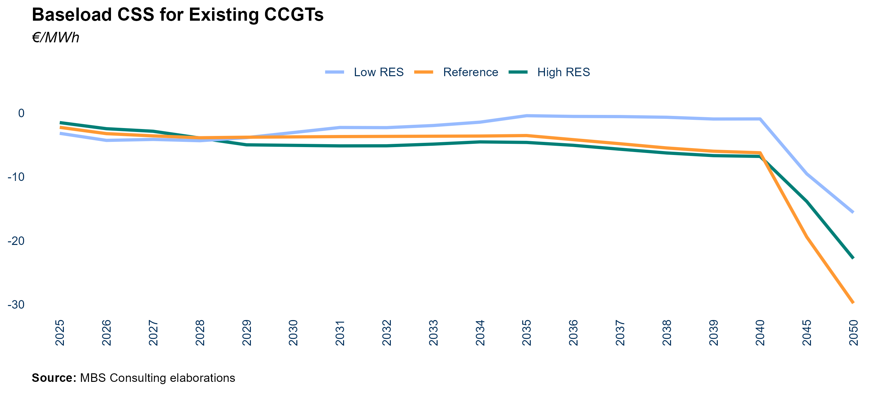

::::: callout-item
::: callout-left
#### 25-26 {.unnumbered}
:::

::: callout-right
The anticipated energy outlook, characterized by stagnant electricity
demand, a growing share of RES, and increased import levels, is expected
to intensify competition for the existing fleet. These factors will
place downward pressure on the CSS for CCGTs, with average values
projected at -2.7 €/MWh over the 2025-2026 period.
:::
:::::

::::: callout-item
::: callout-left
#### 27-30 {.unnumbered}
:::

::: callout-right
Market competition is set to intensify with stabilized imports from
Northern borders, increased renewable capacity, and new high-efficiency
CCGTs from CM auctions. These factors will keep baseload CSS negative,
averaging around -3.5 €/MWh in the High RES scenario, where accelerated
RES growth and heightened thermoelectric competition amplify the
pressure in the second half of the 2020s.
:::
:::::

::::: callout-item
::: callout-left
#### 31-50 {.unnumbered}
:::

::: callout-right
Post-2030, the decommissioning of aging capacity will enable existing
CCGTs (53%-efficiency) to remain the marginal technology for
approximately 80% of the operating hours through 2040. During this
horizon, baseload CSS is expected to range below -2 €/MWh, and until -6
€/MWh. In the High RES scenario, baseload CSS is projected to fall
further, staying below -7 €/MWh in the long-term (post-2040).
Conversely, in the Low RES, increased CCGT generation will result in
higher baseload CSS, though it is still expected to remain below -4
€/MWh from 2040 onwards.
:::
:::::

::::: callout-wrap
::: callout-left
#### Main updates {.unnumbered}
:::

::: callout-right
CSS estimations are in line with the previous update.
:::
:::::

### Day-Ahead Market Profitability for CCGT Units

::: callout-main
**IN THE NEAR TERM, CURRENT UNITS ARE LIKELY TO FACE LESS FAVORABLE
SWITCHING CONDITIONS, BUT THE RISING SOLAR PENETRATION IS PROJECTED TO
INCREASE EVENING PRICE PEAKS OVER THE MEDIUM TO LONG TERM.
HIGH-EFFICIENCY UNITS WILL OPTIMIZE DAM VOLUMES WHILE MAINTAINING A
DOUBLE-DIGIT MARGINAL CAPTURE**
:::


::::: callout-item
::: callout-left
#### 25-26 {.unnumbered}
:::

::: callout-right
In the short term, captured CSS for existing CCGTs are projected to average around 10 €/MWh. The energy mix composition across different market zones will significantly influence margins for thermal units. In southern bidding zones, slow demand growth and continued RES installations are expected to limit plant operability. However, despite similar trends and stable import flows from the northern border, CCGT margins in the northern zones should remain stable, supported by strong zonal demand.
:::
:::::

::::: callout-item
::: callout-left
#### 27-30 {.unnumbered}
:::

::: callout-right
As renewable capacity increases, existing units tend to concentrate their operations during evening hours to maximize captured margins. The high-efficiency gas-fired capacity captured CSS is subject to competitive market conditions as new projects enter the market with support from the latest CM auction. Despite this, the high efficiency of these projects enables them to maintain an average captured margin of 10 €/MWh.
:::
:::::

::::: callout-item
::: callout-left
#### 31-50 {.unnumbered}
:::

::: callout-right
Growing renewable penetration intensifies overgeneration phenomena and accentuates evening price spikes, determining an increasing trend for captured marginality for existing units in the second half of the 2030s, but load factors reduce progressively on increasing renewables share and increase competition from high efficiency units.
:::
:::::

::::: callout-wrap
::: callout-left
#### Main updates {.unnumbered}
:::

::: callout-right
Expected load factor and marginality of CCGT units depend on updated
hypothesis concerning commodity prices, market dynamics and new
thermoelectric installed capacity.
:::
:::::

\newpage

## Captured Prices of Renewable Sources

### Solar Captured Prices

::: callout-main
**A GROWING CANNIBALIZATION EFFECT ON SOLAR PRICES BECOMES APPARENT IN
THE LATE 2020s, PARTICULARLY IN SOUTHERN MARKET ZONES, WHERE HIGH
RENEWABLE PENETRATION AND LIMITED INTERCONNECTION CAPACITY WITH NORTHERN
ZONES EXACERBATE THE IMPACT**
:::

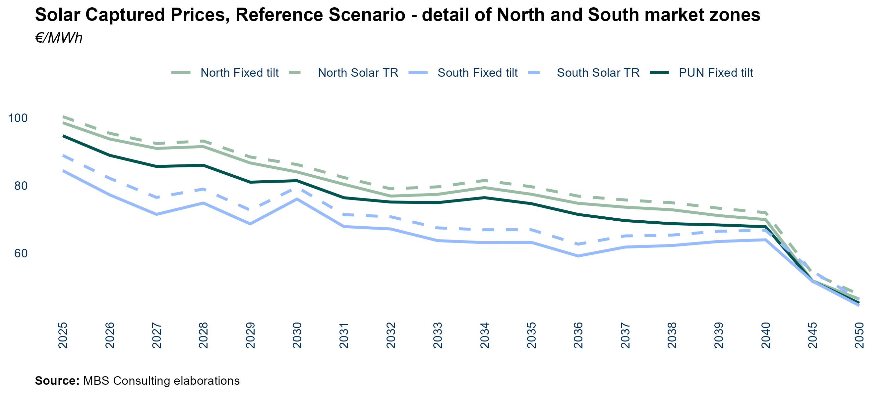

::::: callout-item
::: callout-left
#### 25-26 {.unnumbered}
:::

::: callout-right
Solar power plants stand to benefit from projected moderate increases in
power prices, with captured prices varying between approximately 94€/MWh
and 100€/MWh in the Northern zone, depending on the technology (Tracker
or Fixed Tilt). In the Southern zones, captured prices range between
77€/MWh and 88€/MWh.
:::
:::::

::::: callout-item
::: callout-left
#### 27-30 {.unnumbered}
:::

::: callout-right
The accelerating rate of RES installations, along with the resulting
cannibalization and overgeneration effects --- only partially mitigated
by energy storage systems and grid improvements --- is influencing zonal
captured prices. These prices are diverging from baseload prices and are
projected to fall below 90 €/MWh by 2030, even in the Northern zones.
:::
:::::

::::: callout-item
::: callout-left
#### 31-50 {.unnumbered}
:::

::: callout-right
The growing frequency of overgeneration highlights the need for
energy-intensive storage systems to partially mitigate the
cannibalization effect. After 2030, this effect intensifies for solar
captured prices, especially in Southern market zones with higher
renewable penetration, driving long-term prices below 50 €/MWh in both
Northern and Southern regions.
:::
:::::

::::: callout-wrap
::: callout-left
#### Main updates {.unnumbered}
:::

::: callout-right
Short-term outcomes are driven by shifts in commodity prices and power
demand projections, influencing power prices.
:::
:::::

\newpage

### Wind Captured Prices

::: callout-main
**WIND GENERATION IS LESS CONCENTRATED THAN SOLAR PRODUCTION, WITH ITS
OUTPUT MORE EVENLY DISTRIBUTED ACROSS BOTH SEASONS AND HOURS OF THE DAY.
THIS BROADER DISTRIBUTION ENABLES CAPTURED PRICES TO MATCH --- OR EVEN
SURPASS --- BASELOAD PRICES**
:::


::::: callout-item
::: callout-left
#### 25-26 {.unnumbered}
:::

::: callout-right
Captured prices are closely aligned with zonal baseload prices and
benefit from a modest uptick in power prices, with values nearing 100
€/MWh across all zones.
:::
:::::

::::: callout-item
::: callout-left
#### 27-50 {.unnumbered}
:::

::: callout-right
Captured prices remain closely aligned with zonal baseload prices over
the long term. Increased solar production leads to overgeneration in the
early 2030s, but outcomes for both sources are shaped more by zonal
market dynamics than price trends. By 2030, captured prices exceed 95
€/MWh in the Northern zones and approach 90 €/MWh in the South,
supported by a more balanced production profile across the day and year.
:::
:::::

::::: callout-wrap
::: callout-left
#### Main updates {.unnumbered}
:::

::: callout-right
Short-term outcomes are driven by shifts in commodity prices and power
demand projections, influencing power prices.
:::
:::::

\newpage

### Investment costs and IRR of Solar and Wind

::: callout-main
**INTENSE COMPETITION IN THE PV MODULES MARKET DRIVES DOWN INVESTMENT
COSTS FOR SOLAR IN THE MID AND LONG TERM, EVEN THOUGH GRID CONNECTION
AND LAND COSTS MAY RISE. HIGHER TECHNOLOGY COSTS FOR WIND**
:::


::::: callout-item
::: callout-left
#### Solar {.unnumbered}
:::

::: callout-right
The high competition in the PV modules market, predominantly led by
Chinese manufacturers, has driven the costs of PV modules down to around
€150,000 per MW. Nearly 30% of the total cost for a module is attributed
to polysilicon, a relatively inexpensive but highly volatile material.
Other critical materials with high demand and low availability, such as
silver, could potentially increase the price of the technology in the
future. Generally, due to market competitiveness, PV modules account for
only 15% of the total solar CAPEX. Two significant costs impact the
total CAPEX for solar technologies. The cost of connecting to the grid,
which varies greatly by project, is expected to rise in the coming
years. This is due to the increasing number of projects in remote
locations, complicating high-voltage grid connections. Additionally, the
cost of land acquisition or rental, which constitutes nearly 8% of the
total cost, has increased in recent years. The anticipated acceleration
of new installations in the coming years may further drive up land
demand for solar projects, as available sites diminish, thereby
increasing rental costs. This cost structure typically results in an IRR
of around 7% (base case considering South zone, pre-tax captured prices,
30 years time horizon) for solar projects, with regional variations
according to different zonal captured prices. For agri-voltaic projects,
a markup of 20%-40% on the total investment cost must be applied,
leading to a lower expected IRR of around 6%.
:::
:::::

::::: callout-item
::: callout-left
#### Wind {.unnumbered}
:::

::: callout-right
The primary cost for a wind plant is the turbine and inverter, which
account for 60% of the total cost. Grid connection represents 10% of the
wind CAPEX, which is approximately €1.5 million for an onshore wind
project. In the short and mid-term, technology costs are unlikely to
decrease due to the low rate of new installations, which limits the
potential for economies of scale. However, as the technology matures,
particularly in Northern countries where installation rates are higher,
there may be a reduction in technology costs. Despite this, the CAPEX
for a wind project is expected to remain above €1 million until 2040.
This cost structure typically results in an IRR of around 7% (base case
considering South zone, pre-tax captured prices, 20 years time horizon)
for onshore wind projects.
:::
:::::

::::: callout-wrap
::: callout-left
#### Main updates {.unnumbered}
:::

::: callout-right
Cost structure for solar and wind technologies is in line with the
previous update.
:::
:::::

\newpage

### Hydro Run-of-River Captured Prices

::: callout-main
**HYDROPOWER GENERATION IS MORE SENSITIVE TO SEASONAL WATER INFLOWS
TRENDS THAN TO HOURLY VARIABILITY, SO THAT CAPTURED PRICES REMAIN
BASICALLY IN LINE WITH BASELOAD PRICES**
:::


::::: callout-item
::: callout-left
#### 25-26 {.unnumbered}
:::

::: callout-right
Captured prices closely align with zonal baseload prices and benefit
from elevated power prices.
:::
:::::

::::: callout-item
::: callout-left
#### 27-50 {.unnumbered}
:::

::: callout-right
Captured prices are expected to remain closely aligned with zonal
baseload prices in the long term. The overgeneration resulting from
increased solar production significantly influences the early 2030s;
however, the performance of both sources remains more closely tied to
zonal market dynamics than to changes in price structure. Additionally,
both sources benefit from a production profile that is more evenly
distributed throughout the day and across the year.
:::
:::::

::::: callout-wrap
::: callout-left
#### Main updates {.unnumbered}
:::

::: callout-right
Short-term outcomes are backed by the trend in commodity prices and
their impact on power prices. Mid- and long-term results remain
consistent with the previous update
:::
:::::

\newpage

# Ancilliary Services & Fuels Mix

## Ancilliary Services Volumes, Reference Scenario

::: callout-main
**THE DEMAND FOR ANCILLARY SERVICES IS EXPECTED TO REMAIN BELOW RECENT
LEVELS DUE TO CHANGES IN SYSTEM MANAGEMENT STRATEGIES IMPLEMENTED BY THE
TSO AND INVESTMENTS IN GRID INFRASTRUCTURE AT CRITICAL NODES. HOWEVER,
IN THE LONG TERM, THE EXPANSION OF RENEWABLE ENERGY CAPACITY IS LIKELY
TO DRIVE AN INCREASED NEED FOR SYSTEM SERVICES**
:::

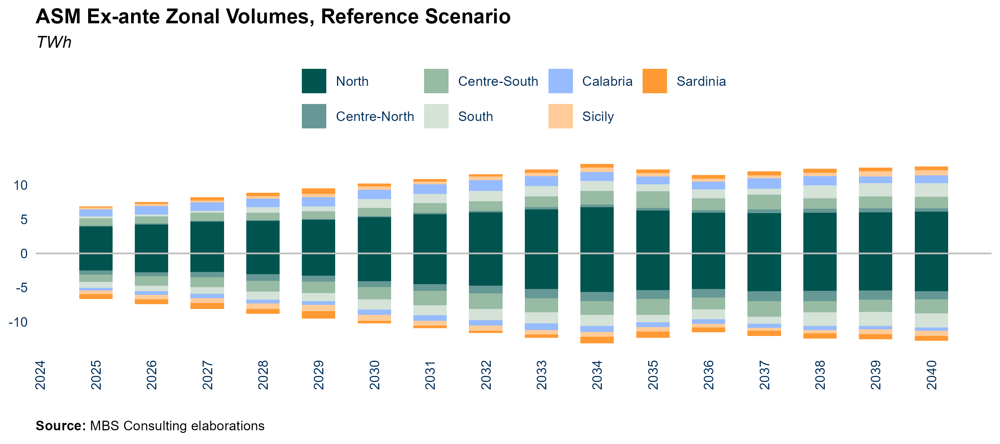

::::: callout-item
::: callout-left
#### 25-26 {.unnumbered}
:::

::: callout-right
Procured ex-ante ancillary services volumes are expected to partially
recover from 2022 but will remain below historical levels due to: (i)
availability of thermoelectric reserves, (ii) changes in network
management practices by Terna since the 2022 cost-containment scheme,
and (iii) feasibility intervals imposed on power plants under the new
Intra-Day Market structure.
:::
:::::

::::: callout-item
::: callout-left
#### 27-30 {.unnumbered}
:::

::: callout-right
The exit of coal-fired units on the mainland and the progressive
increase in the energy mix of renewable production are compensated by
the entry of (i) new thermoelectric and energy intensive storage
capacity sustained by the CM mechanism, and (ii) the diffusion of power
intensive BESS that are going to reduce the need of ex ante scheduling,
given the availability of flexible resources in the system.
:::
:::::

::::: callout-item
::: callout-left
#### 31-50 {.unnumbered}
:::

::: callout-right
The increasing share of renewables in the energy mix will be balanced by
(i) the addition of new thermoelectric capacity and storage systems
supported by the Capacity Market mechanism and MACSE. This is expected
to reduce the need for ex-ante scheduling, thanks to the greater
availability of flexible resources within the system.
:::
:::::

::::: callout-wrap
::: callout-left
#### Main updates {.unnumbered}
:::

::: callout-right
ASM volumes reflect recent structural market trends throughout the
simulated horizon. Upward and downward volumes from our model are
symmetric due to the deterministic simulation approach. The contingent
portion of the balancing market linked to real-time imbalances is not
included in the estimates.
:::
:::::

\newpage

## Ancilliary Services Volumes, Alternative Scenario

::: callout-main
**ANCILLARY SERVICES EX-ANTE VOLUMES EVOLVE ACCORDING TO THE COMPOSITION
OF THE GENERATION MIX AND DAM DYNAMICS IN THE DIFFERENT SCENARIOS. IN
THE POST-2030 SCENARIO, STORAGE SYSTEMS AND GRID REINFORCEMENTS ARE
EXPECTED TO LIMIT THE EXPANSION TREND IN THE THREE SCENARIOS**
:::


::::: callout-item
::: callout-left
#### 25-26 {.unnumbered}
:::

::: callout-right
Procured ex-ante ancillary services volumes are projected to remain low
compared to recent levels in the alternative scenarios as well, with
variations arising from the differing degrees of competition in the
thermoelectric sector within the Day-Ahead Market. This competition
results in varying levels of running reserves.
:::
:::::

::::: callout-item
::: callout-left
#### 27-30 {.unnumbered}
:::

::: callout-right
In the High RES scenario, the swift expansion of non-programmable
renewable generation is mitigated by advancements in grid infrastructure
and the accelerated deployment of energy-intensive storage solutions. In
contrast, the Low RES scenario sees the proliferation of less flexible
resources, thereby increasing the demand for additional volumes in the
Market for Secondary Reserves.
:::
:::::

::::: callout-item
::: callout-left
#### 31-50 {.unnumbered}
:::

::: callout-right
In the High RES scenario, continued grid development and significant
growth in energy-intensive storage assets contribute to limiting ASM
volumes. In contrast, in the Low RES scenario, ASM volumes remain stable
due to a greater presence of CCGT in the Day-Ahead Market and the
continued operation of coal plants until 2035. Additionally, the
development of energy-intensive storage facilitates better regulation of
the system.
:::
:::::

::::: callout-wrap
::: callout-left
#### Main updates {.unnumbered}
:::

::: callout-right
ASM short-term volumes incorporate the variations in commodities level.
:::
:::::

\newpage

## Ancilliary Services Market prices

::: callout-main
**GRID BOTTLENECK RESOLUTION AND THE PENETRATION OF BESS ARE KEY DRIVERS
OF FUTURE COMPETITIVE DYNAMICS IN THE ANCILLARY SERVICES MARKET. THE
CAPACITY MARKET STRIKE PRICE (FOR DELIVERY YEARS) MAY EMERGE AS THE
REFERENCE UPPER PRICE, SIGNIFICANTLY AFFECTING THE CENTRE-SOUTH MARKET
ZONE.**
:::


::::: callout-item
::: callout-left
#### 25-26 {.unnumbered}
:::

::: callout-right
In the delivery years of the Capacity Market's, the strike price is
anticipated to exert a cap on prices for start-up and upward regulation,
particularly in the Centre-South market zone. However, the decline in
ASM volumes may promote increased price competition across Italy
compared to previous years.
:::
:::::

::::: callout-item
::: callout-left
#### 27-50 {.unnumbered}
:::

::: callout-right
Price competition in the ancillary services market is expected to
increase gradually as innovative technological solutions, such as
electrochemical storage, become available at more competitive prices.
Assuming the extension of the capacity remuneration mechanism, the
strike price, along with the Levelized Cost of Storage (LCOS) of
batteries, could emerge as key factors shaping ancillary services prices
in the future.
:::
:::::

::::: callout-wrap
::: callout-left
#### Main updates {.unnumbered}
:::

::: callout-right
Price projections are derived from a statistical approach that analyzes
the historical bidding strategies of market participants in the
ancillary services market. It is assumed that the historical
distributions of price spreads between Day-Ahead Market (DAM) and
ancillary services prices for each type of service will remain constant
in the future. In comparison to the previous release, the updated
short-term price projections for ancillary services now reflect the
impacts of revised assumptions regarding DAM dynamics and prices.
:::
:::::

# Our Suite of Market Models


ELFO ++ suite has been included among the benchmark models for energy
systems' planning in the World Bank database and it is included in the
top list of electricity market simulation models prepared in 2017 by the
Joint Research Center of European Commission. ELFO ++suite and its
database are used for research acvities in numerous universities with
which REF-E has a consolidated collaboration (Florence School of
Regulation, University of Milan-Bicocca, Bocconi University, Milan
Catholic, Milan Polytechnic, Turin Polytechnic, University of Pavia,
University of Padua, University of Verona, others).

# Acronyms


\newpage


