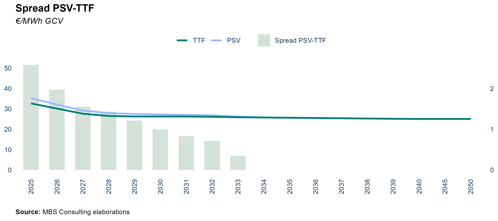
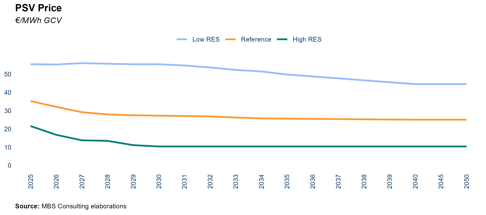
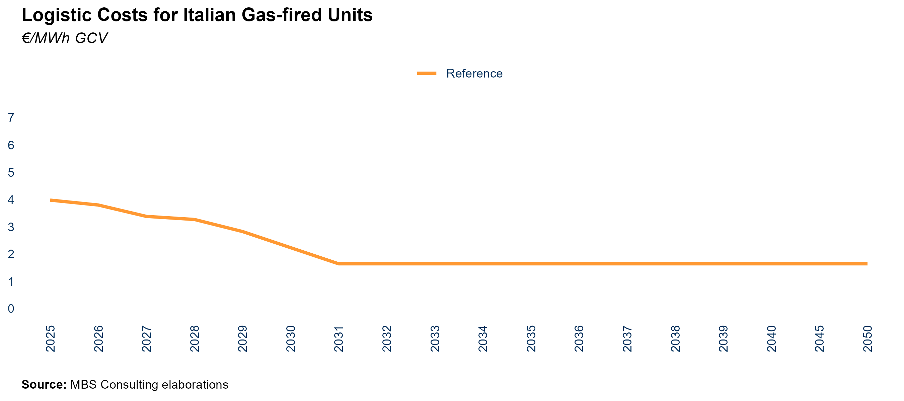
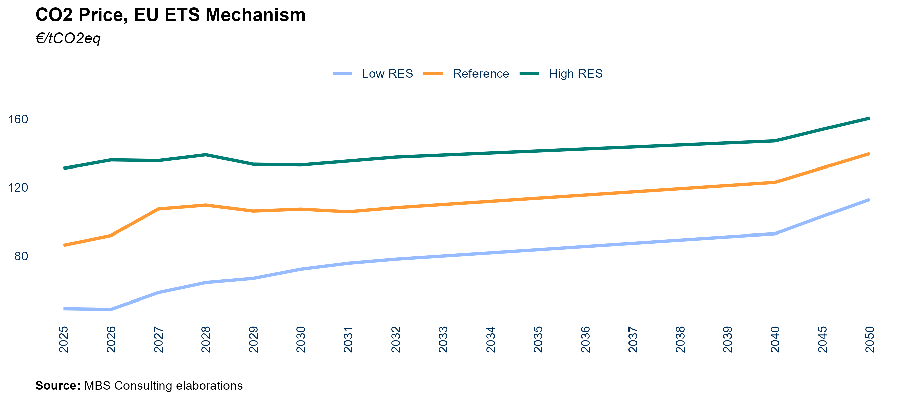
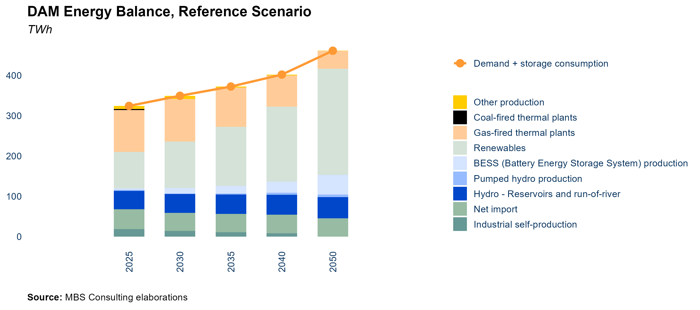
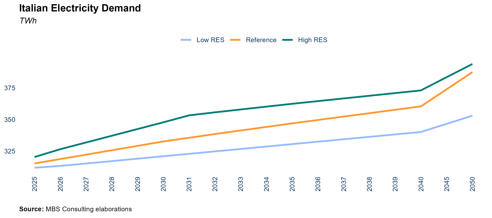
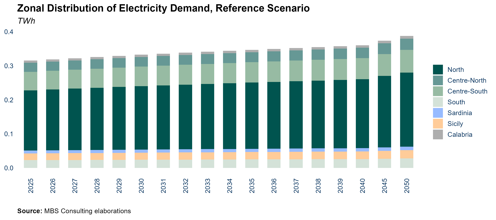
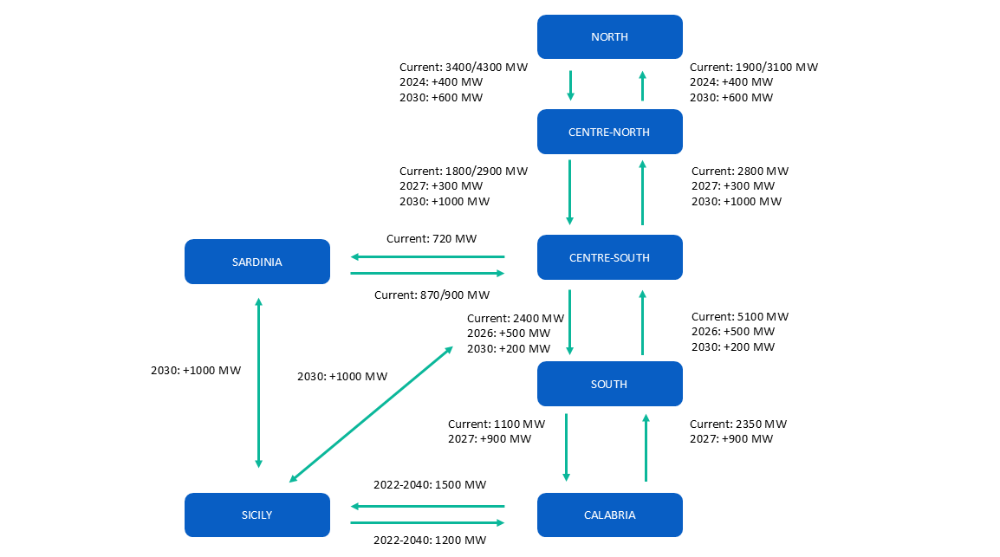
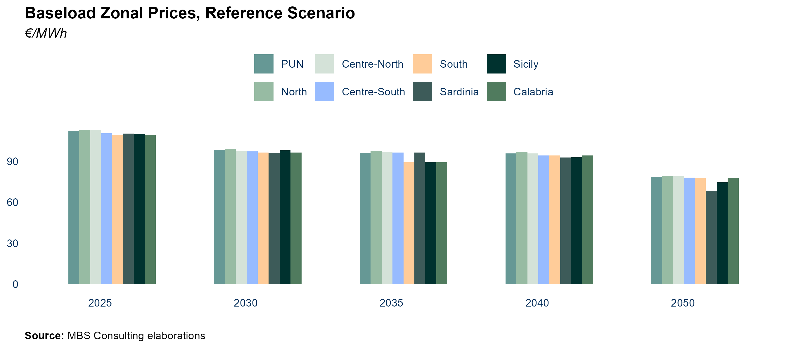
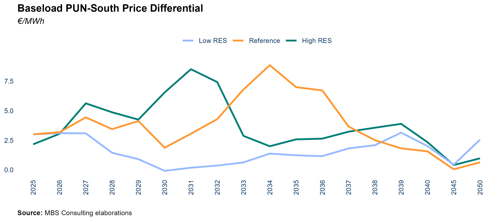

```{r setup, include=FALSE}
knitr::opts_chunk$set(
               echo=FALSE,
	           cache=FALSE,
               prompt=FALSE,
               # tidy=TRUE,
               tidy=FALSE,
               comment=NA,
               message=FALSE,
               warning=FALSE)
options(knitr.kable.NA = '')

library(mbsenergyUtils)

box::use(ggplot2[...],
         magrittr[...],
         data.table[...],
         scales[...],
         flextable[...],
         xl = openxlsx[read.xlsx, getSheetNames])

set_flextable_defaults(
    font.color = "#54565B",
    font.size = 7,
    font.family = 'calibri',
    padding = 2,
    border.color = "#dfe2e5",
    background.color = "whitesmoke",
    split = FALSE,
    theme_fun = "theme_box",
    decimal.mark = ",",
    big.mark = " ",
    na_str = "<NA>")


excel_file = file.path('tables_data', 'tables_report.xlsx')
excel_file_sn = xl$getSheetNames(excel_file)


```

# Frame of Reference

REF-E scenarios over the time horizon 2024-2050 (with projections up to
2060) are elaborated by MBS Consulting experts on the base of
proprietary suites and market knowledge. Econometric and structural
models, as well as our expert sensitiveness, detailed knowledge of
regulation, and accurate monitoring of market outcomes underlie our
elaborations.

Gas and electricity forecasts consider the diverse geopolitical and
economic hypothesis deriving from the regulatory, financial and
fundamentals adjustments to the disruption generated both from the
pandemic and the Ukrainian war, which are seen as key determinants of
the future equilibrium of the energy markets.

Current scenario update incorporates an evolution of climate variables
in line with the historical average trend.

In this perspective, we defined three scenarios:

-   The **High Case scenario** is characterized by permanently high
    fuels and power prices amid negative or zero economic growth
    depressing investments and weighing on the energy transition
    process.\

-   In the **Reference scenario**, is characterized by the energy
    transition process progress leading to a diversification of energy
    sources supported by the existing policies. This, combined with
    efficiency maintains the energy market on a transformation path. The
    economic growth slowly recovers over the next two years.

-   The **Low Case scenario** would materialize in the event of
    favorable weather conditions and a fast energy transition, supported
    by low inflation and a faster economic recovery, reducing power and
    fossil fuels demand over the next few years. This would limit energy
    prices upside potential and then fuel a downward acceleration.


\newpage

## The Outlook for Italy's Energy Market Amid

Regulatory Changes, Geopolitical Tensions, and RES Dynamics

### Key Insights {.unnumbered}

Following the challenging period for European energy markets between
2021 and 2023, the decarbonization of the electricity sector is now
gaining significant momentum, with renewable energy sources driving the
transformation across major European markets. In the first nine months
of 2024, electricity consumption across Europe stabilized, closely
aligning with the average levels recorded in 2023. This stability
occurred despite the ongoing downward trend in demand observed over
recent years. Factors such as slow economic growth, decreased industrial
production, and delays in the electrification process—particularly in
countries like Italy—have continued to suppress demand, especially
within energy-intensive industries. Moreover, widespread adoption of
energy-saving practices and enhanced efficiency measures have further
contributed to the reduction in electricity consumption.


Simultaneously, across most European countries—and similarly in
Italy—the proportion of renewables in the energy mix has reached
historic levels. In the first half of 2024, renewable energy sources
accounted for over 60% of Germany’s electricity consumption,
representing a nearly 10 percentage point rise compared to the same
period in 2023. This growth was primarily fueled by favorable wind
conditions and the significant expansion of photovoltaic (PV) systems.
In Spain, the energy mix was substantially influenced by a rebound in
hydroelectric production and the rapid addition of nearly 6 GW of PV
capacity in 2023. Meanwhile, Switzerland enacted the Federal Act on a
Secure Electricity Supply from Renewable Energy Sources, aiming to
accelerate the deployment of renewables, reduce dependency on nuclear
power, and facilitate electricity exports to Italy. In contrast, France
remains steadfast in its reliance on nuclear energy, which continues to
provide approximately 70% of its total electricity generation.

In Italy, the notable 2023 surge in renewables (with an increase of 5.7
GW compared to the 1.5 GW/year averaged over the last five years) has
continued into 2024, marking further progress on the path to net zero.
In the first eight months of 2024, solar capacity grew by 4.3 GW, with a
monthly growth rate consistent with 2023 and a geographical distribution
of new capacity largely following historical patterns: Lazio led in
installations, followed by Piedmont, Lombardy, Sicily, and Sardinia.
Wind capacity, meanwhile, expanded by just under 500 MW in 2024,
predominantly in the Central and Southern regions, aligning with the
post-2021 trajectory (we recall that 2021 corresponds to the year of the
implementation of the “*Semplificazioni*” Decree). The positive impact
of previous regulatory simplifications in the permitting process is
evident in the advancement of authorized projects: between July and
September 2024, 2.3 GW of solar and wind projects were approved,
predominantly solar, with Puglia, Sicily, and Emilia Romagna at the
forefront. In contrast, permits have experienced a notable slowdown
Lazio and Sardinia, two regions that have led the rankings up to this
point. PAS procedures, whose scope has been broadened by the
“*Semplificazioni*” Decree, accounted for half of the approved capacity,
indicating sustained growth from 2023 on. Nevertheless, RES projects
continue to encounter connection delays, primarily due to the need to
upgrade the power grid’s capacity for increased generation. This also
highlights the importance of simplifying the permitting process.
Streamlining permitting and implementing supportive mechanisms for
distributed generation will be essential for achieving growth in line
with PNIEC targets. The latest draft of the National Energy and Climate
Plan (NECP 2024) reinforces Italy’s ambitious decarbonization goals for
the power sector, aiming for a 63% renewable share by 2030. The
regulatory landscape, however, continues to be riddled with medium- to
long-term uncertainties. The “*Aree Idonee*” Decree, which was
anticipated to expedite the authorization process, has instead
obstructed the growth of renewable energy sources (RES), as regional
authorities impose strict limitations on designated suitable areas. In a
comparable vein, the “*Testo Unico sulle Rinnovabili*” exacerbates the
complexity of the regulatory framework by imposing new qualifications
rather than effectively streamlining the permitting process. Notably,
landscape compatibility assessments have become a requirement for
specific operations that once fell under “*Edilizia libera*” (permitted
development). Furthermore, the evolutions regarding the FerX incentive
scheme amplify the uncertainty associated with the commissioning of RES
plants. As the final version of the FerX remains pending, the MASE has
recently prepared a draft temporary decree, “*FerX Transitorio*”, aimed
at launching the incentive system as quickly as possible. This Decree
establishes a support scheme for renewable sources that is valid only
until December 31, 2025. The most recent update, that is ready to be
submitted to the European Commission for validation,  allocates a quota
of 3 GW specifically for RES plants with direct access to auctions,
alongside 14.65 GW—comprised of 10 GW for solar and 4 GW for wind—for
plants participating in the public auction regime. This quota, which has
already been lowered in response to the ARERA opinion on the Decree,
signifies a notable reduction compared to the contingent set by the
definitive FER X. As for the rest, the scheme retains most of the
stipulations found in the draft of the definitive FER X, including the
exclusion from the auction participation for projects that initiated
construction operations prior to the submission of the auction
participation application. Such a stipulation may potentially hinder the
short-term momentum of plant commissioning. However, the expected impact
of the “FerX Transitorio” will likely depend on the timing of the
auctions, which are currently projected to be delayed unt

Overall, the outlook for renewable energy sources (RES) in Italy appears
promising for the coming years, despite lingering uncertainties. The
momentum gained in 2023, which has continued into early 2024, is
expected to carry through to the latter part of 2024, albeit at a more
gradual pace, stabilizing at around 2.5 GW annually (an average of 2 GW
from solar and 0.5 GW from wind) during the 2025–2026 period. A more
significant acceleration in RES installations is projected from 2027
onward, driven by the FERX initiative. However, under the Reference
scenario, only 50 GW of solar and 16 GW of wind installed capacity are
anticipated by 2030, which falls short of the PNIEC targets of 80 GW and
28 GW, respectively. This discrepancy is attributed to the current
permitting pace, which remains insufficient at approximately 9–10 GW per
year. Should there be a complete simplification of the authorization
procedures, a more efficient permitting process could enable the
installation of 63 GW of solar and 22 GW of wind by 2030 (Low Case
scenario). The recent developments in renewable energy source (RES)
regulations align with improved short-term conditions in the gas market
and an increase in renewable electricity generation. This has
contributed to a downward trend in power prices across Europe since
early 2024, a trend that has recently been intensified by spikes in
electricity demand. The IIIQ 2024 Market Report explores the long-term
risks and opportunities that lie ahead. The analysis identifies
potential pathways to decarbonization while addressing the disparities
between expected market trends and national decarbonization objectives,
underscoring the challenges that must be navigated in the future.
Short-term GDP growth remains modest, primarily driven by a gradual
recovery in industrial production, influenced by wage trends and
anticipated adjustments in monetary policy. In the Reference scenario,
GDP growth is projected to reach 0.4% year-on-year in 2024, followed by
a more robust increase of 1% in 2025, bolstered by expected improvements
in financial conditions. A lackluster industrial sector and subdued
investment are expected to hinder performance in 2024. However, a
relaxation of monetary policy in the latter half of the year, coupled
with favorable wage dynamics, is anticipated to invigorate growth in
2025. In the High case scenario, characterized by ongoing inflationary
pressures, GDP may contract by 0.1% in 2024, followed by a modest
recovery of 0.3% in 2025. In contrast, the Low case scenario—defined by
a quicker disinflation and a resurgence in investments—anticipates GDP
growth of 1.2% in 2024 and 1.6% in 2025. Long-term growth will hinge on
several factors, including the pace of disinflation, the enhancement of
financial conditions, and the effective execution of the National
Recovery and Resilience Plan (NRRP). Both the Reference and Low
scenarios posit that economic growth will thrive on successful NRRP
implementation, a global economic recovery, and expedited green
transition reforms. Conversely, in the High scenario, fiscal pressures
and delays in NRRP execution may impede growth, posing risks to progress
in the green transition.

Gas prices have experienced a slight increase during the summer months
due to heightened geopolitical tensions, approaching the average levels
for the same period in 2023. However, given the current competition in
LNG supplies, along with the status of European domestic gas reserves
and demand, a significant rise in gas prices is deemed unlikely until
the upcoming winter season, barring any further deterioration in
geopolitical conditions. The extended period of low prices is delaying
the construction of liquefaction capacity, which could create renewed
supply-demand imbalances. Nevertheless, the potential for a new bullish
cycle should not be discounted, particularly beginning in the winter of
2025-2026. From 2026 onward, LNG demand growth is projected to slow to
below 5% annually, driven by an increase in renewable energy production
and enhanced energy efficiency measures. A new wave of liquefaction
capacity is expected to come online by 2026, primarily led by the United
States and Qatar, which should significantly alleviate the risk of
market shortages. While current geopolitical tensions have not yet
influenced gas market dynamics in this scenario and are not reflected in
pricing, they remain a critical risk factor that could disrupt
short-term market equilibrium. The persistently low gas demand across
Europe in 2023 has led to storage levels significantly surpassing
historical averages, which has, in turn, contributed to a decline in gas
prices. Without a resurgence in electricity demand to boost
thermoelectric gas consumption, the anticipated demand for storage
injections in 2024 is unlikely to have a substantial impact on gas
prices in the coming months. The Italian gas price remains closely
linked to the European hub, particularly the TTF. However, the temporary
suspension of operations at the OLT facility has disrupted Italian gas
imports, causing near-term projections to reflect greater discrepancies
from the TT

In our Reference scenario, the yearly averages for both PSV and TTF in
2024 stay below 42 €/MWh, reflecting the effects of limited gas demand
recovery, shift towards savings and efficiency reducing pressure on
distribution networks. Additionally, subdued growth in the
energy-intensive sector limits industrial demand, resulting in
lower-than-average thermoelectric gas demand. Delays in the
commissioning of the Ravenna FSRU have tempered expectations for a
recovery in gas demand. The dynamics of the global LNG market continue
to play a crucial role in amplifying price volatility, particularly
during the winter months. In the Low scenario, a more accelerated energy
transition and diminished global gas demand are projected to maintain
prices around 30 €/MWh in 2024, with levels dipping at 20 €/MWh in 2025
and below 20 €/MWh by 2026. Conversely, the High scenario anticipates
that economic stagnation, reduced investment, and geopolitical
instability will push prices above 50 €/MWh by 2025. PSV is expected to
align with the mid-term normalization of European gas prices towards 30
€/MWh by 2030, in the Reference scenario, reflecting a gradual
re-balancing of global gas demand-supply dynamics amid the anticipated
acceleration of the energy transition. In the very long-term PSV price
should converge to an equilibrium of 25 €/MWh in the Reference scenario
and 10 €/MWh in the Low case, while it should settle above 40 €/MWh in
the High scenario.

The formalization of the ETS system reform underscores its essential
role in advancing the decarbonization process. This introduction of new
measures comes in the context of weakened macroeconomic fundamentals, a
prolonged period of low demand, and a bearish trend in CO2 prices since
the second quarter of 2023. Several factors are estimated to have
contributed to this decline in demand, including reduced industrial
production—particularly in energy-intensive sectors—higher energy costs
from the previous year prompting increased savings, elevated inflation
rates, and a restrictive monetary policy adversely affecting economic
growth. In our Reference scenario, the average CO2 price for 2024 is
projected to approach 67 €/ton, propelled by the gradual implementation
of the ETS reform. The planned phase-out of free allowances for the
aviation sector—accounting for 50% of total allowances by 2025—and the
scheduled removal of 90 million permits from the market in 2024 are
expected to drive allowance prices upward as supply diminishes.
Furthermore, the gradual inclusion of the maritime transport sector
starting in 2025 is anticipated to further elevate overall demand, with
prices projected to reach 107 €/ton by 2030. Key concerns center around
the limited demand recovery expected in the next few years due to
sluggish economic growth. The Low case scenario envisions a rapid
economic recovery alongside challenges in decarbonizing hard-to-abate
sectors such as aviation and maritime transport. These dynamics could
lead to a substantial increase in demand, pushing the CO2 price to
exceed 130 €/ton before 2030. Conversely, if further demand disruptions
occur due to high energy costs, reduced industrial output, and delays in
implementing new regulations, the High case scenario may emerge, wherein
ETS prices fail to rebound, remaining below 65 €/ton in the short term
and under 75 €/ton until 2030. The effectiveness of the ETS system is
crucial for achieving long-term emission reduction targets, with the CO2
price projected to exceed 120 €/ton in the Reference scenario by 2040,
potentially rising to just under 150 €/ton in the Low scenario or
nearing 90 €/ton in the High scenario.

In 2023, electricity consumption fell to 306 TWh, marking a 3% decline
from 2022. However, a modest recovery in the macroeconomic outlook for
2024, coupled with increased electrification of end-use consumption, is
projected to raise consumption to 312 TWh in the Reference scenario. In
a more optimistic economic context, consumption could reach 315 TWh, as
indicated in the Low case scenario. Conversely, a more pessimistic
outlook, along with delays in the electrification of final uses, is
anticipated to result in a consumption level of 310 TWh in the High
scenario. In the coming years, supportive economic measures driven by
the NRRP and the realization of electrification potential could create a
divergence in forecasts, with consumption potentially ranging from 327
TWh in the High scenario to 358 TWh in the Low case by 2030. The
Reference case anticipates a more contained efficiency trajectory and
moderate economic growth, projecting electricity demand to reach 339 TWh
by 2030. In the long term, a successful electrification trajectory
combined with a stable economic outlook could drive consumption to 377
TWh by 2040 in the Low scenario. The Reference scenario anticipates a
more moderate increase, projecting consumption at 364 TWh. Conversely,
the structural delays reflected in the High scenario are expected to
result in electricity demand of only 340 TWh. The overall contraction of
electricity demand in European countries, coupled with a recovery in
hydro generation following the severe drought of 2022 and the first half
of 2023, alongside the resurgence of nuclear availability in France, has
contributed to a 15% year-on-year increase in net import flows in 2023,
reaching 53 TWh. During the first nine months of 2024, imports accounted
for 16% of demand in that period, consistent with the same quota from
2023. In the coming years, persistently subdued electricity demand,
combined with the growing installed capacity and generation of renewable
energy sources (RES) across Europe, is expected to sustain steady
imports to Italy, particularly from northern borders. The commissioning
of the new Passio Resia interconnector, linking Austria and Italy with a
capacity of 300 MW, will further enhance inflows from Austria. High
electricity imports to Italy are also bolstered by the PUN, which
remains stable well above other European electricity prices, especially
those in France and Switzerland. Notably, the average spread between the
Italian power price and those of neighboring countries has nearly
doubled over the past five years. As we approach 2030, the consolidation
of these dynamics—coupled with the expansion of RES capacity to meet
projected increases in power demand—supports expectations of
overgeneration across Europe, despite the gradual phase-out of
coal-fired generation on the continent. This trend indicates that
imports will continue to be a cost-effective option in the medium to
long term, reinforcing projections of imports around 45 TWh even beyond
2030.

The grid expansion aligns with Terna’s 2023 Development Plan. In the
Reference scenario, reinforcements are projected to be operational by
the 2020s, with significant improvements to address zonal congestion
expected to be completed in the 2030s, including the Tyrrhenian and
Adriatic links, as well as the initial segments of the Hypergrid. In the
Low scenario, a more rapid adoption of renewable energy would
necessitate the implementation of these major projects even before 2030.
Conversely, the slower transition seen in the High scenario would delay
key investments until the mid-2030s.

By 2030, the Southern zone and the Islands are projected to experience
significant risks of overgeneration and curtailment, underscoring the
urgent need for a substantial increase in new electrochemical storage
projects. The trajectory of storage capacity expansion is closely tied
to the current eligible pipeline, the growth of renewable energy
sources, and grid enhancement plans. While the anticipated expansion of
RES capacity in the Reference scenario falls short of the targets
established by the PNIEC, storage capacity projections are similarly
expected to underperform, reaching approximately 15 GW by 2030. However,
these dynamics may accelerate or decelerate significantly, heavily
influenced by the evolution of RES permitting and deployment trends. In
the Low scenario, we anticipate storage capacity could reach 20 GW,
reflecting a more rapid growth in RES capacity. Long-term development of
battery storage should capitalize on time-shifting applications within
the day-ahead market. Investments in power-intensive electrochemical
batteries could prove financially viable in the medium term, primarily
generating revenue through participation in the balancing phase of the
Ancillary Services Market and long-term capacity remuneration via
specific projects. Investment in merchant energy-intensive storage
batteries is expected to be attractive mainly in the long term, when
time-shifting applications in the day-ahead market become economically
sustainable due to increasing price volatility and instances of
overgeneration. By 2040, our Reference scenario anticipates the
development of up to 29 GW of energy-intensive batteries, with 35 GW
projected in the Low scenario. The regulatory framework is undergoing
significant changes, creating new opportunities for battery storage. The
MACSE mechanism, designed for storage stand alone, offers a regulated
remuneration model in which Terna pays a fixed fee (€/MWh/year) for
capacity provision and allocates 20% of the revenues from balancing
activities to support the storage development. In October, the MASE
approved the rules that regulate this new mechanism. The auctions are
expected to be scheduled in the first half of 2025, with at least six
months before the definition of the auction perimeters and the updating
of economic parameters.

The need to boost energy independence in the decarbonization process at
European level has placed green hydrogen at the forefront of the
European energy strategy (REPowerEU). It is expected to determine the
allocation of substantial funding – way more than the amount currently
earmarked – to accelerate the development of a European hydrogen supply
chain, improving current cost perspectives of green solutions. But
accelerating renewables development poses the risk of structural
overgeneration if the development of BESS does not advance concurrently,
especially in less interconnected regions and have a high intensity of
renewables relative to demand, such as Sardinia and Sicily where
economically viable opportunities for competitive green hydrogen
consolidate starting from 2035.

In 2023, electricity prices experienced a significant decline of 58%
from their peak in 2022, averaging €127/MWh. This downward trend closely
mirrors developments in the gas market, underscoring the dependency of
electricity prices on gas dynamics. The easing of short-term gas market
conditions, coupled with an increase in renewable electricity
production, has exerted consistent downward pressure on power prices
throughout Europe since the year's outset. This trend is anticipated to
persist into 2024, driven by improved conditions in the Italian gas
market and further growth in renewable generation. In this context, the
average PUN is expected to approach €107 €/MWh under the Reference
scenario and €100/MWh in the Low case. However, for 2025 and 2026, we
foresee a potential increase in PUN projections, averaging near
€110/MWh. This anticipated rise can be attributed to two primary
factors: firstly, a recovery in CO2 prices expected in 2025, bolstered
by reforms to the EU ETS; and secondly, the variable logistic costs are
projected to remain around €4/MWh in the short term, as the CRVOS
component—which incentivizes storage injections—remains crucial for
adequate cost coverage (ARERA Resolution 182/2024). This situation may
be further complicated by renewed tensions in the global gas market,
contingent on potential delays in LNG liquefaction capacity development.
Overall, while robust renewable production driven by hydroelectric and
solar energy, high import levels, and moderate consumption continue to
mitigate demand pressures on CCGT gas power plants, the uncertainty
surrounding future logistic costs and inherent risks in the gas market
necessitate a slight upward revision of electricity price projections.
In the Low scenario, a decline in demand and a swift transition toward
renewable technologies are projected to lower prices to €96/MWh. As we
approach 2030, the integration of renewable energy sources into the
energy mix, coupled with further reductions in commodity prices and
gradual improvements in grid infrastructure, is expected to bring prices
down to €73/MWh in the Low case. Conversely, in the Reference scenario,
a partial delay in the decarbonization trajectory and elevated PSV
prices will result in an average price of €105/MWh. In the medium term,
the increasing penetration of renewables, particularly solar energy, is
anticipated to significantly influence peak and off-peak pricing
dynamics post-2030, leading to an inversion of price spreads between
time slots. With a projected slow recovery in electricity demand,
disparities in zonal prices are expected to be limited due to reduced
transit between market zones. Furthermore, substantial electricity
imports from the northern borders will help alleviate congestion.
Average zonal spreads are expected to remain below €1/MWh in the short
term, with the exception of the South and Calabria, which may experience
a gap of €2/MWh. However, beyond 2026, zonal spreads are anticipated to
widen, potentially peaking around €10/MWh in the 2030s, driven by
increasing electricity consumption alongside accelerated renewable
energy development. Over the long term, significant growth in renewable
energy sources within the Southern macro-zone is expected to exert
downward pressure on prices due to the cannibalization effect of solar
technologies. Despite ongoing grid enhancements, bottlenecks between the
northern and southern zones are likely to persist, resulting in
differentiated price levels throughout the 2030s. From 2036 onward,
further grid reinforcements are projected to mitigate inter-zonal
congestion on the mainland; however, critical congestion issues are
expected to remain in the islands.

The Law 11/2024, known as DL Energia, mandates that starting from
January 1st, 2025 final customers will transition to paying zonal prices
based on wholesale market price trends, departing from PUN. The reform
is driven by the necessity to implement Capacity Allocation & Congestion
Management (CACM) rules, which aim to establish a unified European
market by simplifying algorithms, and to create locational signals for
both demand and supply. Many aspects still require clarification,
particularly the methodologies for implementation, which will play a
crucial role in defining the market impact of the reform.

In the recent past, prices for renewable technologies have closely
followed the fluctuations in commodities markets, benefiting from
bullish trends. However, in 2023, prices began to gradually decline,
resulting in an alignment of zonal pricing that reflects the varying
impacts of different energy mixes. Notably, the reduction in coal
generation in Southern zones has led to lower prices compared to those
in the Northern zones. In the short term, price differentials are
expected to remain consistent with last year's outcomes, demonstrating a
general alignment across zones. Looking ahead to 2030, the continued
integration of renewable energy sources (RES) into the energy mix is
projected to exacerbate this disparity, leading to increased price
differentials, particularly in the Southern zones.

In the coming years, a contraction in electricity demand, coupled with
an increase in imports, is expected to impact the competitiveness of gas
plants, diminishing their marginality compared to the peaks observed in
recent years, which were driven by high commodity prices. The captured
CSS for the average CCGT operating at 53% efficiency is projected to
align with 2023 results, approximately €10/MWh, while baseload CSS is
anticipated to average around -€1.2/MWh in 2024 and -€2.5/MWh in 2025.
Post-2025, despite the entry of new thermal capacity through the
Capacity Market, marginality is expected to stabilize at around
€15-€18/MWh due to the retirement of older power plants, the complete
phase-out of coal by 2029, and the ongoing necessity for gas plants to
ensure system adequacy. In the Reference scenario, gas-fired generation
is projected to remain a backbone of the national energy mix even as
renewables ascend to become the primary source of production over the
coming decades, with renewables expected to dominate only after 2031.
The thermoelectric share in the generation mix is likely to decrease
gradually but will remain close to 30% of national electricity needs
until 2040. The evolving market conditions, influenced by geopolitical
tensions and other factors observed over the past two years, along with
changes in market design and regulatory frameworks such as the XBID
initiative and Terna’s Incentive scheme, are reshaping the market
landscape and are expected to permanently alter the revenue structures
for gas-fired power plants. As seen in recent years, the operational
focus for CCGTs is expected to be heavily concentrated—over 80% of total
production—on the Day-Ahead Market, particularly during the ex-ante
phase, which has contracted significantly by 85% compared to 2021
ex-ante volumes. Operational activity has shifted toward the balancing
phase, which remains stable despite Terna’s interventions. As renewable
energy sources increasingly contribute to generation, the Balancing
Market may provide additional support for the marginality of thermal
units. The implementation of TIDE in 2025 may bolster market revenues
for CCGTs by introducing new service remuneration, currently mandatory
under “Riserva Primaria,” and potentially relaxing operational
constraints depending on XBID participation. The evolution of market
regulation and the structure of the generation mix may favor thermal
units within the ASM, thereby supporting their revenues. Furthermore,
the growing need for balancing services arising from the integration of
RES is expected to enhance operational opportunities in the ASM,
particularly in southern regions, where the development of flexible
capacity lags behind demand.

The scenario analysis is complemented by an assessment of the economic
viability of the current thermal generation fleet given the expected
market scenario. This evaluation aims to highlight potential financial
viability challenges that may arise, emphasizing the need to consider
extending a Capacity Remuneration Mechanism solely for existing capacity
or substituting unfinished projects. As noted by Terna in its latest
adequacy report, system adequacy has been at risk over the past three
years, despite the operational capacity market, particularly during
extreme weather conditions such as those experienced in the summer of
2022. The significant reduction in hydroelectric production, combined
with increased unavailability of water-cooled thermal power plants and
limited imported energy due to French nuclear unavailability, has
exacerbated these challenges. The proposed changes are intended for
auctions related to the years 2025-2027, scheduled for the summer of
2024. With the recent DCO 102/2024 published by ARERA, the new capacity
market premium cap should be set higher than in previous auctions to
account for the revised inflation index by the ECB.

The new long-term scenario analysis conducted by MBS reflects the latest
trends in the evolution of the Italian energy system. It aligns with the
Fit-for-55 targets for 2030 and explores potential pathways toward 2050.
Market simulations are extended beyond 2040, employing deterministic
techniques to explicitly model market fundamentals, while incorporating
the recent acceleration in the permitting and deployment of renewable
technologies. All analyses are based on the current market structure and
established rules. The projected trajectory falls short of the Net Zero
targets: by 2050, it is anticipated that only 86% of Italy's electricity
demand will be met by renewable generation, with the remaining demand
supplied by flexible and efficient gas generation, which remains
essential for system adequacy. The further contraction of operating
hours, particularly during morning and evening peaks, underscores the
necessity for an explicit remuneration mechanism to ensure the economic
viability of these gas plants. As renewables are expected to emerge as
the predominant marginal technology, market prices are projected to
become increasingly independent of gas generation costs and more closely
aligned with the Levelized Cost of Electricity (LCOE) of renewable
technologies, particularly as their marginal share reaches 40% of annual
operating hours. To assess price dynamics beyond 2050, specifically
within the 2050-2060 horizon, we assume an extension of 2030 results
while acknowledging the inherent uncertainty associated with available
data for a thorough long-term evaluation. Scenarios for 2040-2060 will
be meticulously analyzed in future updates to facilitate a comprehensive
discussion on the economic sustainability of policy frameworks aimed at
achieving net zero targets.

#### Key market trends in Italy {.unnumbered}


# Key Figures

```{r, net_power}

dt_table = openxlsx::read.xlsx(file.path('tables_data', 'tables_report.xlsx'), sheet = excel_file_sn[1]) %>% 
    setDT() 

vec_sce = names(dt_table)[-1]
vec_colnames = as.character(as.vector(dt_table[1]))

dt_table = dt_table[2:.N]


suffixes = c('', rep("Reference_", 4), rep("Low_", 4), rep('High_', 4))
vec_colnames = paste0(suffixes, vec_colnames)
names(dt_table) = vec_colnames

dt_table[, (vec_colnames[-1]) := lapply(.SD, function(x) {round(as.numeric(x), 1)}), .SDcols = vec_colnames[-1]]

dt_table |> flextable() %>% 
    separate_header() %>%  
    align(align = "center", part = "all") %>% 
    bg(bg = "#8497B0", part = "header") %>% 
    color(part = "header", color = 'white') %>% 
    vline(j = c(1, 5, 9, 13), border = officer::fp_border(color = "#dfe2e5", width = 1), part = "all") %>% 
    bold(i = NULL, j = 1) %>% 
    width(width = 2, j = 1)

```

```{r, balance}

dt_table = openxlsx::read.xlsx(file.path('tables_data', 'tables_report.xlsx'), sheet = excel_file_sn[2]) %>% 
    setDT() 

vec_sce = names(dt_table)[-1]
vec_colnames = as.character(as.vector(dt_table[1]))

dt_table = dt_table[2:.N]


suffixes = c('', rep("Reference_", 4), rep("Low_", 4), rep('High_', 4))
vec_colnames = paste0(suffixes, vec_colnames)
names(dt_table) = vec_colnames

dt_table[, (vec_colnames[-1]) := lapply(.SD, function(x) {round(as.numeric(x), 1)}), .SDcols = vec_colnames[-1]]

dt_table |> flextable() %>% 
    separate_header() %>%  
    align(align = "center", part = "all") %>% 
    bg(bg = "#8497B0", part = "header") %>% 
    color(part = "header", color = 'white') %>% 
    vline(j = c(1, 5, 9, 13), border = officer::fp_border(color = "#dfe2e5", width = 1), part = "all") %>% 
    bold(i = NULL, j = 1) %>% 
    width(width = 2, j = 1)

```

```{r, commodities}

dt_table = openxlsx::read.xlsx(file.path('tables_data', 'tables_report.xlsx'), sheet = excel_file_sn[3]) %>% 
    setDT() 

vec_sce = names(dt_table)[-1]
vec_colnames = as.character(as.vector(dt_table[1]))

dt_table = dt_table[2:.N]


suffixes = c('', rep("Reference_", 4), rep("Low_", 4), rep('High_', 4))
vec_colnames = paste0(suffixes, vec_colnames)
names(dt_table) = vec_colnames

dt_table[, (vec_colnames[-1]) := lapply(.SD, function(x) {round(as.numeric(x), 1)}), .SDcols = vec_colnames[-1]]

dt_table |> flextable() %>% 
    separate_header() %>%  
    align(align = "center", part = "all") %>% 
    bg(bg = "#8497B0", part = "header") %>% 
    color(part = "header", color = 'white') %>% 
    vline(j = c(1, 5, 9, 13), border = officer::fp_border(color = "#dfe2e5", width = 1), part = "all") %>% 
    bold(i = NULL, j = 1) %>% 
    width(width = 2, j = 1)

```

```{r, electricity_prices}

dt_table = openxlsx::read.xlsx(file.path('tables_data', 'tables_report.xlsx'), sheet = excel_file_sn[4]) %>% 
    setDT() 

vec_sce = names(dt_table)[-1]
vec_colnames = as.character(as.vector(dt_table[1]))

dt_table = dt_table[2:.N]


suffixes = c('', rep("Reference_", 4), rep("Low_", 4), rep('High_', 4))
vec_colnames = paste0(suffixes, vec_colnames)
names(dt_table) = vec_colnames

dt_table[, (vec_colnames[-1]) := lapply(.SD, function(x) {round(as.numeric(x), 1)}), .SDcols = vec_colnames[-1]]

dt_table |> flextable() %>% 
    separate_header() %>%  
    align(align = "center", part = "all") %>% 
    bg(bg = "#8497B0", part = "header") %>% 
    color(part = "header", color = 'white') %>% 
    vline(j = c(1, 5, 9, 13), border = officer::fp_border(color = "#dfe2e5", width = 1), part = "all") %>% 
    bold(i = NULL, j = 1) %>% 
    width(width = 2, j = 1)

```

```{r, zonal_prices}

dt_table = openxlsx::read.xlsx(file.path('tables_data', 'tables_report.xlsx'), sheet = excel_file_sn[5]) %>% 
    setDT() 

vec_sce = names(dt_table)[-1]
vec_colnames = as.character(as.vector(dt_table[1]))

dt_table = dt_table[2:.N]


suffixes = c('', rep("Reference_", 4), rep("Low_", 4), rep('High_', 4))
vec_colnames = paste0(suffixes, vec_colnames)
names(dt_table) = vec_colnames

dt_table[, (vec_colnames[-1]) := lapply(.SD, function(x) {round(as.numeric(x), 1)}), .SDcols = vec_colnames[-1]]

dt_table |> flextable() %>% 
    separate_header() %>%  
    align(align = "center", part = "all") %>% 
    bg(bg = "#8497B0", part = "header") %>% 
    color(part = "header", color = 'white') %>% 
    vline(j = c(1, 5, 9, 13), border = officer::fp_border(color = "#dfe2e5", width = 1), part = "all") %>% 
    bold(i = NULL, j = 1) %>% 
    width(width = 2, j = 1)

```

```{r, cp_pv_fx}

dt_table = openxlsx::read.xlsx(file.path('tables_data', 'tables_report.xlsx'), sheet = excel_file_sn[6]) %>% 
    setDT() 

vec_sce = names(dt_table)[-1]
vec_colnames = as.character(as.vector(dt_table[1]))

dt_table = dt_table[2:.N]


suffixes = c('', rep("Reference_", 4), rep("Low_", 4), rep('High_', 4))
vec_colnames = paste0(suffixes, vec_colnames)
names(dt_table) = vec_colnames

dt_table[, (vec_colnames[-1]) := lapply(.SD, function(x) {round(as.numeric(x), 1)}), .SDcols = vec_colnames[-1]]

dt_table |> flextable() %>% 
    separate_header() %>%  
    align(align = "center", part = "all") %>% 
    bg(bg = "#8497B0", part = "header") %>% 
    color(part = "header", color = 'white') %>% 
    vline(j = c(1, 5, 9, 13), border = officer::fp_border(color = "#dfe2e5", width = 1), part = "all") %>% 
    bold(i = NULL, j = 1) %>% 
    width(width = 2, j = 1)

```

```{r, cp_pv_tr}

dt_table = openxlsx::read.xlsx(file.path('tables_data', 'tables_report.xlsx'), sheet = excel_file_sn[7]) %>% 
    setDT() 

vec_sce = names(dt_table)[-1]
vec_colnames = as.character(as.vector(dt_table[1]))

dt_table = dt_table[2:.N]


suffixes = c('', rep("Reference_", 4), rep("Low_", 4), rep('High_', 4))
vec_colnames = paste0(suffixes, vec_colnames)
names(dt_table) = vec_colnames

dt_table[, (vec_colnames[-1]) := lapply(.SD, function(x) {round(as.numeric(x), 1)}), .SDcols = vec_colnames[-1]]

dt_table |> flextable() %>% 
    separate_header() %>%  
    align(align = "center", part = "all") %>% 
    bg(bg = "#8497B0", part = "header") %>% 
    color(part = "header", color = 'white') %>% 
    vline(j = c(1, 5, 9, 13), border = officer::fp_border(color = "#dfe2e5", width = 1), part = "all") %>% 
    bold(i = NULL, j = 1) %>% 
    width(width = 2, j = 1)

```

```{r, cp_wind_on}

dt_table = openxlsx::read.xlsx(file.path('tables_data', 'tables_report.xlsx'), sheet = excel_file_sn[8]) %>% 
    setDT() 

vec_sce = names(dt_table)[-1]
vec_colnames = as.character(as.vector(dt_table[1]))

dt_table = dt_table[2:.N]


suffixes = c('', rep("Reference_", 4), rep("Low_", 4), rep('High_', 4))
vec_colnames = paste0(suffixes, vec_colnames)
names(dt_table) = vec_colnames

dt_table[, (vec_colnames[-1]) := lapply(.SD, function(x) {round(as.numeric(x), 1)}), .SDcols = vec_colnames[-1]]

dt_table |> flextable() %>% 
    separate_header() %>%  
    align(align = "center", part = "all") %>% 
    bg(bg = "#8497B0", part = "header") %>% 
    color(part = "header", color = 'white') %>% 
    vline(j = c(1, 5, 9, 13), border = officer::fp_border(color = "#dfe2e5", width = 1), part = "all") %>% 
    bold(i = NULL, j = 1) %>% 
    width(width = 2, j = 1)

```

```{r, cp_wind_off}

dt_table = openxlsx::read.xlsx(file.path('tables_data', 'tables_report.xlsx'), sheet = excel_file_sn[9]) %>% 
    setDT() 

vec_sce = names(dt_table)[-1]
vec_colnames = as.character(as.vector(dt_table[1]))

dt_table = dt_table[2:.N]


suffixes = c('', rep("Reference_", 4), rep("Low_", 4), rep('High_', 4))
vec_colnames = paste0(suffixes, vec_colnames)
names(dt_table) = vec_colnames

dt_table[, (vec_colnames[-1]) := lapply(.SD, function(x) {round(as.numeric(x), 1)}), .SDcols = vec_colnames[-1]]

dt_table |> flextable() %>% 
    separate_header() %>%  
    align(align = "center", part = "all") %>% 
    bg(bg = "#8497B0", part = "header") %>% 
    color(part = "header", color = 'white') %>% 
    vline(j = c(1, 5, 9, 13), border = officer::fp_border(color = "#dfe2e5", width = 1), part = "all") %>% 
    bold(i = NULL, j = 1) %>% 
    width(width = 2, j = 1)

```

# Macroeconomic Context

## GDP

::: callout-main
**GDP GROWTH IN THE SHORT TERM REMAINS SUBDUED, WITH A MODERATE RECOVERY
IN INDUSTRIAL PRODUCTION ANTICIPATED, SUPPORTED BY WAGE DYNAMICS AND THE
EASING OF MONETARY POLICIES. IN THE MEDIUM AND LONG TERM, GROWTH
PROSPECTS ARE PRIMARILY DRIVEN BY THE PATH OF DISINFLATION, EASING
FINANCING CONDITIONS, AND THE IMPLEMENTATION OF THE NRRP**
:::


::: callout-item
::: callout-left
#### 24-25 {.unnumbered}
:::

::: callout-right
The reference scenario predicts a 0.4% year-on-year GDP growth in 2024,
with a stronger increase of 1% in 2025, driven by an anticipated easing
of financial conditions. A gradual easing of monetary policies in the
second half of the year, along with positive wage dynamics, should
contribute to growth in 2025. In the worst-case scenario, if
inflationary pressures persist, GDP is projected to decline by 0.1%
year-on-year in 2024 and see a modest increase of 0.3% in 2025.
Conversely, the best-case scenario, characterized by accelerated
disinflation and a recovery in investments, would result in GDP growth
of up to 1.2% in 2024 and 1.6% in 2025.
:::
:::

::: callout-item
::: callout-left
#### 26-30 {.unnumbered}
:::

::: callout-right
In our Reference and Best scenarios, economic growth would gradually
realign to the previously projected path, sustained by the effective
implementation of the NRRP measures, the recovery of the global economy,
and an acceleration of the green transition reforms.
:::
:::

::: callout-item
::: callout-left
#### 31-50 {.unnumbered}
:::

::: callout-right
In the long-term, our Reference and Best-case scenarios remain anchored
to the assumption of a stabilization of the yearly GDP growth rate in
the 1-2% interval, while in the Worst scenario, GDP growth continues to
discount the effects of the failure of key investments.
:::
:::

::: callout-wrap
::: callout-left
#### Main updates {.unnumbered}
:::

::: callout-right
Short-term GDP projections were revised upward, as a faster than
expected disinflation and the probable easing of monetary policies
combined with positive wage dynamics contribute to GDP growth.
:::
:::

## Inflation rate

::: callout-main
**THE PERSISTENCE OF THE ENERGY PRICES NORMALIZATION IS DRIVING THE
GENERAL PRICE INDEX DECLINE, WITH ITS REDUCTION BEGINNING TO TRANSMIT
ALSO TO THE CORE INDEX. MONETARY POLICY TIGHTENING PROVED TO BE
EFFECTIVE IN LIMITING INFLATIONARY PRESSURES AND KEEPING MEDIUM AND LONG
TERM EXPECTATIONS UNDER CONTROL**
:::


::: callout-item
::: callout-left
#### 24-25 {.unnumbered}
:::

::: callout-right
Inflation is expected to remain close to 2% both in 2024 and 2025, with
the ongoing disinflation path expected to gradually ease as the
carry-over effect of declining energy prices diminish and the monetary
policy stance reverts. Since mid-2024, the European Central Bank and the
Federal Reserve have indeed approved the first cuts to reference rates
to support investments, following the reduction in inflation risk. The
path to monetary normalization remains uncertain, though, as the
decisions of the two Central Banks are highly dependent on economic
outcomes. Geopolitical uncertainty could further weigh on the inflation
outlook, as new disruptions in the production and transportation chains
of imported goods may increase pressure on inflation.
:::
:::

::: callout-item
::: callout-left
#### 26-30 {.unnumbered}
:::

::: callout-right
Still relatively high interest rates are seen as proving effective in
guiding inflation back to 2% in the short term. Our scenario foresees a
stabilization at 2% in the second part of the decade, even with a
gradual easing of monetary policy, although the risk of further pressure
on prices due to the expected easing of monetary policy.
:::
:::

::: callout-item
::: callout-left
#### 31-50 {.unnumbered}
:::

::: callout-right
Long-term assumptions envisage the inflation rate to stabilize at around
2%, in line with the ECB’s medium term inflation target.
:::
:::

::: callout-wrap
::: callout-left
#### Main updates {.unnumbered}
:::

::: callout-right
Short-term inflation rates remained in line with our previous market
update.
:::
:::

\newpage

# Commodities

## Natural Gas

### LNG

::: callout-main
**GLOBAL LNG DEMAND IS SEEN AS GROWING STEADY IN THE SHORT TERM, WITH A
NOTABLE DISPARITY IN GROWTH RATE SHOWCASED BETWEEN THE ASIAN AND
EUROPEAN BLOCS. DELAYS IN THE CONSTRUCTION OF LIQUEFACTION AND
REGASIFICATION CAPACITY, INDUCED BY LOW PRICES, COULD TRANSLATE IN
RENEWED DEMAND-SUPPLY TENSIONS IN 2025-2026. THERE IS A HIGH PROPABILITY
OF AN OVERSUPPLED MARKET POST-2026 LAYING THE GROUNDWORK FOR LNG PRICES
NORMALIZING IN THE MEDIUM TO LONG-TERM**
:::


::: callout-item
::: callout-left
#### 24-25 {.unnumbered}
:::

::: callout-right
Global LNG demand growth is forecasted to grow with an average growth
rate close to 5% in 2024, with a possible acceleration in 2025 led by
regasification capacity in full swing worldwide. European and Chinese
gas demand will primarily drive this uprise, as LNG intake is expected
to accelerate in the short-term, in response to expansion of
regasification capacity, and to support the transition from coal.
Despite 2024 LNG supply growth being limited globally, reduced
competition between Europe and Asia, and the expected new capacity
entering the market in 2025, are likely to guarantee adequate demand
coverage. Should new liquefaction plants construction and FIDs suffer
further delays, renewed tensions could emerge in winter 2025-2026
leading to price upswings.
:::
:::

::: callout-item
::: callout-left
#### 26-30 {.unnumbered}
:::

::: callout-right
Starting from 2026, LNG demand growth is expected to gradually slowdown,
stabilizing just below 5% y/y, consistently with rising renewable energy
production and improved energy efficiency measures. Conditional on the
lack of further delays, a new wave of liquefaction capacity will enter
the market by 2026, driven by US and Qatar, contributing to almost
eliminating the risk of market tightness.
:::
:::

::: callout-item
::: callout-left
#### 31-50 {.unnumbered}
:::

::: callout-right
In the long-term, pressure on the LNG market is expected to ease, with
new capacity growing and green energy commitments becoming effective.
:::
:::

::: callout-wrap
::: callout-left
#### Main updates {.unnumbered}
:::

::: callout-right
Global LNG demand growth remains consistent with our prior market
assessment.
:::
:::

\newpage

### TTF Price

::: callout-main
**THE PROBABILITY OF DEMAND RETURNING TO PRE-CRISIS LEVELS IN THE NEXT
THREE YEARS IS CONSIDERED LOW, AS THE SAVINGS MEASURES ADOPTED IN
RESPONSE TO THE RUSSIAN GAS DISRUPTION HAVE LED TO STRUCTURAL SHIFTS. IN
THE LONGER TERM, WE EXPECT ADDITIONAL DEMAND DECLINES DUE TO EUROPE'S
DECARBONIZATION EFFORTS, RESULTING IN A LOWER TTF PRICE TREND
APPROACHING €25/MWH. THAT SAID, PRICE PRESSURES AND VOLATILITY SURGES,
PARTICULARLY DURING THE WINTER MONTHS, MAY STILL ARISE IN THE COMING
YEARS**
:::


::: callout-item
::: callout-left
#### 24-25 {.unnumbered}
:::

::: callout-right
In our Reference scenario, the TTF yearly average for 2024 and 2025 is
projected to remain below €40/MWh, with subdued demand putting downward
pressure on prices. Europe's LNG import capacity is poised to expand by
a further 30 Bcm in 2024, enabling additional LNG arrivals, which will
be crucial for maintaining market equilibrium in the short-term and
structurally adapting to the absence of Russian piped gas supplies.
:::
:::

::: callout-item
::: callout-left
#### 26-30 {.unnumbered}
:::

::: callout-right
From 2026 onwards, a further normalization is anticipated as a result of
the significant deployment of new liquefaction capacity. Assuming a
progressive growth of global LNG supplies alongside an acceleration of
the energy transition, European gas prices are projected to steadily
decrease towards 30 €/MWh by 2028.
:::
:::

::: callout-item
::: callout-left
#### 31-40 {.unnumbered}
:::

::: callout-right
The European decarbonization process would keep reducing gas demand,
successively pressuring the price action back towards the 25 €/MWh
long-term equilibrium. Only in the High scenario, persisting
geopolitical and commercial tensions would leave commodities shortages
unresolved, leaving prices just below 45 €/MWh in the long-term.
Effective green policies supported by economic growth may lead prices
significantly lower in the Low scenario, with the TTF averaging near 10
€/MWh in the long-term.
:::
:::

::: callout-wrap
::: callout-left
#### Main updates {.unnumbered}
:::

::: callout-right
TTF gas price projections remain in line with our previous market
update. However, increasing geopolitical tensions are expected to exert
pressure on global gas prices.
:::
:::

\newpage

### Spread TTF-PSV

::: callout-main
**IN THE SHORT-TO-MEDIUM TERM THE PSV GAS PRICE IS ANTICIPATED TO
MAINTAIN A PREMIUM COMPARED TO THE TTF, FOLLOWING THE NEED FOR NORTHERN
EUROPE GAS FLOWS TO COMPENSATE FOR THE INTERRUPTION OF RUSSIAN PIPED GAS
SUPPLIES. THE TEMPORARY CLOSURE OF THE OLT LNG REGASIFICATION FACILITY
IN ITALY UNTIL THE END OF NOVEMBER 2024 ADDS PRESSURE IN THE VERY
NEAR-TERM. IN THE LONG-TERM, THE REBALANCING OF FLOWS IS SEEN AS LEADING
TO A PROGRESSIVE NARROWING OF THE SPREAD TOWARDS ZERO**
:::



::: callout-item
::: callout-left
#### 24-25 {.unnumbered}
:::

::: callout-right
The PSV-TTF spread is expected to stay just below 3 €/MWh in 2024
following the closure of the OLT LNG regasification facility which
increases the Italy’s reliance on piped gas flows from Norway via *Passo
Gries*. Fluctuations throughout the year are anticipated to be in line
with seasonality.
:::
:::

::: callout-item
::: callout-left
#### 26-30 {.unnumbered}
:::

::: callout-right
Flows from the TAP and Algeria, and LNG arrivals are seen as partially
taking over imports from the North in the medium-term, leading to a
progressive spread closure to below 1 €/MWh by 2030.
:::
:::

::: callout-item
::: callout-left
#### 31-50 {.unnumbered}
:::

::: callout-right
The PSV-TTF spread is foreseen to reabsorb towards zero in the
long-term, with the completion of flows rebalancing from Noth to South
and LNG expected to combine with the underlying decarbonization-induced
demand reduction.
:::
:::

::: callout-wrap
::: callout-left
#### Main updates {.unnumbered}
:::

::: callout-right
PSV-TTF spread is still expected to remain positive in short and medium
term and to reduce progressively towards null in the long-run. A slight
increase in the short-term average PSV-TTF spread follows OLT LNG
regasification facility temporary halt, coherently with our
expectations.
:::
:::

\newpage

### PSV Price

::: callout-main
**THE ITALIAN GAS PRICE CONTINUES TO BE CLOSELY TIED TO THE EUROPEAN HUB
ONE, WITH THE TTF SIGNIFICANTLY AFFECTING PSV TRENDS. HOWEVER, THE
TEMPORARY CLOSURE OF OLT LNG FACILITY LEADS TO SHORT-TERM PROJECTIONS
SUGGESTING WIDER DEVIATIONS FROM THE TTF. IN THE LONG RUN, WE FORESEE
THE PSV TO ALIGN WITH THE EUROPEAN PRICES, TARGETING 30 €/MWH BY 2030**
:::



::: callout-item
::: callout-left
#### 24-25 {.unnumbered}
:::

::: callout-right
We expect the 2024 PSV yearly average to remain below €40/MWh due to
limited recovery in gas demand. The transition towards savings and
efficiency impacts distribution network consumption, while slow growth
in the energy-intensive sector restricts industrial demand, contributing
to below-average thermoelectric gas consumption. Additionally, delays in
the commissioning of the Ravenna FSRU have hindered expectations for gas
demand recovery. Should tensions surrounding LNG and TTF prices reemerge
in winter 2025-2026, the PSV is likely to respond accordingly.
:::
:::

::: callout-item
::: callout-left
#### 26-30 {.unnumbered}
:::

::: callout-right
The PSV is foreseen to follow the European gas prices mid-term
normalization towards 30 €/MWh by year 2030, as a gradual rebalancing of
the global gas demand-supply dynamics should follow the expected
acceleration of energy transition.
:::
:::

::: callout-item
::: callout-left
#### 31-40 {.unnumbered}
:::

::: callout-right
The PSV Reference price is expected to stabilize, aligning to TTF prices
at around 25 €/MWh in the long-term.
:::
:::

::: callout-wrap
::: callout-left
#### Main updates {.unnumbered}
:::

::: callout-right
Our short-term expectations for the European gas hubs prices remain
consistent with our prior market update on the back of the persisting
relaxation of short-term market fundamentals and the significant
slowdown in economic growth in Europe. However, the risk for renewed
tensions in winter 2025-26 and possibly 2026-27 is now seen as not
negligible.
:::
:::

\newpage

### Logistics Costs for Italian Gas-Fired Units

::: callout-main
**GAS LOGISTIC COSTS ARE EXPECTED TO REMAIN HIGH IN THE SHORT-TERM DUE
TO THE INCREASE RELATED TO THE COVERAGE OF STORAGE INJECTIONS ACTIVITY
 IN PARTICULAR. VARIABLE LOGISTIC GAS COSTS SHOULD START GRADUALLY
DECREASING FROM 2028 ONWARDS, FOLLOWING THE EXPECTED GAS PRICES
NORMALIZATION**
:::



::: callout-item
::: callout-left
#### 24-27 {.unnumbered}
:::

::: callout-right
The 2023 logistic cost for Italian gas-fired units averaged 4 €/MWh amid
the increase of the CRVOS (which pays storage injections incentives),
CRVBL (which covers the charges associated with the gas system balancing
activity) and the CVU (which covers variable charges and it’s linked to
the gas price trend) components. The variable logistic cost remains
around 4 €/MWh short-term due to the essential CRVOS component for
storage injection incentives, though thermoelectric producers could
request over 60% exemption from October 2024 (ARERA Resolution
384/2024). The remaining losses stemmed from extra cost derived from
2022 emergency gas purchases to rebuild storages (nearly 5 Bln€) will be
recovered through final customers’ bills over five years. The ARERA
Resolution 263/2024 temporary fixes the CRVBL component (which covers
the charges associated with the gas system balancing activity) equal to
zero from January 2025, as a result of the improved natural gas price
scenario. As a precautionary measure, we assume a gradual return to
historical average levels in the second half of 2025 to account for the
volatility of the current transport cost environment, which reverberates
on prices consequently.
:::
:::

::: callout-item
::: callout-left
#### 28-50 {.unnumbered}
:::

::: callout-right
A gradual normalization of the average variable logistic costs below 4
€/MWh is only expected beyond 2028, coherently with the foreseen
normalization of gas prices and the recovery of the storage-related
losses, nearing 1.6 €/MWh on average by 2030.
:::
:::

::: callout-wrap
::: callout-left
#### Main updates {.unnumbered}
:::

::: callout-right
The variable transport charges forecast incorporates the regulator
interventions to mitigate the recent commodities surge on bills,
compensated by an increase in storages and balancing cost.
:::
:::

\newpage

## EU ETS

### CO2 Allowances Price

::: callout-main
**THE ETS REFORM, TO BE INCORPORATED INTO NATIONAL LEGISTLATION OF EU
MEMBER STATES BY THE END OF 2024, AIMS AT SUPPORTING A RAISE OF THE CO2
PRICE BY TIGHTENING THE EMISSIONS CERTIFICATES MARKET THROUGH A
COMBINATION OF SUPPLY CURTAILMENT AND DEMAND-INCREASING MEASURES. THE
INCLUSION OF NEW SECTORS, SUCH AS THE MARITIME, WILL CONTRIBUTE TO
SUSTAINING THE ENVISIONED PRICE INCREASES**
:::



::: callout-item
::: callout-left
#### 24-25 {.unnumbered}
:::

::: callout-right
In our Reference scenario, the 2024 CO2 price average is projected to
stay near 70 €/ton, driven by the gradual implementation of the ETS
system reform. The phasing out of free allowances for the aviation
sector, reaching 50% of the total in 2025, along with the planned
removal of 90 Mln permits from the market in 2024, are expected to begin
exerting upward pressure on allowances prices by curtailing supply. From
2025 onwards, the progressive inclusion of the maritime transport sector
will further boost overall demand. Concerns remain regarding the
underlying demand recovery, which is anticipated to be limited over the
next couple of years due to a slow economic growth.
:::
:::

::: callout-item
::: callout-left
#### 26-30 {.unnumbered}
:::

::: callout-right
The widening of the supply-demand gap should become evident starting
from 2026, as the maritime sector integrates into the ETS system and the
phasing out of free allowances for aviation reaches full implementation.
In addition, by 2030, the reinforcement of the Market Stability Reserve
and the increase of the Linear Reduction Factor up to 4.4% will
contribute to further tightening the market. As a result, the CO2 price
is expected to accelerate towards 110 €/ton on average by 2030.
:::
:::

::: callout-item
::: callout-left
#### 31-50 {.unnumbered}
:::

::: callout-right
By 2034 the removal of free allowances for sectors covered by the CBAM
will reach full implementation, inducing a further increase in
allowances demand. The long-term targets would hinge upon the effective
efficiency of the ETS System, with the CO2 price expected to exceed 120
€/ton in the Reference scenario by 2040, and potentially accelerate to
just below 150 €/ton in the Low scenario, under the assumption of
stricter decarbonization efforts in Europe to accelerate the prices
increase.
:::
:::

::: callout-wrap
::: callout-left
#### Main updates {.unnumbered}
:::

::: callout-right
Our CO2 price targets remain consistent with our prior market update,
when we took into account a downward revision in the very short term
across all three scenarios, in response to the sharp decline in CO2
prices in evidence in the second half of 2023 and in the first quarter
of 2024. A rebound in allowances demand and, consequently, in average
prices in the post-2024 period, is envisaged.
:::
:::

# Energy Mix

## Day-Ahead Market Energy Balance

### Reference Scenario

::: callout-main
**IN THE SHORT TERM, SUBDUED DEMAND IS INCREASINGLY COVERED BY GROWTH IN
RENEWABLE ENERGY SOURCES (RES) AND NET IMPORT FLOWS. IN THE MID TERM,
GAS-FIRED GENERATION CONTINUES TO SERVE AS THE BACKBONE OF THE ENERGY
MIX, EVEN AS RENEWABLES INCREASE THEIR SHARE. IN THE LONG TERM,
RENEWABLES WILL EMERGE AS THE PRIMARY SOURCE OF ELECTRICITY PRODUCTION,
WITH GAS-FIRED GENERATION PROVIDING ESSENTIAL SUPPORT**
:::



::: callout-item
::: callout-left
#### 24-25 {.unnumbered}
:::

::: callout-right
::: callout-item
The reduction in electricity demand across Europe, combined with
supply-side overgeneration driven by the recovery of nuclear plant
capacity after two years of maintenance and an increase in hydroelectric
production, has led to a rise in electricity imports from the northern
borders. This phenomenon is expected to continue in the short term.
Additionally, the positive trend in the installation of new renewable
energy sources (RES) observed in 2023 and the first half of 2024 is
anticipated to persist, with gas-fired thermal plants maintaining their
role as the marginal source in the energy mix.
:::
:::
:::

::: callout-item
::: callout-left
#### 26-30 {.unnumbered}
:::

::: callout-right
Coal-fired units are set to phase out by 2025, with the exception of
those in Sardinia, which will remain operational until the completion of
the Tyrrhenian Link—projected for 2030 in the Reference scenario and
2029 in the Low case. By 2030, electricity production from renewable
sources is expected to meet approximately 47% of overall demand.
:::
:::

::: callout-item
::: callout-left
#### 31-50 {.unnumbered}
:::

::: callout-right
Renewable energy is projected to become the dominant source in the
energy mix, reaching nearly 70% by 2040 and 85% by 2050. The share of
gas-fired thermal plants in the energy mix is expected to reach 10% by
2050. Favorable market conditions are expected to promote the
development of energy-intensive storage solutions, thereby enhancing
their contribution to the energy mix.
:::
:::

::: callout-wrap
::: callout-left
#### Main updates {.unnumbered}
:::

::: callout-right
::: callout-wrap
Short-term shifts in the production mix reflect updated commodity
prices.
:::
:::
:::

### Low Case Scenario

::: callout-main
**GREATER COMMITMENT TO DECARBONIZATION IN THE EUROPEAN ECONOMY DRIVES
STRONG RENEWABLE ENERGY GROWTH, WHICH IS EXPECTED TO APPROACH THE
CURRENT 2030 PNIEC TARGET, REACHING 55% OF THE ELECTRICITY MIX BY 2030
AND EXCEEDING 85% BY 2050. THIS EXPANSION IN RENEWABLES WILL BE FURTHER
SUPPORTED BY SIGNIFICANT INCREASES IN BATTERY STORAGE CAPACITY**
:::


::: callout-item
::: callout-left
#### 24-25 {.unnumbered}
:::

::: callout-right
A rapid surge in decarbonization efforts is driven by rising commodity
prices, increased EU ETS costs, and streamlined approval processes for
new renewable projects, all of which collectively boost investment in
energy efficiency. The phase-out of coal-fired units across the
peninsula is projected by 2025. Gas-fired thermal plants are expected to
supply up to 34% of national electricity demand by then, with net
electricity imports exceeding 49 TWh.
:::
:::

::: callout-item
::: callout-left
#### 26-30 {.unnumbered}
:::

::: callout-right
By the end of 2028 coal-fired units are entirely phased-out. Falling
renewables' costs and a greater effort to reach decarbonization goals
support renewables development. In 2030 the ratio between renewable
energy and total electricity consumption reach 59%. Improvements in the
electricity grid will facilitate the reduction of electricity imported
from neighborhood countries.
:::
:::

::: callout-item
::: callout-left
#### 31-50 {.unnumbered}
:::

::: callout-right
In the long term, gas-fired thermal plants will remain crucial for
ensuring system security and reliability, but their share in the energy
mix is expected to drop to 15% by 2040 and 6% by 2050, as storage
capacity expands. However, despite progress in storage and grid
enhancements, achieving full renewable integration will encounter
challenges like grid congestion and overproduction. These issues are
likely to highlight the need for increased electrolyzer capacity to
manage surplus renewable energy output effectively.
:::
:::

::: callout-wrap
::: callout-left
#### Main updates {.unnumbered}
:::

::: callout-right
Short-term shifts in the production mix reflect updated commodity
prices.
:::
:::

\newpage

### High Case Scenario

::: callout-main
**A SLOWER ECONOMIC RECOVERY TRANSLATES INTO REDUCED ELECTRICITY DEMAND
AND LOWER INVESTMENTS IN DECARBONIZATION. THE COMPLETION OF KEY GRID
INFRASTRUCTURE PROJECTS FACILITATES THE PHASE-OUT OF COAL UNITS BY 2034,
WHILE RENEWABLES AND BATTERY STORAGE SYSTEMS GRADUALLY EXPAND THEIR
SHARE IN THE ENERGY MIX**
:::


::: callout-item
::: callout-left
#### 24-25 {.unnumbered}
:::

::: callout-right
Coal-fired thermal plants remain a significant power source, but lower
gas prices will increase the share of gas-fired plants to 32% of demand.
Net imports are expected to stabilize at 49 TWh in 2025, reducing coal
generation from 7 TWh in 2024 to to 5 TWh.
:::
:::

::: callout-item
::: callout-left
#### 26-30 {.unnumbered}
:::

::: callout-right
CM-led investments are set to come online, but the phase-out of
coal-fired capacity is delayed until 2035, coinciding with the
completion of significant network investments. By 2030, net imports are
expected to decline to just over 44 TWh, while gas-fired generation will
account for 35% of total electricity demand. Hydroelectric output is
projected to stabilize around 46.5 TWh per year, with renewable energy
sources steadily increasing their share in the energy mix.
:::
:::

::: callout-item
::: callout-left
#### 31-50 {.unnumbered}
:::

::: callout-right
The projected rise in CO2 prices is expected to further erode the
competitiveness of coal generation, leading to its full phase-out by
2035 with the completion of the Tyrrhenian Link. Meanwhile, gas-fired
generation is anticipated to account for 22% of the energy mix by 2050.
The evolving dynamics of the Day-Ahead Market (DAM) and the continued
expansion of renewable energy sources will support the long-term
integration of 10 GW of energy-intensive storage.
:::
:::

::: callout-wrap
::: callout-left
#### Main updates {.unnumbered}
:::

::: callout-right
Short-term shifts in the production mix reflect updated commodity prices
:::
:::

\newpage

## Electricity Demand

::: callout-main
**THE REDUCTION IN ELECTRICITY DEMAND AT THE EUROPEAN LEVEL IS ALSO
EVIDENT IN THE ITALIAN CONTEXT, ALTHOUGH IT REMAINS TO BE SEEN WHETHER
THIS TREND WILL BE STRUCTURAL. IN THE LONG TERM, ELECTRIFICATION AND
EFFICIENCY IMPROVEMENTS IN FINAL CONSUMPTION ARE EXPECTED TO BE THE
PRIMARY DRIVERS OF DEMAND RECOVERY.**
:::



::: callout-item
::: callout-left
#### 24-25 {.unnumbered}
:::

::: callout-right
A modest economic recovery is anticipated over the next two years,
resulting in an increase in electricity demand, projected to reach
nearly 316 TWh by 2025 (+1.1% year-on-year). Positive growth is also
expected in alternative scenarios: in the high case scenario, demand is
estimated at 312 TWh, reflecting a lower rate of economic recovery,
while in the low case scenario, where economic growth is projected to be
more robust, demand could rise to 321 TWh.
:::
:::

::: callout-item
::: callout-left
#### 26-30 {.unnumbered}
:::

::: callout-right
In the Reference case, moderate economic growth is driven by supportive
measures and electrification allowing demand to reach 339 TWh in 2030.
In the Low scenario, stronger economic outlook and system
electrification push demand slightly below 360TWh, while in the High
scenario the lower economic recovery and electrification bring
consumption at 327 TWh.
:::
:::

::: callout-item
::: callout-left
#### 31-50 {.unnumbered}
:::

::: callout-right
After 2030, the gradual electrification of consumption in the
transportation sector and the widespread adoption of heating and cooling
appliances may be offset by efficiency measures in the industrial and
residential sectors. As a result, electricity demand could fall below
370 TWh by 2040. In alternative scenarios, electricity demand is
projected to reach 377 TWh in the low case and 340 TWh in the high case.
:::
:::

::: callout-wrap
::: callout-left
#### Main updates {.unnumbered}
:::

::: callout-right
Electricity demand hypotheses are in line with the previous update.
:::
:::

\newpage

### E-mobility

::: callout-main
**ADDITIONAL ELECTRICITY DEMAND FROM ELECTRIC VEHICLES (EVS) CAN VARY
SIGNIFICANTLY DEPENDING ON THE FUTURE IMPLEMENTATION OF E-MOBILITY
SOLUTIONS IN URBAN AREAS, EMISSIONS REDUCTION TARGETS IN TRANSPORTATION,
AND OVERALL LONG-TERM TRANSPORTATION HABITS**
:::


::: callout-item
::: callout-left
#### 24-40 {.unnumbered}
:::

::: callout-right
Electric vehicle (EV) numbers are projected to reach 1.2 million by
2025, 4.5 million by 2030, and 11.1 million by 2040 in the Reference
scenario, resulting in total consumption of 2 TWh, 7.6 TWh, and 18.7 TWh
from EVs, respectively. In the Low scenario, a more rapid adoption of
electric vehicles is expected to reach 6 million by 2030 and 15 million
by 2040. Conversely, in the High scenario, the development of e-mobility
experiences a 5- to 10-year delay compared to the Reference scenario,
with the target of 4.5 million EVs only being achieved by 2040.
:::

::: callout-left
#### 30 {.unnumbered}
:::

::: callout-right
The NIECP envisages 6.5 million electric vehicles in Italy in 2030 - 4.3
million are pure EVs (BEV: Battery Electric Vehicles) -- accounting for
about 8 TWh of additional electricity demand. In our Reference view we
estimate additional 7.5 TWh to come from BEV and PHEV (Plug-in Hybrid
Electric Vehicle). This means that our hypotheses consider a greater
consumption per EV compared to NIECP figures. Main differences are most
likely connected to the underlying assumptions about e-mobility
applications in cities or long-term transport.
:::
:::

::: callout-item
::: callout-left
#### 31-50 {.unnumbered}
:::

::: callout-right
Despite the recent Green Deal proposals at the EU level regarding
transportation, the uncertainty surrounding the future expansion of a
market still in its early stages of development leads us to assume a
business-as-usual (BAU) trend over the long term, beginning with the
annual level of electric vehicle (EV) additions projected for 2030.
:::
:::

::: callout-wrap
::: callout-left
#### Main updates {.unnumbered}
:::

::: callout-right
E-mobility demand hypotheses are in line with the previous update.
:::
:::

\newpage

### Heating and Cooling

::: callout-main
**THE ADDITIONAL ELECTRICITY DEMAND FOR HEATING AND COOLING WILL DEPEND
ON THE GROWTH RATE OF INSTALLATIONS FOR RESIDENTIAL AND INDUSTRIAL USES,
WHICH MAY BE FURTHER SUPPORTED BY DECARBONIZATION INCENTIVES**
:::


::: callout-item
::: callout-left
#### 24-40 {.unnumbered}
:::

::: callout-right
Heating and cooling (H&C) is projected to represent additional
electricity requirements ranging from 2 TWh to 5 TWh in 2025, 4 TWh to 9
TWh in 2030, and 8 TWh to 17 TWh in 2040, depending on the scenario
analyzed.
:::
:::

::: callout-item
::: callout-left
#### 30 {.unnumbered}
:::

::: callout-right
Our assumptions lead to estimate 6.7 TWh of H&C consumption in 2030, as
per the reference scenario, corresponding to around 1.8 million
installations for civil uses.
:::
:::

::: callout-item
::: callout-left
#### 31-50 {.unnumbered}
:::

::: callout-right
We assume a BAU trend in the long-term horizon, starting from the annual
level of additional installations and consumption reached in 2030.
:::
:::

::: callout-wrap
::: callout-left
#### Main updates {.unnumbered}
:::

::: callout-right
H&C demand hypotheses are in line with the previous update.
:::
:::

\newpage

### Industrial Self-Production and Self-Consumption

::: callout-main
**INDUSTRIAL SELF-CONSUMPTION WILL GRADUALLY DECREASE AS EXISTING ASSETS
REACH END-OF-LIFE AND THE EXEMPTIONS ACCORDED TO CLOSED DISTRIBUTION
SYSTEMS WILL BE AT LEAST PARTIALLY REMOVED**
:::


::: callout-item
::: callout-left
#### 24 {.unnumbered}
:::

::: callout-right
Law 91/2014 affirms that grid and general system tariff components
should be applied to the electricity consumed and not only to the
electricity withdrawn from the public grid. Following this approach, the
exemptions accorded to RIU (Re Interne di Utenza) and SEU (Sistemi
Efficienti di Utenza) and closed distribution systems, and the benefits
currently in force for existing plants related to self-consumption will
be at least partially removed for new subjects/projects that apply for
similar mechanisms.
:::
:::

::: callout-item
::: callout-left
#### 25-50 {.unnumbered}
:::

::: callout-right
The excess of self-produced electricity that is not consumed by the
industrial sites (self-consumption) and is thus sold on the market
(differential between self-production and self-consumption) is expected
to gradually decrease, consistently with the expected end-of-life of
existing power plants that serve industrial sites.
:::
:::

::: callout-wrap
::: callout-left
#### Main updates {.unnumbered}
:::

::: callout-right
Industrial self-production and self-consumption hypotheses are in line
with the previous update. Self-production/consumption hypotheses are the
same in all the three scenarios.
:::
:::

\newpage

### Zonal Distribution of Electricity Demand

::: callout-main
**ZONAL DISTRIBUTION OF ELECTRICITY DEMAND IS ESTIMATED IN LINE WITH
MOST RECENT REGIONAL TRENDS**
:::



::: callout-item
::: callout-left
#### 15-20 {.unnumbered}
:::

::: callout-right
In 2015, the approval of the European guidelines on capacity allocation
and congestion management (CACM) introduced new parameters to be
followed in the zonal configuration review process. In 2018, Terna began
a process to review the zonal configurations in compliance with such
rules.
:::
:::

::: callout-item
::: callout-left
#### 21-onwards {.unnumbered}
:::

::: callout-right
The current zonal configuration derives from the base case proposed by
Terna in compliance with the CACM. Differences compared to the previous
configuration: (i) elimination of the limited production poles, (ii)
inclusion of a new bidding zone corresponding to the Calabria region,
(iii) displacement of the Umbria region from the Centre-North zone to
the Centre-South market zone.
:::
:::

::: callout-item
::: callout-left
#### 24-50 {.unnumbered}
:::

::: callout-right
The zonal distribution of electricity demand is based on historical
regional data published by Terna and subsequent econometric
elaborations. In the Reference case, the zonal distribution of
electricity needs is as follows: North (57%), Central-North (9%),
Central-South (17%), South (7%), Calabria (2%), Sicily (6%), Sardinia
(3%). Slight differences in such figures between the alternative cases
are the result of the econometric elaborations performed.
:::
:::

::: callout-wrap
::: callout-left
#### Main updates {.unnumbered}
:::

::: callout-right
The approach adopted and the distribution quotas is in line with the
previous update.
:::
:::

\newpage

## Net Import

::: callout-main
**THE RECOVERY OF NUCLEAR CAPACITY FROM O&M OPERATIONS INITIATED IN
2022, AN INCREASE IN HYDROPOWER PRODUCTION IN SWITZERLAND, AND A
REDUCTION IN ELECTRICITY DEMAND AT THE EUROPEAN LEVEL WILL RESULT IN
SUSTAINED NET IMPORTS FROM NEIGHBORING COUNTRIES TO THE NORTHERN ZONE.
AS A RESULT, NET IMPORTS ARE EXPECTED TO REACH UP TO 50 TWH BY THE END
OF 2024. AFTER 2029, THE COMPLETION OF A 600 MW POWER INTERCONNECTOR
WITH TUNISIA (MONTEL) WILL BOOST ELECTRICITY EXPORTS**
:::


::: callout-item
::: callout-left
#### 24-25 {.unnumbered}
:::

::: callout-right
Building on the trend observed in 2023 and the first half of 2024, net
imports from neighboring countries are expected to exceed the historical
average. This is primarily driven by the recovery of French nuclear
power production following two years of operation and maintenance
interruptions, increased hydro production in Switzerland, and a general
lag in the recovery of European electricity demand. Net imports are
projected to reach 49.7 TWh in 2024 and are anticipated to remain stable
through 2025, covering almost 16% of electricity demand in the
short-term.
:::
:::

::: callout-item
::: callout-left
#### 26-30 {.unnumbered}
:::

::: callout-right
The combination of consistently low demand and continued growth in
renewable energy capacity across Europe is expected to lead to systemic
overgeneration in the medium term, confirming imports a cost-effective
solution. Net imports are projected to remain steady, averaging around
49 TWh annually through 2029. However, with the activation of the Elmed
interconnection between Sicily and Tunisia by the end of 2028, net
import balance will shrink to around 45 TWh as over 3.5 TWh of
electricity is redirected for export.
:::
:::

::: callout-item
::: callout-left
#### 31-50 {.unnumbered}
:::

::: callout-right
Import levels are expected to remain stable also after 2030, ranging
above 45 TWh. The slight increase in net import seen from 2035 is due to
an estimated reduction (1 TWh ca.) in the export flows towards Tunisia,
following the implementation of the Tunisian system development plan.
:::
:::

::: callout-wrap
::: callout-left
#### Main updates {.unnumbered}
:::

::: callout-wrap
Import hypotheses are in line with the previous update.
:::
:::

\newpage

```{r, include=FALSE}
# ## Capacity from 2024 Capacity Market Auction
# 
# ::: callout-main
# **NEW PROJECTS CONCENTRATED IN THE NORTH ZONE AND SARDINIA, THOSE
# MANIFESTING THE GREATEST ADEQUACY NEEDS. ALL THE NEW GAS-FIRED PROJECTS
# PARTICIPATING TO THE AUCTIONS ARE SUPPOSED TO EXPLOIT THE 1-YEAR BUFFER
# PERMITTED BY THE RULES OF THE MECHANISM**
# :::
# 
# 
# 
# ::: callout-item
# ::: callout-left
# #### NORTH, CNORTH {.unnumbered}
# :::
# 
# ::: callout-right
# 1.7 GW of new high-efficiency gas-fired capacity and almost 0.6 of new
# electrochemical storage capacity have been procured in the North market
# zone, the one which will suffer the most -- under a system adequacy
# point of view -- from the dismission of coal-fired capacity. In the
# Centre-North market zone, about 50 MW of new storage capacity have been
# procured instead.
# :::
# :::
# 
# ::: callout-item
# ::: callout-left
# #### CSOUTH, SOUTH, CALA {.unnumbered}
# :::
# 
# ::: callout-right
# These zones will be interested by the phase-out planned for 2025 as they
# respectively host about 1.8 GW and 2.6 GW of coal-fired capacity.
# However, only 0.4 GW ca. between gas-fired and storage capacity have
# been awarded among the two -- 0.3 GW in Centre-South and the remaining
# capacity in South -- after the competitive procedure. No new projects
# were awarded in Calabria.
# :::
# :::
# 
# ::: callout-item
# ::: callout-left
# #### SICI, SARD {.unnumbered}
# :::
# 
# ::: callout-right
# In Sardinia, coal-fired units will not be substituted by new gas-fired
# generation as the 0.8 GW awarded only come from new storage capacity.
# This could be a cornerstone for the island as the transition path
# embraced would hence neglect natural gas and favor fully electrified
# solutions. In Sicily, the competitive procedure resulted in the
# procurement of just 12 MW of new storage capacity.
# :::
# :::
# 
# ::: callout-wrap
# ::: callout-left
# #### Main updates {.unnumbered}
# :::
# 
# ::: callout-right
# 2024 Capacity Market auction outcomes are based on the data published by
# Terna and recent information regarding construction time.
# :::
# :::
# 
# \newpage
```

\## Thermoelectric Generation

### Installed Capacity, Reference Scenario

::: callout-main
**CAPACITY MARKET AUCTIONS WILL COMPREHENSIVELY BRING 7.3 GW OF NEW
GAS-FIRED CAPACITY BY MID 2025. SARDINIAN COAL-FIRED UNITS TO BE
PHASED-OUT ONLY IN 2029, CONSIDERING THE TYRRHENIAN LINK ENTERING IN
2030**
:::


::: callout-item
::: callout-left
#### 24-25 {.unnumbered}
:::

::: callout-right
2024 CM capacity should enter the market between late 2024 and mid-2025.
:::
:::

::: callout-item
::: callout-left
#### 26-30 {.unnumbered}
:::

::: callout-right
Auction results show also that Sardinia coal-fired capacity will not be
substituted by gas-fired units, as only storage capacity was awarded in
the island. Anyway, while coal-fired plants on the peninsula will be
phased-out after 2025, Sardinia units are expected to operate until the
Tyrrhenian Link infrastructure is fully completed (2030).
:::
:::

::: callout-item
::: callout-left
#### 31-50 {.unnumbered}
:::

::: callout-right
The amount of capacity auctioned through the CM is expected to grant
full system adequacy at least through to 2030. No other thermoelectric
capacity investments are envisaged after the wave of investment brought
by the last CM auctions. Existing CHP power plants continue to support
industrial activities under the assumption of a BAU evolution of the
industrial needs they serve. Some ageing CCGT capacity exit the market.
:::
:::

::: callout-wrap
::: callout-left
#### Main updates {.unnumbered}
:::

::: callout-right
Thermoelectric capacity hypotheses are in line with the previous update.
:::
:::

\newpage

### Installed Capacity, Low Case Scenario

::: callout-main
**CAPACITY MARKET AUCTIONS WILL COMPREHENSIVELY BRING 7.3 GW OF NEW
GAS-FIRED CAPACITY ONLINE BETWEEN MID 2025. SARDINIAN COAL-FIRED UNITS
TO BE PHASED-OUT ONLY IN 2029, CONSIDERING THE TYRRHENIAN LINK ENTERING
IN 2030**
:::


::: callout-item
::: callout-left
#### 24-25 {.unnumbered}
:::

::: callout-right
2024 CM capacity should enter the market between late 2024 and mid-2025.
:::
:::

::: callout-item
::: callout-left
#### 26-30 {.unnumbered}
:::

::: callout-right
Auction results show also that Sardinia coal-fired capacity will not be
substituted by gas-fired units, as only storage capacity was awarded in
the island. Anyway, while coal-fired plants on the peninsula will be
phased-out after 2025, Sardinia units are expected to operate until the
Tyrrhenian Link infrastructure is fully completed (2029).
:::
:::

::: callout-item
::: callout-left
#### 31-50 {.unnumbered}
:::

::: callout-right
No other thermoelectric capacity investments are envisaged after the
wave of investment brought by the last CM auctions. Most of existing CHP
power plants gradually exit the market, substituted by greener
solutions. Some ageing CCGT capacity exit the market following strong
competitive conditions.
:::
:::

::: callout-wrap
::: callout-left
#### Main updates {.unnumbered}
:::

::: callout-right
Thermoelectric capacity hypotheses are in line with the previous update.
:::
:::

\newpage

### Installed Capacity, High Case Scenario

::: callout-main
**CAPACITY MARKET AUCTIONS WILL COMPREHENSIVELY BRING 7.3 GW OF NEW
GAS-FIRED CAPACITY ONLINE BETWEEN 2022 AND EARLY 2025. PHASE-OUT OF
COAL-FIRED UNITS IS POSTPONED UNTIL 2034 WHEN THE TYRRHENIAN LINK
BECOMES OPERATIVE**
:::


::: callout-item
::: callout-left
#### 24-25 {.unnumbered}
:::

::: callout-right
2024 CM capacity should enter the market between late 2024 and mid-2025.
:::
:::

::: callout-item
::: callout-left
#### 26-30 {.unnumbered}
:::

::: callout-right
Thermal capacity expected to be stable in the second half of the decade
in the High scenario.
:::
:::

::: callout-item
::: callout-left
#### 31-50 {.unnumbered}
:::

::: callout-right
No other thermoelectric capacity investments are envisaged after the
wave of investment brought by the last CM auctions. Existing CHP and
CCGT power plants are projected to remain operative. The commissioning
of the Tyrrhenian Link is postponed until 2035, determining a delayed
phase-out of all coal power plants.
:::
:::

::: callout-wrap
::: callout-left
#### Main updates {.unnumbered}
:::

::: callout-right
Thermoelectric capacity hypotheses are in line with the previous update.
:::
:::

\newpage

### Residual Demand for CCGTs

::: callout-main
**EXISTING CCGTS COULD EXCEED 2000 EOH IN THE SHORT TERM, WITH
EXPECTATIONS TO RANGE BETWEEN 2000 AND 1300 EOH IN THE MID- AND
LONG-TERM. THIS VARIATION IS ATTRIBUTED TO THE SIGNIFICANT INCREASE IN
PRODUCTION FROM NEW RENEWABLE ENERGY INSTALLATIONS, ALONG WITH A HIGHER
DEGREE OF COMPETITION INTRODUCED BY NEWLY BUILT CAPACITY FOLLOWING THE
2024-2025 CAPACITY MARKET AUCTIONS.**
:::


::: callout-item
::: callout-left
#### 24-25 {.unnumbered}
:::

::: callout-right
The existing fleet of combined cycle gas turbines (CCGTs) is projected
to average approximately 2200 EOH during the 2024-2025 period,
exhibiting significant zonal variations. In the Northern zone, the load
factor for CCGTs is around 1800 EOH, while the Southern zones show lower
figures, averaging about 1000 EOH. Notably, Calabria stands out with an
average of 3000 EOH.
:::
:::

::: callout-item
::: callout-left
#### 26-30 {.unnumbered}
:::

::: callout-right
After the phase-out of coal-fired units, residual demand is expected to
rebound. However, existing combined cycle gas turbines (CCGTs) will face
significant competition from sustained import levels and new
high-efficiency entrants supported by the capacity market. In the low
scenario, residual demand is further reduced due to the effects of
energy efficiency improvements and increased renewable penetration.
Conversely, in the high scenario, residual demand gradually increases as
switching conditions improve.
:::
:::

::: callout-item
::: callout-left
#### 31-50 {.unnumbered}
:::

::: callout-right
Existing CCGTs (53%-efficiency) stabilize around 2000 EOH. In the Low
scenario, the great renewable penetration influences competitive
dynamics and existing units remain close to 1600 EOH. In the High
scenario, the improvement of switching conditions is hampered by the
high level of imports from abroad, with EOH of existing units over 2000
favored by phase-out after 2035. High-efficiency units stabilize below
the 4800 EOH only in the Low scenario.
:::
:::

::: callout-wrap
::: callout-left
#### Main updates {.unnumbered}
:::

::: callout-right
CCGT residual demand hypotheses are in line with the previous update.
:::
:::

\newpage

### Coal-fired Production

::: callout-main
**THE PHASE-OUT OF COAL-FIRED THERMAL PLANTS IS EXPECTED TO OCCUR IN
2025, EXCEPT FOR THE SARDINIAN PLANTS, WHICH ARE SET TO CLOSE IN 2029.
THIS TIMELINE COINCIDES WITH THE FULL COMPLETION OF THE TYRRHENIAN LINK
IN 2030.**
:::


::: callout-item
::: callout-left
#### 24-25 {.unnumbered}
:::

::: callout-right
The decrease in the electricity demand and favorable switching
conditions are leading to a reduction in the coal production, reaching
1.8 TWh in 2025 in the Reference scenario, and less than 1 TWh in the
Low Scenario. In the High case Scenario, the quota coal production will
amount to 4.7 TWh in 2025.
:::
:::

::: callout-item
::: callout-left
#### 26-30 {.unnumbered}
:::

::: callout-right
The phase-out of coal varies across different scenarios, influenced by
the functionality of the main grid infrastructure, particularly the
Tyrrhenian Link. In the Reference case, only the units in Sardinia will
remain operational beyond 2025 until the Tyrrhenian Link is completed in
2030. In the Low scenario, the complete retirement of coal-powered
plants is expected by 2028. Conversely, in the High scenario,
coal-powered units are projected to continue operating until 2035.
:::
:::

::: callout-item
::: callout-left
#### 31-50 {.unnumbered}
:::

::: callout-right
Coal units remain operative beyond 2030 only in the High scenario, until
the complete phase-out projected in 2035, with the entrance of the
Tyrrhenian Link.
:::
:::

::: callout-wrap
::: callout-left
#### Main updates {.unnumbered}
:::

::: callout-right
Short-term shifts in coal production reflect updated commodity prices
and RES installation projections.
:::
:::

\newpage

## Reneweable Generation

### Renewable Installed Capacity

::: callout-main
**THE SIGNIFICANT INCREASE IN RENEWABLE ENERGY SOURCE (RES) CAPACITY
OBSERVED IN THE PAST YEAR IS EXPECTED TO CONTINUE IN THE SHORT TERM. IN
THE LONG TERM, RES MARKET PARITY WILL BE STRENGTHENED BY RISING
COMMODITY PRICES AND THE ACTIONS TAKEN TO MEET DECARBONIZATION TARGETS**
:::


::: callout-item
::: callout-left
#### 24-27 {.unnumbered}
:::

::: callout-right
By the end of the year, 36 GW of solar and 13 GW of wind capacity are
expected to be operational. The potential for renewable energy
development is assessed based on recent trends, considering both
bureaucratic and technical obstacles. This analysis projects an increase
of 6.5 GW in solar capacity and 1.7 GW in wind capacity between the end
of 2024 and 2027. These estimates are aligned with the installation
growth trends observed in recent years, driven by the joint impact of
the normative simplification of the permitting process brought about by
the "Semplificazioni Decree", Fer 1 incentives, signed PPAs, and
merchant projects.
:::
:::

::: callout-item
::: callout-left
#### 27-30 {.unnumbered}
:::

::: callout-right
Market parity conditions, coupled with the FerX incentive scheme, are
expected to accelerate the achievement of long-term targets. In the
Reference scenario, an ambitious renewable energy expansion plan
foresees the addition of 51 GW of solar and 16 GW of wind capacity by
2030, driving the RES share to nearly 50% of total energy demand. This
scenario assumes a market-driven evolution. In the Low scenario, faster
declines in technology costs and more favorable economic conditions push
capacity growth further, resulting in 63 GW of solar and 21 GW of wind
capacity by 2030.
:::
:::

::: callout-item
::: callout-left
#### 31-50 {.unnumbered}
:::

::: callout-right
The Reference scenario forecasts a steady increase in renewable energy
penetration, with solar capacity projected to reach 80 GW and wind
capacity 27 GW by 2040. Accelerating progress towards long-term
decarbonization goals may be achievable through higher-than-expected
investments in grid infrastructure and advanced energy storage
solutions.
:::
:::

::: callout-wrap
::: callout-left
#### Main updates {.unnumbered}
:::

::: callout-right
The short-term projections regarding renewable capacity have been
updated in line with the latest available data on the evolution of
installed capacity.
:::
:::

\newpage

### Renewable Production

::: callout-main
**THE ACHIEVEMENT OF THE ITALIAN NECP TARGETS RELATED TO THE ELECTRICITY
SECTOR REQUIRES A GREAT EFFORT: THE 2030 RES/GDC TARGET OF 63% COULD BE
ACHIEVED ONLY WITH A NOTABLE ACCELERATION IN THE PERMITTING PROCESS IN
THE NEXT YEARS AND WITH THE FAVOURABLE SUPPORT OF FER-X INCENTIVES
SCHEME**
:::


::: callout-item
::: callout-left
#### 24-25 {.unnumbered}
:::

::: callout-right
Wind and solar generation are projected to surpass 25 TWh and 42 TWh,
respectively, by 2025. In the Low scenario, more favorable economic
conditions result in even higher projections, with wind reaching 27 TWh
and solar 43 TWh within the same period.
:::
:::

::: callout-item
::: callout-left
#### 26-30 {.unnumbered}
:::

::: callout-right
Assuming a business-as-usual market trajectory and the resolution of
permitting process bottlenecks in the near future, it is expected that
90% of the 2030 RES/GDC target will be met. Full achievement of the 63%
target is anticipated only with a greener, more ambitious evolution of
the Italian energy system. Meeting the more stringent Green Deal
objectives—potentially setting the RES/GDC target around 70%, though
still under discussion—would require a significantly greater effort.
:::
:::

::: callout-item
::: callout-left
#### 31-50 {.unnumbered}
:::

::: callout-right
The reduction of technology costs and consolidated market parity
conditions could allow both solar and wind generation to triple in 2040,
with respect to 2024 values, in the Reference scenario. Boundary
conditions of alternative scenarios lead to different degrees of
renewable development and production level.
:::
:::

::: callout-wrap
::: callout-left
#### Main updates {.unnumbered}
:::

::: callout-right
Short-term projections for renewable energy source (RES) production have
been revised to account for recent changes in installation timelines.
:::
:::

\newpage

### Day-Ahead Market Overgeneration

::: callout-main
**OVERGENERATION COULD BECOME SIGNIFICANT IN THE LONG TERM DUE TO HIGH
RENEWABLE PENETRATION IN THE ENERGY MIX, ESPECIALLY IN THE SOUTHERN
ZONES. THE DEVELOPMENT OF ENERGY-INTENSIVE STORAGE SYSTEMS AND INCREASED
ELECTROLYSIS CAPACITY COULD HELP MITIGATE MARKET COUNTEREFFECTS**
:::


::: callout-item
::: callout-left
#### 24-25 {.unnumbered}
:::

::: callout-right
Under BAU market conditions and moderate renewable penetration, the risk
of overgeneration remains limited in both the Reference and High cases.
However, a more pronounced increase in capacity installation in the
South macro-zone could result in higher instances of overgeneration
during certain hours in the Low case scenario.
:::
:::

::: callout-item
::: callout-left
#### 26-30 {.unnumbered}
:::

::: callout-right
The increased penetration of renewable energy sources expected after
2027 is likely to raise the risk of overgeneration, potentially leading
to around 2 TWh of excess electricity in the Low scenario by 2030. The
curtailment effect may become more pronounced under specific local grid
conditions. In contrast, the Reference scenario anticipates a more
moderate level of overgeneration, approaching 0.5 TWh by 2030. Overall,
during this decade, overgeneration is expected to intensify due to the
rapid expansion of renewable energy in the Southern regions of the
country, and it could be exacerbated if coupled with insufficient grid
reinforcement.
:::
:::

::: callout-item
::: callout-left
#### 31-50 {.unnumbered}
:::

::: callout-right
To effectively manage the increasing penetration of renewable energy and
the resulting overgeneration, substantial investments in grid
reinforcement and high-capacity energy storage solutions will be
essential throughout the 2030s. These measures will be critical for
balancing the grid and maintaining a stable energy supply, particularly
in regions more susceptible to overgeneration. Additionally, this excess
energy production presents an opportunity to expand electrolysis
capacity, which would not only harness surplus energy but also support
continued investments in renewable energy sources.
:::
:::

::: callout-wrap
::: callout-left
#### Main updates {.unnumbered}

Short-term day-ahead market overgeneration updated to factor in the
adjustments to RES installation.
:::
:::

\newpage

### Electrolyzer Installed Capacity

::: callout-main
**LONG-TERM RENEWABLE EXPANSION IN THE SOUTHERN REGIONS, PARTICULARLY ON
THE ISLANDS, IS EXPECTED TO RESULT IN SIGNIFICANT EXCESS ENERGY
GENERATION. GRID UPGRADES AND THE DEPLOYMENT OF BATTERY ENERGY STORAGE
SYSTEMS (BESS) MAY PROVE INSUFFICIENT TO FULLY MITIGATE THIS ISSUE,
NECESSITATING THE IMPLEMENTATION OF ELECTROLYSERS. BY 2040, INSTALLED
CAPACITY COULD REACH 0.5 GW UNDER THE REFERENCE SCENARIO AND UP TO 4 GW
IN THE LOW SCENARIO, WITH CAPACITY PRIMARILY CONCENTRATED IN SARDINIA
AND SICILY**
:::


::: callout-item
::: callout-left
#### 35-40 {.unnumbered}
:::

::: callout-right
In the long term, the expansion of renewable capacity—particularly in
the Southern regions—is expected to significantly increase the incidence
of systematic overgeneration, especially on the islands. Grid
investments and battery energy storage systems (BESS) will likely prove
inadequate to address this issue, thereby creating favorable conditions
for the adoption of green hydrogen technologies. In the Reference
scenario, installed electrolysis capacity could reach nearly 0.5 GW,
predominantly concentrated in Sardinia. Over time, electrolysis capacity
can effectively mitigate overgeneration by offering a mechanism to store
surplus renewable energy. Moreover, by enhancing demand during periods
of high renewable energy source (RES) production, it can help stabilize
prices and alleviate the cannibalization effect, particularly during the
later stages of the transition.
:::
:::

::: callout-wrap
::: callout-left
#### Main updates {.unnumbered}
:::

::: callout-right
Electrolyzer capacity hypotheses are in line with the previous update.
:::
:::

\newpage

### Solar Market Parity

::: callout-main
**DESPITE THE ANTICIPATED LONG-TERM REDUCTION IN PRICES—DRIVEN BY THE
NORMALIZATION OF GAS PRICES AND THE GRADUAL INTEGRATION OF RENEWABLE
ENERGY SOURCES INTO THE ENERGY MIX—SOLAR TECHNOLOGY REMAINS COMPETITIVE,
EXHIBITING CAPTURED RATES THAT EXCEED THE LEVELIZED COST OF
ELECTRICITY**
:::


::: callout-item
::: callout-left
#### 24-25 {.unnumbered}
:::

::: callout-right
Despite some observed increases in technology costs over the past year,
the solar energy sector continues to achieve market parity. Baseload
prices are projected to stabilize above 100€/MWh during the 2024-2025
period, driven by rising CO2 costs and escalating logistical expenses.
As a result, solar power plants are expected to capture rates that
significantly exceed the estimated levelized cost of electricity (LCOE)
across all scenarios. This trend highlights a positive outlook for the
solar energy industry, which is well-positioned to remain both
competitive and profitable in the near term.
:::
:::

::: callout-item
::: callout-left
#### 26-30 {.unnumbered}
:::

::: callout-right
Despite the potential cannibalization effect on unlevered projects
situated in the Southern regions, market opportunities for merchant
investments are anticipated to strengthen in the coming years.
:::
:::

::: callout-item
::: callout-left
#### 31-50 {.unnumbered}
:::

::: callout-right
The long-term outlook for the renewable energy sector from 2030 onwards
appears promising, driven by the continuous decline in technology costs
and the adoption of enhanced Power Purchase Agreement (PPA) best
practices, which are expected to bolster non-incentivized investments.
However, the cannibalization effect may emerge as a significant concern
in specific regions, such as Sardinia and Sicily, where the grid
infrastructure may lack the capacity to efficiently manage and redirect
energy flows.
:::
:::

::: callout-wrap
::: callout-left
#### Main updates {.unnumbered}
:::

::: callout-right
Short-term adjustments to solar captured prices are determined by
revised commodity prices and updated projections for renewable energy
source (RES) installations.
:::
:::

\newpage

### Wind Market Parity

::: callout-main
::: callout-main
**DESPITE THE ANTICIPATED LONG-TERM REDUCTION IN PRICES—DRIVEN BY THE
NORMALIZATION OF GAS PRICES AND THE GRADUAL INTEGRATION OF RENEWABLE
ENERGY SOURCES INTO THE ENERGY MIX—WIND MARKET PARITY IS ENSURED BY
CAPTURED PRICES THAT EXCEED THE LEVELIZED COST OF ELECTRICITY**
:::
:::


::: callout-item
::: callout-left
#### 24-25 {.unnumbered}
:::

::: callout-right
Wind market parity continues to strengthen despite a rise in technology
costs, benefiting from the upward trajectory of baseload prices driven
by escalating CO2 and logistical expenses. With annual captured prices
aligned with baseload prices, wind power plants are anticipated to
deliver robust performance, surpassing the estimated levelized cost of
electricity (LCOE) across all scenarios.
:::
:::

::: callout-item
::: callout-left
#### 26-30 {.unnumbered}
:::

::: callout-right
Market opportunities for merchant investments are anticipated to
consolidate, as wind captured prices remain relatively unaffected by
cannibalization effects. However, site-specific factors may still
influence the economics of individual projects.
:::
:::

::: callout-item
::: callout-left
#### 31-50 {.unnumbered}
:::

::: callout-right
The long-term outlook from 2030 onwards appears promising, driven by the
ongoing decline in technology costs and the adoption of enhanced Power
Purchase Agreement (PPA) best practices that support non-incentivized
investments.
:::
:::

::: callout-wrap
::: callout-left
#### Main updates {.unnumbered}
:::

::: callout-right
Short-term adjustments to wind captured prices are determined by revised
commodity prices and updated projections for renewable energy source
(RES) installations.
:::
:::

\newpage

## Storage

### Pumped Hydro Production

::: callout-main
**DAY-AHEAD MARKET OPPORTUNITIES FOR PUMPED HYDRO POWER PLANTS MAY
EMERGE IN THE SHORT TERM DUE TO VOLATILE PRICE FLUCTUATIONS; THESE
OPPORTUNITIES ARE EXPECTED TO PERSIST IN THE LONG TERM AS
NON-PROGRAMMABLE RENEWABLE GENERATION CONTINUES TO GROW**
:::


::: callout-item
::: callout-left
#### 24-25 {.unnumbered}
:::

::: callout-right
Intra-day price spreads on the Day-Ahead Market (DAM) may reveal
opportunities for pumped hydro units; however, the Ancillary Services
Market, particularly during the real-time balancing phase, is
anticipated to remain their primary source of revenue. pumped hydro
production is projected to hover around 2 TWh.
:::
:::

::: callout-item
::: callout-left
#### 26-30 {.unnumbered}
:::

::: callout-right
The gradual advancement of renewable energy sources (RES) is expected to
enhance opportunities in the Day-Ahead Market (DAM). An accelerated
development of RES, relative to the anticipated Business-As-Usual (BAU)
trajectory, could enable pumped hydro production volumes to attain 3.9
TWh by 2030 in the Low scenario. Conversely, in the High scenario,
pumped hydro production is projected to be constrained to approximately
2 TWh.
:::
:::

::: callout-item
::: callout-left
#### 31-50 {.unnumbered}
:::

::: callout-right
With non-programmable renewable sources surpassing 50% of total
electricity demand, market opportunities continue to expand. Pumped
hydro units play a crucial role in alleviating the solar cannibalization
effect and mitigating network congestion.
:::
:::

::: callout-wrap
::: callout-left
#### Main updates {.unnumbered}
:::

::: callout-right
Short-term shifts in pumped hydro production reflect updated commodity
prices and RES installation projections. Meanwhile, pure pumped hydro
capacity currently amounts to about 4 GW and is not assumed to increase
further in the future.
:::
:::

\newpage

### Power Intensive Electrochemical Storage

::: callout-main
**POWER-INTENSIVE ELECTROCHEMICAL STORAGE SYSTEMS ARE EXPECTED TO BE
PROFITABLE IN THE MID TERM, WITH REVENUES PRIMARILY GENERATED THROUGH
PARTICIPATION IN THE ANCILLARY SERVICES MARKET AND THE PROVISION OF
SPECIFIC SERVICES. THESE REVENUES COULD BE FURTHER SUPPORTED BY THE
CHANGES INTRODUCED BY FUTURE MARKET DESIGN REFORMS. IN THE LONG RUN, AN
INCREASE IN THE PROPORTION OF RENEWABLE SOURCES AND MORE VOLATILE PRICES
WILL FOSTER THE SHIFT TOWARD ENERGY-INTENSIVE STORAGE**
:::


::: callout-item
::: callout-left
#### 24-25 {.unnumbered}
:::

::: callout-right
The first Battery Energy Storage System (BESS) projects are expected to
come online in 2025, following the outcomes of the Fast Reserve auctions
held in December 2020. Terna’s pilot project was centered on the
provision of a specialized ultra-fast frequency regulation service,
compensated through a fixed annual capacity remuneration. This marks the
first instance of large-scale electrochemical storage development in the
Italian market.
:::
:::

::: callout-item
::: callout-left
#### 26-30 {.unnumbered}
:::

::: callout-right
The penetration of power-intensive (PI) storage systems, with one-hour
storage capacity, is initially driven by increasing demand in the
Balancing Market (BM) as non-programmable renewable capacity expands.
However, after peaking in the mid-2020s, power-intensive storage is
projected to gradually decline as opportunities for conversion to
energy-intensive storage emerge, enabling these units to capitalize on
growing price volatility in the Day-Ahead Market (DAM). The rise in
overgeneration and the contraction of Ancillary Services Market (ASM)
volumes further contribute to the gradual cessation of PI storage
investments.
:::

::: callout-left
#### 31-50 {.unnumbered}
:::

::: callout-right
Power-intensive BESS capacity gradually phases out in the Reference and
High scenarios, being progressively replaced by energy-intensive systems
as they reach the end of their operational life. Power-intensive units
remain present only in the Low scenario, where higher levels of
renewable capacity continue to signal demand in the Ancillary Services
Market.
:::
:::

::: callout-wrap
::: callout-left
#### Main updates {.unnumbered}
:::

::: callout-right
Power-intensive BESS capacity hypotheses are in line with the previous
update. They factor in ASM volumes dynamics and economic convenience.
:::
:::

\newpage

### Energy Intensive Electrochemical Storage

::: callout-main
**2024 CAPACITY MARKET AUCTION STARTED THE DEVELOPMENT OF ENERGY
INTENSIVE STORAGES IN THE ITALIAN MARKET. LONG-TERM DEVELOPMENT OF SUCH
KIND OF ASSET WILL BE KEY IN FOSTERING THE INTEGRATION OF RENEWABLES IN
THE SYSTEM, WHEN THE GREAT SOLAR PENETRATION CREATES OPPORTUNITIES FOR
TIME-SHIFTING APPLICATIONS ON THE DAY-AHEAD MARKET**
:::


::: callout-item
::: callout-left
#### 24 {.unnumbered}
:::

::: callout-right
2024 Capacity Market auction started the development of energy intensive
storage in the Italian market, with more than 1.5 GW of new storage
capacity -- quite completely energy intensive (4 hours) -- expected to
hit the market by 2024 (possibly with some delays due to issue on the
supply chain), with Sardinia and North to host about 0.8 GW and about
0.6 GW respectively.
:::
:::

::: callout-item
::: callout-left
#### 25-30 {.unnumbered}
:::

::: callout-right
The Day-Ahead Market presents promising market opportunities for
merchant energy-intensive storage applications with a storage capacity
of 4 hours. This is due to the increasing price spread volatility and
the presence of overgeneration resulting from the development of
renewable energy sources. Additionally, the gradual decrease in
technology costs further enhances the attractiveness of energy-intensive
investments.
:::
:::

::: callout-item
::: callout-left
#### 31-50 {.unnumbered}
:::

::: callout-right
Energy-intensive applications reach an overall installed capacity of 22
GW in 2040. The larger installed capacity achieved in the Low scenario
(near 31 GW in 2040) is consequence of greater opportunities both on the
DAM and on the ASM.
:::
:::

::: callout-wrap
::: callout-left
#### Main updates {.unnumbered}
:::

::: callout-right
Energy-intensive BESS capacity hypotheses are in line with the previous
update. They factor in ASM volumes dynamics and economic convenience.
:::
:::

\newpage

# Transmission Grid

## Grid Reinforcements

::: callout-main
**SIGNIFICANT GRID REINFORCEMENTS ARE EXPECTED TO BE IMPLEMENTED BY THE
MID-2020s, WITH MAJOR UPGRADES, SUCH AS THE TYRRHENIAN LINK AND ADRIATIC
LINK, SLATED FOR COMPLETION IN THE 2030s. THE EXPANSIVE DEVELOPMENT OF
RENEWABLE ENERGY SOURCES WILL TRIGGER THE NEED FOR ADDITIONAL GRID
UPGRADES, AS INTER-ZONAL CONSTRAINTS WILL NOT BE FULLY RESOLVED**
:::



::: callout-item
::: callout-left
#### 24-25 {.unnumbered}
:::

::: callout-right
In all the scenarios proposed, network constraints are aligned with the
most recent indications provided by Terna.
:::
:::

::: callout-item
::: callout-left
#### 26-30 {.unnumbered}
:::

::: callout-right
Grid reinforcements are expected to improve flow management and reduce
inter-zonal congestion on the mainland. By 2030, two key HVDC
infrastructures are set to become operational: the Tyrrhenian Link,
essential for decommissioning Sardinia's coal-fired units, and the
Adriatic Link, designed to alleviate bottlenecks between Southern and
Northern regions. However, both projects are anticipated to face delays
compared to the Terna-Arera schedule.
:::
:::

::: callout-item
::: callout-left
#### 31-50 {.unnumbered}
:::

::: callout-right
Under BAU assumptions, a gradual reduction of inter-zonal constraints on
the mainland is expected to begin in 2035. In the Low scenario, the
implementation of Terna's proposed 30 GW Hypergrid infrastructure is
considered. Conversely, in the High scenario, long-term network
development is expected to be more limited.
:::
:::

::: callout-wrap
::: callout-left
#### Main updates {.unnumbered}
:::

::: callout-right
BAU grid development hypotheses are in line with the previous update,
and are based on the 2023 Development Plan published by Terna.
Assumptions in the alternative scenarios are consistent with other
boundary conditions.
:::
:::

\newpage

# Power Market Prices

## Baseload PUN

::: callout-main
**UNCERTAINTY AND VOLATILITY IN COMMODITY PRICES, PARTICULARLY FOR CO2
AND GAS, WILL DRIVE A SHORT-TERM SPIKE IN ELECTRICITY PRICES. IN THE MID
TO LONG-TERM, A GRADUAL STABILIZATION IS EXPECTED, COINCIDING WITH THE
NORMALIZATION OF COMMODITY MARKETS, DEMAND, AND NET IMPORTS**
:::


::: callout-item
::: callout-left
#### 24-25 {.unnumbered}
:::

::: callout-right
In the Reference scenario, market dynamics are anticipated to stabilize
over the next two years, with the gas market continuing to achieve
equilibrium. By 2025, potential tensions in the gas market, along with a
recovery in demand bolstering the Emissions Trading System mechanism,
are expected to result in an average price increase to approximately
€114/MWh. In the Low case scenario, more favorable economic conditions
may lead to a more modest price rise, with the PUN projected to average
around €105/MWh in 2025.
:::
:::

::: callout-item
::: callout-left
#### 26-30 {.unnumbered}
:::

::: callout-right
In the medium term, sustained imports and an increase in renewable
energy sources (RES) capacity will exert downward pressure on energy
prices; however, the growth in storage capacity will counterbalance this
trend, preventing the PUN from declining significantly. Following the
normalization of gas prices after 2025 and the continued integration of
RES, electricity prices are projected to fall to 105€/MWh by 2030, in
the Reference case. In the Low case, characterized by a heightened
emphasis on system decarbonization could induce lower prices, averaging
€75/MWh.
:::
:::

::: callout-item
::: callout-left
#### 31-50 {.unnumbered}
:::

::: callout-right
In the long term, the trajectory of power prices will remain closely
linked to the cost profile of combined cycle gas turbines (CCGTs), which
are projected to serve as the marginal technology for 80% of the time in
2040 and less than 60% by 2050. Consequently, long-term ETS dynamics
will exert upward pressure on baseload prices; however, this will be
offset by the cost-reducing impact of increasing renewable energy source
(RES) penetration. The projected PUN for 2040 is anticipated to range
from €130/MWh to €75/MWh, depending on the level of decarbonization
achieved in each scenario.
:::
:::

::: callout-wrap
::: callout-left
#### Main updates {.unnumbered}
:::

::: callout-right
Upward revision of commodities levels determines a modest surge in power
prices in 2024. On the other hand, medium and long-term price forecasts
are in line with the previous update.
:::
:::

\newpage

### Peak-Load/ Off-Peak PUN

::: callout-main
**RENEWABLES PENETRATION, DRIVEN BY SOLAR ENERGY, IS ANTICIPATED TO HAVE
A SIGNIFICANT IMPACT ON PEAK AND OFF-PEAK DYNAMICS AFTER 2030, WHEN AN
INVERSION IN PRICE SPREADS BETWEEN TIME SLOTS IS EXPECTED TO TAKE
PLACE**
:::


::: callout-item
::: callout-left
#### 24-25 {.unnumbered}
:::

::: callout-right
The favorable price spread between evening and midday hours is
anticipated to persist in the short term, as the penetration of
renewables remains below 50% of gross domestic consumption.
:::
:::

::: callout-item
::: callout-left
#### 26-30 {.unnumbered}
:::

::: callout-right
Ongoing solar development will intensify the decline in prices during
the midday hours, particularly when there is abundant sunlight and low
demand levels (such as in spring), gradually narrowing the gap between
peak and off-peak prices.
:::
:::

::: callout-item
::: callout-left
#### 31-50 {.unnumbered}
:::

::: callout-right
The reversal of hourly price differentials is anticipated to persist in
the long term, leading to an increase in prices during off-peak hours.
The rising integration of energy-intensive electrochemical battery
energy storage systems (BESS), along with the overall enhanced
operability of storage units, could mitigate the cannibalization effect
caused by non-programmable solar power plants.
:::
:::

::: callout-wrap
::: callout-left
#### Main updates {.unnumbered}
:::

::: callout-right
The price trends for the various categories of hours align with the
findings from the previous market update.
:::
:::

\newpage

### Baseload PUN Components, Reference Scenario

::: callout-main
**THE DECREASE IN RESIDUAL DEMAND FOR CCGTs CAUSED BY STAGNANT
ELECTRICITY DEMAND, CONTINUED NET IMPORTS, AND SUBSTANTIAL RES
GENERATION WILL RESULT IN A REDUCTION OF CSS FOR EXISTING CCGTs IN THE
SHORT TERM. FOLLOWING THE PHASE-OUT OF COAL-FIRED UNITS, CSS IS EXPECTED
TO STAY NEAR ZERO AND BECOME INCREASINGLY NEGATIVE IN THE LONG TERM AS
THE RISING PENETRATION OF RENEWABLES AND CM-SUPPORTED NEW BUILDS AFFECT
COMPETITIVE DYNAMICS**
:::


::: callout-item
::: callout-left
#### 24-25 {.unnumbered}
:::

::: callout-right
The stabilization of commodity prices, elevated net imports from foreign
countries, and a weak recovery of demand are intensifying market
competition for CCGTs. Consequently, a negative CSS of approximately
-2.5 €/MWh is projected for thermal plants in the Reference scenario for
2025.
:::

::: callout-left
#### 26-30 {.unnumbered}
:::

::: callout-right
In the second half of the 2020s, existing CCGTs are poised to benefit
from the phase-out of coal-fired units. Coupled with a recovery in
electricity demand, this is anticipated to enhance baseload CSS, which
is expected to reach approximately 2.9 €/MWh. Nevertheless, this benefit
could be countered by heightened competition from newly constructed
Capacity Market (CM) units and the growing proportion of renewable
energy sources.
:::
:::

::: callout-item
::: callout-left
#### 31-50 {.unnumbered}
:::

::: callout-right
In the long term, renewables are projected to lead the generation mix.
However, due to the declining trend in imported flows and a rise in
demand, existing CCGTs are favored and are expected to remain the
marginal technology in the system for approximately 80% of the hours in
2040.
:::
:::

::: callout-wrap
::: callout-left
#### Main updates {.unnumbered}
:::

::: callout-right
The short-term baseload PUN component projections have been slightly
adjusted to reflect updated commodity levels and moderate changes in the
production mix due to variations in the production hours of renewable
energy sources.
:::
:::

\newpage

### PUN Hourly Shape

::: callout-main
**INCREASING SOLAR PENETRATION SIGNIFICANTLY AFFECTS PRICES DURING PEAK
DAYTIME HOURS AND WORSENS DAILY PRICE DIFFERENTIALS IN THE LONG TERM.
THIS IMPACT IS PARTIALLY OFFSET BY THE DEVELOPMENT OF STORAGE UNITS**
:::


::: callout-item
::: callout-left
#### 24-25 {.unnumbered}
:::

::: callout-right
The impact of solar production during peak daytime hours is still
moderate due to limited penetration. As a result, price differentials
throughout the day are currently at average levels.
:::
:::

::: callout-item
::: callout-left
#### 26-30 {.unnumbered}
:::

::: callout-right
As solar penetration rises and the cannibalization effect becomes more
pronounced, the gap between central and morning/evening peak hours
widens. The joint implementation of single-axis tracker installations,
grid upgrades, and power-intensive storage solutions only partially
mitigates this effect.
:::
:::

::: callout-item
::: callout-left
#### 31-50 {.unnumbered}
:::

::: callout-right
As renewable penetration advances, both intra-day price differentials
and the number of hours with prices at 0 €/MWh increase, encouraging
investments in electrolysis capacity. This scenario makes time-shifting
applications in the Day-Ahead Market (DAM) appealing and stimulates new
investments in energy-intensive storage units.
:::
:::

::: callout-wrap
::: callout-left
#### Main updates {.unnumbered}
:::

::: callout-right
The PUN hourly shape aligns with the findings of the previous update.
The lower short-term absolute values reflect the impacts of the revised
commodity assumptions.
:::
:::

\newpage

## Baseload Zonal Prices

::: callout-main
**IN THE SHORT TERM, ZONAL PRICES ARE EXPECTED TO DIVERGE DUE TO
FLUCTUATIONS IN THE DEMAND-OFFER BALANCE AMONG DIFFERENT ZONES. IN THE
LONG TERM, THE SIGNIFICANT EXPANSION OF RENEWABLE ENERGY SOURCES IN THE
SOUTHERN MACRO-ZONE, ENABLED BY IMPROVEMENTS TO THE TRANSMISSION GRID,
WILL REDUCE BASELOAD ZONAL PRICES**
:::



::: callout-item
::: callout-left
#### 24-25 {.unnumbered}
:::

::: callout-right
Network congestion is generally not a significant problem on the
mainland. With electricity demand remaining below historical levels and
renewable generation increasing gradually, prices in the Southern
regions are lower. In contrast, increased CCGT operations in the
Northern zones contribute to prices exceeding the PUN, in line with
recent historical trends.
:::
:::

::: callout-item
::: callout-left
#### 26-30 {.unnumbered}
:::

::: callout-right
Surging renewable penetration is projected to exacerbate inter-zonal
congestion through 2030; while major grid enhancements, such as the
completion of the Adriatic Link, will improve energy exchanges from
South to North, they will only partially mitigate congestion in the
medium term. Continued expansion of renewable capacity in the Southern
zones is likely to increase the frequency of congestion events,
upsurging the incidence of price spreads over time.
:::
:::

::: callout-item
::: callout-left
#### 31-50 {.unnumbered}
:::

::: callout-right
Despite the completion of grid improvements, bottlenecks are expected to
persist between the Northern and Southern zones, leading to sustained
price differentials throughout the 2030s. Further grid reinforcements,
scheduled to begin in 2035, are anticipated to alleviate inter-zonal
congestion on the mainland; however, similar challenges are expected to
remain pronounced in the island regions.
:::
:::

::: callout-wrap
::: callout-left
#### Main updates {.unnumbered}
:::

::: callout-right
The dynamics of zonal prices are in line with the previous update.
:::
:::

\newpage

## Evolution of Baseload PUN-South Price Differential

::: callout-main
**THE TREND IN THE SPREAD BETWEEN THE PUN PRICE—PRIMARILY INFLUENCED BY
THE PERFORMANCE OF THE NORTHERN MARKET ZONE—AND THE PRICES IN THE
SOUTHERN MARKET ZONES IS HEAVILY DEPENDENT ON ASSUMPTIONS REGARDING
RENEWABLE PENETRATION, STORAGE DEVELOPMENT, AND THE TIMING OF GRID
INFRASTRUCTURE IMPLEMENTATION**
:::



::: callout-item
::: callout-left
#### 24-25 {.unnumbered}
:::

::: callout-right
The spread between the PUN and the Southern market zones is expected to
remain at recent historical levels in the short term, with the Southern
zone experiencing a discount. This dynamic is driven by a general
decrease in electricity demand and an increasing share of renewable
energy sources (RES) in the generation mix, leading to lower prices
compared to the Northern zones. Despite the rise in import flows, CCGTs
in the North are still needed to meet demand, resulting in average
prices that are higher.
:::
:::

::: callout-item
::: callout-left
#### 26-30 {.unnumbered}
:::

::: callout-right
In both the Reference and Low cases, the incorporation of renewable
technologies results in a wider spread, despite network interventions.
Conversely, in the High scenario, the spread decreases due to more
restrained growth in renewables, allowing for gradual enhancements in
the operational conditions of gas-fired units until 2030, when coal
generation becomes less competitive compared to gas.
:::
:::

::: callout-item
::: callout-left
#### 31-50 {.unnumbered}
:::

::: callout-right
In the Reference case, the significant penetration of renewables in
Southern regions increases the spread during the first half of the
2030s, signaling the market for new electrochemical battery energy
storage systems (BESS) to enter and prompting new grid investments. In
the Low scenario, the expected and accelerated development of storage
and network investments contributes to a reduction in the spread.
However, ongoing growth in renewable energy sources causes the spread to
widen again in the second half of the 2030s.
:::
:::

::: callout-wrap
::: callout-left
#### Main updates {.unnumbered}
:::

::: callout-right
The evolution of the spread between the PUN and Southern zonal prices is
substantially in line with the previous update; minor shifts in
short-term projections depend on the updated hypoteses on commodities
levels and the slight changes to the production mix.
:::
:::

\newpage

## Clean Spark Spread

### Baseload CSS for Existing CCGT Units

::: callout-main
**BASELOAD CSS IS EXPECTED TO DECREASE IN THE SHORT-TERM AS HIGH IMPORT
AND RES PENETRATION AFFECT CCGTS PRODUCTION. IN MID- AND LONG-TERM
VALUES ARE EXPECTED TO STABILIZE AROUND -4 AND -1 €/MWh DEPENDING ON THE
SCENARIO. MISSING MONEY ISSUES LIKELY TO ARISE IN THE SECOND HALF OF THE
2020s AND TO BE AMPLIFIED IN ALTERNATIVE SCENARIOS**
:::


::: callout-item
::: callout-left
#### 24-25 {.unnumbered}
:::

::: callout-right
The anticipated energy outlook, marked by stagnating electricity demand,
an increasing share of renewable energy sources (RES), and higher levels
of imports, is expected to intensify competition for the existing fleet.
These factors will exert downward pressure on Clean Spark Spreads (CSS)
for CCGTs, with average values projected at -1.9 €/MWh over the
2024-2025 period.
:::
:::

::: callout-item
::: callout-left
#### 26-30 {.unnumbered}
:::

::: callout-right
Market competition is expected to increase due to the stabliziation of
import flows from Northern borders, the rise in renewable capacity, and
the entry of new high-efficiency CCGTs, acquired through Capacity Market
auctions. These dynamics are expected to keep baseload CSS in negative
territory. In the Low scenario, characterized by accellerated renewable
development and heightened competition within the thermoelectric sector,
this pressure will be even more pronounced, with CSS projected to
average around -3 €/MWh.
:::
:::

::: callout-item
::: callout-left
#### 31-50 {.unnumbered}
:::

::: callout-right
Post-2030, the decommissioning of aging capacity will enable existing
CCGTs (53%-efficiency) to remain the marginal technology for at least
85% of the operating hours through 2040. During this horizon, baseload
CSS is expected to remain below -2 €/MWh. In the Low scenario,
characterized by greater renewable penetration, baseload CSS is
projected to fall further, staying below -7 €/MWh in the long-term
(post-2040). Conversely, in the High scenario, where renewable
development is more limited, increased CCGT generation will result in
higher baseload CSS, though it is still expected to remain below -4
€/MWh from 2040 onwards.
:::
:::

::: callout-wrap
::: callout-left
#### Main updates {.unnumbered}
:::

::: callout-right
CSS estimations are aligned with market dynamics.
:::
:::

\newpage

### Day-Ahead Market Profitability for CCGT Units

::: callout-main
**IN THE NEAR TERM, CURRENT UNITS ARE LIKELY TO FACE LESS FAVORABLE
SWITCHING CONDITIONS, BUT THE RISING SOLAR PENETRATION IS PROJECTED TO
INCREASE EVENING PRICE PEAKS OVER THE MEDIUM TO LONG TERM.
HIGH-EFFICIENCY UNITS WILL OPTIMIZE DAM VOLUMES WHILE MAINTAINING A
DOUBLE-DIGIT MARGINAL CAPTURE**
:::


::: callout-item
::: callout-left
#### 24-25 {.unnumbered}
:::

::: callout-right
Captured CSS evolve depending on the zone mix, with southern bidding
zones suffering the high operativity of coal-fired units and significant
risk of operation at loss, while CCGT producing in the northern zone
manage to guarantee positive margins at around 11 €/MWh , favored by the
current market dynamics.
:::
:::

::: callout-item
::: callout-left
#### 26-30 {.unnumbered}
:::

::: callout-right
As renewable capacity increases, existing units tend to concentrate
their operations during evening hours to maximize captured margins. The
high-efficiency gas-fired capacity captured CSS is subject to
competitive market conditions as new projects enter the market with
support from the latest CM auction. Despite this, the high efficiency of
these projects enables them to maintain an average captured margin of 10
€/MWh.
:::
:::

::: callout-item
::: callout-left
#### 31-50 {.unnumbered}
:::

::: callout-right
Growing renewable penetration intensifies overgeneration phenomena and
accentuates evening price spikes, determining an increasing trend for
captured marginality for existing units in the first half of the 2030s,
but load factors reduce progressively on increasing renewables share and
increase competition from high efficiency units.
:::
:::

::: callout-wrap
::: callout-left
#### Main updates {.unnumbered}
:::

::: callout-right
Expected load factor and marginality of CCGT units depend on updated
hypothesis concerning commodity prices, market dynamics and new
thermoelectric installed capacity.
:::
:::

\newpage

## Captured Prices of Renewable Sources

### Solar Captured Prices

::: callout-main
**A GROWING CANNIBALIZATION EFFECT ON SOLAR PRICES BECOMES APPARENT IN
THE LATE 2020s, PARTICULARLY IN SOUTHERN MARKET ZONES, WHERE HIGH
RENEWABLE PENETRATION AND LIMITED INTERCONNECTION CAPACITY WITH NORTHERN
ZONES EXACERBATE THE IMPACT**
:::


::: callout-item
::: callout-left
#### 24-25 {.unnumbered}
:::

::: callout-right
Solar power plants stand to benefit from projected moderate increases in
power prices, with captured prices varying between approximately 98€/MWh
and 100€/MWh in the Northern zone, depending on the technology (Tracker
or Fixed Tilt). In the Southern zones, captured prices range between
88€/MWh and 92€/MWh.
:::
:::

::: callout-item
::: callout-left
#### 26-30 {.unnumbered}
:::

::: callout-right
The accelerating rate of RES installations, along with the resulting
cannibalization and overgeneration effects — only partially mitigated by
energy storage systems and grid improvements — is influencing zonal
captured prices. These prices are diverging from baseload prices and are
projected to fall below 95 €/MWh by 2030, even in the Northern zones.
:::
:::

::: callout-item
::: callout-left
#### 31-50 {.unnumbered}
:::

::: callout-right
The increasing occurrence of overgeneration signals the need for
energy-intensive storage systems, which help partially ease the
cannibalization effect. After 2030, this effect becomes more significant
for solar energy captured prices, particularly in Southern market zones
with higher renewable penetration, pushing long-term prices below 50
€/MWh in the South and below 60 €/MWh in the North.
:::
:::

::: callout-wrap
::: callout-left
#### Main updates {.unnumbered}
:::

::: callout-right
Short-term outcomes are backed by the trend in commodity prices and
their impact on power prices. Mid- and long-term results remain
consistent with the previous update.
:::
:::

\newpage

### Wind Captured Prices

::: callout-main
**WIND GENERATION IS LESS CONCENTRATED THAN SOLAR PRODUCTION, WITH ITS
OUTPUT MORE EVENLY DISTRIBUTED ACROSS BOTH SEASONS AND HOURS OF THE DAY.
THIS BROADER DISTRIBUTION ENABLES CAPTURED PRICES TO MATCH — OR EVEN
SURPASS — BASELOAD PRICES**
:::


::: callout-item
::: callout-left
#### 24-25 {.unnumbered}
:::

::: callout-right
Captured prices are closely aligned with zonal baseload prices and
benefit from a modest uptick in power prices, with values nearing 100
€/MWh across all zones.
:::
:::

::: callout-item
::: callout-left
#### 26-50 {.unnumbered}
:::

::: callout-right
Captured prices continue to align closely with zonal baseload prices in
the long term. The overgeneration resulting from increased solar
production significantly affects the early 2030s; however, the outcomes
for both energy sources remain more influenced by zonal market dynamics
than by changes in price trends. By 2030, captured prices in the
Northern zones stay above 100 €/MWh, while those in the Southern zones
approach 95 €/MWh. Additionally, both sources benefit from a production
profile that is more evenly distributed throughout the day and across
the year.
:::
:::

::: callout-wrap
::: callout-left
#### Main updates {.unnumbered}
:::

::: callout-right
Short-term outcomes are backed by the trend in commodity prices and
their impact on power prices. Mid- and long-term results remain
consistent with the previous update.
:::
:::

\newpage

### Investment costs and IRR of Solar and Wind

::: callout-main
**INTENSE COMPETITION IN THE PV MODULES MARKET DRIVES DOWN INVESTMENT
COSTS FOR SOLAR IN THE MID AND LONG TERM, EVEN THOUGH GRID CONNECTION
AND LAND COSTS MAY RISE. HIGHER TECHNOLOGY COSTS FOR WIND**
:::


::: callout-item
::: callout-left
#### Solar {.unnumbered}
:::

::: callout-right
The high competition in the PV modules market, predominantly led by
Chinese manufacturers, has driven the costs of PV modules down to around
€150,000 per MW. Nearly 30% of the total cost for a module is attributed
to polysilicon, a relatively inexpensive but highly volatile material.
Other critical materials with high demand and low availability, such as
silver, could potentially increase the price of the technology in the
future. Generally, due to market competitiveness, PV modules account for
only 15% of the total solar CAPEX. Two significant costs impact the
total CAPEX for solar technologies. The cost of connecting to the grid,
which varies greatly by project, is expected to rise in the coming
years. This is due to the increasing number of projects in remote
locations, complicating high-voltage grid connections. Additionally, the
cost of land acquisition or rental, which constitutes nearly 8% of the
total cost, has increased in recent years. The anticipated acceleration
of new installations in the coming years may further drive up land
demand for solar projects, as available sites diminish, thereby
increasing rental costs. This cost structure typically results in an IRR
of around 7% (base case considering South zone, pre-tax captured prices,
30 years time horizon) for solar projects, with regional variations
according to different zonal captured prices. For agri-voltaic projects,
a markup of 20%-40% on the total investment cost must be applied,
leading to a lower expected IRR of around 6%.
:::
:::

::: callout-item
::: callout-left
#### Wind {.unnumbered}
:::

::: callout-right
The primary cost for a wind plant is the turbine and inverter, which
account for 60% of the total cost. Grid connection represents 10% of the
wind CAPEX, which is approximately €1.5 million for an onshore wind
project. In the short and mid-term, technology costs are unlikely to
decrease due to the low rate of new installations, which limits the
potential for economies of scale. However, as the technology matures,
particularly in Northern countries where installation rates are higher,
there may be a reduction in technology costs. Despite this, the CAPEX
for a wind project is expected to remain above €1 million until 2040.
This cost structure typically results in an IRR of around 7% (base case
considering South zone, pre-tax captured prices, 20 years time horizon)
for onshore wind projects.
:::
:::

::: callout-wrap
::: callout-left
#### Main updates {.unnumbered}
:::

::: callout-right
Cost structure for solar and wind has been adjusted on the basis of
current technologies' trends.
:::
:::

\newpage

### Hydro Run-of-River Captured Prices

::: callout-main
**HYDROPOWER GENERATION IS MORE SENSITIVE TO SEASONAL WATER INFLOWS
TRENDS THAN TO HOURLY VARIABILITY, SO THAT CAPTURED PRICES REMAIN
BASICALLY IN LINE WITH BASELOAD PRICES**
:::


::: callout-item
::: callout-left
#### 24-25 {.unnumbered}
:::

::: callout-right
Captured prices closely align with zonal baseload prices and benefit
from elevated power prices.
:::
:::

::: callout-item
::: callout-left
#### 26-50 {.unnumbered}
:::

::: callout-right
Captured prices are expected to remain closely aligned with zonal
baseload prices in the long term. The overgeneration resulting from
increased solar production significantly influences the early 2030s;
however, the performance of both sources remains more closely tied to
zonal market dynamics than to changes in price structure. Additionally,
both sources benefit from a production profile that is more evenly
distributed throughout the day and across the year.
:::
:::

::: callout-wrap
::: callout-left
#### Main updates {.unnumbered}
:::

::: callout-right
Short-term outcomes are backed by the trend in commodity prices and
their impact on power prices. Mid- and long-term results remain
consistent with the previous update
:::
:::

\newpage

# Ancilliary Services & Fuels Mix

## Ancilliary Services Volumes, Reference Scenario

::: callout-main
**ANCILLARY SERVICES NEEDS ARE EXPECTED TO SHRINK IN THE FUTURE
FOLLOWING THE MOST RECENT PAST, BUILDING ON RECENT TRENDS DUE TO UNIQUE
MARKET CONDITIONS AND CHANGES IN THE SYSTEM MANAGEMENT STRATEGY
IMPLEMENTED BY THE TSO. IN THE LONG-TERM THE DEVELOPMENT OF BATTERY
ENERGY STORAGE SYSTEMS (BESS) AND GRID ENHANCEMENTS CAN IMPROVE THE
ANCILLARY SERVICES MARKET**
:::


::: callout-item
::: callout-left
#### 24-25 {.unnumbered}
:::

::: callout-right
Procured ex-ante ancillary services volumes are expected to partially
recover from 2022; however, they will remain lower than historical
levels due to several factors: (i) increased availability of
thermoelectric running reserves resulting from reversed switching
conditions, (ii) modifications in network management practices
implemented by Terna since the initiation of the cost-containment
incentive scheme in 2022, and (iii) feasibility intervals imposed on
power plants under the new Intra-Day Market structure
:::
:::

::: callout-item
::: callout-left
#### 26-31 {.unnumbered}
:::

::: callout-right
The exit of coal-fired units on the mainland and the progressive
increase in the energy mix of renewable production are compensated by
the entry of (i) new thermoelectric and energy intensive storage
capacity sustained by the Capacity Market mechanism, and (ii) the
diffusion of power intensive BESS that are going to reduce the need of
ex ante scheduling, given the availability of flexible resources in the
system.
:::
:::

::: callout-item
::: callout-left
#### 31-50 {.unnumbered}
:::

::: callout-right
ASM ex-ante volumes are expected to contract and then remain stable
during the 2030s as consequence of a more efficient purchase, thanks to
flexible resources and grid reinforcement. On the other side an increase
of MB can be expected in line with the increasing volatility driven by
the strong development of RES in the scenario, sustaining units
operativity.
:::
:::

::: callout-wrap
::: callout-left
#### Main updates {.unnumbered}
:::

::: callout-right
ASM volumes incorporate the most recent trends -- which are reckoned to
be structural in the market -- over the entire me horizon simulated.
Upward and downward volumes resulting from our model are very symmetric
due to the deterministic approach adopted in the simulations. The
contingent portion of balancing market linked to real time imbalances
are not included in the estimations.
:::
:::

\newpage

## Ancilliary Services Volumes, Alternative Scenario

::: callout-main
**ANCILLARY SERVICES EX-ANTE VOLUMES EVOLVE ACCORDING TO THE COMPOSITION
OF THE GENERATION MIX AND DAM DYNAMICS IN THE DIFFERENT SCENARIOS. IN
THE POST-2030 SCENARIO, STORAGE SYSTEMS AND GRID REINFORCEMENTS ARE
EXPECTED TO LIMIT THE EXPANSION TREND IN THE THREE SCENARIOS**
:::


::: callout-item
::: callout-left
#### 24-25 {.unnumbered}
:::

::: callout-right
Procured ex-ante ancillary services volumes are projected to remain low
compared to recent levels in the alternative scenarios as well, with
variations arising from the differing degrees of competition in the
thermoelectric sector within the Day-Ahead Market. This competition
results in varying levels of running reserves.
:::
:::

::: callout-item
::: callout-left
#### 26-31 {.unnumbered}
:::

::: callout-right
In the Low scenario, the swift expansion of non-programmable renewable
generation is mitigated by advancements in grid infrastructure and the
accelerated deployment of energy-intensive storage solutions. In
contrast, the High scenario sees the proliferation of less flexible
resources, thereby increasing the demand for additional volumes in the
Market for Secondary Reserves.
:::
:::

::: callout-item
::: callout-left
#### 31-50 {.unnumbered}
:::

::: callout-right
In the Low scenario, continued grid development and significant growth
in energy-intensive storage assets contribute to limiting ASM volumes.
In contrast, in the High scenario, ASM volumes remain stable due to a
greater presence of CCGT in the Day-Ahead Market and the continued
operation of coal plants until 2025. Additionally, the development of
energy-intensive storage facilitates better regulation of the system.
:::
:::

::: callout-wrap
::: callout-left
#### Main updates {.unnumbered}
:::

::: callout-right
ASM short-term volumes incorporate the variations in commodities level.
:::
:::

\newpage

## Ancilliary Services Market prices

::: callout-main
**GRID BOTTLENECK RESOLUTION AND THE PENETRATION OF BESS ARE KEY DRIVERS
OF FUTURE COMPETITIVE DYNAMICS IN THE ANCILLARY SERVICES MARKET. THE
CAPACITY MARKET STRIKE PRICE (FOR DELIVERY YEARS) MAY EMERGE AS THE
REFERENCE UPPER PRICE, SIGNIFICANTLY AFFECTING THE CENTRE-SOUTH MARKET
ZONE.**
:::


::: callout-item
::: callout-left
#### 24-25 {.unnumbered}
:::

::: callout-right
In the initial years of the Capacity Market's delivery, the strike price
is anticipated to exert a cap on prices for start-up and upward
regulation, particularly in the Centre-South market zone. However, the
recent decline in ASM volumes may promote increased price competition
across Italy compared to previous years.
:::
:::

::: callout-item
::: callout-left
#### 26-50 {.unnumbered}
:::

::: callout-right
Price competition in the ancillary services market is expected to
increase gradually as innovative technological solutions, such as
electrochemical storage, become available at more competitive prices.
Assuming the extension of the capacity remuneration mechanism, the
strike price, along with the Levelized Cost of Storage (LCOS) of
batteries, could emerge as key factors shaping ancillary services prices
in the future.
:::
:::

::: callout-wrap
::: callout-left
#### Main updates {.unnumbered}
:::

::: callout-right
Price projections are derived from a statistical approach that analyzes
the historical bidding strategies of market participants in the
ancillary services market. It is assumed that the historical
distributions of price spreads between Day-Ahead Market (DAM) and
ancillary services prices for each type of service will remain constant
in the future. In comparison to the previous release, the updated
short-term price projections for ancillary services now reflect the
impacts of revised assumptions regarding DAM dynamics and prices.
:::
:::

# Our Suite of Market Models


ELFO ++ suite has been included among the benchmark models for energy
systems' planning in the World Bank database and it is included in the
top list of electricity market simulation models prepared in 2017 by the
Joint Research Center of European Commission. ELFO ++suite and its
database are used for research acvities in numerous universities with
which REF-E has a consolidated collaboration (Florence School of
Regulation, University of Milan-Bicocca, Bocconi University, Milan
Catholic, Milan Polytechnic, Turin Polytechnic, University of Pavia,
University of Padua, University of Verona, others).

# Acronyms


\newpage


