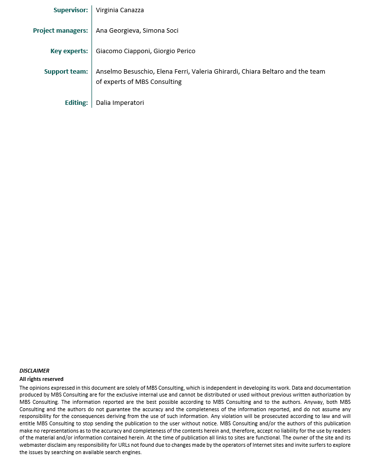
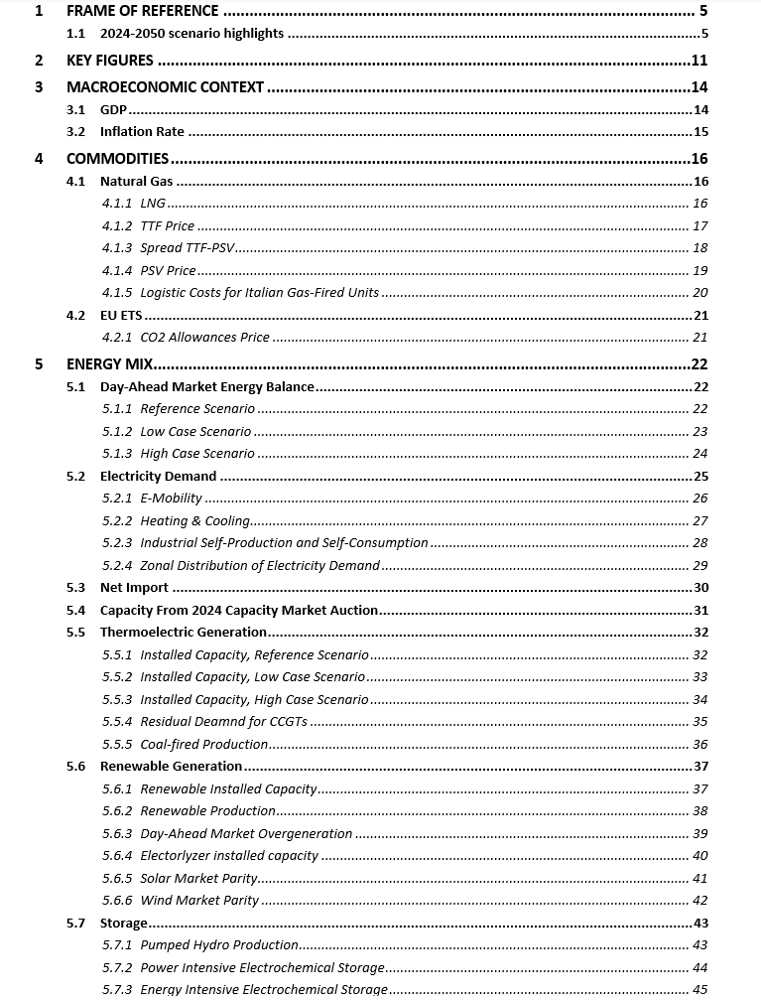
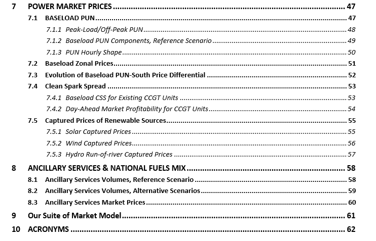

    
    ```{r setup, include=FALSE}
knitr::opts_chunk$set(
    echo=FALSE,
    cache=FALSE,
    prompt=FALSE,
    # tidy=TRUE,
    tidy=FALSE,
    comment=NA,
    message=FALSE,
    warning=FALSE)
options(knitr.kable.NA = '')

library(mbsenergyUtils)

box::use(ggplot2[...],
         magrittr[...],
         data.table[...],
         scales[...],
         flextable[...],
         xl = openxlsx[read.xlsx, getSheetNames])

set_flextable_defaults(
    font.color = "#54565B",
    font.size = 7,
    font.family = 'calibri',
    padding = 2,
    border.color = "#dfe2e5",
    background.color = "whitesmoke",
    split = FALSE,
    theme_fun = "theme_box",
    decimal.mark = ",",
    big.mark = " ",
    na_str = "<NA>")


excel_file = file.path('data', 'tables_report.xlsx')
excel_file_sn = xl$getSheetNames(excel_file)


```






