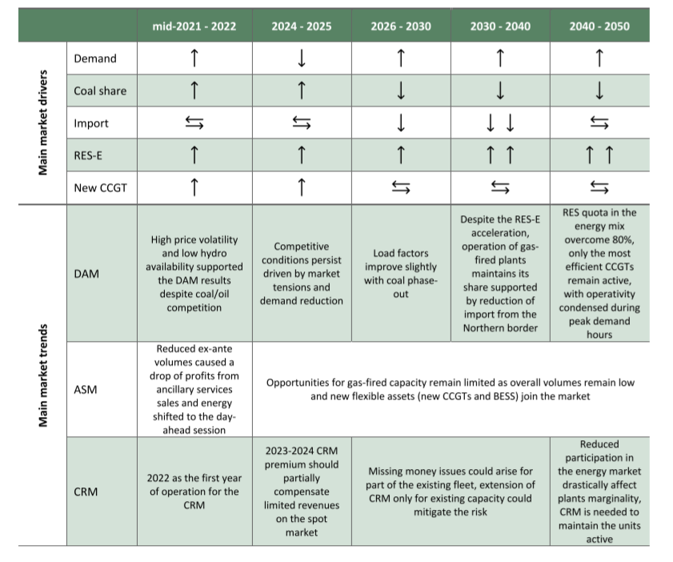
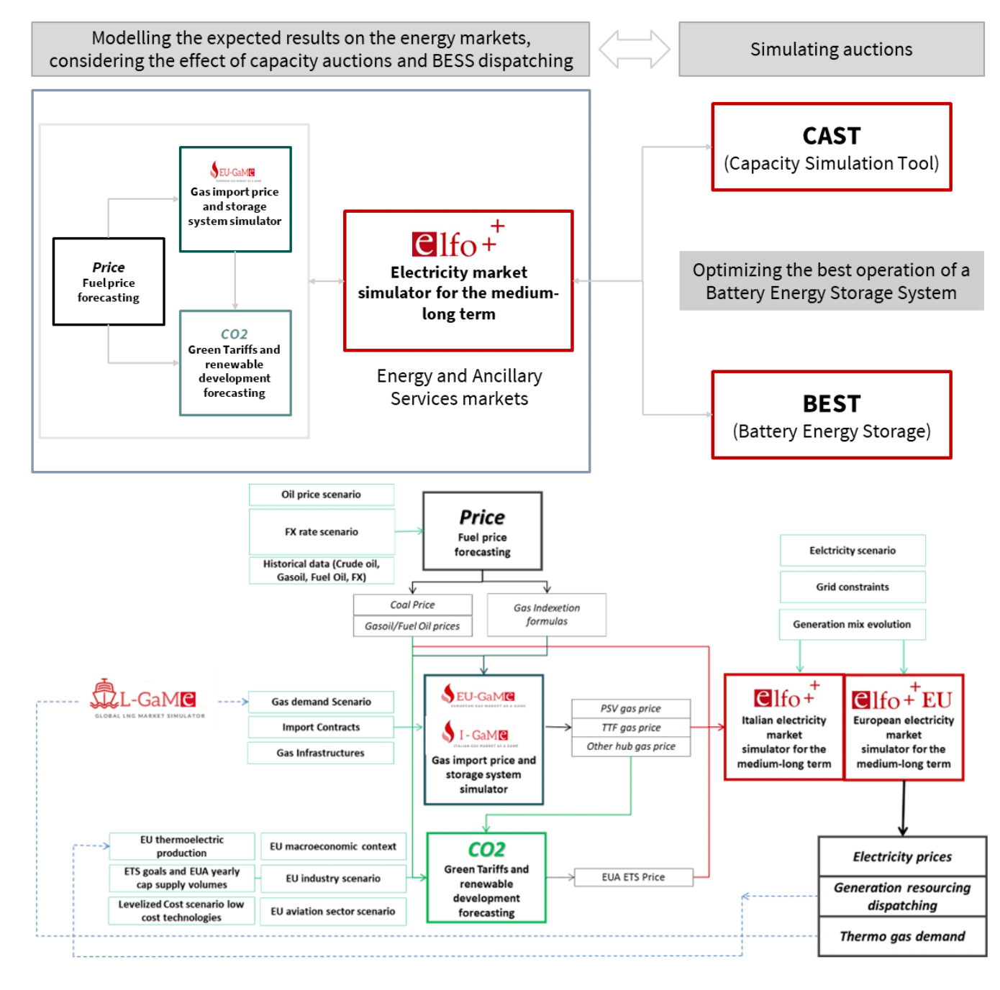
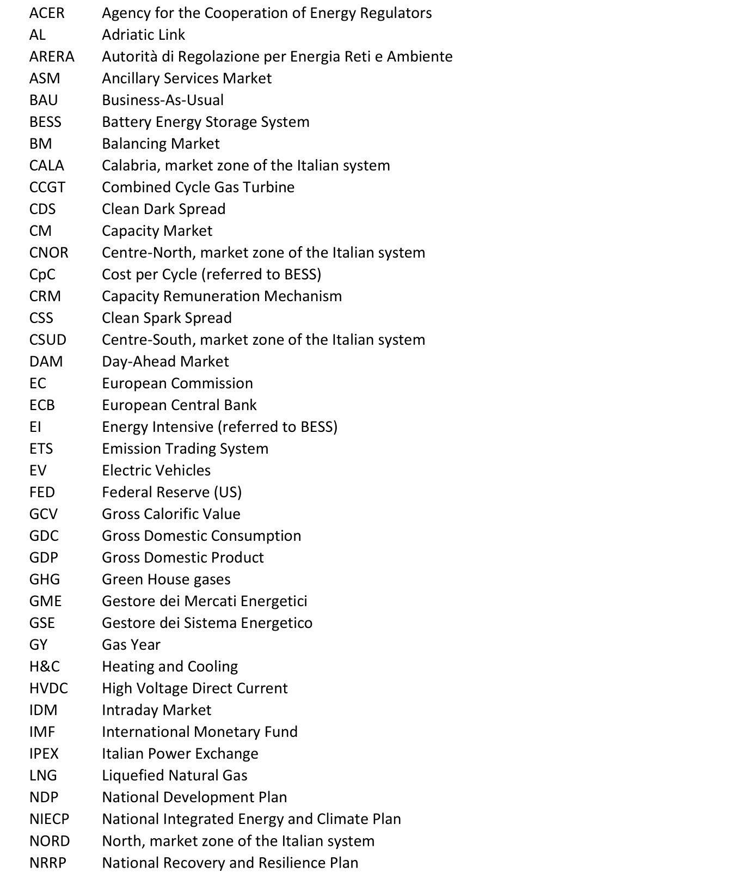
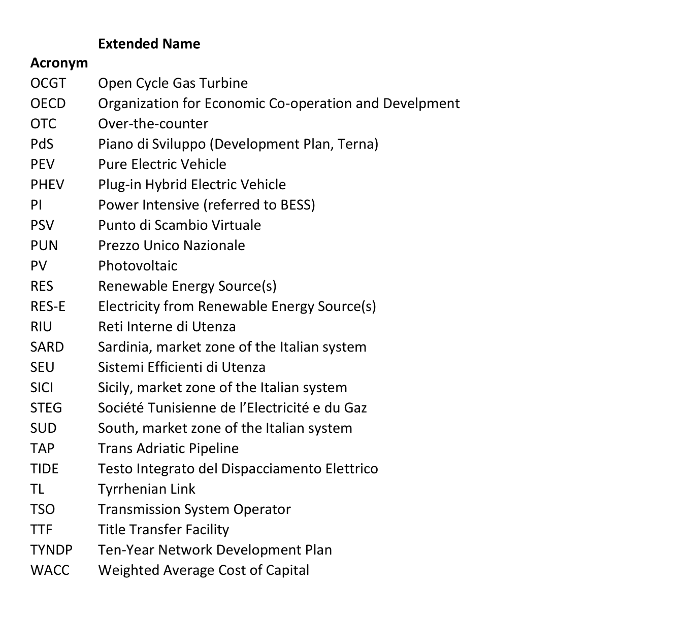

```{r setup, include=FALSE}
knitr::opts_chunk$set(
               echo=FALSE,
	           cache=FALSE,
               prompt=FALSE,
               # tidy=TRUE,
               tidy=FALSE,
               comment=NA,
               message=FALSE,
               warning=FALSE)
options(knitr.kable.NA = '')

library(mbsenergyUtils)

box::use(ggplot2[...],
         magrittr[...],
         data.table[...],
         scales[...],
         flextable[...],
         xl = openxlsx[read.xlsx, getSheetNames])

set_flextable_defaults(
    font.color = "#54565B",
    font.size = 7,
    font.family = 'calibri',
    padding = 2,
    border.color = "#dfe2e5",
    background.color = "whitesmoke",
    split = FALSE,
    theme_fun = "theme_box",
    decimal.mark = ",",
    big.mark = " ",
    na_str = "<NA>")


excel_file = file.path('data', 'tables_report.xlsx')
excel_file_sn = xl$getSheetNames(excel_file)


```

# Frame of Reference

REF-E scenarios over the time horizon 2024-2050 (with projections up to
2060) are elaborated by MBS Consulting experts on the base of
proprietary suites and market knowledge. Econometric and structural
models, as well as our expert sensitiveness, detailed knowledge of
regulation, and accurate monitoring of market outcomes underlie our
elaborations.

Gas and electricity forecasts consider the diverse geopolitical and
economic hypothesis deriving from the regulatory, financial and
fundamentals adjustments to the disruption generated both from the
pandemic and the Ukrainian war, which are seen as key determinants of
the future equilibrium of the energy markets.

Current scenario update incorporates an evolution of climate variables
in line with the historical average trend. In this perspective, we
defined three scenarios:

-   The **High Case scenario** is characterized by permanently high
    prices amid import-export tensions, supply scarcity and possible
    logistic locks. Negative or zero economic growth and the energy
    transition process failure would follow because of investments
    disruption.

-   In the **Reference scenario**, prices remain high in the short-term
    since still low supplies combines with demand growth. However, the
    energy transition process continues leading to a progressive
    diversification of energy sources. This, combined with efficiency
    and high prices induced savings leads the energy market towards a
    normalization path. The economic growth suffers a contraction over
    the next two years, followed by recovery.

-   The **Low Case scenario** would materialize in the event of
    favourable weather conditions and a fast energy transition,
    supported by low inflation and a faster economic recovery, reducing
    demand over the next few years.

This would limit prices upside potential and then fuel a downward
acceleration.


## Scenario highlights

**Short-term perspectives for Italy have relaxed compared to the recent
past, although tensions on energy markets are still possible given the
fragile equilibrium on gas market: intensified competitive dynamics
between Europe and Asia could drive prices up on the electricity market
as well.**

Relaxation in market fundamentals, a significant slowdown in economic
growth and still subdued power demand are the key determinant for the
electricity prices easing expected for the 2024-2025 period. Ongoing
consumption trends appear to confirm a positive impact of the energy
crisis on the acceleration of energy-saving investments and more
flexible behaviours on the energy demand side. Whether the overall
decrease in power demand dealt with short-term electricity savings or
structural efficiency measures is still under observation, but effects
are accounted for in near-term demand projections.

Contraction in electricity demand (-10 TWh y/y), recovery in hydro
generation after the severe drought during the first months of 2023, an
higher than historical level installation rate in renewable guarantied
an increase in RES quota (30% of demand, +22% y/y) in the energy mix
affecting the competitiveness for gas generation units. Furthermore,
electricity demand contraction also in the other European countries,
rebound in hydro generation together with an improved availability of
French nuclear fleet increase the potential export flows from
interconnected countries, resulting in an increased net import from the
northern border (+10 TWh y/y). In the coming years the expectation of a
slow recovery in electricity demand, below 2019 level until 2026, and a
sustained pace of renewable installations (+3.5 GW per year in Reference
scenario and +6 GW in the Low scenario) may intensify market competition
for gas-fired power plants.

**In 2023, a notable increase in renewable installation rate (+5.7 GW
compared to 1.5 GW/y during the last 5 years), driven by solar
technologies, marks a further step towards the net zero path in the long
run, despite a still uncertain economy recovery; permitting process
simplifications, attractive market signals and investment costs
reduction, driven by supply chain recovery may further accentuate the
trend.**

The Italian 2024 GDP growth is expected to remain almost close to zero
in the Reference scenario, since inflation and restrictive monetary
policies weigh on economic growth, while a recovery of demand and
investments should sustain GDP growth in 2025 and for all the scenario
years. In the High case the pessimistic macroeconomic view ( -0.5% y/y)
for the GDP in 2024 and the overall deceleration in growth in the
ensuing years, undermines the system's potential.

The inflation trajectory will play a crucial role in defining the
economic outlook performance. Private consumptions and industry
investments persist in subdued, curbing growth projections in the short
term. However, a possible faster normalization in inflation may
speeds-up monetary policy normalization, supporting investments leading
to our LOW Case scenario, with the GDP growth moving back to just below
1% (y/y) already in 2024.

Continuous relaxation in gas market dynamics over 2023 have favoured the
easing in global prices. Favourable weather conditions, with subdued
demand, abundant storage facilities, and stable supplies have guaranteed
market stability in the short-term. The European market equilibrium
remains delicate though, depending on LNG imports, strongly affected by
competition with Northeast Asia. A faster recovery in Chinese industrial
and transport sector pushed LNG demand in 2023, +10% y/y. Additionally,
intensified competition driven by pricesensitive buyers in Asia could
amplify market volatility, influencing price trends until 2025. By then,
the availability of new liquefaction capacity should expand the global
LNG demand-supply margin, mitigating potential tightness risks.

The gas price forecasts were revised in the short-term following the
relaxation in market fundamentals and the significant slowdown in
economic growth in Europe. TTF and PSV yearly price projections in the
REFERENCE scenario average around 50 €/MWh for 2024 and decline towards
35 €/MWh in 2025 when liquefaction and regasification capacity should
rebalance the supply-demand dynamics. If the global economic recovery
stall and no competition arise on gas supplies, the gas prices decline
may continue, with the PSV averaging below 30 €/MWh in 2024 as in the
Low case, while in the High scenario an escalation of geopolitical
tensions and increased competition on LNG supplies may emphasize the
market upward potential with the yearly PSV averaging 80 €/MWh.

In 2024, the average CO2 price is should to approach €90/ton, driven by
the gradual implementation of reforms within the ETS system, supporting
the CO2 prices. The gradual integration of the maritime transport sector
into the ETS scheme, as outlined in EU Directive 2023/959, is expected
to unfold incrementally, potentially lacking a substantial impact on
allowances demand in the short run. However, a notable divergence
between supply and demand is projected to emerge around 2027 as the
maritime sector fully integrates into the ETS system, leading to a tight
market, with CO2 prices forecasted to surge towards an average of
€110/ton by 2030. In 2023 electricity consumption curbs to 306 TWh but
it is expected to eventually resume in 2024 reaching 311 TWh driven by
recover in consumption and electrification. A moderate economic growth,
driven by supportive measures, and quicker, but yet limited
electrification allows the demand to reach 340 TWh in 2030. Acceleration
of end-use electrification and full unfolding of efficiency potential
driven by a more positive economic outlook in the LOW Case scenario
should overcome the 2023 drop, and reach 313 TWh in 2024 (still below
2022 result) and head to the 360 TWh in 2030. On the contrary, in the
HIGH case scenario, halted efficiency investments and slow economy
recovery should keep power demand below 2022 level during 2024-2025
period, potentially growing up to 328 TWh in 2030.

The enhanced availability of France's nuclear fleet, coupled with a full
recovery in hydroelectric generation across Europe, should ensure a
stable energy net import flow of around 40 TWh towards Italy. In
perspective, the gradual phase-out of coal-fired and nuclear capacity in
the continental Europe could drive the sharp reduction of imported
energy in the post-2030 horizon1. French nuclear fleet availability
remains a central variable for the power exchange dynamics in Italy and
phase-out decisions should drive the potential decline of net import
form Northern borders after 2030 if not replaced by investments in new
nuclear generation capacity.

Renewables gain share rapidly as the 2023 momentum is expected to
enhance over the coming years, with a yearly increase up to 6 GW (4.5 GW
of solar and 1.5 GW of wind) in the Low scenario and 3 GW (2 GW of solar
and 1 GW of wind) in the Reference case, still below the NIECP average
annual target of 8 GW necessary to reach the 2030 targets. Improved
regulation, decreasing investment costs and ETS price signals should
support the market parity conditions in the long run. The share of
demand covered by renewables in 2030 reach almost 50 % and 60% mark in
the REFERENCE and the LOW case respectively, while remains close to 40%
in the HIGH case. Zonal distribution of the new capacity additions
follows the patterns revealed by Terna's connection request database,
and new utility scale projects are expected to concentrate mostly in the
Southern macrozone and the two islands. Growth of small-scale
distributed renewables for self-consumption is more concentrated in the
Norther area following the historical path with 6% annual increase. Grid
expansion reflect Terna's 2023 Development Plan indications. In the
REFERENCE case reinforcements are assumed operational already in the
2020s but the main improvements to resolve zonal congestions are
expected to be completed in the 2030s -- Tyrrhenian link and Adriatic
link as well as first portions of the Hypergrid. Faster penetration of
renewable energy in the LOW case would require the realization of the
main projects even before 2030, while the slower system transition in
the HIGH case postpone the key investments to the middle of the 2030s.

The need to boost energy independence in the decarbonization process at
European level has already put hydrogen at the central stage of the
future European energy strategy (REPowerEU) and could result in the
allocation of significant financings -- way more than the amount
currently earmarked -- to accelerate the development of a European
hydrogen supply chain, improving current cost perspectives of green
solutions. But accelerating renewables development materializes the risk
of structural overgeneration if the development of BESS does not
progress concurrently, especially in areas that are less interconnected
with the rest of the system and have a high intensity of renewables
relative to demand, such as Sardinia and La Sicilia in Sardinia and
Sicily where economically viable opportunities for competitive green
hydrogen consolidate starting from 2035.

By 2030, significant overgeneration and curtailment risks are expected
to arise in the Southern zone and the Islands, which will prompt a surge
in new electrochemical storage projects. Depending on the alternative
scenarios of RES and grid development trajectories, these dynamics may
be accelerated or delayed. Long-term development of batteries should
follow the opportunities for time-shifting applications on the day-ahead
market.

Investments in power intensive electrochemical batteries can be
in-the-money in the medium-term, with revenue streams deriving mainly
from the participation in the balancing phase of the Ancillary Services
Market and a long-term capacity remuneration through specific projects.
Investments in merchant energy intensive storage batteries are likely to
be attractive only in the long-term when time-shifting applications on
the DAM could become economically sustainable thanks to increasing price
spread volatility and the presence of overgeneration. In 2040, up to 22
GW of energy intensive batteries are expected to be developed in our
REFERENCE scenario.

In the REFERENCE scenario gas-fired generation is expected to remain at
the backbone of the national energy mix even after renewables become the
first production source through the next decades, until 2031 when RES
become the main resource in the mix. Its share in the generation mix
should decrease progressively but stay close to 30% of the national
electricity needs until 2040.\
However, mutated market conditions, triggered by the geopolitical
tensions and contingent factors witnessed during the last year and a
half, combined with implications of market design and regulation
evolution (XBID, Terna's Incentive scheme, TIDE reform) unveil a changed
market landscape context that is expected to permanently change the
structure of revenue flows for gas-fired power plants.

Presence of coal units in the generation mix combined with the power
demand slowdown are expected to partially limit the day-ahead market
operativity of gas power plants and to reduce their margins in the
20242025 period, further worsened by the structural and permanent
reduction in ASM volumes. In the longer run, after 2026, despite the
entrance of less new generation CCGTs through the capacity market,
competition for existing units should increase, further exacerbated by
continuous acceleration in renewables development, but to be also
partially compensated by coal phase-out of generation units in the
Italian peninsula2 and by import reduction after 2030. The clean spark
spread, which is strictly related to the evolution of existing CCGTs
market share that remain the technology fixing the prices in most hours,
remains negative on baseload basis, but the flexible operation of gas
fired assets allows to optimise the actual captured value. Even though
volatility and competitiveness increase, the day-ahead market remains
the primary source of revenues for CCGTs. Missing money issues could
arise for part of the existing CCGT fleet and the extension of a
Capacity Remuneration Mechanism only for existing capacity could
mitigate the risk of a non-adequate system.

Market prices in the short-term will mainly be guided by commodities
prices dynamics. A gradual normalization of gas prices can be reflected
in the power prices in the mid-term. In the long-term, power prices will
be mainly driven by CO2 movements, while the impact of other commodities
are expected to reach a stable equilibrium. Renewables penetration,
mainly led by solar energy, is expected to strongly affect peak/off-peak
dynamics after 2030, when the inversion of price spreads between time
slots is expected to occur. Zonal spreads reflect the disruptive
variations of the generation mix and grid in the three alternative
views. In the short term, the REFERENCE case predicts that zonal prices
will diverge due to the cost-effectiveness of coal production in
specific areas. However, over the long term, the significant development
of renewable energy sources in the southern macro-zone is expected to
drive prices down through the cannibalization of solar technologies.
Despite anticipated grid improvements, bottlenecks are still expected
between the northern and southern zones, resulting in differing price
levels in the 2030s. From 2035 onwards, further grid reinforcements are
assumed to occur, resulting in a reduction of inter-zonal congestion
issues on the mainland. However, criticalities are likely to remain
evident in the islands.

Systematic and significant contraction of volumes exchanged on the
ancillary services market has been observed since mid-2021 for both
upward and downward operations. At the basis of the new trend there are
multiple drivers that are expected to change the role and the
perspective of the ancillary services market. The origin of the new
trends is actually a combination of factors with less or more contingent
nature such as: available running reserve due to reversed switching
conditions, evidence for changes in the network management criteria
adopted by Terna potentially connected to the incentives for ASM cost
reduction, feasibility intervals imposed to power plants in the new
Intra-Day Market continuous structure. The traditional market phase for
regulation services is expected to become riskier and tighter, and to
offer only a marginal integration to the spot market profits. Limited
room is expected to remain a permanent trend in the long run, further
supported by the commissioning of additional flexible thermal and
storage capacity. Delay of grid investments with respect to the
renewable growth could impact on the security condition with a wide
heterogeneity at nodal level: local criticalities and limited renewable
hosting capacity could be mitigated by storage waiting for structural
network reinforcements.

The new long-term scenario analysis of MBS takes into consideration the
latest trends of the Italian system evolution, it peers itself with the
Fit-for-55 targets in 2030 and discusses the possible paths towards
2050. Market simulations are extended beyond 2040 by explicitly
modelling the market fundamentals through deterministic techniques and
by assuming an inertial evolution, in line with the average 2030 -- 2040
trajectory, for renewables installation sustained by BESS technologies,
reduction in gas generation quota in the energy mix, electrification of
consumptions and a proportional gird development on top of Terna
development plan. All the elaborations are done considering the market
structure and rules as known of today.

The resulting trajectory lacks behind the Net Zero targets: by 2050,
only 85% of Italian electricity demand is expected to be met by
renewable generation, while the residual demand would be covered by
flexible and efficient gas generation, still needed by the system for
adequacy reasons. Further contraction in operating hours (morning and
evening peaks) impose the need of an explicit remuneration mechanism to
support their economic viability. Renewables are expected to become the
predominant marginal technology and market prices are expected to become
less dependent on gas generation costs and more related to LCOE of
renewable technologies as their marginal quota reach 40% of the yearly
hours.

For evaluating price dynamics beyond 2050 (2050-2060 horizon),we assume
an extension of 2050 results taking into account the uncertainty of
available information for an explicit evaluation of the very long-term.
2040 -2060 scenarios will be carefully evaluated in future updates in
order to discuss the economic sustainability of policy scenarios
implementing the net zero target.

#### Key market trends in Italy {.unnumbered}


# Key Figures

```{r, net_power}

dt_table = openxlsx::read.xlsx(file.path('data', 'tables_report.xlsx'), sheet = excel_file_sn[1]) %>% 
    setDT() 

vec_sce = names(dt_table)[-1]
vec_colnames = as.character(as.vector(dt_table[1]))

dt_table = dt_table[2:.N]


suffixes = c('', rep("Reference_", 4), rep("Low_", 4), rep('High_', 4))
vec_colnames = paste0(suffixes, vec_colnames)
names(dt_table) = vec_colnames

dt_table[, (vec_colnames[-1]) := lapply(.SD, function(x) {round(as.numeric(x), 1)}), .SDcols = vec_colnames[-1]]

dt_table |> flextable() %>% 
    separate_header() %>%  
    align(align = "center", part = "all") %>% 
    bg(bg = "#8497B0", part = "header") %>% 
    color(part = "header", color = 'white') %>% 
    vline(j = c(1, 5, 9, 13), border = officer::fp_border(color = "#dfe2e5", width = 1), part = "all") %>% 
    bold(i = NULL, j = 1) %>% 
    width(width = 2, j = 1)

```
```{r, balance}

dt_table = openxlsx::read.xlsx(file.path('data', 'tables_report.xlsx'), sheet = excel_file_sn[2]) %>% 
    setDT() 

vec_sce = names(dt_table)[-1]
vec_colnames = as.character(as.vector(dt_table[1]))

dt_table = dt_table[2:.N]


suffixes = c('', rep("Reference_", 4), rep("Low_", 4), rep('High_', 4))
vec_colnames = paste0(suffixes, vec_colnames)
names(dt_table) = vec_colnames

dt_table[, (vec_colnames[-1]) := lapply(.SD, function(x) {round(as.numeric(x), 1)}), .SDcols = vec_colnames[-1]]

dt_table |> flextable() %>% 
    separate_header() %>%  
    align(align = "center", part = "all") %>% 
    bg(bg = "#8497B0", part = "header") %>% 
    color(part = "header", color = 'white') %>% 
    vline(j = c(1, 5, 9, 13), border = officer::fp_border(color = "#dfe2e5", width = 1), part = "all") %>% 
    bold(i = NULL, j = 1) %>% 
    width(width = 2, j = 1)

```
```{r, commodities}

dt_table = openxlsx::read.xlsx(file.path('data', 'tables_report.xlsx'), sheet = excel_file_sn[3]) %>% 
    setDT() 

vec_sce = names(dt_table)[-1]
vec_colnames = as.character(as.vector(dt_table[1]))

dt_table = dt_table[2:.N]


suffixes = c('', rep("Reference_", 4), rep("Low_", 4), rep('High_', 4))
vec_colnames = paste0(suffixes, vec_colnames)
names(dt_table) = vec_colnames

dt_table[, (vec_colnames[-1]) := lapply(.SD, function(x) {round(as.numeric(x), 1)}), .SDcols = vec_colnames[-1]]

dt_table |> flextable() %>% 
    separate_header() %>%  
    align(align = "center", part = "all") %>% 
    bg(bg = "#8497B0", part = "header") %>% 
    color(part = "header", color = 'white') %>% 
    vline(j = c(1, 5, 9, 13), border = officer::fp_border(color = "#dfe2e5", width = 1), part = "all") %>% 
    bold(i = NULL, j = 1) %>% 
    width(width = 2, j = 1)

```
```{r, electricity_prices}

dt_table = openxlsx::read.xlsx(file.path('data', 'tables_report.xlsx'), sheet = excel_file_sn[4]) %>% 
    setDT() 

vec_sce = names(dt_table)[-1]
vec_colnames = as.character(as.vector(dt_table[1]))

dt_table = dt_table[2:.N]


suffixes = c('', rep("Reference_", 4), rep("Low_", 4), rep('High_', 4))
vec_colnames = paste0(suffixes, vec_colnames)
names(dt_table) = vec_colnames

dt_table[, (vec_colnames[-1]) := lapply(.SD, function(x) {round(as.numeric(x), 1)}), .SDcols = vec_colnames[-1]]

dt_table |> flextable() %>% 
    separate_header() %>%  
    align(align = "center", part = "all") %>% 
    bg(bg = "#8497B0", part = "header") %>% 
    color(part = "header", color = 'white') %>% 
    vline(j = c(1, 5, 9, 13), border = officer::fp_border(color = "#dfe2e5", width = 1), part = "all") %>% 
    bold(i = NULL, j = 1) %>% 
    width(width = 2, j = 1)

```

```{r, zonal_prices}

dt_table = openxlsx::read.xlsx(file.path('data', 'tables_report.xlsx'), sheet = excel_file_sn[5]) %>% 
    setDT() 

vec_sce = names(dt_table)[-1]
vec_colnames = as.character(as.vector(dt_table[1]))

dt_table = dt_table[2:.N]


suffixes = c('', rep("Reference_", 4), rep("Low_", 4), rep('High_', 4))
vec_colnames = paste0(suffixes, vec_colnames)
names(dt_table) = vec_colnames

dt_table[, (vec_colnames[-1]) := lapply(.SD, function(x) {round(as.numeric(x), 1)}), .SDcols = vec_colnames[-1]]

dt_table |> flextable() %>% 
    separate_header() %>%  
    align(align = "center", part = "all") %>% 
    bg(bg = "#8497B0", part = "header") %>% 
    color(part = "header", color = 'white') %>% 
    vline(j = c(1, 5, 9, 13), border = officer::fp_border(color = "#dfe2e5", width = 1), part = "all") %>% 
    bold(i = NULL, j = 1) %>% 
    width(width = 2, j = 1)

```

```{r, cp_pv_fx}

dt_table = openxlsx::read.xlsx(file.path('data', 'tables_report.xlsx'), sheet = excel_file_sn[6]) %>% 
    setDT() 

vec_sce = names(dt_table)[-1]
vec_colnames = as.character(as.vector(dt_table[1]))

dt_table = dt_table[2:.N]


suffixes = c('', rep("Reference_", 4), rep("Low_", 4), rep('High_', 4))
vec_colnames = paste0(suffixes, vec_colnames)
names(dt_table) = vec_colnames

dt_table[, (vec_colnames[-1]) := lapply(.SD, function(x) {round(as.numeric(x), 1)}), .SDcols = vec_colnames[-1]]

dt_table |> flextable() %>% 
    separate_header() %>%  
    align(align = "center", part = "all") %>% 
    bg(bg = "#8497B0", part = "header") %>% 
    color(part = "header", color = 'white') %>% 
    vline(j = c(1, 5, 9, 13), border = officer::fp_border(color = "#dfe2e5", width = 1), part = "all") %>% 
    bold(i = NULL, j = 1) %>% 
    width(width = 2, j = 1)

```

```{r, cp_pv_tr}

dt_table = openxlsx::read.xlsx(file.path('data', 'tables_report.xlsx'), sheet = excel_file_sn[7]) %>% 
    setDT() 

vec_sce = names(dt_table)[-1]
vec_colnames = as.character(as.vector(dt_table[1]))

dt_table = dt_table[2:.N]


suffixes = c('', rep("Reference_", 4), rep("Low_", 4), rep('High_', 4))
vec_colnames = paste0(suffixes, vec_colnames)
names(dt_table) = vec_colnames

dt_table[, (vec_colnames[-1]) := lapply(.SD, function(x) {round(as.numeric(x), 1)}), .SDcols = vec_colnames[-1]]

dt_table |> flextable() %>% 
    separate_header() %>%  
    align(align = "center", part = "all") %>% 
    bg(bg = "#8497B0", part = "header") %>% 
    color(part = "header", color = 'white') %>% 
    vline(j = c(1, 5, 9, 13), border = officer::fp_border(color = "#dfe2e5", width = 1), part = "all") %>% 
    bold(i = NULL, j = 1) %>% 
    width(width = 2, j = 1)

```

```{r, cp_wind_on}

dt_table = openxlsx::read.xlsx(file.path('data', 'tables_report.xlsx'), sheet = excel_file_sn[8]) %>% 
    setDT() 

vec_sce = names(dt_table)[-1]
vec_colnames = as.character(as.vector(dt_table[1]))

dt_table = dt_table[2:.N]


suffixes = c('', rep("Reference_", 4), rep("Low_", 4), rep('High_', 4))
vec_colnames = paste0(suffixes, vec_colnames)
names(dt_table) = vec_colnames

dt_table[, (vec_colnames[-1]) := lapply(.SD, function(x) {round(as.numeric(x), 1)}), .SDcols = vec_colnames[-1]]

dt_table |> flextable() %>% 
    separate_header() %>%  
    align(align = "center", part = "all") %>% 
    bg(bg = "#8497B0", part = "header") %>% 
    color(part = "header", color = 'white') %>% 
    vline(j = c(1, 5, 9, 13), border = officer::fp_border(color = "#dfe2e5", width = 1), part = "all") %>% 
    bold(i = NULL, j = 1) %>% 
    width(width = 2, j = 1)

```

```{r, cp_wind_off}

dt_table = openxlsx::read.xlsx(file.path('data', 'tables_report.xlsx'), sheet = excel_file_sn[9]) %>% 
    setDT() 

vec_sce = names(dt_table)[-1]
vec_colnames = as.character(as.vector(dt_table[1]))

dt_table = dt_table[2:.N]


suffixes = c('', rep("Reference_", 4), rep("Low_", 4), rep('High_', 4))
vec_colnames = paste0(suffixes, vec_colnames)
names(dt_table) = vec_colnames

dt_table[, (vec_colnames[-1]) := lapply(.SD, function(x) {round(as.numeric(x), 1)}), .SDcols = vec_colnames[-1]]

dt_table |> flextable() %>% 
    separate_header() %>%  
    align(align = "center", part = "all") %>% 
    bg(bg = "#8497B0", part = "header") %>% 
    color(part = "header", color = 'white') %>% 
    vline(j = c(1, 5, 9, 13), border = officer::fp_border(color = "#dfe2e5", width = 1), part = "all") %>% 
    bold(i = NULL, j = 1) %>% 
    width(width = 2, j = 1)

```


# Macroeconomic Context

## GDP

::: callout-main
**GDP GROWTH IN THE SHORT TERM REMAINS SUBDUED, WITH A FORESEEN MODERATE
INDUSTRIAL PRODUCTION RECOVERY SUSTAINED BY WAGE DYNAMICS AND AN
EXPECTED EASING OF MONETARY POLICIES. THE DISINFLATION PATH, EASING
FINANCING CONDITIONS, AND THE IMPLEMENTATION OF THE NRRP ARE THE MAIN
DRIVERS BEHIND MID AND LONG TERM GROWTH PERSPECTIVES**
:::


::: callout-item
::: callout-left
#### 24-25 {.unnumbered}
:::

::: callout-right
The reference scenario foresees GDP growth at 0.4% y/y in 2024 and a
more robust increase in 2025 (+1%), due to an expected easing of
financial conditions. A still weak industrial sector and limited
investments weight in 2024. A gradual easing of the monetary policies in
the second half of the year and positive wage dynamic should would
contribute positively to growth in 2025. In the Worst case scenario,
should inflationary pressure persist, GDP would fall by 0.1% y/y in 2024
and slightly grow in 2025 (+ 0.3%), while an acceleration of
disinflation and investments recovery would lead to the Best-case
scenario (GDP growth up to 1.2% in 2024 and 1.6% in 2025).
:::
:::

::: callout-item
::: callout-left
#### 26-30 {.unnumbered}
:::

::: callout-right
In our Reference and Best scenarios, economic growth would gradually
realign to the previously projected path, sustained by the effective
implementation of the NRRP measures, the recovery of the global economy,
and an acceleration of the green transition reforms. In the Worst
scenario, fiscal policies pressures and the failure of the NRRP
implementation would keep economic growth near zero and lead to a
failure of the green transition.
:::
:::

::: callout-item
::: callout-left
#### 31-50 {.unnumbered}
:::

::: callout-right
In the long-term, our Reference and Best-case scenarios remain anchored
to the assumption of a stabilization of the yearly GDP growth rate in
the 1-2% interval, while in the Worst scenario, GDP growth continues to
discount the effects of the failure of key investments and reforms in
the previous period and only gradually realigns with the Reference
scenario.
:::
:::

::: callout-wrap
::: callout-left
#### Main updates {.unnumbered}
:::

::: callout-right
Short-term GDP projections were revised upward, as a faster than
expected disinflation and the probable easing of monetary policies
combined with positive wage dynamics contribute to GDP growth.
:::
:::

\newpage

## Inflation rate

::: callout-main
**THE PERSISTENCE OF THE ENERGY PRICES NORMALIZATION IS DRIVING THE
GENERAL PRICE INDEX DECLINE, WITH ITS REDUCTION BEGINNING TRANSMIT ALSO
TO THE CORE INDEX. MONETARY POLICY TIGHTENING PROVED TO BE EFFECTIVE IN
LIMITING INFLATIONARY PRESSURES AND KEEPING MEDIUM AND LONG TERM
EXPECTATIONS UNDER CONTROL**
:::


::: callout-item
::: callout-left
#### 24-25 {.unnumbered}
:::

::: callout-right
Inflation is expected to increase by 1.7% y/y in 2024 and by 2.3% in
2025, with a downward revision incorporating the recent disinflation
path. In the second half of 2024 monetary policy may revert to easing
supporting investments growth.
:::
:::

::: callout-item
::: callout-left
#### 26-30 {.unnumbered}
:::

::: callout-right
After 10 consecutive reference rates increases, the actual interest
rates level is proving effective in guiding inflation back to the 2% in
the short term. Our scenario foresees a stabilization to 2% in the
second part of the decade, even with a gradual monetary policy easing.
:::
:::

::: callout-item
::: callout-left
#### 31-50 {.unnumbered}
:::

::: callout-right
Long-term assumptions envisage the inflation rate to stabilize at around
2%, in line with the BCE's medium term inflation target.
:::
:::

::: callout-wrap
::: callout-left
#### Main updates {.unnumbered}
:::

::: callout-right
GDP projections are in line with the previous market update.
:::
:::

\newpage

# Commodities

## Natural Gas

### LNG

::: callout-main
**2023 GLOBAL LNG DEMAND ROSE BY 2% Y/Y IN 2023 COMPARED TO 2022; A
NOTABLE DISPARITY IN GROWTH RATE WAS SHOWCASED BETWEEN THE ASIAN AND
EUROPEAN BLOCS. DELAYS IN THE CONSTRUCTION OF LIQUEFACTION AND
REGASIFICATION CAPACITY, INDUCED BY LOW PRICES, COULD TRANSLATE IN
RENEWED DEMAND-SUPPLY TENSIONS IN 2025-2026. THERE IS AN ANTICIPATION OF
POTENTIAL OVERSUPPLY IN THE LNG MARKET POST-2026, LAYING THE GROUNDWORK
FOR PRICE NORMALIZATION IN THE LONG-TERM**
:::


::: callout-item
::: callout-left
#### 24-25 {.unnumbered}
:::

::: callout-right
In 2023, global LNG demand increased by 2% year-on-year, and it's
predicted to rise by close to 5% annually in both 2024 and 2025, driven
by an increased demand from Europe and China. Despite limited global LNG
supply growth in 2024, competition between Europe and Asia will
decrease, and new capacity coming online in 2024 and 2025 should meet
demand. The balance of LNG demand between Europe and Asia, influenced by
economic activity and weather conditions, along with the progress of new
capacity, will be crucial in determining the global equilibrium in 2025
and 2026, with a growth rate potentially exceeding 7% in the high
scenario.
:::
:::

::: callout-item
::: callout-left
#### 26-50 {.unnumbered}
:::

::: callout-right
After 2026, LNG demand growth is expected to slow down to just below 5%
per year due to increased renewable energy production and improved
energy efficiency. By 2026, new liquefaction capacity from the US and
Qatar is expected to enter the market, reducing the risk of market
tightness. In the long term, the pressure on the LNG market is expected
to ease further due to the growth in new capacity and the implementation
of green energy commitments.
:::
:::

::: callout-wrap
::: callout-left
#### Main updates {.unnumbered}
:::

::: callout-right
Global LNG demand growth in the short term remained in line with our
previous update. 2024 European LNG demand growth was revised slightly
lower since record high gas storages should slowdown demand recovery
over the next few months, while the Asian one was revised higher to
account for a faster than expected recovery of price-sensitive
importers.
:::
:::

\newpage

### TTF Price

::: callout-main
**MILDER WINTER TEMPERATURES AND SUBDUED THERMOELECTRIC DEMAND DROVE A
RECORD DECLINE IN EUROPEAN GAS PRICES IN 2023. STRUCTURAL MARKET CHANGES
INDICATE THAT DEMAND IS UNLIKELY TO RETURN TO PRE-CRISIS LEVELS OVER THE
NEXT THREE YEARS. IN THE LONG TERM, WE ANTICIPATE FURTHER DEMAND
REDUCTION DUE TO EUROPE'S DECARBONIZATION EFFORTS, LEADING TO A LOWER
TTF PRICE TRAJECTORY NEARING €25/MWH. PRICE TENSION AND VOLATILITY
SPIKES, PARTICULARLY DURING WINTERS, MAY OCCUR OVER THE NEXT FEW YEARS.
NORMALIZATION OF PRICES IS EXPECTED FROM 2026 ONWARDS, CONTINGENT UPON
INCREASED EUROPEAN LNG SUPPLY**
:::


::: callout-item
::: callout-left
#### 24-25 {.unnumbered}
:::

::: callout-right
The TTF 2023 average price settled just above 40 €/MWh, and based on our
reference scenario, expectations for the 2024 yearly average are
projected to establish close to 30 €/MWh. The persistence of subdued
demand, not anticipated to rebound in the short-term, driven by
structural changes in the energy markets and the recovery of RES
production, induce price expectations to remain low. Europe LNG import
capacity is poised to expand by further 30 Bcm in 2024, following the
delay of under construction regasification facilities to that year or
later. The development of European regasification capacity will
increasingly enable additional LNG arrivals, crucial to maintain market
equilibrium in the short-term and to structurally adapt to the absence
of Russian piped gas.
:::
:::

::: callout-item
::: callout-left
#### 26-50 {.unnumbered}
:::

::: callout-right
Starting from 2025, there will be a gradual return to normalcy in the
global LNG market due to the deployment of new liquefaction capacity.
This normalization, combined with an accelerated energy transition, is
expected to lead to a steady decrease in European gas prices, reaching
around €30/MWh by 2028. The ongoing decarbonization process in Europe
will continue to reduce gas demand, which will further push prices down
towards the long-term equilibrium of €25/MWh. However, in a scenario of
persisting geopolitical and commercial tensions (High scenario), prices
may remain just below €45/MWh in the long term. Conversely, effective
green policies coupled with economic growth (Low scenario) could drive
prices significantly lower, with the TTF averaging around €10/MWh in the
long term.
:::
:::

::: callout-wrap
::: callout-left
#### Main updates {.unnumbered}
:::

::: callout-right
We adjusted our short-term forecasts for European gas hub prices
downward, particularly for 2024-25 winter season target, in response to
the stalling recovery of European gas demand.
:::
:::

\newpage

### Spread TTF-PSV

::: callout-main
**IN THE SHORT-TO-MEDIUM TERM THE PSV GAS PRICE IS ANTICIPATED TO
MAINTAIN A PREMIUM COMPARED TO THE TTF. THIS IS DUE TO THE NEED FOR
INCREASED GAS FLOWS FROM NORTHERN EUROPE TO COMPENSATE FOR BOTH THE
INTERRUPTION OF RUSSIAN PIPED GAS SUPPLIES AND FOR THE TEMPORARY CLOSURE
OF THE OLT LNG REGASIFICATION FACILITY IN ITALY. HOWEVER, OVER THE LONG
TERM, THE PRICE DIFFERENTIAL IS EXPECTED TO PROGRESSIVELY NARROW TOWARDS
ZERO**
:::


::: callout-item
::: callout-left
#### 24-25 {.unnumbered}
:::

::: callout-right
The PSV-TTF spread is expected to widen in 2024 following the closure of
the OLT LNG regasification facility, averaging at 2 €/MWh. This is due
to the increased reliance on flows from Norway via Passo Gries to
compensate for the reduced availability of LNG. Fluctuations throughout
the year are anticipated, driven by seasonal factors.
:::
:::

::: callout-item
::: callout-left
#### 26-30 {.unnumbered}
:::

::: callout-right
Flows from the TAP and Algeria, and LNG arrivals are seen as balancing
imports in the medium-term, leading to a progressive spread closure to
below 1 €/MWh by 2030.
:::
:::

::: callout-item
::: callout-left
#### 31-50 {.unnumbered}
:::

::: callout-right
The PSV-TTF spread is foreseen to reabsorb towards zero in the
long-term, since a gradual flows rebalancing is expected to combine with
the underlying decarbonization-induced demand reduction.
:::
:::

::: callout-wrap
::: callout-left
#### Main updates {.unnumbered}
:::

::: callout-right
PSV-TTF spread is still expected to remain positive in short and medium
term and to reduce progressively towards null in the long-run. A slight
increase in the short-term average PSV-TTF spread followed the
aforementioned dynamics affecting Italian gas supply.
:::
:::

\newpage

### PSV Price

::: callout-main
**THE ITALIAN GAS PRICE CONTINUES TO BE CLOSELY TIED TO THE EUROPEAN HUB
ONE, WITH THE TTF SIGNIFICANTLY AFFECTING PSV TRENDS. HOWEVER, THE
TEMPORARY CLOSURE OF OLT FACILITY HAS IMPACTED ITALIAN IMPORTS, LEADING
TO SHORT-TERM PROJECTIONS SUGGESTING WIDER DEVIATIONS FROM THE TTF.
MOREOVER, THE PSV IS EXPECTED TO FOLLOW A TRAJECTORY LOWER THAN
PREVIOUSLY ANTICIPATED, REFLECTING STAGNATING DEMAND AND ECONOMIC
RECOVERY. IN THE LONG RUN, WE FORESEE THE PSV TO ALIGN WITH THE EUROPEAN
PRICES NORMALIZATION PATH, TARGETING 30 €/MWH BY 2030 AMIDST A
REBALANCING OF GLOBAL GAS DEMAND AND SUPPLY DRIVEN BY THE ACCELERATION
OF THE ENERGY TRANSITION**
:::


::: callout-item
::: callout-left
#### 24-25 {.unnumbered}
:::

::: callout-right
The 2023 PSV average price settled just below 45 €/MWh in 2023. In 2024,
we anticipate a decrease in the PSV yearly average, with prices hovering
around 30 €/MWh. This downward revision in PSV forecasts for 2024-2026
can be attributed to constrained gas demand recovery, which, in turn,
stems from various factors. Firstly, gas consumption of the distribution
network is anticipated to remain subdued amid a shift towards savings
and efficiency. Limited growth in the energy-intensive sector and
lower-than-average thermoelectric gas demand driven by sustained
electricity imports and renewable electricity production on the rebound,
will further limit national gas consumption. Delays in the commissioning
of the Ravenna FSRU have also hampered gas demand recovery, falling
short of initial expectations.
:::
:::

::: callout-item
::: callout-left
#### 26-50 {.unnumbered}
:::

::: callout-right
The PSV is expected to follow the European gas prices mid-term
normalization towards 30 €/MWh by year 2030, as a gradual rebalancing of
the global gas demand-supply dynamics should follow the expected
acceleration of energy transition. PSV Reference price is expected to
stabilize, aligning to TTF prices at around 25 €/MWh in the long-term.
:::
:::

::: callout-wrap
::: callout-left
#### Main updates {.unnumbered}
:::

::: callout-right
Our short-term expectations on the European gas hubs prices were revised
lower, mainly across 2023-24 and 2024-25 winter seasons targets,
following the recent relaxation of short-term market fundamentals and a
significant slowdown in economic growth in Europe.
:::
:::

\newpage

### Logistics Costs for Italian Gas-Fired Units

::: callout-main
**GAS LOGISTIC COSTS ARE EXPECTED TO REMAIN HIGH IN THE SHORT-TERM DUE
TO THE INCREASE RELATED TO THE COVERAGE OF STORAGE INJECTIONS ACTIVITY
IN PARTICULAR. VARIABLE LOGISTIC GAS COSTS SHOULD START GRADUALLY
DECREASING FROM 2027 ONWARDS, FOLLOWING THE EXPECTED GAS PRICES
NORMALIZATION**
:::


::: callout-item
::: callout-left
#### 24-26 {.unnumbered}
:::

::: callout-right
The 2023 logistic cost for Italian gas-fired units averaged 4 €/MWh amid
the increase of the CRVOS (which pays storage injections incentives),
CRVBL (which covers the charges associated with the gas system balancing
activity) and the CVU (which covers variable charges and it's linked to
the gas price trend) components. With the Consultation Document
588/2023/R/gas ARERA is evaluating the introduction of a Neutrality
Charge of 2.2 €MWh from April 2024 (and for at least 3 years) to recover
almost 4 Bln€ derived from the summer 2022 last resort buying activity
put in place to refill the Italian storages. The overall gas transport
cost should therefore remain above 4 €/MWh at least until 2026. The
CRVOS component should reduce close to pre-crisis levels starting from
October-2024 instead.
:::
:::

::: callout-item
::: callout-left
#### 27-50 {.unnumbered}
:::

::: callout-right
A gradual normalization of the average variable logistic costs is
expected from 2027 on wards, following the normalization of gas prices,
nearing 1.6 €/MWh on average by 2030.
:::
:::

::: callout-wrap
::: callout-left
#### Main updates {.unnumbered}
:::

::: callout-right
The variable transport charges forecast incorporates the regulator
interventions to mitigate the recent commodities surge on bills,
compensated by an increase in storages and balancing cost.
:::
:::

\newpage

## EU ETS

### CO2 Allowances Price

::: callout-main
**THE NEW ETS REFORM, TO BE INCORPORATED INTO NATIONAL LEGISTLATION OF
EU MEMBER STATES BY THE END OF 2024, AIMS TO PROGRESSIVELY RAISE THE CO2
PRICE BY TIGHTENING THE EMISSIONS CERTIFICATES MARKET THROUGH A
COMBINATION OF SUPPLY CURTAILMENT AND DEMAND-INCREASING MEASURES. THE
INCLUSION OF NEW SECTORS, SUCH AS THE MARITIME SECTOR, WILL CONTRIBUTE
TO SUSTAINING THE ENVISIONED PRICE INCREASES**
:::


::: callout-item
::: callout-left
#### 24-25 {.unnumbered}
:::

::: callout-right
In our Reference scenario, the 2024 CO2 price average is projected to
approach 65 €/ton, driven by the gradual implementation of the ETS
system reform supporting CO2 prices. The phasing out of free allowances
for the aviation sector, reaching 50% of the total in 2025, along with
the planned removal of 90 Mln permits from the market in 2024, are
expected to begin exerting upward pressure on allowances prices by
curtailing supply. From 2025 onwards, the progressive inclusion of the
maritime transport sector will further boost overall demand. Concerns
remain regarding effective demand recovery, which is anticipated to be
limited over the next couple of years due to anticipated slow economic
growth.
:::
:::

::: callout-item
::: callout-left
#### 26-30 {.unnumbered}
:::

::: callout-right
A notable widening of the supply-demand gap should manifest starting
from 2026, as the maritime sector integrates into the ETS system and the
phasing out of free allowances for aviation reaches full implementation.
By 2030, the reinforcement of the Market Stability Reserve and the
increase of the Linear Reduction Factor up to 4.4% will contribute to
further tightening the market. CO2 prices are expected to accelerate,
nearing just below 110 €/ton by 2030.
:::
:::

::: callout-item
::: callout-left
#### 31-50 {.unnumbered}
:::

::: callout-right
By 2034 the removal of free allowances for sectors covered by the CBAM
will reach full implementation, inducing a further increase in
allowances demand. The long-term targets would hinge upon the effective
efficiency of the ETS System, with the CO2 price expected to exceed 120
€/ton in the Reference scenario by 2040, and potentially accelerate to
just below 150 €/ton in the Low scenario, under the assumption of
stricter decarbonization efforts in Europe to accelerate the prices
increase.
:::
:::

::: callout-wrap
::: callout-left
#### Main updates {.unnumbered}
:::

::: callout-right
CO2 price targets downward in the very short term, in response to the
sharp decline in CO2 prices in evidence until the first quarter of 2024.
Consistent with our previous forecasts, a rebound in allowances demand
and, in average prices in the post-2024 period is expected.
:::
:::

\newpage

# Energy Mix

## Day-Ahead Market Energy Balance

### Reference Scenario

::: callout-main
**IN THE SHORT-TERM, A REDUCTION IN COAL PRODUCTION IS SUSTAINED BY AN
INCRESE IN ELECTRICITY IMPORT. IN THE MID-TERM, GAS-FIRED GENERATION
BECOMES THE PRIMARY SOURCE OF ELECTRICITY AS COAL PLANTS ARE PHASED OUT.
IN THE LONG-TERM, RENEWABLES TAKE THE LEAD AS THE PRIMARY SOURCE OF
ELECTRICITY PRODUCTION, SUPPORTED BY GAS-FIRED PRODUCTION**
:::


::: callout-item
::: callout-left
#### 24-25 {.unnumbered}
:::

::: callout-right
The reduction of the electricity demand at European level, the recovery
of nuclear plants capacity from the O&M maintenance of the last two
years, and a surge in hydro production in Switzerland lead to an
increase in the electricity import from the Northern borders. The
positive trend of new RES installed capacity evidenced in 2023 will
recur also in the two following years. Gas power thermal plants remain
the marginal source.
:::
:::

::: callout-item
::: callout-left
#### 26-30 {.unnumbered}
:::

::: callout-right
Coal-fired units are going to phase-out within 2025, with the exception
of the Sardinian ones, which remian operative until the completion of
the Tyrrhenian Link in 2030. Electricity production from renewables will
cover almost 50% by 2030.
:::
:::

::: callout-item
::: callout-left
#### 31-50 {.unnumbered}
:::

::: callout-right
Renewables will become the main source in the electricity mix, with a
share of 70% by 2040. An optimization of the electricity grid, with the
Tyrrhenian Link doubling in 2043, and the realization of the Elmed cable
(Tunisia-Sicily) will reduce the need of net import from the Norther
borders. Convenient market conditions would favor the development of
energy intensive storage.
:::
:::

::: callout-wrap
::: callout-left
#### Main updates {.unnumbered}
:::

::: callout-right
Net import increases in the short-term, supported by French nuclear
capacity recovery and a general reduction in the electricity demand and
European level.
:::
:::

\newpage

### Low Case Scenario

::: callout-main
**HIGHER COMMITMENT TO DECARBONIZE THE EUROPEAN ECONOMY LEADS TO A
STRONGER DECARBONIZATION PROCESS, IN WHICH RENEWABLES COULD SORPASS THE
CURRENT 2030 TARGET, REACHING 75% OF THE ELECTRICITY PRODUCTION MIX BY
2050, SUPPORTED BY AN INCREASE IN THE BATTERY STORAGE CAPACITY**
:::


::: callout-item
::: callout-left
#### 24-25 {.unnumbered}
:::

::: callout-right
A swift rise in decarbonization solutions is supported by an increase in
commodities' prices, higher prices in the EU ETS mechanisms, and easier
authorization for new renewables projects to encourage investments in
the energy efficiency. Although coal units continue to operate, their
share decreased due to more favorable conditions for gas-fired thermal
plants, whose production will reach up to 33% of the national
electricity demand by 2025.
:::
:::

::: callout-item
::: callout-left
#### 26-30 {.unnumbered}
:::

::: callout-right
By the end of 2028 coal-fired units in the are entirely phased-out.
Falling renewables costs and a greater effort to reach decarbonizations
goals support renewables development. In fact, the share of renewables
production will reach 43% of the total electricity consumption.
Improvements in the electricity grid will facilitate the reduction of
electricity imported from neighborhood countries. Gas-fired thermal
plants will continue to be the marginal source, cover 30% of the
national electricity needs.
:::
:::

::: callout-item
::: callout-left
#### 31-50 {.unnumbered}
:::

::: callout-right
In the long-term, gas-fired thermal plants will be operative to
guarantee system security and adequacy, even though the increase in
storage system will down their share to 15% by 2050. Despite storage and
network reinforcements the integration of renewables in the energy mix
will only be partial reached as congestion and overgeneration problems
are going to manifest, generating signals for electrolysis capacity.
:::
:::

::: callout-wrap
::: callout-left
#### Main updates {.unnumbered}
:::

::: callout-right
Changes in the production mix reflect updated commodities in the
short-term. In the long term, new renewables installed capacity will be
supported by thermoelectric and storage to maintain system adequacy.
:::
:::

\newpage

### High Case Scenario

::: callout-main
**SLOWER ECONOMIC RECOVERY IS REFLECTED IN A LOWER ELECTRICITY DEMAND
AND LOWER AMOUNT OF INVESTMENT IN DECARBONIZATION. THE ENTRANCE OF THE
MAIN GRID INFRASTRUCTURE PROJECTS ALLOWS THE PHASE-OUT OF COAL UNITS BY
2034. RENEWABLES AND BESS GRADUALLY INCREASE THEIR SHARES IN THE
GENERATION MIX**
:::


::: callout-item
::: callout-left
#### 24-25 {.unnumbered}
:::

::: callout-right
Coal-fired thermal plants are still an important source of power, even
though the reduction in the gas prices will increase the share of the
gas-fired thermal plant, covering 35% of the demand. The increase in net
import up to 47 TWh in 2025 reduce the need of coal to 5 TWh in the same
year.
:::
:::

::: callout-item
::: callout-left
#### 26-30 {.unnumbered}
:::

::: callout-right
CM-led investments come online but the phase-out of coal-fired capacity
is postponed, so as the realization of great network investments. Net
imports will reduce to 36 TWh within 2030, and gas-fired production
maintains a 40% quota of total electricity needs, as hydro production
normalize aroung 46.5 TWh/y and renewable energy sources gradually
increase their share in the mix.
:::
:::

::: callout-item
::: callout-left
#### 31-50 {.unnumbered}
:::

::: callout-right
Increase in CO2 price reduce coal generation competitiveness until 2035,
when the entrance of the Tyrrhenian Link determine the phase-out of all
coal units. Gas-fired production increases its share in the national
energy mix to around 38%. Volatile DAM dynamics and RES development
sustain the entrance of 10GW of energy intensive storage in the
long-term.
:::
:::

::: callout-wrap
::: callout-left
#### Main updates {.unnumbered}
:::

::: callout-right
Changes in the production mix reflect updated commodities in the
short-term.
:::
:::

\newpage

## Electricity Demand

::: callout-main
**THE REDUCTION OF ELECTRICITY DEMAND AT EUROPEAN LEVEL IS REFLECTED IN
THE ITALIAN SCENARIO, STILL TO EVALUATE WHETHER THE TREND IS GOING TO BE
STRUCTURAL. IN THE LONG-TERM, ELECTRIFICATION AND EFFICIENCY IN FINAL
CONSUMPTIONS ARE GOING TO BE THE MAIN DRIVERS FOR DEMAND RECOVERY**
:::


::: callout-item
::: callout-left
#### 24-25 {.unnumbered}
:::

::: callout-right
A slight recovery of the economy is expected in the next two years,
leading to an increase in the electricity demand, which would reach
almost 316 TWh in 2025 (+1.1% y/y). The positive growth is foreseen also
in the alternative views: in the high case scenario, the demand would
reach 312 TWh, according to a lower economic recovery, and 321 TWh in
the low case scenario, where the economic growth is expected to be more
sustained.
:::
:::

::: callout-item
::: callout-left
#### 26-30 {.unnumbered}
:::

::: callout-right
In the Reference case, moderate economic growth is driven by supportive
measures and electrification allowing demand to reach 339 TWh in 2030.
In the Low scenario, stronger economic outlook and system
electrification push demand slightly below 360TWh, while in the High
scenario the lower economic recovery and electrification bring
consumption at 327 TWh.
:::
:::

::: callout-item
::: callout-left
#### 31-50 {.unnumbered}
:::

::: callout-right
After 2030, the progressive electrification of consumption in the
transport sector and the diffusion of heating and cooling appliances
could be compensated by efficiency measures in the industrial and civil
sectors. This could lead electricity demand below 370 TWh in 2040. In
the alternave scenarios 2040 demand totals 377 TWh in Low case and 347
TWh in High case.
:::
:::

::: callout-wrap
::: callout-left
#### Main updates {.unnumbered}
:::

::: callout-right
Electricity demand hypothesis are in line with the previous update, with
a 1 TWh improvement in 2024.
:::
:::

\newpage

### E-mobility

::: callout-main
**ADDITIONAL ELECTRICITY DEMAND FROM EVs CAN SIGNIFICANTLY VARY BASED ON
THE FUTURE DEPLOYMENT OF E- MOBILITY APPLICATIONS IN CITIES, EMISSION
REDUCTION OBJECTIVES IN TRANSPORTS AND GENERALLY ON LONG- TERM TRANSPORT
HABITS**
:::


::: callout-item
::: callout-left
#### 24-40 {.unnumbered}
:::

::: callout-right
Electric vehicles are assumed to increase up to 1.2 million in 2025, 4.5
million in 2030 and 11 million in 2040, bringing 2 TWh, 7.6 TWh and 18.7
TWh of additional consumption, respectively. In the Low scenario, a
greater diffusion of electric vehicles leads 10.5 million in 2030 and 14
million in 2040. In the High scenario, e-mobility development suffers a
5-year delay compared to the Reference case.
:::
:::

::: callout-item
::: callout-left
#### 30 {.unnumbered}
:::

::: callout-right
The NIECP envisages 6 million electric vehicles in Italy in 2030 - 4
million are pure EVs (BEV: Battery Electric Vehicles) -- accounting for
about 8 TWh of additional electricity demand. In our Reference view we
estimate additional 7.5 TWh to come from BEV and PHEV (Plug-in Hybrid
Electric Vehicle). This means that our hypotheses consider a greater
consumption per EV compared to NIECP figures. Main differences are most
likely connected to the underlying assumptions about e-mobility
applications in cities or long-term transport.
:::
:::

::: callout-item
::: callout-left
#### 31-50 {.unnumbered}
:::

::: callout-right
Notwithstanding the newest Green Deal proposals at EU level concerning
transports, considering the uncertainty connected to the future
expansion of a market which is still in a first stage of development, we
assume a BAU trend in the long-term horizon, starting from the annual
level of EVs addition reached in 2030.
:::
:::

::: callout-wrap
::: callout-left
#### Main updates {.unnumbered}
:::

::: callout-right
Development of EVs in line with previous market update, considering a
potentially accentuated sensitivity towards sustainability goals in the
post-pandemic recovery and especially from 2030 on with the likely
strengthening of EU standards.
:::
:::

\newpage

### Heating and Cooling

::: callout-main
**THE ADDITIONAL ELECTRICITY DEMAND FOR HEATING AND COOLING WILL DEPEND
ON THE PACE OF GROWTH OF INSTALLATIONS FOR CIVIL AND INDUSTRIAL USES,
POTENTIALLY SUSTAINED BY SUPPORT MEASURES FOR DECARBONIZATION**
:::


::: callout-item
::: callout-left
#### 24-40 {.unnumbered}
:::

::: callout-right
H&C is expected to account for additional electricity requirements in a
range between 2.5 TWh and 8 TWh in 2025, 4 TWh and 16 TWh in 2030, 7 TWh
and 18 TWh in 2040, depending on the scenario considered.
:::
:::

::: callout-item
::: callout-left
#### 30 {.unnumbered}
:::

::: callout-right
Our assumptions lead to estimate 6.7 TWh of H&C consumption in 2030,
corresponding to around 1.8 million installations for civil uses.
:::
:::

::: callout-item
::: callout-left
#### 31-50 {.unnumbered}
:::

::: callout-right
We assume a BAU trend in the long-term horizon, starting from the annual
level of additional installations and consumption reached in 2030.
:::
:::

::: callout-wrap
::: callout-left
#### Main updates {.unnumbered}
:::

::: callout-right
H&C hypotheses are in line with the previous market update, that
considers the outcomes of a survey conducted in recent years by REF-E
among H&C installers.
:::
:::

\newpage

### Industrial Self-Production and Self-Consumption

::: callout-main
**INDUSTRIAL SELF-CONSUMPTION WILL GRADUALLY DECREASE AS EXISTING ASSETS
REACH END-OF-LIFE AND THE EXEMPTIONS ACCORDED TO CLOSED DISTRIBUTION
SYSTEMS WL BE AT LEAST PARTIALLY REMOVED**
:::


::: callout-item
::: callout-left
#### 24 {.unnumbered}
:::

::: callout-right
Law 91/2014 affirms that grid and general system tariff components
should be applied to the electricity consumed and not only to the
electricity withdrawn from the public grid. Following this approach, the
exemptions accorded to RIU (Re Interne di Utenza) and SEU (Sistemi
Efficienti di Utenza) and closed distribution systems, and the benefits
currently in force for existing plants related to self-consumption will
be at least partially removed for new subjects/projects that apply for
similar mechanisms.
:::
:::

::: callout-item
::: callout-left
#### 25-50 {.unnumbered}
:::

::: callout-right
The excess of self-produced electricity that is not consumed by the
industrial sites (self-consumption) and is thus sold on the market
(differential between self-production and self-consumption) is expected
to gradually decrease, consistently with the expected end-of-life of
existing power plants that serve industrial sites.
:::
:::

::: callout-wrap
::: callout-left
#### Main updates {.unnumbered}
:::

::: callout-right
Industrial self-production and self-consumption hypotheses have been
updated considering the most recent historical data but are in line with
the previous update. Self-production/consumption hypotheses are the same
in all the three scenarios.
:::
:::

\newpage

### Zonal Distribution of Electricity Demand

::: callout-main
**ZONAL DISTRIBUTION OF ELECTRICITY DEMAND IS ESTIMATED IN LINE WITH
MOST RECENT REGIONAL TRENDS**
:::


::: callout-item
::: callout-left
#### 15-20 {.unnumbered}
:::

::: callout-right
In 2015, the approval of the European guidelines on capacity allocation
and congestion management (CACM) introduced new parameters to be
followed in the zonal configuration review process. In 2018, Terna began
a process to review the zonal configurations in compliance with such
rules.
:::
:::

::: callout-item
::: callout-left
#### 21-onwards {.unnumbered}
:::

::: callout-right
The current zonal configuration derives from the base case proposed by
Terna in compliance with the CACM. Differences compared to the previous
configuration: (i) elimination of the limited production poles, (ii)
inclusion of a new bidding zone corresponding to the Calabria region,
(iii) displacement of the Umbria region from the Centre-North zone to
the Centre-South market zone.
:::
:::

::: callout-item
::: callout-left
#### 24-50 {.unnumbered}
:::

::: callout-right
The zonal distribution of electricity demand is based on historical
regional data published by Terna and subsequent econometric
elaborations. In the Reference case, the zonal distribution of
electricity needs is as follows: North (57%), Central-North (9%),
Central-South (17%), South (7%), Calabria (2%), Sicily (6%), Sardinia
(3%). Slight differences in such figures between the alternative cases
are the result of the econometric elaborations performed.
:::
:::

::: callout-wrap
::: callout-left
#### Main updates {.unnumbered}
:::

::: callout-right
The approach adopted and the distribution quotas are in line with the
previous update.
:::
:::

\newpage

## Net Import

::: callout-main
**THE RECOVERY OF NUCLEAR CAPACITY FROM THE O&M OPERATION HELD SINCE
2022, AN INCREASE IN HYDRO PRODUCTION IN SWITZERALND, AND DEMAND
ELECTRICITY REDUCTION AT EUROPEAN LEVEL LEAD TO AN INCREASE IN NET
IMPORT FROM THE NORD NEIGHBORHOOD COUNTRIES, WHICH IS GOING TO REACH UP
TO 48 TWh IN 2024.** **IN THE LONG-TERM, GRID OPTIMIZATION AND
INVESTMENT IN STORAGE SYSTEMS DRIVE THE REDUCTION OF IMPORTED ENERGY**
:::


::: callout-item
::: callout-left
#### 24-25 {.unnumbered}
:::

::: callout-right
In 2024 and 2025, net import is going to increase, thanks to the
recovery of French nuclear power production after two years operation
and maintenance stops. The increase in hydro production in Switzerland
registered in the last years is also contributing to net import growth.
Net import is expected to reach 47.8 TWh in 2024, aligned with the value
registered in 2023 of 53 TWh and with the long-term reduction goal.
:::
:::

::: callout-item
::: callout-left
#### 26-30 {.unnumbered}
:::

::: callout-right
Net imports flows are assumed to slowly decrease in the second half of
the decade to around 32 TWh in 2030. This is due to: (i) recovering
switching conditions and the partial dismission of the nuclear and coal-
fired capacity in France and Germany -- and considering also a BAU
approach in estimang the achievement of 2030 renewable targets in other
European countries; (ii) the go-live of the Tunisia-Sicily cable, that
reduces the net import balance by adding more than 3.5 TWh of export
flows .
:::
:::

::: callout-item
::: callout-left
#### 31-50 {.unnumbered}
:::

::: callout-right
The phase-out of nuclear and coal-fired units in continental Europe
could lead to a further net import decrease in the 2030s, until 13 TWh
ca. in 2040. The slight increase in net import seen from 2035 is due to
an estimated reduction (1 TWh ca.) in the export flows towards Tunisia,
following the Tunisian system development plan. In the High scenario,
net imports remain sustained as switching conditions only partially
improve and no significant nuclear/coal-fired dismission is supposed in
continental Europe.
:::
:::

::: callout-wrap
::: callout-left
#### Main updates {.unnumbered}
:::

::: callout-right
Net import is in line with the 2023 value of 53 TWh, considering the
reduction that is expected to happen in the next years thanks to
improvement in the electricity grid and in storage systems balancing
zonal differences. In the Low scenario, long-term net import values are
assumed equivalent to the Reference case under the assumption that
national grid security conditions must be ensured.
:::
:::

\newpage

## Capacity from 2024 Capacity Market Auction

::: callout-main
**NEW PROJECTS CONCENTRATED IN THE NORTH ZONE AND SARDINIA, THOSE
MANIFESTING THE GREATEST ADEQUACY NEEDS. ALL THE NEW GAS-FIRED PROJECTS
PARTICIPATING TO THE AUCTIONS ARE SUPPOSED TO EXPLOIT THE ̴1-YEAR BUFFER
PERMITTED BY THE RULES OF THE MECHANISM**
:::


::: callout-item
::: callout-left
#### NORD, CNORD {.unnumbered}
:::

::: callout-right
1.7 GW of new high-efficiency gas-fired capacity and almost 0.6 of new
electrochemical storage capacity have been procured in the North market
zone, the one which will suffer the most -- under a system adequacy
point of view -- from the dismission of coal-fired capacity. In the
Centre-North market zone, about 50 MW of new storage capacity have been
procured instead.
:::
:::

::: callout-item
::: callout-left
#### CSUD, SUD, CALA {.unnumbered}
:::

::: callout-right
These zones will be interested by the phase-out planned for 2025 as they
respectively host about 1.8 GW and 2.6 GW of coal-fired capacity.
However, only 0.4 GW ca. between gas-fired and storage capacity have
been awarded among the two -- 0.3 GW in Centre-South and the remaining
capacity in South -- after the competitive procedure. No new projects
were awarded in Calabria.
:::
:::

::: callout-item
::: callout-left
#### SICI, SARD {.unnumbered}
:::

::: callout-right
In Sardinia, coal-fired units will not be substituted by new gas-fired
generation as the 0.8 GW awarded only come from new storage capacity.
This could be a cornerstone for the island as the transition path
embraced would hence neglect natural gas and favor fully electrified
solutions. In Sicily, the competitive procedure resulted in the
procurement of just 12 MW of new storage capacity.
:::
:::

::: callout-wrap
::: callout-left
#### Main updates {.unnumbered}
:::

::: callout-right
2024 Capacity Market auction outcomes are based on the data published by
Terna and recent information regarding construction time.
:::
:::

\newpage

## Thermoelectric Generation

### Installed Capacity, Reference Scenario

::: callout-main
**CAPACITY MARKET AUCTIONS WILL COMPREHENSIVELY BRING 7.3 GW OF NEW
GAS-FIRED CAPACITY ONLINE BETWEEN MID 2025. SARDINIAN COAL-FIRED UNITS
TO BE PHASED-OUT ONLY IN 2029, CONSIDERING THE TYRRHENIAN LINK ENTERING
IN 2030**
:::


::: callout-item
::: callout-left
#### 24-25 {.unnumbered}
:::

::: callout-right
According to Terna's assumptions, almost 1.8 GW of coal-fired thermal
plants capacity is going to enter the capacity market by 2025. The
closures of coal plants will reduce the capacity from 2.8 GW to 1.5 GW
within 2024 and 2025.
:::
:::

::: callout-item
::: callout-left
#### 26-30 {.unnumbered}
:::

::: callout-right
The first results of the 2024 CM auction show that around 1.8 GW of new
gas-fired capacity has been procured and will enter the market between
late 2024 and mid-2025. Auction results show also that Sardinian
coal-fired capacity will not be substituted by gas-fired units, as only
storage capacity was awarded in the island. Anyway, while coal-fired
plants on the peninsula will be phase-out after 2025, Sardinian units
are expected to operate until the Tyrrhenian Link infrastructure is
fully completed (2030).
:::
:::

::: callout-item
::: callout-left
#### 31-50 {.unnumbered}
:::

::: callout-right
The amount of capacity auctioned through the CM is expected to grant
full system adequacy at least through to 2030. No other thermoelectric
capacity investments are envisaged after the wave of investment brought
by the last CM auctions. Existing CHP power plants continue to support
industrial acvities under the assumption of a BAU evolution of the
industrial needs they serve. Some ageing CCGT capacity exit the market.
:::
:::

::: callout-wrap
::: callout-left
#### Main updates {.unnumbered}
:::

::: callout-right
Evolution of new thermoelectric capacity reviewed consistently with
latest information diffused by Terna with respect to the results of
Capacity Market auctions. Hypotheses related to existing gas-fired
capacity are in line with the previous market update.
:::
:::

\newpage

### Installed Capacity, Low Case Scenario

::: callout-main
**CAPACITY MARKET AUCTIONS WILL COMPREHENSIVELY BRING 7.3 GW OF NEW
GAS-FIRED CAPACITY ONLINE BETWEEN MID 2025. SARDINIAN COAL-FIRED UNITS
TO BE PHASED-OUT ONLY IN 2029, CONSIDERING THE TYRRHENIAN LINK ENTERING
IN 2030**
:::


::: callout-item
::: callout-left
#### 24-25 {.unnumbered}
:::

::: callout-right
According to Terna's assumptions, almost 1.8 GW of coal-fired thermal
plants capacity is going to enter the capacity market by 2025. The
closures of coal plants will reduce the capacity from 2.8 GW to 1.5 GW
within 2024 and 2025.
:::
:::

::: callout-item
::: callout-left
#### 26-30 {.unnumbered}
:::

::: callout-right
The first results of the 2024 CM auction show that around 1.8 GW of new
gas-fired capacity has been procured and will enter the market between
late 2024 and early 2025. Sardinian coal-fired plants are phase-out in
2025 together with power plants located in the peninsula under the
hypothesis of a quick realization of the Tyrrhenian Link infrastructure.
:::
:::

::: callout-item
::: callout-left
#### 31-50 {.unnumbered}
:::

::: callout-right
No other thermoelectric capacity investments are envisaged a􀅌er the wave
of investment brought by the last CM auctions. Most of existing CHP
power plants gradually exit the market, substituted by greener
solutions. Some ageing CCGT capacity exit the market following strong
competitive conditions.
:::
:::

::: callout-wrap
::: callout-left
#### Main updates {.unnumbered}
:::

::: callout-right
Evolution of new thermoelectric capacity reviewed consistently with
latest information diffused by Terna with respect to the results of
Capacity Market auctions. All coal-fired units phased-out in 2029 under
the hypothesis of a realization of the Tyrrhenian Link infrastructure in
line with Terna assumptions. Hypotheses related to existing gas-fired
capacity are in line with the previous market update.
:::
:::

\newpage

### Installed Capacity, High Case Scenario

::: callout-main
**CAPACITY MARKET AUCTIONS WILL COMPREHENSIVELY BRING 7.3 GW OF NEW
GAS-FIRED CAPACITY ONLINE BETWEEN 2022 AND EARLY 2025. PHASE-OUT OF
COAL-FIRED POSTPONED UNTILL 2034 WHEN TYRRHENIAN LINK BECOME OPERATIVE**
:::


::: callout-item
::: callout-left
#### 24-25 {.unnumbered}
:::

::: callout-right
According to Terna's assumptions, almost 1.8 GW of gas-fired thermal
plants capacity is going to enter the capacity market by end of 2025.
The closures of coal plants will reduce the capacity from 2.8 GW to 1.5
GW within 2024 and 2025.
:::
:::

::: callout-item
::: callout-left
#### 26-30 {.unnumbered}
:::

::: callout-right
The first results of the 2024 CM auction show that around 1.8 GW of new
gas-fired capacity has been procured and will enter the market between
late 2024 and early 2025, and will continue to operate until 2030.
:::
:::

::: callout-item
::: callout-left
#### 31-50 {.unnumbered}
:::

::: callout-right
No other thermoelectric capacity investments are envisaged after the
wave of investment brought by the last CM auctions. Existing CHP and
CCGT power plants are remain operative. Realization of the Tyrrhenian
Link in 2035 determine the phase-out of all coal power plants.
:::
:::

::: callout-wrap
::: callout-left
#### Main updates {.unnumbered}
:::

::: callout-right
Evolution of new thermoelectric capacity reviewed consistently with
latest information diffused by Terna with respect to the results of
Capacity Market auctions. Phase-out of coal-fired units positioned until
2035. Hypotheses related to existing gas-fired capacity are in line with
the previous market update.
:::
:::

\newpage

### Residual Demand for CCGTs

::: callout-main
**EXISTING CCGTs COULD ACHIEVE ABOUT 3000 EOH IN THE SHORT-THERM AND
RANGE BETWEEN 2000 AND 2500 EOH IN THE MID- AND LONG-TERM DUE TO THE
GREATER DEGREE OF COMPETITION BROUGHT BY THE NEWBUILD CAPACITY AFTER
2024-2025 CAPACITY MARKET AUCTIONS**
:::


::: callout-item
::: callout-left
#### 24-25 {.unnumbered}
:::

::: callout-right
Due to reversed coal-to-gas switching conditions, the existing CCGT
fleet is supposed to average about 2200 EOH in the 2024-2025 period in
the Reference case. In the alternative scenarios, the diverse results
depend on the different switching conditions: in the Low scenario, the
2024-2025 average is 2200 EOH, while in the High scenario the figure
drops to 2000 EOH. In the same period, min-max performances of new,
high-efficiency CCGTs range between 4000 EOH and 6300 EOH (considering
the three cases).
:::
:::

::: callout-item
::: callout-left
#### 26-30 {.unnumbered}
:::

::: callout-right
After the phase-out of coal-fired units, the residual demand rebounds
but existing CCGTs suffer the competition brought by sustained import
levels and new high-efficiency competitors entering with the Capacity
Market support. In the Low scenario, residual demand is furtherly
reduced by the energy efficiency effect on consumption and the greater
renewable penetration. In the High scenario, the progressive increase of
residual demand is due to improving switching conditions.
:::
:::

::: callout-item
::: callout-left
#### 31-50 {.unnumbered}
:::

::: callout-right
Existing CCGTs (53%-efficiency) stabilize around 2400 EOH. In the Low
scenario, the great renewable penetration influences competitive
dynamics and existing units remain close to 1600 EOH. In the High
scenario, the improvement of switching conditions is hampered by the
high level of imports from abroad, with EOH of existing units over 2000
favored by phase-out after 2035. High-efficiency units stabilize below
the 4800 EOH only in the Low scenario.
:::
:::

::: callout-wrap
::: callout-left
#### Main updates {.unnumbered}
:::

::: callout-right
CCGTs production varies in the scenarios according to the different
hypotheses made for commodities, demand growth and the evolution of the
thermoelectric installed capacity.
:::
:::

\newpage

### Coal-fired Production

::: callout-main
**THE PHASE-OUT OF COAL-FIRED THERMAL PLANTS IS EXPECTED IN 2025, A PART
FROM THE SARDINIAN PLANTS THAT ARE GOING TO CLOSE IN 2029 IN THE
REFERENCE SCENARIO, AS IN 2030 THE TYRRHENIAN LINK WILL BE FULLY
COMPLETED**
:::


::: callout-item
::: callout-left
#### 24-25 {.unnumbered}
:::

::: callout-right
The decrease in the electricity demand is leading to a reduction in the
coal production, reaching 1.8 TWh in 2025 in the Reference Scenario. In
the High Case Scenario, the share coal production will amount to 4.9 TWh
in 2025.
:::
:::

::: callout-item
::: callout-left
#### 26-30 {.unnumbered}
:::

::: callout-right
Coal phase-out in the different scenarios depend on the functionality of
the main grid infrastructure (Tyrrhenian link). In the Reference case
only the units in Sardinia will conue to operate after 2025 until the
Tyrrhenian Link is completed in 2030. In the Low scenario all units will
be phased out by 2025. However, in the High scenario coal-powered units
may continue to operate until 2035.
:::
:::

::: callout-item
::: callout-left
#### 31-50 {.unnumbered}
:::

::: callout-right
Coal units remain operative only in the High scenario unll phase-out in
2035, with the entrance of the Tyrrhenian Link, with favorable
conditions for coal switching price most of the units are going to be in
an economical phase-out, only the most efficents remains operative.
:::
:::

::: callout-wrap
::: callout-left
#### Main updates {.unnumbered}
:::

::: callout-right
CCGTs production varies in the scenarios according to the different
hypotheses made for commodies, demand growth and the evolution of the
thermoelectric installed capacity.
:::
:::

\newpage

## Reneweable Generation

### Renewable Installed Capacity

::: callout-main
**THE ACCELERATION GROWTH OF RES CAPACITY OBSERVED IN THE LAST YEAR WILL
CONTINUE IN THE SHORT-TERM. IN THE LONG-TERM,** **RES MARKET PARITY WILL
CONSOLIDATE DRIVEN BY THE SURGE IN COMMODITIES PRICES AND
DECARBONIZATION TARGETS**
:::


::: callout-item
::: callout-left
#### 24-25 {.unnumbered}
:::

::: callout-right
In the Reference case, the potential for renewable development is
considered based on recent trends, taking into account both bureaucratic
and technical obstacles. This results in an estimated increase of 7.4 GW
of solar and 2 GW of wind capacity. In Low scenario, there is a greater
emphasis on achieving a decarbonized economy, with 10 GW of solar and 2
GW of wind power. In High scenario, the growth of renewables is hindered
by unfavorable economic conditions, resulting in an increase of just 5.4
GW and 0.6 GW of new solar and wind capacity, respectively, over the
same two-year period.
:::
:::

::: callout-item
::: callout-left
#### 26-30 {.unnumbered}
:::

::: callout-right
Market parity conditions will accelerate long-term targets achievement.
In the Reference case, there is an ambitious plan for the development of
renewables with an estimated 49 GW of solar and 16 GW of wind capacity
by 2030, allowing to reach almost 50% of the energy demand. This
scenario assumes a market-driven evolution of the sector. Low scenario
reach 63 GW of solar and 21 GW of wind capacity by 2030, achieved
through a faster decrease in technology costs.
:::
:::

::: callout-item
::: callout-left
#### 31-50 {.unnumbered}
:::

::: callout-right
The Reference scenario predicts a continued increase in renewables
penetration, with solar and wind capacity expected to reach 69 GW and
27.6 GW respectively, by 2040. A faster transition towards long-term
decarbonization goals may be possible with greater-than-anticipated
investments in grid infrastructure and high-capacity energy storage
solutions.
:::
:::

::: callout-wrap
::: callout-left
#### Main updates {.unnumbered}
:::

::: callout-right
The assumptions regarding renewable capacity have been updated in line
with the latest available data and consistently with the TSO connection
requests.
:::
:::

\newpage

### Renewable Production

::: callout-main
**THE ACHIEVEMENT OF THE NIECP TARGETS RELATED TO THE ELECTRICITY SECTOR
REQUIRES A GREAT EFFORT: A 2030 RES/GDC RATIO OF 65% COULD BE ACHIEVED
ONLY WITH A STRONG ACCELERATION OF PROJECTS RECEIVING THE GREEN LIGHT IN
THE NEXT FEW YEARS**
:::


::: callout-item
::: callout-left
#### 24-25 {.unnumbered}
:::

::: callout-right
In the next two years, solar and wind production are assumed to reach
past 60 TWh and 65 TWh by 2025. In the Low scenario, instead, the
greater amount of investments in decarbonization projects leads to
achieve 40 TWh (solar) and 27 TWh (wind) in the same period.
:::
:::

::: callout-item
::: callout-left
#### 26-30 {.unnumbered}
:::

::: callout-right
Assuming a BAU evolution of the market and the elimination of perming
process constraints in the next future, an 90% quota of the 2030 RES/GDC
ratio target is expected to be achieved. Only a greener evolution of the
Italian system is expected to be able to lead to the full achievement of
the target (55+ %). The achievement of Green Deal targets -- possibly
RES/GDC around 70%, yet to be defined -- would surely require a greater
effort instead.
:::
:::

::: callout-item
::: callout-left
#### 31-50 {.unnumbered}
:::

::: callout-right
The reduction of technology costs and consolidated market parity
conditions could allow solar production to almost quadruple and wind
generation to more than triple with respect to 2022 values in 2040 in
the Reference scenario. Boundary condiotions of alternative scenarios
lead to different degrees of renewable development and production level.
:::
:::

::: callout-wrap
::: callout-left
#### Main updates {.unnumbered}
:::

::: callout-right
RES production are in line with capacity installation and technology
performance.
:::
:::

\newpage

### Day-Ahead Market Overgeneration

::: callout-main
**OVERGENERATION COULD BECOME SIGNIFICANT IN THE LONG-TERM, FOLLOWING
THE HIGH RENEWABLE PENETRATION IN THE ENERGY MIX, PARTICULARLY IN THE
SOUTHERN ZONES. ENERGY INTENSIVE STORAGES DEVELOPMENT AND ELECTROLYSIS
CAPACITY INCREASE COULD MITIGATE THE MARKET COUNTEREFFECTS**
:::


::: callout-item
::: callout-left
#### 24-25 {.unnumbered}
:::

::: callout-right
BAU market conditions and moderate renewable penetration lead to a
minimum risk of overgeneration in Reference and High scenario, while a
more sustained increase in capacity installation in the south macro-
zone could lead to overgeneration in some hours.
:::
:::

::: callout-item
::: callout-left
#### 26-30 {.unnumbered}
:::

::: callout-right
Greater penetration of renewable energy sources expected after 2026,
there is a possibility of overgeneration starting to increase, which
could result in almost 4 TWh of excess electricity in the Low scenario
by 2030. The curtailment effect may be emphasized in certain local grid
conditions. Moreover, during this decade, overgeneration is likely to be
exacerbated by the rapid development of renewable energy sources in the
southern regions of the country and the lack of adequate grid
reinforcement.
:::
:::

::: callout-item
::: callout-left
#### 31-50 {.unnumbered}
:::

::: callout-right
In order to effectively manage the growing penetration of renewable
energy sources and the associated overgeneration phenomena, the 2030s
will require significant investments in grid reinforcements and high-
capacity energy storage solutions. These measures will be crucial for
balancing the grid and ensuring stable energy supply, especially in
regions that are particularly prone to overgeneration. This excess
energy production could provide opportunities for the installation of
electrolysis capacity, which would not only help to take advantage of
excess energy production but also support ongoing investments in RES.
:::
:::

::: callout-wrap
::: callout-left
#### Main updates {.unnumbered}
:::

::: callout-right
Day-ahead market overgeneration updated according to new scenario
hypothesis concerning RES installation and grid reinforcement.
:::
:::

\newpage

### Electrolyzer Installed Capacity

::: callout-main
**LONG-TERM RENEWABLE GROWTH IN SOUTHERN REGIONS WILL CAUSE EXCESS
ENERGY, ESPECIALLY ON ISLANDS. GRID AND BESS DEVELOPMENT MAY NOT BE
SUFFICIENT TO CONTAIN THE PHENOMENA, ELECTROLYSER MAY BE NEEDED.
INSTALLED CAPACITY COULD REACH 0.5 GW IN REFERENCE AND 4 GW IN LOW
SCENARIO, MAINLY IN SARDINIA AND SICILY**
:::


::: callout-item
::: callout-left
#### 35-40 {.unnumbered}
:::

::: callout-right
In the long-term the development of renewable capacity, in particular in
the southern zones, increase the presence of systematic overgeneration
in the system, mainly in the islands. Grid investments and BESS are
going to be insufficient to mitigate the problem, creating favorable
conditions for green hydrogen, installed electrolysis capacity could
reach almost 0.5 GW in the Reference scenario, concetrated in Sardinia.
In the long-term, electrolysis capacity can effectively address
overgeneration by providing a means to store excess renewable energy.
Additionally, by increasing demand during periods of high RES
production, it can help sustain prices and mitigate the cannibalization
effect, particularly during the advanced transition phase.
:::
:::

::: callout-wrap
::: callout-left
#### Main updates {.unnumbered}
:::

::: callout-right
Electrolysis capacity introduce in Reference and Low case scenario,
considering Day-ahead market overgeneration update according to new
scenario hypothesis concerning RES installation and grid reinforcement.
Expected load factor at least between 1700 and 2000 equivalent hours.
Commodities prices make green hydrogen competitive compared to grey.
:::
:::

\newpage

### Solar Market Parity

::: callout-main
**DESPITE THE REDUCTION IN COMMODITIES PRICES IS LOWERING ELECTRICITY
PRICES, SOLAR PV CONTINUES TO BE COMPETITIVE, WITH CAPTURE RATES HIGHER
THAN THE LIVELIZED COST OF ELECTRICITY**
:::


::: callout-item
::: callout-left
#### 24-25 {.unnumbered}
:::

::: callout-right
Even if some increase in technology costs has been observable in the
last year, the solar energy sector continues to achieve market parity;
as baseload prices are expected to settle above 100€/MWh during the
2024-2025 period, solar power plants are projected to capture rates that
are significantly higher than the estimated levelized cost of
electricity (LCOE) across all scenarios. This indicates a positive
outlook for the solar energy industry, which is likely to remain
competitive and profitable in the near future.
:::
:::

::: callout-item
::: callout-left
#### 26-30 {.unnumbered}
:::

::: callout-right
Despite the potential cannibalization effect on unlevered projects
located in southern regions, market opportunities for merchant
investments are expected to strengthen in the coming years.
:::
:::

::: callout-item
::: callout-left
#### 31-50 {.unnumbered}
:::

::: callout-right
The long-term outlook from 2030 on wards appears promising for the
renewable energy sector, as the ongoing reduction in technology costs
and the adoption of improved PPA best practices are expected to support
non-incentivized investments. However, the cannibalization effect could
become a significant factor in certain regions, such as Sardinia and
Sicily, where the grid infrastructure may not be capable of efficiently
redirecting energy flows.
:::
:::

::: callout-wrap
::: callout-left
#### Main updates {.unnumbered}
:::

::: callout-right
Captured prices driven by the commodities prices dynamics. No
development of tracker technology assumed in the High scenario until
2040. LCOE metrics: 30-year me horizon, full equity financing, discount
factor 7%.
:::
:::

\newpage

### Wind Market Parity

::: callout-main
**DESPITE THE REDUCTION IN COMMODITIES PRICES IS LOWERING ELECTRICITY
PRICES, WIND MARKET PARITY IS GUARANTEED BY CAPTURED PRICES HIGHER THAN
THE LIVELIZED COST OF ELECTRICITY**
:::


::: callout-item
::: callout-left
#### 24-25 {.unnumbered}
:::

::: callout-right
Wind market parity consolidates despite some increase in technology
costs benefitting from the bullish trend of commodities that influence
market prices. With yearly captured prices aligned to baseload prices,
wind power plants are expected to achieve promising results, above the
estimated levelized cost of electricity (LCOE) in all the scenarios.
:::
:::

::: callout-item
::: callout-left
#### 26-30 {.unnumbered}
:::

::: callout-right
Market opportunities for merchant investments are expected to
consolidate, as wind assets do not suffer from cannibalization effects.
Site-specific matters may however influence project economics.
:::
:::

::: callout-item
::: callout-left
#### 31-50 {.unnumbered}
:::

::: callout-right
Long-term perspectives from 2030 on wards are promising, following the
continuous reduction of the cost of technologies and improved PPA best
practices to support non-incentivized investments.
:::
:::

::: callout-wrap
::: callout-left
#### Main updates {.unnumbered}
:::

::: callout-right
Captured prices driven by the great surge in commodities prices. LCOE
metrics: 35-year time horizon, full equity financing, discount factor
7%.
:::
:::

\newpage

## Storage

### Pumped Hydro Production

::: callout-main
**DAY-AHEAD MARKET OPPORTUNITIES FOR PUMPED HYDRO POWER PLANTS CAN ARISE
IN THE SHORT-TERM BECAUSE OF THE EFFECT OF VOLATILE PRICES, WILL
MANIFEST IN THE LONG-TERM BECAUSE OF THE CONTINUOUS INCREASE OF
NON-PROGRAMMABLE RENEWABLE PRODUCTION**
:::


::: callout-item
::: callout-left
#### 24-25 {.unnumbered}
:::

::: callout-right
Within-day price spreads on the DAM could disclose opportunities for
pumped hydro units, although the Ancillary Services Market (especially
the real-me balancing phase) is expected to continue to be their main
source of revenues.
:::
:::

::: callout-item
::: callout-left
#### 26-30 {.unnumbered}
:::

::: callout-right
Renewables development gradually increases the opportunities on the DAM.
An accelerated development compared to the expected BAU trajectory could
lead pumped hydro production volumes to reach 3.5 TWh in the Low
scenario.
:::
:::

::: callout-item
::: callout-left
#### 31-50 {.unnumbered}
:::

::: callout-right
With a penetration of non-programmable renewable sources above 50% of
total electricity needs, market opportunities furtherly increase: pumped
hydro units help mitigate the solar cannibalization effect and help
contain network congestions.
:::
:::

::: callout-wrap
::: callout-left
#### Main updates {.unnumbered}
:::

::: callout-right
Pure pumped hydro capacity currently amounts to about 4 GW and is not
assumed to increase further in the future.
:::
:::

\newpage

### Power Intensive Electrochemical Storage

::: callout-main
**POWER INTENSIVE ELECTROCHEMICAL STORAGES CAN BE IN THE MONEY IN THE
MID TERM: REVENUES DERIVE MAINLY FROM ANCILLARY SERVICES MARKET
PARTICIPATION AND SPECIFIC SERVICES SUPPLY, AND COULD BE FURTHERLY
SUSTAINED BY THE CHANGES BROUGHT BY THE FUTURE MARKET DESIGN REFORM. IN
THE LONG RUN INCREASE IN RES QUOTA AND MORE VOLATILE PRICES FAVOR
CONVERSION TO ENERGY INTENSIVE STORAGE**
:::


::: callout-item
::: callout-left
#### 24-25 {.unnumbered}
:::

::: callout-right
The first BESS (Battery Energy Storage System) projects are expected to
come online in 2023 following the results of the Fast Reserve auctions
held in December 2020. The pilot project proposed by Terna is based on
the supply of a specific ultra-fast frequency regulation service paid
with a fixed yearly capacity remuneration and is the first experience of
development electrochemical storages in the italian market.
:::
:::

::: callout-item
::: callout-left
#### 26-30 {.unnumbered}
:::

::: callout-right
PI storages (1 hour of storage capacity) penetration is sustained by
growing needs on the BM as non- programmable renewable capacity
progressively increases, in the first years. After reaching the peak in
the mid 20s, power intensive gradually contract, due to opportunities
for converting their units in energy intensive storage to capture the
increase volatile dynamics on DAM. Increased overgeneration and
contractiion in ASM volumes reduce determine a gradual end in PI
investments
:::
:::

::: callout-item
::: callout-left
#### 31-50 {.unnumbered}
:::

::: callout-right
Power intensive BESS capacity gradually disappear in the Reference and
High scenario, progressively replaced by energy intensive BESS as they
reach the end of the operational life, and remain available only in the
Low scenario where higher RES capacity generate operativity signals on
the ancillary service market.
:::
:::

::: callout-wrap
::: callout-left
#### Main updates {.unnumbered}
:::

::: callout-right
Power intensive storage updated taking in account ASM volumes dynamics
and economic convenience.
:::
:::

\newpage

### Energy Intensive Electrochemical Storage

::: callout-main
**2024 CAPACITY MARKET AUCTION STARTED THE DEVELOPMENT OF ENERGY
INTENSIVE STORAGES IN THE ITALIAN MARKET. LONG-TERM DEVELOPMENT OF SUCH
KIND OF ASSET WILL BE KEY IN FOSTERING THE INTEGRATION OF RENEWABLES IN
THE SYSTEM, WHEN THE GREAT SOLAR PENETRATION CREATES OPPORTUNITIES FOR
TIME-SHIFTING APPLICATIONS ON THE DAY-AHEAD MARKET**
:::


::: callout-item
::: callout-left
#### 24 {.unnumbered}
:::

::: callout-right
2024 Capacity Market auction started the development of energy intensive
storages in the Italian market, with more than 1.5 GW of new storage
capacity -- quite completely energy intensive (4 hours) -- expected to
hit the market by 2024 (possibly with some delays due to issue on the
supply chain), with Sardinia and North to host about 0.8 GW and about
0.6 GW respectively.
:::
:::

::: callout-item
::: callout-left
#### 25-30 {.unnumbered}
:::

::: callout-right
The Day-Ahead Market presents promising market opportunities for
merchant energy-intensive storage applications with a storage capacity
of 4 hours. This is due to the increasing price spread volatility and
the presence of overgeneration resulting from the development of
renewable energy sources. Additionally, the gradual decrease in
technology costs further enhances the attractiveness of energy-intensive
investments.
:::
:::

::: callout-item
::: callout-left
#### 31-50 {.unnumbered}
:::

::: callout-right
Energy intensive applications reach an overall installed capacity of 22
GW in 2040. The larger installed capacity achieved in the Low scenario
(near 31 GW in 2040) is consequence of greater opportunies both on the
DAM and on the ASM.
:::
:::

::: callout-wrap
::: callout-left
#### Main updates {.unnumbered}
:::

::: callout-right
Energy intensive storage updated taking in account overgenertiaon
dynamics and price volatility on the DAM.
:::
:::

\newpage

# Transmission Grid

## Grid Reiforcements

::: callout-main
**IMPORTANT GRID REINFORCEMENTS TO BE REALIZED ALREADY IN THE MID 2020s
BUT MAJOR IMPROVEMENTS ARE EXPECTED TO BE COMPLETED IN THE 2030s --
TYRRHENIAN LINK AND ADRIATIC LINK. GREAT RES DEVELOPMENT GENERATE SIGNAL
FOR FURTHER GRID REINFORCEMNTS AS INTER-ZONAL CONSTRAINT ARE NOT FULLY
OVERCOM**
:::


::: callout-item
::: callout-left
#### 24-25 {.unnumbered}
:::

::: callout-right
In all the scenarios proposed, network constraints are aligned with the
most recent indications provided by Terna.
:::
:::

::: callout-item
::: callout-left
#### 26-30 {.unnumbered}
:::

::: callout-right
Grid reinforcements are anticipated to enhance grid flow management and
alleviate inter-zonal congestions on the mainland. By 2030, two
significant HVDC infrastructures are expected to become operational: the
Tyrrhenian Link, crucial for phasing out Sardinian coal-fired units, and
the Adriac Link, aimed at reducing bottlenecks between southern and
northern regions. However, these infrastructures are projected to be
introduced with some delay compared to the proposed timeline by Terna
and ARERA. In the Low scenario, they are assumed to be completed by
2028, while in the High scenario, they are expected to be operational by
2035.
:::
:::

::: callout-item
::: callout-left
#### 31-50 {.unnumbered}
:::

::: callout-right
Under BAU assumption, a further progressive reduction of inter-zonal
constraints in the mainland is assumed to take place since 2035. In the
Low scenario we assume the implementation of the infrastructure proposed
by Terna for the Hypergird project to reach 30GW of exchange capacity
between market zones. In the High scenario the long-term network
development is much more limited instead.
:::
:::

::: callout-wrap
::: callout-left
#### Main updates {.unnumbered}
:::

::: callout-right
BAU grid development hypotheses based on the latest Development Plan
published by Terna (2023) and on information publicly available
concerning the feasibility of the various network improvements.
Assumptions in the alternative scenarios are consistent with other
boundary conditions.
:::
:::

\newpage

# Power Market Prices

## Baseload PUN

::: callout-main
**MORE FAVORABLE ECONOMIC CONDITIONS LEAD TO A REDUCTION OF PRICES IS
EXPECTED IN THE SHORT-TERM.** **A GRADUAL NORMALIZATION OF PRICES IS
EXPECTED IN THE MID-TERM. IN THE LONG-TERM, COMMODITIES ARE EXPECTED TO
REACH AN EQUILIBRIUM AND PRICE WILL BE MAINLY DRIVEN BY CO2 VARIATION
COSTS**
:::


::: callout-item
::: callout-left
#### 24-25 {.unnumbered}
:::

::: callout-right
In the Reference scenario, markets dynamics are expected to relax in the
next two years, with gas market continuing to stabilize. The increase in
net import form the Northern zones, and the acceleration in new
renewables production will bring electricity price to stabilize around
110 €/TWh.
:::
:::

::: callout-item
::: callout-left
#### 26-30 {.unnumbered}
:::

::: callout-right
In the later half of the 2020s, a gradual decline in commodities prices
is expected due to the recovery of gas supply and economic growth. This
decline, along with the increased development of RES, adoption of BESS
technologies, and completion of crucial network infrastructure, is
projected to bring prices below 110 €/MWh in the Reference case. A
stronger focus on system decarbonization could even drive prices down to
75 €/MWh in the Low scenario.
:::
:::

::: callout-item
::: callout-left
#### 31-50 {.unnumbered}
:::

::: callout-right
In the long run, power prices are expected to be supported by ETS
dynamics, with CCGTs being the marginal technology in the system for at
least 85% of the me, causing the baseload PUN to largely reflect their
average variable production costs. Depending on the level of
decarbonization achieved in each scenario, the projected PUN range for
2040 is between 130-75 €/MWh.
:::
:::

::: callout-wrap
::: callout-left
#### Main updates {.unnumbered}
:::

::: callout-right
Compared to the previous update, the downward revision of commodities
prices determines reduction in power prices during the mid 2020s.
Long-term price trends are in line with previous update.
:::
:::

\newpage

### Peak-Load/ Off-Peak PUN

::: callout-main
**RENEWABLES PENETRATION, LED BY SOLAR ENERGY, IS EXPECTED TO STRONGLY
AFFECT PEAK / OFF-PEAK DYNAMICS AFTER 2030, WHEN THE INVERSION OF PRICE
SPREADS BETWEEN TIME SLOTS IS EXPECTED TO OCCUR**
:::


::: callout-item
::: callout-left
#### 24-25 {.unnumbered}
:::

::: callout-right
The positive price spread between evening and central hours of the day
is expected to persist in the short- term, as renewables penetration
remains under 40% of gross domestic consumptions.
:::
:::

::: callout-item
::: callout-left
#### 26-30 {.unnumbered}
:::

::: callout-right
Sustained solar development will sharpen the price decrease in the
central hours of the day, especially in correspondence of large sunlight
availability and low demand levels (e.g., during spring), gradually
closing the gap between peak and off-peak prices.
:::
:::

::: callout-item
::: callout-left
#### 31-50 {.unnumbered}
:::

::: callout-right
The reverse trajectory of hourly price differentials is expected to
continue in the long-term, favoring the increase of prices in off-peak
hours. The growing penetration of energy intensive electrochemical BESS
and the generally greater operativity of storage units could dampen the
cannibalization effect produced by non- programmable solar power plants.
:::
:::

::: callout-wrap
::: callout-left
#### Main updates {.unnumbered}
:::

::: callout-right
The evolution of the price for the different categories of hours is in
line with the previous market update.
:::
:::

\newpage

### Baseload PUN Components, Reference Scenario

::: callout-main
**CONTRACTION IN ELECTRICITY DEMAND AND INCREASE IN NET IMPORT REDUCE
CSS FOR EXISTING CCGTs IN THE SHORT-TERM. AFTER THE PHASE-OUT OF
COAL-FIRED UNITS, THE CCS IS EXPECTED TO REMAIN CLOSE TO NULL, AS THE
GROWING PENETRATION OF RENEWABLES AND THE CM-SUPPORTED NEWBUILDS AFFECT
COMPETITIVE DYNAMICS**
:::


::: callout-item
::: callout-left
#### 24-25 {.unnumbered}
:::

::: callout-right
The reduction in commodities prices negatively affects the CSS of
existing CCGTs, bringing it below zero. Despite that, they will continue
to be the marginal technology in the Italian system, therefore setting a
price lower than in the previous scenario.
:::
:::

::: callout-item
::: callout-left
#### 26-30 {.unnumbered}
:::

::: callout-right
In the second half of the 2020s, it is expected that existing CCGTs
(Combined Cycle Gas Turbines) will benefit from the phase-out of
coal-fired units in the peninsula and the growing demand, resulting in a
baseload CSS (Clean Spark Spread) averaging around -1.7 €/MWh. However,
this benefit will be challenged by factors such as the slowly decreasing
trend of imported flows, intra-sectoral competition from CM- supported
new builds, and the growing trend of renewables.
:::
:::

::: callout-item
::: callout-left
#### 31-50 {.unnumbered}
:::

::: callout-right
In the long-term, renewables are expected to dominate the generation
mix. However, due to the decreasing trend of imported flows and increase
in demand, existing CCGTs are favored and are expected to remain the
marginal technology in the system for at least 85% of the hours.
:::
:::

::: callout-wrap
::: callout-left
#### Main updates {.unnumbered}
:::

::: callout-right
The reduction in commodies hypotheses is the main driver of downward
price variations in the short- and mid- term, compared to the previous
scenario. Long-term price trends are in line with previous update.
:::
:::

\newpage

### PUN Hourly Storage

::: callout-main
**INCREASING SOLAR PENETRATION SIGNIFICANTLY IMPACTS PRICES DURING
CENTRAL HOURS OF THE DAY AND EXACERBATES DAILY PRICE DIFFERENTIALS IN
THE LONG-TERM. THE EFFECT IS PARTIALLY MITIGATED BY THE DEVELOPMENT OF
STORAGE UNITS**
:::


::: callout-item
::: callout-left
#### 24-25 {.unnumbered}
:::

::: callout-right
The effect of solar production during central hours of the day is still
moderate as penetration remains limited. Price differentials during
attain the day current average levels.
:::
:::

::: callout-item
::: callout-left
#### 26-30 {.unnumbered}
:::

::: callout-right
As solar penetration increases and the cannibalisation effect
intensifies, the spread between central and morning/evening peak hours
increase. The development of single-axis tracker installations, grid
reinforcements, and power intensive storages only partially contain such
effect.
:::
:::

::: callout-item
::: callout-left
#### 31-50 {.unnumbered}
:::

::: callout-right
As within-day price differential and the number of hours in which prices
reach 0 €/MWh increase, supporting investments in electrolysis capacity,
time-shifting applications on the DAM become interesting and trigger new
investments in energy intensive storage units.
:::
:::

::: callout-wrap
::: callout-left
#### Main updates {.unnumbered}
:::

::: callout-right
The PUN hourly shape is in line with the results of the previous update.
Lower short- and mid-term absolute values incorporate the effects of
updated commodities assumptions.
:::
:::

\newpage

## Baseload Zonal Prices

::: callout-main
**IN THE SHORT-TERM, ZONAL PRICES ARE EXPECTED TO DIVERGE DUE TO
DIFFERENCES IN THE DEMAND-OFFER BALANCE BETWEEN ZONES. IN THE LONG-TERM,
THE STRONG DEVELOPMENT OF RENEWABLE ENERGY SOURCES IN THE SOUTHERN
MACRO-ZONE AND IMPROVEMENTS IN THE TRANSMISSION GRID WILL AVOID ZONAL
PRICES SPREAD EXPLOITATION**
:::


::: callout-item
::: callout-left
#### 24-25 {.unnumbered}
:::

::: callout-right
Network congestions are generally not a major issue on the mainland.
Eletricity demand still below the historical level and gradual growth of
renewable generation result in lower prices in the southern regions,
while higher CCGT operations in the northern zones lead to higher than
PUN prices, consistent with recent historical trends.
:::
:::

::: callout-item
::: callout-left
#### 26-30 {.unnumbered}
:::

::: callout-right
Renewable penetration will increase the number of inter-zonal
congestions until 2030, when the completion of the Adriac Link is
expected to partially contain the effect in the mainland and improve
south-to-north energy exchanges. Nevertheless, a greater development of
renewables energy sources in the southern zones is expected to gradually
increase congestions occourrence, favoring price separation.
:::
:::

::: callout-item
::: callout-left
#### 31-50 {.unnumbered}
:::

::: callout-right
Despite the realized grid improvements, bottlenecks are expected to
occur anyway between northern and southern zones, leading to different
price levels between them in 2030s. Further grid reinforcements are
assumed from 2035, with consequent minimization of inter-zonal
congestion issues on the mainland, while criticalies remain evident in
the islands.
:::
:::

::: callout-wrap
::: callout-left
#### Main updates {.unnumbered}
:::

::: callout-right
The dynamics of zonal prices are in line with the previous update.
:::
:::

\newpage

## Evolution of Baseload PUN-South Price Differential

::: callout-main
**THE EVOLUTION TREND OF THE SPREAD BETWEEN THE PUN PRICE -- BASICALLY
DRIVEN BY THE RESULTS OF THE NORTH MARKET ZONE -- AND THE PRICE OF
SOUTHERN MARKET ZONES STRONGLY DEPENDS ON THE ASSUMPTIONS RELATED TO
RENEWABLES PENETRATION, STORAGE DEVELOPMENT, AND THE TIMING OF
REALIZATION OF GRID INFRASTRUCTURES**
:::


::: callout-item
::: callout-left
#### 24-25 {.unnumbered}
:::

::: callout-right
The spread between the PUN and southern market zones (here represented
by the South zone) is expected to mantain recent historical levels in
the short-term, driven by operativity of coal units located in southern
regions that, combined with a decreasing demand, results in CCGTs to
become less determinant in establishing the zonal market price in those
areas.
:::
:::

::: callout-item
::: callout-left
#### 26-30 {.unnumbered}
:::

::: callout-right
In the Reference case the phase-out of coal-fired units reduce the
spread in the second half of the 2020s. In the Low scenario, instead, a
greater renewables development contributes to further widen the spread,
notwithstanding network interventions. In the High scenario, the spread
is reabsorbed as switching conditions for gas-fired units gradually
improve until in 2030, when coal generation become less competitive
compared to gas.
:::
:::

::: callout-item
::: callout-left
#### 31-50 {.unnumbered}
:::

::: callout-right
In the Reference case, the great penetration of renewables in southern
regions widens back the spread in the first half of the 2030s, providing
the market signal for new electrochemical BESS to enter the market and
for new grid investment to be realized. In the Low scenario, the
anticipated and greater development of storage and network investments
helps reduce the spread instead. Continuos RES development widen again
the spread in the second half of the 2030s.
:::
:::

::: callout-wrap
::: callout-left
#### Main updates {.unnumbered}
:::

::: callout-right
The evolution of the spread between the PUN and southern zonal prices
depends on the assumptions related to renewables, storage, and grid
developments.
:::
:::

\newpage

## Clean Spark Spread

### Baseload CSS for Existing CCGT Units

::: callout-main
**BASELOAD CSS EXPECTED TO DECREASE IN THE SHORT-TERM FOLLOWING REVERSE
SWITCHING DYNAMICS. REFERENCE MID-TERM AND LONG-TERM VALUES EXPECTED TO
STABILIZE IN THE -1/-2 €/MWh RANGE. MISSING MONEY ISSUES LIKELY TO ARISE
IN THE SECOND HALF OF THE 2020s AND TO BE AMPLIFIED IN ALTERNATIVE
SCENARIOS**
:::


::: callout-item
::: callout-left
#### 24-25 {.unnumbered}
:::

::: callout-right
CSS for existing CCGTs is expected to be slightly positive in the next
year, as the power-plants will still represent the marginal technology
in the Italian market scenario.
:::
:::

::: callout-item
::: callout-left
#### 26-30 {.unnumbered}
:::

::: callout-right
The market competition is expected to increase with the stable import
flows from the northern borders, the rise in renewable capacity, and the
entry of approximately 1.8 GW high-efficiency CCGTs, which were acquired
through the 2024 Capacity Market auctions. These factors will keep the
baseload CSS in negative territory. In the Low scenario, where renewable
development is greater, and in the High scenario, where demand is lower,
and the competition within the thermoelectric sector is stronger, this
effect will be even more pronounced.
:::
:::

::: callout-item
::: callout-left
#### 31-50 {.unnumbered}
:::

::: callout-right
After 2030, a significant decrease in net import flows and the exit of
some ageing capacity allow existing CCGTs (53%-efficiency) to remain the
marginal technology in the system for at least 85% of the hours, with
the baseload CSS around -1 €/MWh. Greater renewable penetration in the
Low scenario, maintain the baseload CSS below 4 €/MWh also in the
long-term. In the High scenario reduce renewable development favor CCGT
production increasing the baseload CSS.
:::
:::

::: callout-wrap
::: callout-left
#### Main updates {.unnumbered}
:::

::: callout-right
Increase in CSS in the short term is driven by reviewed mix generation
in the three scenarios.
:::
:::

\newpage

### Day-Ahead Market Profitability for CCGT Units

::: callout-main
**IN THE SHORT-TERM, EXISTING UNITS ARE EXPECTED TO SUFFER FROM WEAKER
SWITCHING CONDITIONS, BUT THE GROWING PENETRATION OF SOLAR IS EXPECTED
TO BOOST EVENING PRICE SPIKES IN THE MID- AND LONG-TERM. HIGH-EFFICIENCY
UNITS TO MAXIMIZE DAM VOLUMES WHILE PRESERVING A DOUBLE DIGIT CAPTURED
MARGINALITY**
:::


::: callout-item
::: callout-left
#### 24-25 {.unnumbered}
:::

::: callout-right
Captured CSS evolve depending on the zone mix, with southern bidding
zones suffering the high operativity of coal-fired units and significant
risk of operation at loss, while CCGT producing in the northern zone
manage to guarantee positive margins at around 20 €/MWh , favored by the
current market dynamics.
:::
:::

::: callout-item
::: callout-left
#### 26-30 {.unnumbered}
:::

::: callout-right
As renewable capacity increases, existing units tend to concentrate
their operations during evening hours to maximize captured margins. The
high-efficiency gas-fired capacity captured CSS is subject to
competitive market conditions as new projects enter the market with
support from the latest CM auction. Despite this, the high efficiency of
these projects enables them to maintain an average captured margin above
15 €/MWh.
:::
:::

::: callout-item
::: callout-left
#### 31-50 {.unnumbered}
:::

::: callout-right
Growing renewable penetration intensifies overgeneration phenomena and
accentuates evening price spikes, determining an increasing trend for
captured marginality for existing units in the first half of the 2030s
but load factors reduce progressively on increasing renewables share and
increase competition from high efficiency units.
:::
:::

::: callout-wrap
::: callout-left
#### Main updates {.unnumbered}
:::

::: callout-right
Expected load factor and marginality of CCGT units depend on updated
hypothesis concerning commodity prices, market dynamics and new
thermoelectric installed capacity.
:::
:::

\newpage

## Captured Prices of Renewable Sources

### Solar Captured Prices

::: callout-main
**PROGRESSIVELY INCREASING CANNIBALIZATION EFFECT IS EVIDENT ON SOLAR
PRICES FROM THE LATE 2020s, ESPECIALLY IN SOUTHERN MARKET ZONES, WHERE
RENEWABLE PENETRATION IS GREATER AND INTERCONNECTION CAPACITY WITH
NORTHERN ZONES IS LIMITED**
:::


::: callout-item
::: callout-left
#### 24-25 {.unnumbered}
:::

::: callout-right
Solar power plants benefit of power prices, with captured prices around
133 €/MWh.
:::
:::

::: callout-item
::: callout-left
#### 26-30 {.unnumbered}
:::

::: callout-right
Increasing pace of installations and the consequent cannibalization and
overgeneration effects -- only partially limited by power intensive
storages and grid developments -- have an impact on zonal captured
prices, which trend diverges compared to baseload prices.
:::
:::

::: callout-item
::: callout-left
#### 31-50 {.unnumbered}
:::

::: callout-right
The increasing occurrence of overgeneration serves as a market signal
for the entry of energy-intensive storages, which partially mitigate the
cannibalization phenomenon. After 2030, the cannibalization effect
becomes more noticeable in the captured prices of solar energy,
parcularly in southern market zones with higher renewable penetration.
:::
:::

::: callout-wrap
::: callout-left
#### Main updates {.unnumbered}
:::

::: callout-right
Short- results supported by the trend of commodities prices and their
effect on power prices. Mid and long- term results are affected by the
high degree of cannibalization effect.
:::
:::

\newpage

### Wind Captured Prices

::: callout-main
**WIND GENERATION IS LESS CONCENTRATED THAN SOLAR PRODUCTION AND ITS
GREATER DISTRIBUTION OVER THE SEASONS AND THE HOURS OF THE DAY LEADS
CAPTURED PRICES TO ALIGN WITH -- OR EVEN OUTPERFORM -- BASELOAD PRICES**
:::


::: callout-item
::: callout-left
#### 24-25 {.unnumbered}
:::

::: callout-right
Captured prices are aligned to zonal baseload prices and benefit from
power prices, with captured price around 100€/MWh.
:::
:::

::: callout-item
::: callout-left
#### 26-50 {.unnumbered}
:::

::: callout-right
Captured prices remain basically in line zonal baseload prices also in
the long-term. The overgeneration induced by the growing solar
production has a major impact in the early 2030s, but the results of
both sources remain more connected to zonal market dynamics than to the
evolution of the price shape. Also, both sources benefit from a
production profile which is more distributed over the hours of the day
and over the year.
:::
:::

::: callout-wrap
::: callout-left
#### Main updates {.unnumbered}
:::

::: callout-right
Short- results supported by the trend of commodities prices and their
effect on power prices. Mid and long- term results are affected by the
high degree of cannibalization effect.
:::
:::

\newpage

### Hydro Run-of-River Captured Prices

::: callout-main
**HYDROPOWER GENERATION IS MORE SENSITIVE TO SEASONAL WATER INFLOWS
TRENDS THAN TO HOURLY VARIABILITY, SO THAT CAPTURED PRICES REMAIN
BASICALLY IN LINE WITH BASELOAD PRICES**
:::


::: callout-item
::: callout-left
#### 24-25 {.unnumbered}
:::

::: callout-right
Captured prices are basically aligned to zonal baseload prices and
benefit from high power prices.
:::
:::

::: callout-item
::: callout-left
#### 26-50 {.unnumbered}
:::

::: callout-right
Captured prices remain basically in line zonal baseload prices also in
the long-term. The overgeneration induced by the growing solar
production has a major impact in the early 2030s, but the results of
both sources remain more connected to zonal market dynamics than to the
evolution of the price shape. Also, both sources benefit from a
production profile which is more distributed over the hours of the day
and over the year.
:::
:::

::: callout-wrap
::: callout-left
#### Main updates {.unnumbered}
:::

::: callout-right
Short- results supported by the trend of commodities prices and their
effect on power prices. Mid and long- term results are affected by the
high degree of cannibalization effect.
:::
:::

\newpage

# Ancilliary Services & Fuels Mix

## Ancilliary Services Volumes, Reference Scenario

::: callout-main
**ANCILLARY SERVICES NEEDS ARE EXPECTED TO SHRINK IN THE FUTURE
FOLLOWING THE MOST RECENT PAST, AS A CONSEQUENCE OF PECULIAR MARKET
CONDITIONS AND CHANGES IN THE SYSTEM MANAGEMENT APPROACH ADOPTED BY THE
TSO. IN THE LONG-TERM BESS AND GRID DEVELOPMENT CAN IMRPOVE THE
ANCILLARY SERVICES MARKET**
:::


::: callout-item
::: callout-left
#### 24-25 {.unnumbered}
:::

::: callout-right
Procured ex-ante ancillary services volumes are expected to partially
recover from 2022, but remaining lower compared to the past as a
consequence of (i) greater availability of thermoelectric running
reserve due to reversed switching conditions, (ii) changes in the
network management approach adopted by Terna since the beginning of the
cost-containment incentive scheme (2022), (iii) feasibility intervals
imposed to power plants in the new Intra-Day Market structure.
:::
:::

::: callout-item
::: callout-left
#### 26-31 {.unnumbered}
:::

::: callout-right
The exit of coal-fired units on the mainland and the progressive
increase in the energy mix of renewable production are compensated by
the entry of (i) new thermoelectric and energy intensive storage
capacity sustained by the Capacity Market mechanism, and (ii) the
diffusion of power intensive BESS that are going to reduce the need of
ex ante scheduling, given the availability of flexible resources in the
system.
:::
:::

::: callout-item
::: callout-left
#### 31-50 {.unnumbered}
:::

::: callout-right
ASM ex-ante volumes are expected to contract and then remain stable
during the 2030s as consequence of a more efficient purchase, thanks to
flexible resources and grid reinforcement. On the other side an increase
of MB can be expected in line with the increasing volatility driven by
the strong development of RES in the scenario, sustaining units
operativity.
:::
:::

::: callout-wrap
::: callout-left
#### Main updates {.unnumbered}
:::

::: callout-right
ASM volumes incorporate the most recent trends -- which are reckoned to
be structural in the market -- over the entire me horizon simulated.
Upward and downward volumes resulting from our model are very symmetric
due to the deterministic approach adopted in the simulations. The
contingent portion of balancing market linked to real time imbalances
are not included in the estimations.
:::
:::

\newpage

## Ancilliary Services Volumes, Alternative Scenario

::: callout-main
**ANCILLARY SERVICES EX-ANTE VOLUMES EVOLVE ACCORDING TO THE COMPOSITION
OF THE GENERATION MIX AND DAM DYNAMICS IN THE DIFFERENT SCENARIOS. IN
THE POST-2030 SCENARIO, STORAGE SYSTEMS AND GRID REINFORCEMENTS ARE
EXPECTED TO LIMIT THE EXPANSION TREND IN THE THREE SCENARIOS**
:::


::: callout-item
::: callout-left
#### 24-25 {.unnumbered}
:::

::: callout-right
Procured ex-ante ancillary services volumes are expected to remain low
compared to the recent past also in the alternative scenarios, with some
differences determined by the different degree of competition in the
thermoelectric sector on the DAM -- that translates into different
levels of running reserve.
:::
:::

::: callout-item
::: callout-left
#### 26-31 {.unnumbered}
:::

::: callout-right
Rapid growth of non-programmable renewable generation in the Low
scenario is counterbalanced by grid developments and a faster
development of energy intensive storages. In the High scenario the
development of less flexible resources increases the need to purchase
more volumes on MSD.
:::
:::

::: callout-item
::: callout-left
#### 31-50 {.unnumbered}
:::

::: callout-right
In the Low scenario, further grid development and a major development of
energy intensive storage assets help containing ASM volumes. In the High
scenario instead ASM volumes remains stable, because of an increased
presence of CCGT on the DAM and the of still active coal plants untill
2025, furthermore development of energy intensive storage allows to beer
regulate the system.
:::
:::

::: callout-wrap
::: callout-left
#### Main updates {.unnumbered}
:::

::: callout-right
ASM volumes incorporate the most recent trends -- which are reckoned to
be structural in the market -- over the entire me horizon simulated.
Upward and downward volumes resulting from our model are very symmetric
due to the deterministic approach adopted in the simulations. The
contingent portion of balancing market linked to real me imbalances are
not included in the estimate.
:::
:::

\newpage

## Ancilliary Services Market prices

::: callout-main
**GRID BOTTLENECKS RESOLUTION AND BESS PENETRATION ARE AMONG THE MAIN
DRIVERS OF THE FUTURE ASM COMPETITIVE DYNAMICS. THE CAPACITY MARKET
STRIKE PRICE (IN DELIVERY YEARS) COULD BECOME THE REFERENCE UPWARD
PRICE, WITH MAJOR IMPACTS IN THE CENTRE-SOUTH MARKET ZONE**
:::


::: callout-item
::: callout-left
#### 24-25 {.unnumbered}
:::

::: callout-right
During the first years of delivery of the Capacity Market, the strike
price is expected to have a cap effect on prices for start-up and upward
regulation, especially in the Centre-South market zone. However, the
recent downward trend of ASM volumes could foster price competition all
over Italy compared to past years.
:::
:::

::: callout-item
::: callout-left
#### 26-50 {.unnumbered}
:::

::: callout-right
Price competition on the ASM is expected to grow progressively as
innovative technological solutions will be gradually available in the
system at an increasingly competitive price (e.g., electrochemical
storages). Under the hypothesis of an extension of the capacity
remuneration mechanism, the strike price, together with the LCOS of
batteries, could become the main factors influencing ancillary services
prices in the future.
:::
:::

::: callout-wrap
::: callout-left
#### Main updates {.unnumbered}
:::

::: callout-right
Price projections are based on a statiscal approach describing the
historical bidding strategies of market players on the ASM. Historical
distribuotins of price spreads between DAM and ASM prices for each type
of service are assumed constant in the future. Compared to the previous
release, the new ASM price projections incorporate the effects of
updated hypothesis determining DAM dynamics and prices.
:::
:::

# Our Suite of Market Models



ELFO ++ suite has been included among the benchmark models for energy
systems' planning in the World Bank database and it is included in the
top list of electricity market simulation models prepared in 2017 by the
Joint Research Center of European Commission. ELFO ++suite and its
database are used for research acvities in numerous universities with
which REF-E has a consolidated collaboration (Florence School of
Regulation, University of Milan-Bicocca, Bocconi University, Milan
Catholic, Milan Polytechnic, Turin Polytechnic, University of Pavia,
University of Padua, University of Verona, others).

# Acronyms



\newpage


